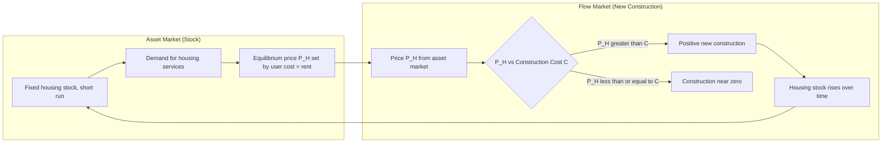
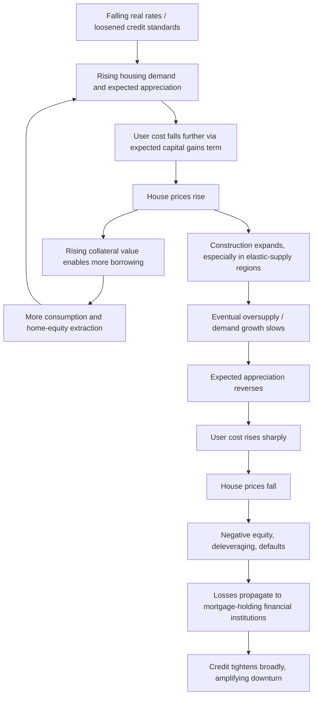

## Residential Investment and Housing Markets

### Overview

Residential investment — spending on new housing construction, major renovations, and (in national accounts) brokers' commissions on housing transactions — is one of the most volatile components of GDP and a key transmission channel for monetary policy. Unlike business fixed investment, residential investment is driven by the interaction between the **stock demand for housing** (a durable asset held by households) and the **flow supply of new construction**, making stock-flow models central to understanding housing market dynamics.

---

### Residential Investment in the National Accounts

**Key Points**

- **Components**: new single-family and multi-family construction, residential structures improvements/renovations, manufactured homes, and brokers' fees/commissions on the sale of existing homes (the transaction service, not the asset itself).
- **Exclusion**: Purchases of *existing* homes are not counted in GDP investment (no new production occurs); only the value of new construction and the transaction-related services are counted.
- **Share and volatility**: Residential investment typically comprises a modest share of GDP (commonly cited in the range of roughly 3-5% in advanced economies, varying by country and period) but exhibits volatility several multiples that of GDP itself, making it a disproportionately important driver of business cycle turning points — it is one of the most reliably leading components of GDP around recessions. **[Unverified]** Exact percentage shares vary by country and year and should be checked against current national accounts data rather than treated as fixed.

---

### The Stock-Flow Model of the Housing Market (Poterba, 1984)

**Setup**

The canonical framework, formalized by **James Poterba (1984)** building on Tobin's Q-theory, separates the housing market into two linked markets:

1. **The asset market** for the existing housing *stock* $H$, which determines the equilibrium real house price $P_H$.
2. **The market for new construction**, a *flow* $\dot{H}$ (new supply added per period), which depends on the profitability of building relative to construction costs.

**The Asset Market: Determining House Prices**

In the asset market, the current stock of housing is fixed in the short run (supply is inelastic at a point in time). The equilibrium price $P_H$ is determined by the user cost of housing equating to the implicit rental value households derive from housing services:

$$P_H \times UC = R$$

where $UC$ is the **user cost of capital for housing** (analogous to Jorgenson's user cost for business capital) and $R$ is the imputed rental value (or actual market rent) of housing services.

**The User Cost of Housing**

$$UC = (i(1-\tau) + \delta + \tau_p - \pi^e)$$

where:

- $i$ = nominal mortgage interest rate
- $\tau$ = marginal tax rate (relevant where mortgage interest is tax-deductible)
- $\delta$ = depreciation and maintenance rate
- $\tau_p$ = property tax rate
- $\pi^e$ = expected house price appreciation (capital gains reduce the effective cost of holding housing)

**Interpretation**: the user cost captures the full opportunity cost of owning a home for one period — foregone interest (net of any tax deduction), physical depreciation, property taxes — minus expected capital gains from price appreciation. When expected appreciation $\pi^e$ rises, user cost falls, increasing the equilibrium house price for a given rental/dividend flow — this is a key channel through which **speculative expectations** feed back into current prices, a hallmark of asset-market dynamics distinct from goods markets.

**The Flow Market: New Construction**

New construction $\dot{H}$ responds to the gap between the current asset-market price $P_H$ and the replacement/construction cost $C$:

$$\dot{H} = \dot{H}(P_H - C), \quad \dot{H}' > 0$$

When $P_H > C$ (analogous to Tobin's $Q > 1$), building is profitable and construction proceeds until the marginal cost of adding new units rises to meet $P_H$ (construction costs typically rise with the pace of building due to capacity constraints in the construction sector — rising land, labor, and material costs at higher activity levels).

---

### Diagram: Poterba Two-Panel Stock-Flow Diagram

---

### Diagram: Poterba Model Equilibrium (SVG)

<svg xmlns="http://www.w3.org/2000/svg" viewBox="0 0 780 420" font-family="Arial, sans-serif">
<text x="390" y="25" text-anchor="middle" font-size="16" font-weight="bold">Housing Asset Market and Construction Flow (svg_diagram)</text>

<line x1="60" y1="360" x2="60" y2="60" stroke="black" stroke-width="2" />
<line x1="60" y1="360" x2="340" y2="360" stroke="black" stroke-width="2" />
<text x="200" y="395" text-anchor="middle" font-size="12">Housing Stock, H</text>
<text x="25" y="200" text-anchor="middle" font-size="12" transform="rotate(-90 25 200)">Price, P_H</text>

<line x1="220" y1="360" x2="220" y2="80" stroke="#1f77b4" stroke-width="2" />
<text x="230" y="90" font-size="11" fill="#1f77b4">Fixed stock (short run)</text>

<path d="M 90 100 Q 200 200, 320 320" stroke="#d62728" stroke-width="2" fill="none" />
<text x="260" y="300" font-size="11" fill="#d62728">Demand (falls as UC rises)</text>
<circle cx="220" cy="200" r="4" fill="black" />
<line x1="60" y1="200" x2="220" y2="200" stroke="gray" stroke-dasharray="3,3" />
<text x="30" y="195" font-size="11">P_H*</text>

<line x1="440" y1="360" x2="440" y2="60" stroke="black" stroke-width="2" />
<line x1="440" y1="360" x2="740" y2="360" stroke="black" stroke-width="2" />
<text x="590" y="395" text-anchor="middle" font-size="12">New Construction, H-dot</text>
<text x="405" y="200" text-anchor="middle" font-size="12" transform="rotate(-90 405 200)">Price, P_H</text>

<line x1="440" y1="200" x2="740" y2="200" stroke="#2ca02c" stroke-dasharray="4,3" />
<text x="640" y="190" font-size="11" fill="#2ca02c">Construction cost, C</text>

<path d="M 440 350 Q 560 260, 700 90" stroke="#9467bd" stroke-width="2" fill="none" />
<text x="600" y="130" font-size="11" fill="#9467bd">Marginal cost of new supply</text>
<line x1="440" y1="200" x2="620" y2="200" stroke="gray" stroke-dasharray="3,3" />
<line x1="620" y1="360" x2="620" y2="200" stroke="gray" stroke-dasharray="3,3" />
<circle cx="620" cy="200" r="4" fill="black" />
<text x="600" y="378" font-size="11">H-dot*</text>

<line x1="340" y1="200" x2="440" y2="200" stroke="black" stroke-width="1.5" marker-end="url(#arrow)" />
</svg>

---

### Housing Supply Elasticity and Regional Variation

**Key Points**

- **Supply elasticity varies enormously across metropolitan areas**, driven by geographic constraints (coastal cities, mountainous terrain — the "geographically constrained" cities identified by Saiz, 2010) and regulatory constraints (zoning, land-use restrictions, permitting delays).
- **Elastic supply cities** (e.g., much of the Sun Belt in the U.S., historically) absorb demand shocks primarily through **quantity adjustment** (more construction), with muted price responses.
- **Inelastic supply cities** (e.g., coastal, highly regulated markets) absorb demand shocks primarily through **price adjustment**, since new construction cannot readily expand to meet demand, generating larger and more persistent house-price cycles.
- This heterogeneity is central to understanding why national average house-price statistics can mask sharply divergent regional experiences, and why the same national monetary-policy shock or income shock produces very different local price and construction responses.

$$\dot{H}_i = \dot{H}_i(P_{H,i} - C_i; \, \eta_i)$$

where $\eta_i$ denotes the local (city-specific) supply elasticity parameter, formally the responsiveness of $\dot{H}_i$ to the price-cost gap.

---

### Housing Demand: The Life-Cycle and User-Cost Perspective

**Key Points**

- **Tenure choice (own vs. rent)**: Households choose between owning and renting by comparing the user cost of owning to the market rental rate; the comparison depends on expected tenure duration, transaction costs of buying/selling, and relative tax treatment of owner-occupied vs. rental housing.
- **Down-payment and credit constraints**: Minimum down-payment requirements (and loan-to-value, LTV, caps) act as a binding financing constraint for many households, particularly first-time buyers, linking housing demand directly to household balance-sheet conditions — a housing-specific analogue of the financing-constraints literature affecting firm investment.
- **Mortgage market structure**: The prevalence of fixed-rate vs. adjustable-rate mortgages, typical amortization periods, and securitization practices differ substantially across countries and shape how sensitive housing demand is to interest-rate changes.
- **Life-cycle housing demand**: Housing demand follows a hump-shaped life-cycle pattern, rising through household formation and family growth, peaking in mid-life, and often declining or shifting composition (downsizing) in retirement — though empirical downsizing patterns vary and are debated in the literature. **[Inference]** The degree and timing of retirement downsizing is heterogeneous across households and countries, so this should be read as a stylized tendency rather than a uniform rule.

---

### The Housing Wealth Effect

Because owner-occupied housing is both a consumption good and the largest asset on most households' balance sheets, changes in house prices generate a **wealth effect** on consumption:

$$C = f(Y^p, W_{financial}, W_{housing})$$

where $W_{housing}$ is housing wealth. Empirical estimates of the **marginal propensity to consume (MPC) out of housing wealth** have found this effect to be economically significant in many studies, and in some specifications larger than the MPC out of equivalent financial wealth — plausibly because housing wealth gains are perceived as more permanent, or because rising house prices ease collateral constraints enabling home-equity extraction (cash-out refinancing, home equity lines of credit) that directly funds consumption. **[Inference]** The precise magnitude of the housing wealth effect relative to the financial wealth effect is an active empirical debate, with estimates varying by country, time period, and methodology (some studies find comparable or even larger effects for financial wealth); this should not be treated as a settled, universal ranking.

**Collateral channel distinction**: A parallel literature (Mian and Sufi, and others) emphasizes that much of the consumption response to house-price changes operates through the **collateral/borrowing channel** — homeowners borrow against increased home equity — rather than through a pure "wealth effect" in the textbook permanent-income sense, with important implications for how house-price *declines* (which can trigger deleveraging and forced consumption cuts, especially for highly leveraged households) transmit to the macroeconomy asymmetrically relative to price increases.

---

### Housing and Monetary Policy Transmission

**Key Points**

- **Direct interest-rate channel**: Higher policy rates raise mortgage rates, directly raising the user cost of housing (via the $i(1-\tau)$ term), reducing both housing demand and, with a lag, new construction.
- **Credit channel interaction**: Tighter monetary policy reduces bank lending capacity and can tighten mortgage credit standards independently of the rate level, amplifying the direct rate effect (a housing-specific instance of the bank lending channel).
- **House prices as a policy indicator and target debate**: Because housing is credit-intensive and leveraged, and because housing cycles have historically preceded and amplified major recessions (most notably 2007-2009), there is ongoing debate over whether central banks should respond to house-price/asset-price movements directly ("lean against the wind") versus focusing narrowly on inflation and output stabilization, addressing financial stability risks through separate macroprudential tools instead.
- **Macroprudential policy**: Tools such as loan-to-value (LTV) caps, debt-service-to-income (DSTI) limits, and countercyclical capital buffers have increasingly been used as a complement (or alternative) to monetary policy for managing housing-credit cycles, reflecting a view that interest-rate policy is too blunt an instrument to target housing-sector-specific risks without unwanted spillovers to the rest of the economy.

---

### Boom-Bust Cycles and the 2007-2009 Case Study

**Example**

The U.S. housing boom (roughly the early-to-mid 2000s) and subsequent bust (2007 onward) illustrates the interaction of the mechanisms above:

1. **Boom phase**: Low real interest rates, loosened underwriting standards, expansion of subprime and non-traditional mortgage products, and rising securitization (mortgage-backed securities, collateralized debt obligations) expanded effective housing demand and credit access, raising expected appreciation $\pi^e$ — which, through the user-cost equation, further *lowered* the effective user cost and fed back into still-higher prices (a self-reinforcing expectations spiral consistent with the asset-market side of the Poterba model).
2. **Supply response**: Construction expanded substantially in elastic-supply regions, eventually creating oversupply as demand growth could not be sustained.
3. **Bust phase**: As appreciation expectations reversed, user cost rose sharply (the $-\pi^e$ term flipped sign), asset prices fell, and the collateral/net-worth channel triggered widespread deleveraging, mortgage defaults, and — via mortgage-backed-security holdings on bank and shadow-bank balance sheets — a broader financial-sector solvency crisis, illustrating how a residential-investment-sector shock can propagate into a systemic financial crisis and a deep recession (financial accelerator dynamics operating at the household and financial-intermediary level simultaneously).

**[Unverified]** Specific quantitative magnitudes (peak-to-trough price declines by region, exact default rates by mortgage vintage) vary by data source and geography and are not restated here as fixed figures; consult contemporaneous data sources (e.g., Case-Shiller indices, Federal Reserve flow-of-funds data) for precise statistics.

---

### Diagram: Housing Boom-Bust Feedback Loop

---

### Housing in Aggregate Demand Models

In a simplified IS-curve-style aggregate demand framework, residential investment $I_H$ enters as a distinct, interest-sensitive component:

$$Y = C(Y-T, W) + I_{business}(r, \dots) + I_H(UC(i,\tau,\delta,\tau_p,\pi^e), Y) + G + NX$$

Residential investment is typically found to be **among the most interest-sensitive components of aggregate demand** and tends to respond to monetary policy changes with a shorter lag than business fixed investment, since mortgage rates adjust quickly to policy changes and construction decisions can be initiated or halted relatively rapidly compared to large-scale business capital projects — making residential investment a closely watched leading indicator for the monetary transmission mechanism.

---

### Comparative Table: Residential vs. Business Fixed Investment

| Dimension | Residential Investment | Business Fixed Investment |
| --- | --- | --- |
| Decision-maker | Households / homebuilders | Firms |
| Primary asset | Owner-occupied or rental housing stock | Structures, equipment, IP |
| Key price signal | House price $P_H$ vs. construction cost $C$ | Tobin's Q / marginal product vs. cost of capital |
| Financing | Mortgage debt, often high leverage, collateralized by the asset itself | Retained earnings, corporate debt/equity, varying collateralization |
| Interest-rate sensitivity | Very high, relatively fast pass-through | High, but often slower/lagged pass-through |
| Volatility relative to GDP | Very high | High, but generally somewhat less volatile than residential |
| Key friction literature | User cost, tenure choice, down-payment/credit constraints | Financing constraints, adjustment costs, real options |

---

### Adjustment Costs and Construction Lags

Residential investment also exhibits **time-to-build** features: from land acquisition and permitting to completion, new housing projects can take many months to multiple years, creating supply response lags that can generate cobweb-style overshooting — construction decisions made based on *current* high prices may be completed only after demand conditions (and prices) have shifted, contributing to boom-bust amplitude beyond what instantaneous stock-flow equilibrium would predict. **[Inference]** The degree to which time-to-build lags generate cobweb-style cyclicality versus being smoothed by rational expectations of builders is debated, and depends on how well market participants forecast future demand relative to current permitting/construction pipelines.

---

**Related Topics**

- Q-theory of investment (Tobin's Q) and its housing-market analogue
- User cost of capital and tax policy toward owner-occupied housing
- Financing constraints and the credit/collateral channel
- Financial accelerator and the 2007-2009 financial crisis
- Macroprudential regulation: LTV and DSTI limits
- Housing supply elasticity and land-use regulation (Saiz, 2010)
- Household balance sheets and the marginal propensity to consume
- Securitization and mortgage-backed securities
- Time-to-build models and cobweb dynamics in construction
- Regional and metropolitan house-price divergence