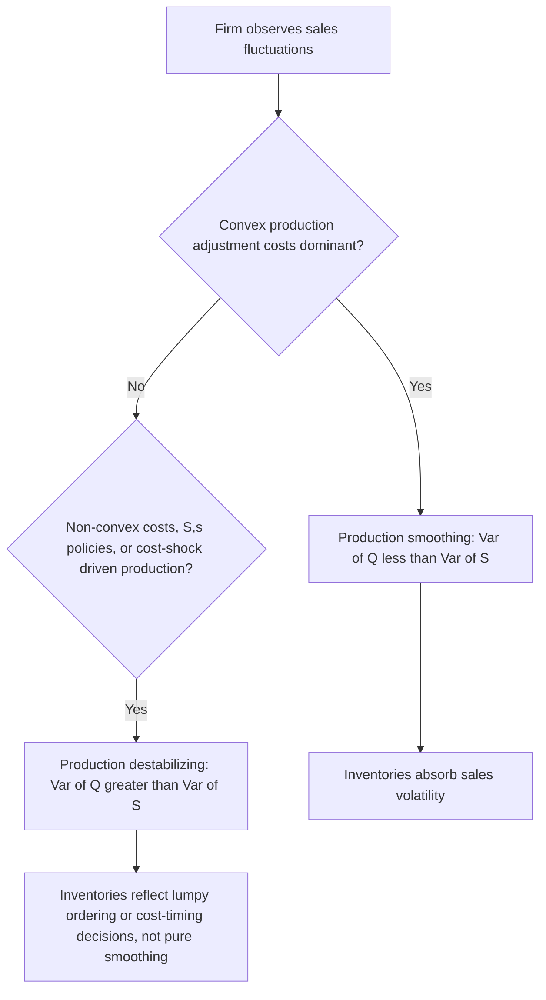
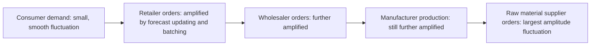

## Inventory Investment Dynamics

### Overview

Inventory investment — the change in the stock of raw materials, work-in-process, and finished goods held by firms — is the smallest component of GDP by average share but historically one of the most important for explaining short-run business cycle fluctuations. Because inventories are a **buffer stock** that firms adjust to reconcile production with uncertain sales, inventory dynamics reveal how firms respond to demand shocks under costly and lumpy production adjustment, and have motivated some of the most influential quantitative theories of the business cycle.

---

### Defining Inventory Investment in the National Accounts

**Key Points**

- **Inventory investment** ($\Delta INV_t$) is the change in the physical stock of inventories held by businesses between periods, measured as a flow.
- It is distinguished from **inventory stock** ($INV_t$), the level of goods held at a point in time.
- GDP accounting identity: production ($Y$) equals final sales ($S$) plus the change in inventories:

  $$Y_t = S_t + \Delta INV_t$$
- This identity means that even when final demand ($S$) is smooth, measured GDP ($Y$) can be volatile if firms choose not to fully accommodate demand fluctuations through inventories, and conversely, GDP can be smoother than final sales if firms use inventories to absorb demand shocks.
- Despite averaging a very small share of GDP levels, inventory investment historically accounts for a **disproportionately large share of the variance of GDP growth**, particularly around business cycle turning points — a fact famously emphasized as one of the most robust "stylized facts" in the inventory literature (Blinder and Maccini, 1991).

---

### The Production Smoothing Model

**Core Idea**

The earliest formal theory of inventories, the **production smoothing model** (Holt, Modigliani, Muth, and Simon, 1960), treats inventories as a tool firms use to **decouple production from sales**, allowing firms to produce at a smoother, more efficient rate than their more volatile sales pattern, using inventories as the buffer.

**Setup**

The firm minimizes a quadratic cost function over production $Q_t$ and inventory stock $INV_t$, subject to convex costs of adjusting production levels (reflecting overtime pay, hiring/firing costs, or diminishing returns to rapid changes in the workforce) and costs of deviating inventories from a target level:

$$\min E_t \sum_{s=0}^{\infty} \beta^s \left[ \frac{a}{2}(Q_{t+s} - Q_{t+s-1})^2 + \frac{b}{2}(INV_{t+s} - k\, S_{t+s})^2 \right]$$

subject to the inventory accounting identity:

$$INV_t = INV_{t-1} + Q_t - S_t$$

where $a$ is the cost parameter for production adjustment, $b$ is the cost parameter for inventory deviations from target, and $k \cdot S_t$ is the target stock (often specified as proportional to expected sales, reflecting a **stock-to-sales ratio** target).

**Key Prediction**: because production smoothing is costly to reverse (adjustment costs on $Q$), the model predicts that **the variance of production should be less than the variance of sales**:

$$Var(Q_t) < Var(S_t)$$

Firms should use inventories as a shock absorber — running inventories down during unexpectedly high sales and building them up during low sales — rather than fully adjusting production to match sales one-for-one each period.

---

### The Production Smoothing Puzzle

**Key Points**

A large body of empirical work, beginning notably with **Blinder (1981)** and further developed by Blinder and Maccini (1991), found that in many manufacturing sectors and time periods, **the variance of production exceeds the variance of sales** — the opposite of the basic production smoothing prediction. This finding, sometimes called the **"production smoothing puzzle,"** or more precisely the finding of "production destabilizing" behavior, was influential in shifting the literature toward alternative explanations:

- **(S,s) inventory policies**: Non-convex or fixed costs of ordering/production changes (rather than smooth convex costs) can generate lumpy, infrequent production adjustments that overshoot sales fluctuations rather than smoothing them.
- **Cost shocks and supply-side variation**: If marginal production costs vary over time (e.g., due to input price fluctuations or seasonal factors), firms may rationally produce more when costs are temporarily low and hold the output as inventory for later sale, generating production volatility unrelated to sales-smoothing motives — this is the essence of the **"production cost smoothing"** vs. sales-smoothing distinction.
- **Stockout avoidance / precautionary motive**: Firms may hold and build inventories preemptively to avoid stockouts under demand uncertainty, generating production patterns that anticipate rather than merely react to sales, complicating the simple variance comparison.
- **Measurement and aggregation issues**: Some subsequent work has argued that certain empirical rejections of production smoothing partly reflect measurement problems (e.g., aggregation across heterogeneous firms and products, or mismeasured expected vs. realized sales) rather than a genuine rejection of the underlying theory. **[Inference]** The relative importance of these competing resolutions of the puzzle remains debated across specific industries and time periods rather than fully settled by a single dominant explanation.

---

### Diagram: Production Smoothing vs. Production Destabilizing

---

### The (S,s) Inventory Model

**Core Idea**

Where fixed costs attach to placing an order or adjusting the production line (rather than smooth, continuously increasing marginal adjustment costs), optimal inventory policy takes an **(S,s) form**: a firm allows inventory to drift down passively through sales until it hits a lower trigger point $s$, at which point it places a large order/production run to restore inventory to an upper target $S$, then lets it drift down again.

$$\text{If } INV_t \le s: \quad \text{order/produce up to } S$$

$$\text{If } INV_t > s: \quad \text{no action}$$

This generates **lumpy, discontinuous** individual-firm inventory and production behavior, in contrast to the smooth, continuous adjustment implied by the quadratic-cost production-smoothing model. At the aggregate level, if many firms' (S,s) trigger points are not perfectly synchronized, individual lumpiness can average out to smoother aggregate behavior — a key theme in the literature on aggregation of lumpy microeconomic decisions (analogous to (S,s) models used in the durable-goods and price-adjustment/menu-cost literatures).

---

### Diagram: (S,s) Inventory Policy over Time

<svg xmlns="http://www.w3.org/2000/svg" viewBox="0 0 760 380" font-family="Arial, sans-serif">
<text x="380" y="25" text-anchor="middle" font-size="16" font-weight="bold">(S,s) Inventory Policy (svg_diagram)</text>
<line x1="70" y1="330" x2="700" y2="330" stroke="black" stroke-width="2" />
<line x1="70" y1="330" x2="70" y2="50" stroke="black" stroke-width="2" />
<text x="385" y="360" text-anchor="middle" font-size="13">Time</text>
<text x="30" y="190" text-anchor="middle" font-size="13" transform="rotate(-90 30 190)">Inventory Level</text>

<line x1="70" y1="90" x2="700" y2="90" stroke="#2ca02c" stroke-dasharray="4,3" />
<text x="705" y="94" font-size="12" fill="#2ca02c">S</text>

<line x1="70" y1="270" x2="700" y2="270" stroke="#d62728" stroke-dasharray="4,3" />
<text x="705" y="274" font-size="12" fill="#d62728">s</text>

<path d="M 100 90 L 220 270 L 220 90 L 340 270 L 340 90 L 480 270 L 480 90 L 620 270 L 620 90 L 680 180" stroke="`#1f77b4`" stroke-width="2.5" fill="none" />

<text x="150" y="180" font-size="11">Passive drawdown</text>

<text x="230" y="80" font-size="11">Instant reorder to S</text>

</svg>

---

### Buffer-Stock (Cost-Shock) Models

**Bils and Kahn (2000)** and related work emphasize the role of **countercyclical markups and procyclical marginal costs** in explaining inventory behavior: if marginal costs of production are lower during expansions (perhaps due to economies of scale, learning-by-doing, or lower input costs when capacity utilization is not yet strained) firms have an incentive to produce ahead of demand and hold inventory, generating a positive correlation between production and future sales growth that differs from simple buffer-stock or pure smoothing stories. This literature reframes inventory dynamics as partly reflecting **intertemporal cost-based production timing** rather than purely stockout-avoidance or smoothing motives.

---

### The Stock-to-Sales Ratio and the (S,s) Target

**Key Points**

- Firms commonly target an **inventory-to-sales (I/S) ratio**, reflecting the desired buffer relative to the scale of business.
- The optimal I/S ratio depends on: the variance of demand (higher demand uncertainty raises optimal buffer stocks under stockout-avoidance motives), the cost of holding inventory (storage, financing, obsolescence/spoilage risk), the cost of stockouts (lost sales, customer goodwill), and the speed/reliability of the production or supply chain (faster, more reliable replenishment reduces required buffer stocks).
- **Just-in-time (JIT) inventory management**, widely adopted in manufacturing since the late 20th century, represents a deliberate strategy to reduce the I/S ratio by improving supply-chain reliability and production flexibility, substituting information and coordination for physical buffer stock. **[Inference]** The macroeconomic effect of widespread JIT adoption on aggregate inventory volatility is debated: some argue it should reduce the amplitude of inventory cycles by lowering buffer stocks generally, while others note it may increase the *sensitivity* of production to demand shocks (since firms hold less buffer to absorb them), a tension noted in subsequent empirical work without full consensus.

$$\text{Target: } \frac{INV_t}{S_t} \approx k^*, \quad k^* = k^*(\sigma_S^2, \text{holding cost}, \text{stockout cost}, \text{supply reliability})$$

---

### Types of Inventories and Their Distinct Dynamics

| Inventory type | Description | Typical dynamics |
| --- | --- | --- |
| Raw materials | Inputs awaiting processing | Driven by production plans and input price expectations; can reflect speculative motives if input prices are expected to rise |
| Work-in-process | Partially completed goods | Tied closely to the length and complexity of the production process (time-to-build); less directly tied to final demand shocks |
| Finished goods | Completed goods awaiting sale | Most directly linked to sales forecasting errors and stockout-avoidance motives; central to production smoothing and (S,s) analyses |
| Retail/wholesale (distribution) inventories | Goods held by intermediaries, not manufacturers | Reflect retailer ordering behavior, which can itself generate the amplification described in the bullwhip effect below |

---

### The Bullwhip Effect and Supply Chain Amplification

**Key Points**

The **bullwhip effect** describes how small fluctuations in end-consumer demand can be progressively **amplified** as orders propagate upstream through a multi-stage supply chain (retailer → wholesaler → manufacturer → raw-materials supplier), because each stage adjusts its own orders based on its perception of demand *and* its own desired inventory buffer, compounding forecast errors and order-batching behavior at each link.

**Contributing mechanisms** (Lee, Padmanabhan, and Whang, 1997):

- **Demand signal processing**: each stage updates its demand forecast based on the orders it receives (rather than true end demand), overreacting to transient fluctuations.
- **Order batching**: fixed costs of placing orders lead downstream firms to batch orders (e.g., ordering monthly rather than continuously), creating lumpy order patterns even when underlying demand is smooth.
- **Price fluctuations / promotions**: temporary price discounts induce forward-buying, creating artificial demand spikes and subsequent troughs that propagate upstream.
- **Rationing and shortage gaming**: when supply is constrained, downstream firms may inflate orders anticipating rationing, then cancel excess orders once supply improves, amplifying volatility further upstream.

This mechanism provides a microeconomic, supply-chain-based explanation for why inventory and production volatility can be substantially larger at earlier stages of the production chain than at the final retail/consumer demand stage — directly relevant to understanding why aggregate manufacturing output volatility often exceeds final consumption volatility.

---

### Diagram: The Bullwhip Effect through a Supply Chain

---

### Inventories and the Business Cycle: Quantitative Importance

**Key Points**

- Even though the *level* of inventory investment is a small fraction of GDP, its *volatility* is large enough that inventory swings have historically accounted for a substantial share of the peak-to-trough decline in output during many postwar recessions (a stylized fact extensively documented by Blinder and Maccini, 1991, and subsequent work).
- **Inventory cycles** — recurring patterns of inventory accumulation followed by involuntary or planned drawdown — have been proposed as a distinct source of business cycle periodicity, sometimes referred to in older literature as the **Kitchin cycle** (a short, roughly 3-5 year inventory-driven cycle, as originally proposed by Joseph Kitchin in the 1920s), distinguished from longer investment cycles (Juglar) or infrastructure/construction cycles (Kuznets). **[Unverified]** The empirical robustness and continued relevance of a fixed-periodicity "Kitchin cycle" as a distinct statistical regularity is contested in modern business cycle research and should not be treated as a precisely dated, mechanically recurring phenomenon.
- **Unintended vs. intended inventory investment**: A key conceptual distinction in Keynesian-style demand-driven models is between **planned** inventory investment (deliberate buildup/drawdown as part of firms' production plans) and **unplanned (involuntary)** inventory investment, which occurs when realized sales differ from forecast sales. Unplanned inventory accumulation (when sales fall short of expectations) signals to firms that production should be cut, providing a key adjustment mechanism by which output converges toward the equilibrium level of aggregate demand in simple Keynesian cross models.

$$\Delta INV_t^{unplanned} = Q_t - S_t^{actual} - \Delta INV_t^{planned}$$

---

### Worked Numerical Example: Unplanned Inventory Adjustment

**Example**

A firm plans production of $Q = 1{,}000$ units this period, expecting sales of $S^e = 1{,}000$ units (implying zero planned change in inventory). Actual realized sales turn out to be only $S^{actual} = 850$ units due to an unanticipated demand shortfall.

$$\Delta INV^{unplanned} = Q - S^{actual} = 1{,}000 - 850 = 150 \text{ units}$$

The firm involuntarily accumulates 150 units of unplanned inventory. In the simple Keynesian adjustment story, this signals excess production relative to demand; the firm responds next period by cutting production below the (now revised downward) expected sales level until the unplanned inventory buildup is worked off, illustrating how inventory data serve as a real-time signal firms use to correct output toward the level consistent with actual demand — a mechanism often cited as one reason inventory data are closely watched as a leading indicator of near-term GDP revisions and turning points.

---

### Empirical Methodology: Testing Inventory Models

**Key Points**

- **Variance ratio tests**: comparing $Var(Q)$ to $Var(S)$ directly, as in the original production-smoothing empirical literature, though subject to the caveats above regarding cost shocks and non-convex adjustment costs.
- **Structural Euler-equation estimation**: estimating the first-order conditions of the quadratic-cost production-smoothing model (or generalized non-quadratic versions) directly on firm- or industry-level data, testing over-identifying restrictions implied by the model.
- **Panel and micro-data approaches**: exploiting disaggregated, firm- or establishment-level inventory and shipment data (where available) to directly observe (S,s)-style discrete adjustment episodes, rather than relying solely on aggregated time-series moments that can mask underlying lumpiness through aggregation.
- **Vector autoregression (VAR) decompositions**: decomposing GDP fluctuations into contributions from final sales versus inventory investment, commonly used in applied macroeconomic forecasting and business-cycle dating discussions to quantify the inventory contribution to a given quarter's growth reading.

---

### Policy and Forecasting Relevance

**Key Points**

- Inventory data (e.g., wholesale and retail inventory reports, the inventory-to-sales ratio) are closely monitored by forecasters and central banks as **high-frequency leading indicators** of near-term GDP momentum, since inventory adjustment often precedes and helps predict subsequent shifts in final demand and production.
- **Recession signaling**: A rising inventory-to-sales ratio combined with slowing final sales is a classic early warning sign of an impending involuntary inventory correction and associated production cutbacks — a pattern recurring across many historical business cycle downturns.
- **Supply chain resilience debates**: Following widespread supply-chain disruptions (e.g., during the COVID-19 pandemic period), there has been renewed policy and corporate interest in balancing lean, JIT-style inventory management against greater buffer-stock resilience ("just-in-case" strategies), reflecting the trade-off between minimizing holding costs in normal times and mitigating disruption risk during supply shocks. **[Inference]** Whether this represents a durable shift away from decades of JIT-oriented practice or a temporary adjustment is not yet conclusively established and depends on how firms and researchers assess relative costs once supply conditions normalize.

---

**Related Topics**

- Production smoothing vs. production destabilizing puzzle
- (S,s) inventory and pricing models; menu-cost analogues
- Bullwhip effect and supply chain management
- Keynesian income-expenditure model and unplanned inventory adjustment
- Just-in-time (JIT) manufacturing and lean supply chains
- Business cycle dating and leading indicators
- Kitchin, Juglar, and Kuznets cycles in business cycle theory
- Financing constraints and their interaction with inventory holding costs
- Vector autoregression (VAR) decomposition of GDP components
- Supply chain resilience and post-pandemic inventory strategy shifts