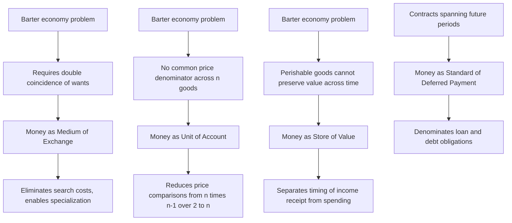
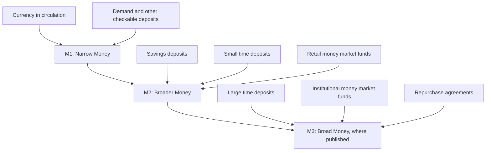

## Functions and Definitions of Money

### Overview

Money is any asset that is generally accepted as payment for goods, services, and debts within an economy. Its economic significance derives not from any intrinsic characteristic but from the **functions** it performs, which in turn determine how economists **define and measure** the money stock. Understanding these functions and their operational definitions is foundational to monetary economics, banking theory, and the analysis of monetary policy transmission.

---

### The Three Classic Functions of Money

**Key Points**

**1. Medium of Exchange**

Money's most fundamental function is to serve as a widely accepted instrument for transacting, eliminating the need for a **double coincidence of wants** required under pure barter (where a trade requires each party to want exactly what the other offers). By reducing transaction costs and search costs, money as a medium of exchange facilitates specialization and the division of labor, a point emphasized as far back as Adam Smith and later formalized in monetary search-theoretic models (Kiyotaki and Wright, 1989).

**2. Unit of Account**

Money serves as the common denominator in which prices, debts, and contracts are expressed, allowing values of heterogeneous goods and services to be directly compared. Without a unit of account, an economy would need to express the relative price of every good against every other good — with $n$ distinct goods, barter requires tracking $\binom{n}{2} = \frac{n(n-1)}{2}$ separate relative prices, a combinatorial burden that a single unit of account collapses to $n$ prices (each good's price in terms of money).

**3. Store of Value**

Money allows purchasing power to be preserved from the present into the future, permitting the separation of the act of selling (receiving income) from the act of buying (spending) across time. Money is not the *only* store of value (bonds, equities, real estate, and other assets also serve this role), but unlike most alternatives it typically combines the store-of-value function with immediate liquidity (usability without conversion cost) — though its usefulness in this role is undermined during periods of high or unpredictable inflation, which erodes real purchasing power.

**Sometimes cited fourth function**: **Standard of deferred payment** — money serves as the unit in which debt contracts and future obligations are denominated, a function closely related to but conceptually distinguishable from the unit-of-account function (the former applies to *future* payments, e.g., loan contracts; the latter to *current* price quotation).

---

### Diagram: The Functions of Money and What They Solve

---

### Properties Desirable in a Good Money

**Key Points**

For an asset to effectively perform the functions above, it typically should exhibit:

- **Durability**: physically resistant to decay, allowing it to function as a store of value and be reused across many transactions.
- **Divisibility**: capable of being split into smaller units to facilitate transactions of varying size, without loss of proportional value.
- **Portability**: easily transported relative to its value, enabling convenient use in transactions.
- **Uniformity/Standardization (Fungibility)**: units of the same denomination are interchangeable, so that any unit is accepted as equivalent to any other of the same face value, removing the need to inspect or verify individual units.
- **Scarcity/Limited supply**: the supply must be sufficiently limited (naturally or through institutional design) to maintain value; commodities that are too abundant fail as effective money because their exchange value collapses.
- **Acceptability**: the most fundamentally circular but essential property — money is valuable largely *because* others are expected to accept it, a self-fulfilling social convention (or one backed by legal tender laws and government fiat).

Historically, precious metals (gold, silver) satisfied these properties well, which explains their long dominance as commodity money before the rise of representative and fiat money.

---

### Types of Money by Underlying Basis of Value

**Key Points**

- **Commodity money**: an item with intrinsic value in non-monetary uses (e.g., gold coins, cattle, tobacco in early colonial economies) that also circulates as a medium of exchange. Its monetary value derives at least partly from its use value.
- **Representative money**: a claim or certificate redeemable for a fixed quantity of an underlying commodity (e.g., historical gold or silver certificates), combining the convenience of paper currency with a formal backing that anchors its value.
- **Fiat money**: currency with no intrinsic commodity backing, whose value derives entirely from government decree (legal tender status) and widespread acceptance/confidence — the dominant form of money in essentially all modern economies since the collapse of the Bretton Woods gold-exchange standard in the early 1970s.
- **Commercial bank money (deposit money)**: the balances recorded in checking/demand deposit accounts at commercial banks, which function as money because they are widely accepted (via checks, debit cards, electronic transfers) as a medium of exchange, despite representing a liability of a private institution rather than the central bank or government directly. In most modern economies, commercial bank deposits constitute the majority of the broad money stock by value, dwarfing physical currency in circulation.
- **Central bank money (base money / high-powered money)**: currency in circulation plus commercial banks' reserve balances held at the central bank; this is the monetary base that the central bank most directly controls through its policy operations.

---

### Diagram: Hierarchy of "Moneyness" — Liquidity Spectrum

<svg xmlns="http://www.w3.org/2000/svg" viewBox="0 0 760 340" font-family="Arial, sans-serif">
<text x="380" y="25" text-anchor="middle" font-size="16" font-weight="bold">Liquidity Spectrum of Monetary Assets (svg_diagram)</text>
<line x1="60" y1="180" x2="700" y2="180" stroke="black" stroke-width="2" marker-end="url(#arrowM)" />
<text x="380" y="210" text-anchor="middle" font-size="13">Decreasing Liquidity, Increasing Yield</text>
<rect x="60" y="120" width="110" height="50" fill="#1f77b4" opacity="0.8" />
<text x="115" y="150" text-anchor="middle" font-size="11" fill="white">Currency</text>
<rect x="200" y="120" width="130" height="50" fill="#2ca02c" opacity="0.8" />
<text x="265" y="145" text-anchor="middle" font-size="11" fill="white">Demand</text>
<text x="265" y="158" text-anchor="middle" font-size="11" fill="white">Deposits (M1)</text>
<rect x="360" y="120" width="140" height="50" fill="#ff7f0e" opacity="0.8" />
<text x="430" y="145" text-anchor="middle" font-size="11" fill="white">Savings, Small</text>
<text x="430" y="158" text-anchor="middle" font-size="11" fill="white">Time Deposits (M2)</text>
<rect x="530" y="120" width="150" height="50" fill="#d62728" opacity="0.8" />
<text x="605" y="145" text-anchor="middle" font-size="11" fill="white">Money Market Funds,</text>
<text x="605" y="158" text-anchor="middle" font-size="11" fill="white">Broader Assets (M3/L)</text>

<text x="115" y="250" text-anchor="middle" font-size="11">Most liquid</text>

<text x="605" y="250" text-anchor="middle" font-size="11">Least liquid (of those included)</text>

</svg>

---

### Empirical Monetary Aggregates

**Key Points**

Because "money" is defined functionally rather than by a single, unambiguous asset class, central banks construct a **hierarchy of monetary aggregates**, moving from the narrowest, most liquid definition to progressively broader measures that include less-liquid, more saving-oriented assets. Precise aggregate definitions and labels (M1, M2, M3, etc.) vary across countries and have been revised over time by individual central banks. **[Unverified]** Exact current component definitions for any specific country's aggregates should be verified against that country's central bank publications, since classifications are periodically redefined (for example, several major central banks have modified M1/M2 boundary definitions over past decades).

**Typical structure (illustrative, not universally identical across countries):**

- **M0 / Monetary base**: currency in circulation plus commercial bank reserves held at the central bank; the base the central bank most directly influences via open market operations.
- **M1 (narrow money)**: physical currency in circulation held by the public, plus demand deposits and other highly liquid checkable deposits — assets usable directly as a medium of exchange with essentially no conversion delay or cost.
- **M2 (broader money)**: M1 plus "near-money" assets such as savings deposits, small-denomination time deposits, and retail money market mutual fund balances — assets that are highly liquid but not directly spendable without a conversion step (e.g., transferring savings to a checking account).
- **M3 (broad money, where still published)**: M2 plus larger institutional instruments such as large time deposits, institutional money market funds, and repurchase agreements — assets more relevant to wholesale financial markets than everyday household transactions. Some major central banks (e.g., the U.S. Federal Reserve, since 2006) have discontinued publishing M3 on the grounds that it added little useful information beyond M2 for policy purposes; other central banks continue to publish comparable broad aggregates. **[Unverified]** Whether a given central bank currently publishes an M3-equivalent series should be checked directly, as reporting practices have changed over time.

---

### Diagram: Constructing Monetary Aggregates

---

### The Moneyness Continuum and the Classification Problem

**Key Points**

There is no sharp, theoretically unambiguous line separating "money" from "near-money" or other liquid financial assets; the boundary is inherently a matter of degree along a **liquidity continuum**. This creates practical classification challenges:

- Financial innovation (e.g., interest-bearing checking accounts, money market mutual funds, sweep accounts, and more recently stored-value and digital payment balances) has repeatedly blurred the boundary between what is classified in narrow versus broad aggregates, sometimes prompting formal redefinitions of official aggregates.
- The choice of where to draw the M1/M2 (or similar) boundary is ultimately a **pragmatic, empirically-motivated decision** by statistical agencies, aimed at producing aggregates that are most stable and useful for predicting nominal spending or serving as policy-relevant indicators — not a decision derived from a single, uncontested theoretical criterion.
- This has led some monetary economists (e.g., proponents of the **Divisia monetary aggregates** approach, associated with William Barnett) to argue that simple-sum aggregation (adding up dollar totals of qualifying assets without adjustment) is theoretically inferior to weighting each component by its "moneyness" (approximated by its relative liquidity/yield characteristics), since simple summation implicitly (and incorrectly) treats highly liquid transaction balances as perfect substitutes for less liquid, higher-yielding near-monies.

$$M^{simple\;sum} = \sum_i A_i$$

$$M^{Divisia} = \sum_i w_i A_i, \quad w_i \propto (\text{user cost of holding } A_i \text{ relative to a benchmark illiquid asset})$$

**[Inference]** The empirical superiority of Divisia over simple-sum aggregates for forecasting or policy purposes is a matter of ongoing methodological debate rather than settled consensus among central banks, most of which continue to publish and primarily reference simple-sum aggregates.

---

### Money versus Credit and Money versus Wealth

**Key Points**

- **Money is not wealth in general**: an increase in the money stock (e.g., via central bank asset purchases) does not by itself increase aggregate real wealth; money is one component of a household's or economy's total portfolio of assets, and printing more money that simply displaces other assets one-for-one in nominal terms need not raise real net worth.
- **Money is distinct from credit**: credit refers to borrowed funds that create a corresponding liability, whereas money (in aggregates like M1/M2) refers to a stock of liquid assets held. The two are related — commercial bank lending and deposit creation are intertwined (see money creation and the deposit multiplier) — but conceptually money is an *asset* held by the non-bank public, while credit encompasses debt instruments and loan balances more broadly, including those that may not directly correspond to transactable "moneyness."
- **Outside money vs. inside money**: **outside money** refers to money that is a net asset of the private sector as a whole (e.g., currency issued by the government/central bank, which is not simultaneously a liability of any private-sector agent), whereas **inside money** refers to money created within the private financial system, where one private agent's monetary asset (a bank deposit) is simultaneously another private agent's liability (the bank's obligation to the depositor) — meaning inside money nets to zero in aggregate for the private sector as a whole, even though it functions fully as a medium of exchange for individual transactors.

---

### Worked Example: Constructing M1 from Simplified Balance-Sheet Data

**Example**

Consider a highly simplified economy with the following aggregated household and business holdings:

| Asset category | Amount (illustrative units) |
| --- | --- |
| Physical currency held by the public | 500 |
| Demand/checking deposits | 1,200 |
| Traveler's checks / other checkable deposits | 50 |
| Savings deposits | 2,000 |
| Small time deposits (under a stated ceiling) | 800 |
| Retail money market mutual funds | 600 |

Using the typical structure above:

$$M1 = \text{Currency} + \text{Demand/Checkable Deposits} = 500 + 1{,}200 + 50 = 1{,}750$$

$$M2 = M1 + \text{Savings} + \text{Small Time Deposits} + \text{Retail MMFs} = 1{,}750 + 2{,}000 + 800 + 600 = 5{,}150$$

This illustrates the mechanical construction: M2 is more than twice the size of M1 in this stylized example, reflecting the much larger scale of savings-type instruments relative to narrow transaction balances typically observed in practice. **[Inference]** The specific numeric ratio of M2 to M1 in this example is illustrative only; actual ratios vary substantially across countries and over time depending on interest-rate environments, financial-sector structure, and payment-technology adoption.

---

### Historical and Emerging Forms: Digital and Alternative Monies

**Key Points**

- **E-money / stored-value instruments**: prepaid cards, mobile-money balances (widely used in some emerging markets), and similar instruments function as a medium of exchange and are increasingly incorporated into or discussed alongside official monetary aggregate definitions, depending on jurisdiction.
- **Central Bank Digital Currency (CBDC)**: a digital form of central bank (outside) money, distinct from existing commercial bank deposit money, under active exploration or partial implementation by numerous central banks; CBDC would, depending on design, represent either a new form of base money accessible directly to the public or a wholesale settlement instrument for financial institutions. **[Unverified]** The design, adoption status, and monetary-aggregate classification of CBDC vary substantially and rapidly by jurisdiction; current status for any specific country should be verified against that country's central bank communications rather than assumed static.
- **Cryptocurrencies**: privately-issued digital assets (e.g., Bitcoin) are, as of current mainstream monetary economics assessment, generally judged to perform the medium-of-exchange and unit-of-account functions poorly relative to fiat currency — due to high price volatility undermining the store-of-value and unit-of-account roles, and limited transactional acceptance relative to sovereign currencies — though they are held and used to varying degrees depending on jurisdiction and application. **[Inference]** Whether specific cryptocurrencies should be classified as "money" in the functional economic sense (versus a speculative asset, a payment technology, or a niche medium of exchange) remains genuinely contested among economists, and reasonable assessments differ; this is not a settled classification.

---

### Money and the Equation of Exchange (Bridge to Quantity Theory)

The **definitions of money** developed here feed directly into the **quantity theory of money** and the equation of exchange:

$$MV = PY$$

where $M$ is the chosen monetary aggregate (the definitional choice affects both the measured level of $M$ and the empirically estimated velocity $V$ needed to satisfy the identity), $V$ is the velocity of money (how frequently a unit of money turns over in transactions per period), $P$ is the price level, and $Y$ is real output. Because $V$ is calculated residually as $V = PY/M$, the choice of monetary aggregate directly affects the empirical stability (or instability) of measured velocity — a central and recurring point of contention in debates over monetarism and the practical usefulness of money-supply targeting as a policy framework, covered in depth in subsequent monetary-theory topics.

---

**Related Topics**

- Quantity theory of money and the equation of exchange
- Money creation, the deposit (money) multiplier, and fractional reserve banking
- Divisia monetary aggregates and index-number theory of money
- Central Bank Digital Currency (CBDC) design and implications
- Inside money versus outside money in general equilibrium monetary models
- Search-theoretic models of money (Kiyotaki-Wright)
- Velocity of money and its stability debates
- Monetary policy transmission and the role of monetary aggregates as policy targets
- History of monetary standards: commodity money, the gold standard, and fiat money
- Financial innovation and the changing boundary of monetary aggregates