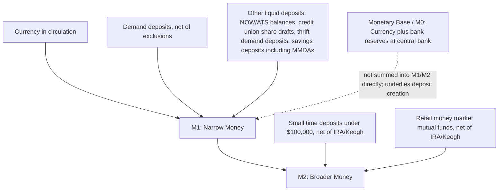

## Monetary Aggregates: M0, M1, M2, and Broader Measures

### Overview

Monetary aggregates are official, statistically constructed measures of the money stock, each defined by which categories of assets are included based on their degree of liquidity — how readily and costlessly they can be used to make payments. Because no single, theoretically unambiguous line separates "money" from "near-money," central banks publish a hierarchy of aggregates (a narrowest base measure through progressively broader measures) rather than a single number, and the precise composition of each aggregate is periodically revised as financial products and regulations evolve. This entry uses U.S. Federal Reserve definitions as the primary worked example, while noting that other central banks use analogous but not identical frameworks.

---

### M0 — The Monetary Base (High-Powered Money)

**Key Points**

- **M0**, also called the **monetary base** or **high-powered money**, consists of currency in circulation (Federal Reserve notes and coin held outside the Treasury, the Federal Reserve, and depository institution vaults) plus the reserve balances that commercial banks hold at the central bank.
- This is the base the central bank most directly influences through its own balance-sheet operations (open market operations, standing facilities, and asset purchases/sales).
- M0 is **not itself a measure of money held and spent by the general public** in the same sense as M1/M2 — bank reserves are held by depository institutions, not directly by households and firms, and are not used by the public to make everyday payments. It is best understood as the raw material from which commercial banks create the broader money supply via lending and deposit creation (see the money-multiplier / deposit-creation topic).

$$M0 = \text{Currency in circulation} + \text{Bank reserves at the central bank}$$

---

### M1 — Narrow (Transactions) Money

**Key Points**

Per the Federal Reserve's current H.6 release methodology, M1 is constructed by summing currency, demand deposits, and other liquid deposits, where currency consists of Federal Reserve notes and coin outside the U.S. Treasury, Federal Reserve Banks, and the vaults of depository institutions. [Federal Reserve](https://www.federalreserve.gov/releases/h6/current/default.htm)[Federal Reserve](https://www.federalreserve.gov/releases/h6/20260224/)

**Components:**

1. **Currency in circulation**: physical notes and coin held by the public (outside the banking system and government vaults).
2. **Demand deposits**: checking-account balances at commercial banks, excluding amounts held by depository institutions, the U.S. government, and foreign banks and official institutions, net of cash items in the process of collection and Federal Reserve float. [Federal Reserve](https://www.federalreserve.gov/releases/h6/20260224/)
3. **Other liquid deposits**: since a 2020 reclassification, this category replaced the prior "other checkable deposits" (OCD) component and, per the Fed's component description, consists of negotiable order of withdrawal (NOW) and automatic transfer service (ATS) balances at depository institutions, share draft accounts at credit unions, demand deposits at thrift institutions, and savings deposits, including money market deposit accounts. [FRED](https://fred.stlouisfed.org/series/M1SL)[Federal Reserve](https://www.federalreserve.gov/releases/h6/20260224/)

**Important structural note**: this means traditional **savings deposits are now included in M1** (as part of "other liquid deposits") rather than being a distinct near-money component of M2, a significant methodological shift from the pre-2020 U.S. definition. For more information on the H.6 release changes and the regulatory amendment that led to the creation of the other liquid deposits component and its inclusion in the M1 monetary aggregate, the Fed's H.6 announcements and Technical Q&As posted on December 17, 2020 provide detail. **[Unverified]** This structure reflects the U.S. definition current as of the most recent H.6 releases reviewed; readers should confirm against the live H.6 release for the exact current period, since seasonal-factor revisions and methodological notes are updated periodically. [FRED](https://fred.stlouisfed.org/series/M1SL)

$$M1 = \text{Currency} + \text{Demand Deposits} + \text{Other Liquid Deposits (incl. savings)}$$

---

### M2 — Broader Money

**Key Points**

Per current Fed methodology, beginning May 2020, M2 consists of M1 plus (1) small-denomination time deposits (time deposits in amounts of less than $100,000) less IRA and Keogh balances at depository institutions; and (2) balances in retail money market mutual funds (MMFs) less IRA and Keogh balances at MMFs. [FRED](https://fred.stlouisfed.org/series/M2)

This differs from the pre-2020 structure, under which M2 consisted of M1 plus (1) savings deposits, including money market deposit accounts; (2) small-denomination time deposits less IRA and Keogh balances at depository institutions; and (3) balances in retail MMFs less IRA and Keogh balances at MMFs — under the older definition, savings deposits sat in M2 rather than M1. The 2020 change effectively **moved savings deposits from M2 into M1**, which is why M1 levels showed a large one-time statistical jump around that period without any actual change in the underlying stock of liquid assets held by the public. [stlouisfed](https://fred.stlouisfed.org/graph/?g=fjCv)

**Seasonal adjustment construction**: seasonally adjusted M2 is constructed by summing small-denomination time deposits and retail MMFs, each seasonally adjusted separately, and adding the result to seasonally adjusted M1, and then subtracting not-seasonally-adjusted individual retirement account (IRA) and Keogh account balances at depository institutions and MMFs. [Federal Reserve](https://www.federalreserve.gov/releases/h6/current/default.htm)

$$M2 = M1 + \text{Small Time Deposits (net of IRA/Keogh)} + \text{Retail MMFs (net of IRA/Keogh)}$$

**Purpose, per the Fed's own framing**: the money supply is defined as a group of safe assets with stable values that households and businesses can use to make payments or to hold as short-term investments, with the Federal Reserve classifying assets according to their liquidity and function — a store of value versus a medium of exchange. The Federal Reserve calculates and publishes three monetary aggregates and their components monthly on its H.6 statistical release: the monetary base, M1 (the most liquid forms of money used for transactions), and M2 (which includes M1 plus less liquid savings-type assets). [Federal Reserve](https://www.federalreserve.gov/econres/notes/feds-notes/new-forms-of-money-and-the-u-s-monetary-aggregates-20260904.html)[Federal Reserve](https://www.federalreserve.gov/econres/notes/feds-notes/new-forms-of-money-and-the-u-s-monetary-aggregates-20260904.html)

---

### Diagram: Current U.S. Aggregate Construction (Post-2020 Methodology)

---

### The Discontinuation of M3 in the United States

**Key Points**

- The Federal Reserve discontinued official publication of **M3** in 2006. The Fed currently calculates and publishes three aggregates: the monetary base, M1, and M2 — M3 is not among them. [Federal Reserve](https://www.federalreserve.gov/econres/notes/feds-notes/new-forms-of-money-and-the-u-s-monetary-aggregates-20260904.html)
- The stated rationale (as documented in the Fed's historical announcements around the 2006 discontinuation) was that M3 did not appear to convey additional information about economic activity beyond what M2 already captured, relative to the cost of collecting the underlying data.
- **This is a U.S.-specific institutional choice**, not a universal practice — other major central banks (for example, the European Central Bank) continue to define and publish broad-money aggregates analogous to M3. **[Unverified]** Whether any specific non-U.S. central bank currently labels or publishes an M3-equivalent series, and its exact component definition, should be verified directly against that institution's current statistical releases, since aggregate frameworks are periodically revised across jurisdictions.

---

### Financial Innovation and the Boundary Problem

**Key Points**

A recurring theme in the historical evolution of these definitions is that new financial products regularly blur the line between aggregates, forcing periodic redefinition:

- The Federal Reserve's own recent research notes discuss "new forms of money" in the context of the U.S. monetary aggregates, reflecting continued attention to how emerging payment instruments and account types should be classified. [Federal Reserve](https://www.federalreserve.gov/econres/notes/feds-notes/new-forms-of-money-and-the-u-s-monetary-aggregates-20260904.html)
- The 2020 shift of savings deposits from M2 into M1 (discussed above) is itself a direct example of this boundary-redefinition process, driven by a regulatory amendment (the elimination of Regulation D's reserve-requirement distinction between "transaction" and "savings" accounts) that made the prior functional distinction between the two deposit types less economically meaningful.
- **General implication for interpretation**: because aggregate definitions can change discretely at a point in time (rather than evolving smoothly), analysts must be careful when examining long time series of M1 or M2 across a redefinition date — a large apparent jump or shift in growth rates may reflect a **definitional break** rather than a genuine acceleration in underlying money creation. This is exactly what occurred with U.S. M1 data around May 2020.

---

### Cross-Country Comparability Caveats

**Key Points**

- Aggregate labels (M1, M2, M3, etc.) are **not standardized internationally** — the same label can refer to different underlying baskets of assets in different countries, and some countries' "M1" may be closer in coverage to another country's "M2," or vice versa.
- Differences commonly arise from: which types of deposit accounts are legally/functionally distinguished in a given banking system, whether foreign-currency deposits held domestically are included, treatment of money market fund shares, and whether the aggregate is compiled on a residency basis (domestic-sector holdings only) or includes some cross-border holdings.
- **Implication for comparative macroeconomics**: cross-country comparisons of "M2-to-GDP" or similar ratios should be interpreted cautiously unless the underlying component definitions have been explicitly reconciled; naive cross-country comparisons risk comparing measures that are only nominally, not substantively, equivalent. **[Inference]** This caution reflects a general methodological principle in comparative monetary statistics rather than a claim about any single specific pair of countries' current definitions, which would need to be checked directly.

---

### Worked Example: Interpreting a Monetary Aggregate Release

**Example**

Suppose a hypothetical H.6-style release reports, for a given month: currency = $2,300bn; demand deposits = $1,900bn; other liquid deposits (including savings-type balances) = $14,800bn; small time deposits (net of IRA/Keogh) = $500bn; retail MMFs (net of IRA/Keogh) = $1,700bn.

Applying the current U.S. construction formulas:

$$M1 = 2{,}300 + 1{,}900 + 14{,}800 = \$19{,}000\text{bn}$$

$$M2 = M1 + 500 + 1{,}700 = 19{,}000 + 2{,}200 = \$21{,}200\text{bn}$$

Note how the "other liquid deposits" component (which post-2020 absorbs savings deposits) dominates the M1 total by a wide margin — this reflects the post-2020 methodology in which savings-type balances, previously excluded from M1, now constitute the bulk of the M1 aggregate. Readers comparing this structure to pre-2020 U.S. data, or to another country's "M1," should expect substantially different relative magnitudes precisely because of this definitional difference. **[Inference]** The specific dollar figures above are illustrative constructs for demonstrating the arithmetic, not observed data for any actual reporting period; consult the live FRED series (M1SL, M2SL) for current values.

---

### Diagram: A Redefinition Event and Its Effect on Reported Series

<svg xmlns="http://www.w3.org/2000/svg" viewBox="0 0 760 380" font-family="Arial, sans-serif">
<text x="380" y="25" text-anchor="middle" font-size="16" font-weight="bold">Effect of a Definitional Break on Reported M1 (svg_diagram)</text>
<line x1="70" y1="330" x2="700" y2="330" stroke="black" stroke-width="2" />
<line x1="70" y1="330" x2="70" y2="50" stroke="black" stroke-width="2" />
<text x="385" y="360" text-anchor="middle" font-size="13">Time</text>
<text x="30" y="190" text-anchor="middle" font-size="13" transform="rotate(-90 30 190)">Reported M1 Level</text>
<path d="M 90 300 C 200 290, 300 285, 380 280" stroke="#1f77b4" stroke-width="2.5" fill="none" />
<line x1="380" y1="330" x2="380" y2="60" stroke="gray" stroke-dasharray="4,3" />
<text x="380" y="358" text-anchor="middle" font-size="11">Redefinition date</text>
<text x="380" y="45" text-anchor="middle" font-size="11" font-style="italic">e.g., savings deposits added to M1</text>
<path d="M 380 280 L 380 100" stroke="#d62728" stroke-width="2.5" stroke-dasharray="2,2" />
<text x="420" y="150" font-size="11" fill="#d62728">Discrete statistical jump</text>
<text x="420" y="165" font-size="11" fill="#d62728">(definitional, not economic)</text>
<path d="M 380 100 C 480 95, 600 90, 680 80" stroke="#1f77b4" stroke-width="2.5" fill="none" />

<text x="150" y="270" font-size="11">Pre-redefinition series</text>

<text x="560" y="70" font-size="11">Post-redefinition series</text>

</svg>

---

### Why Multiple Aggregates Are Published Rather Than a Single "Money" Number

**Key Points**

- Different aggregates serve **different analytical and policy purposes**: M1/narrow money is most closely tied to immediate transactions demand and short-run liquidity conditions; M2/broader money is more closely tied to households' and firms' stock of readily accessible savings, relevant to spending capacity over a slightly longer horizon.
- Historically, monetarist-influenced policy frameworks (particularly in the late 1970s and 1980s in several countries, including the U.S. Federal Reserve under Paul Volcker) placed significant weight on M1 or M2 growth targets as intermediate policy targets, based on the presumed stability of velocity for a well-chosen aggregate.
- The **empirical instability of velocity** for any single aggregate (a recurring finding across countries and periods, driven substantially by the financial-innovation and boundary-redefinition issues discussed above) has been a major reason most central banks moved away from strict monetary-aggregate targeting toward interest-rate-based policy frameworks (e.g., inflation targeting via a policy rate) from the 1980s-1990s onward. **[Inference]** The relative weight any specific central bank currently places on monitoring monetary aggregates (as opposed to using them purely as a diagnostic indicator) varies by institution and period and should be checked against that institution's current stated policy framework rather than assumed uniform.

---

### Comparative Summary Table

| Aggregate | Core content (current U.S. methodology) | Primary use |
| --- | --- | --- |
| M0 (Monetary Base) | Currency in circulation + bank reserves at the central bank | Central bank's direct policy lever; input to money creation |
| M1 | Currency + demand deposits + other liquid deposits (incl. savings-type balances, post-2020) | Narrowest transactions-money measure |
| M2 | M1 + small time deposits (net of IRA/Keogh) + retail MMFs (net of IRA/Keogh) | Broader measure including near-money savings instruments |
| M3 (discontinued in U.S., 2006; still used by some other central banks) | M2 + large time deposits, institutional MMFs, repurchase agreements (where still defined) | Wholesale/institutional liquidity measure |

---

**Related Topics**

- Functions and definitions of money
- Money creation and the deposit (money) multiplier
- Divisia monetary aggregates and index-number approaches to money measurement
- Velocity of money and the quantity theory equation of exchange
- Monetarism and historical monetary-targeting regimes
- Financial innovation and its effect on monetary aggregate boundaries
- Central Bank Digital Currency (CBDC) and its potential classification within monetary aggregates
- The Federal Reserve's H.6 statistical release and data-construction methodology
- Cross-country comparability issues in monetary statistics
- Bank reserves, reserve requirements, and the monetary base