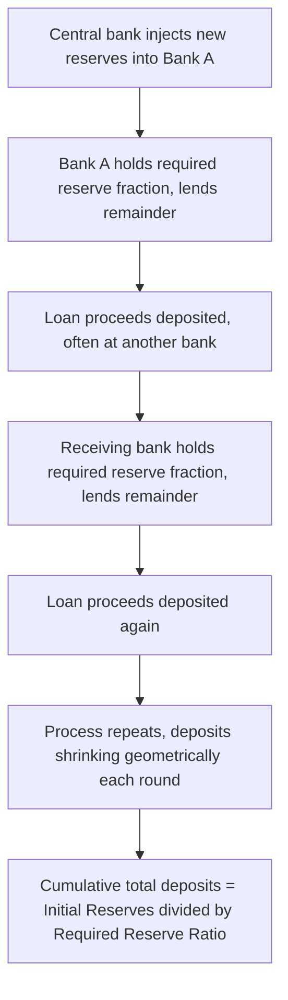
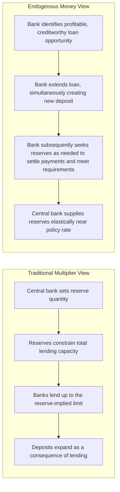

## Money Creation and the Fractional Reserve Banking System

### Overview

Fractional reserve banking is the system in which commercial banks hold only a fraction of depositors' funds as readily available reserves, lending out the remainder. This practice allows the banking system, in aggregate, to create money in excess of the base money issued by the central bank — a process central to understanding how the broad money supply (M1, M2) can substantially exceed the monetary base (M0). Two complementary models explain this process: the traditional **money multiplier** framework and the more institutionally grounded **loanable-reserves-are-not-the-binding-constraint** view emphasized in modern central-bank descriptions of bank lending.

---

### The Basic Mechanics of Deposit Creation

**Key Points**

- When a bank receives a deposit, it is required (or chooses, for prudential reasons) to hold only a fraction of it as **reserves** — vault cash plus balances held at the central bank — and can lend out the remainder.
- When the bank makes a loan, the borrower typically does not hold the loan proceeds as physical cash; the funds are usually deposited into a bank account (potentially at the same or a different bank), creating a **new deposit** in the banking system.
- This new deposit again becomes subject to a reserve requirement (or the lending bank's own prudential reserve target), and a fraction of it can again be lent out, again generating a new deposit — a cascading process that, in the simplest textbook version, continues until reserves are fully "used up" relative to the required reserve ratio.
- The cumulative effect is that an initial injection of central bank reserves (an increase in M0) can support a **multiple** expansion of bank deposits (an increase in M1/M2), because each dollar of reserves is not fully "locked up" against a single dollar of deposits.

---

### The Simple (Textbook) Money Multiplier Model

**Setup**

Let $rr$ denote the **required reserve ratio** (the fraction of deposits banks must hold as reserves), and assume, for the simplest version of the model, that: (1) banks hold no reserves beyond the legal requirement (no excess reserves), and (2) the public holds no currency (all money is held as bank deposits). Under these simplifying assumptions, an initial deposit $D_0$ generates a geometric series of successive re-lending and re-depositing rounds:

$$D_0, \; D_0(1-rr), \; D_0(1-rr)^2, \; D_0(1-rr)^3, \; \ldots$$

Summing this infinite geometric series gives total deposits created:

$$D_{total} = D_0 \sum_{n=0}^{\infty} (1-rr)^n = \frac{D_0}{rr}$$

This yields the **simple money multiplier**:

$$m = \frac{1}{rr}$$

**Interpretation**: with a required reserve ratio of, say, $rr = 0.10$ (10%), each dollar of new reserves can theoretically support up to $\frac{1}{0.10} = 10$ dollars of total deposits in the banking system as a whole — even though no individual bank creates money out of nothing; each bank simply re-lends a fraction of what it receives, and the *system-wide* cumulative effect multiplies the initial injection.

---

### Worked Numerical Example: The Multi-Round Deposit Expansion

**Example**

Suppose the central bank injects $1,000 of new reserves into Bank A (e.g., via an open market purchase of securities from Bank A), and the required reserve ratio is $rr = 0.20$ (20%). Assume no excess reserves are held and no currency is held by the public (the simplifying textbook assumptions).

| Round | Bank | New deposit received | Required reserves held (20%) | Amount available to lend (80%) |
| --- | --- | --- | --- | --- |
| 1 | Bank A | $1,000.00 | $200.00 | $800.00 |
| 2 | Bank B | $800.00 | $160.00 | $640.00 |
| 3 | Bank C | $640.00 | $128.00 | $512.00 |
| 4 | Bank D | $512.00 | $102.40 | $409.60 |
| ... | ... | ... | ... | ... |

Summing the full infinite series using the multiplier formula:

$$D_{total} = \frac{1{,}000}{0.20} = \$5{,}000$$

The initial $1,000 injection of reserves ultimately supports $5,000 in total deposits system-wide — a fivefold expansion — through the cumulative effect of repeated partial lending and re-depositing across many banks.

---

### Diagram: The Deposit Creation / Re-lending Cascade

---

### The Generalized Money Multiplier: Incorporating Currency and Excess Reserves

**Refined Setup**

The simple multiplier's assumptions (no currency holdings by the public, no excess reserves held by banks) are unrealistic. A more general formulation defines the money multiplier in terms of the ratio of a broad money aggregate ($M$) to the monetary base ($MB$):

$$m = \frac{M}{MB}$$

Introducing two additional behavioral parameters:

- $c$ = the **currency-to-deposit ratio** the public chooses to hold ($C/D$)
- $e$ = the **excess-reserves-to-deposit ratio** banks choose to hold beyond the legal requirement ($ER/D$)

The monetary base can be decomposed as $MB = C + R = C + (rr + e)D$, and the broad money stock as $M = C + D$. Substituting and simplifying yields the generalized multiplier:

$$m = \frac{M}{MB} = \frac{C + D}{C + (rr+e)D} = \frac{c+1}{c + rr + e}$$

**Interpretation of comparative statics**:

- A **higher required reserve ratio** ($rr$) *reduces* the multiplier (more reserves locked up per dollar of deposits, less available to re-lend).
- A **higher currency-holding preference** ($c$) *reduces* the multiplier, because currency withdrawn from the banking system does not participate in the deposit-expansion (re-lending) process — every dollar the public holds as cash rather than deposits is a "leakage" out of the multiplier chain.
- A **higher excess-reserves ratio** ($e$) — banks holding reserves beyond the legal minimum, often for precautionary or (when reserves are remunerated) yield-driven reasons — also *reduces* the multiplier, since those funds are not lent out and thus do not generate new deposits.

---

### Diagram: Determinants of the Money Multiplier

<svg xmlns="http://www.w3.org/2000/svg" viewBox="0 0 760 380" font-family="Arial, sans-serif">
<text x="380" y="25" text-anchor="middle" font-size="16" font-weight="bold">Determinants of the Money Multiplier (svg_diagram)</text>
<rect x="300" y="170" width="160" height="60" rx="8" fill="#1f77b4" />
<text x="380" y="195" text-anchor="middle" font-size="13" fill="white">Money Multiplier</text>
<text x="380" y="212" text-anchor="middle" font-size="13" fill="white">m = M / MB</text>
<rect x="60" y="60" width="180" height="55" rx="8" fill="#d62728" opacity="0.85" />
<text x="150" y="85" text-anchor="middle" font-size="12" fill="white">Required reserve ratio (rr)</text>
<text x="150" y="102" text-anchor="middle" font-size="11" fill="white">Higher rr lowers m</text>
<line x1="150" y1="115" x2="330" y2="175" stroke="black" stroke-width="1.5" marker-end="url(#a1)" />
<rect x="60" y="290" width="180" height="55" rx="8" fill="#ff7f0e" opacity="0.85" />
<text x="150" y="315" text-anchor="middle" font-size="12" fill="white">Currency-deposit ratio (c)</text>
<text x="150" y="332" text-anchor="middle" font-size="11" fill="white">Higher c lowers m</text>
<line x1="150" y1="290" x2="330" y2="225" stroke="black" stroke-width="1.5" marker-end="url(#a1)" />
<rect x="520" y="60" width="180" height="55" rx="8" fill="#2ca02c" opacity="0.85" />
<text x="610" y="85" text-anchor="middle" font-size="12" fill="white">Excess reserves ratio (e)</text>
<text x="610" y="102" text-anchor="middle" font-size="11" fill="white">Higher e lowers m</text>
<line x1="610" y1="115" x2="430" y2="175" stroke="black" stroke-width="1.5" marker-end="url(#a1)" />
</svg>

---

### The Traditional (Textbook) View: Reserves as the Binding Constraint

In the classic textbook exposition, the causal sequence runs: the central bank sets or changes the level of bank reserves (via open market operations) → this constrains the total quantity of deposits the banking system can support, given the required reserve ratio → banks then decide how much to lend, subject to that reserve constraint. Under this view, reserves are the exogenous, policy-controlled variable, and the money multiplier translates a given change in reserves into a predictable change in the broader money supply — informing money-supply-targeting approaches to monetary policy historically associated with monetarism.

---

### The Modern Central-Bank View: Loans Create Deposits Endogenously

**Key Points**

A substantial body of central-bank research and commentary (including publications from institutions such as the Bank of England and, in various forms, other central banks) describes the causal sequence differently, emphasizing that in modern banking systems:

- **Banks do not typically lend out pre-existing reserves directly to borrowers.** Instead, when a bank extends a loan, it simultaneously creates a new deposit in the borrower's account — the loan and the deposit are created together as a balance-sheet expansion (a new asset, the loan, and a new liability, the deposit), not a transfer of pre-existing funds.
- Under this view, the bank's decision to lend is driven primarily by its assessment of the profitability and creditworthiness of the loan opportunity, subject to capital adequacy requirements and its own risk-management judgment — **not** by first needing to accumulate spare reserves and then deciding how much of them to lend out.
- **Reserves are obtained afterward, largely on demand**, if the bank finds itself short of the reserves needed to meet reserve requirements or clear interbank payments; in most modern operating frameworks, central banks supply reserves elastically at (or near) their policy rate to accommodate this demand, rather than rigidly rationing the reserve quantity and letting the interbank market determine the price.
- This perspective is sometimes summarized as **"loans create deposits"** rather than **"deposits create loans,"** reversing the intuitive causal direction implied by the simple textbook multiplier story.

**Reconciling the two views**: both descriptions are consistent with the same underlying balance-sheet arithmetic and the same eventual multiplier-like relationship between the monetary base and broad money in the aggregate; they differ chiefly in **which variable is treated as the proximate, policy-controlled trigger of the lending decision** — reserve availability (textbook multiplier) versus profitable lending opportunities subject to capital constraints (modern endogenous-money view) — and in how central banks in practice have operated their reserve-supply frameworks in recent decades (many operating with reserves supplied more elastically, particularly under "ample reserves" or "floor" operating systems, rather than through tight reserve-quantity targeting). **[Inference]** The degree to which any specific central bank's day-to-day operating framework corresponds more closely to a reserve-constrained versus reserve-elastic description varies across countries and periods and should be checked against that institution's current operational framework rather than assumed uniform.

---

### Diagram: Two Causal Narratives of Deposit-Loan Creation

---

### Bank Capital, Not Just Reserves, as a Binding Constraint

**Key Points**

- Beyond reserve availability, a bank's capacity and willingness to extend new loans is constrained by **capital adequacy regulation** (minimum ratios of loss-absorbing capital relative to risk-weighted assets), which limits how much a bank can expand its balance sheet (loans and corresponding deposits) without raising additional capital.
- In many modern analyses of bank lending behavior — particularly during periods of financial stress — **capital constraints**, rather than reserve constraints, are emphasized as the more economically binding limit on credit creation, since banks facing capital shortfalls may curtail lending even when ample reserves are available (a phenomenon linked to the bank capital channel of the financial accelerator).
- This reinforces the broader point that the simple reserve-based multiplier, while useful as a first illustrative approximation, omits several institutionally important constraints (capital, liquidity regulation, credit risk assessment, loan demand) that materially affect the actual pace and volume of money and credit creation in practice.

---

### The Balance Sheet View of Deposit Creation

**Example**

Consider a simplified T-account illustration of a single loan-creation event at Bank A, prior to any subsequent re-lending rounds:

**Bank A's balance sheet — before the loan:**

| Assets | Liabilities |
| --- | --- |
| Reserves: $1,000 | Deposits: $1,000 |

**Bank A extends a new $500 loan to a borrower, crediting the loan proceeds directly to the borrower's deposit account at Bank A:**

| Assets | Liabilities |
| --- | --- |
| Reserves: $1,000 | Deposits: $1,500 |
| Loans: $500 |  |

Immediately after this transaction, Bank A's deposits have risen by $500 — a new deposit has been created **simultaneously with the loan**, without any prior transfer of existing reserves to the borrower. Bank A's reserves are unchanged at this instant; only *afterward*, if the reserve requirement or the borrower's subsequent withdrawal/payment activity requires it, does Bank A need to ensure it holds sufficient reserves against the now-larger deposit base (potentially borrowing reserves in the interbank market or from the central bank if it is short). This illustrates the "loans create deposits" mechanism directly at the level of a single bank's balance sheet.

---

### Reserve Requirements as a Policy Tool: Historical and Current Status

**Key Points**

- Historically, changes in the **required reserve ratio** were used by some central banks as a direct policy lever to expand or contract the potential money multiplier and hence credit conditions.
- In several major economies, required reserve ratios on many deposit categories have in recent years been reduced to very low levels or eliminated for large classes of institutions, reflecting a broader shift toward operating monetary policy primarily through the **policy interest rate** (and, in many systems, the interest rate paid on reserves) rather than through reserve-quantity mandates. **[Unverified]** The specific current reserve-requirement structure (rate, applicable institutions, deposit categories covered) for any given country changes periodically by regulatory action and should be verified against that country's current central bank regulations rather than assumed fixed.
- Where reserve requirements remain low or near zero, the simple textbook multiplier (which depends critically on a binding, non-trivial $rr$) becomes a considerably less accurate description of the *proximate* mechanical constraint on deposit expansion — reinforcing why many central banks' own explanatory materials favor the endogenous-money, capital/creditworthiness-constrained narrative over the strict mechanical multiplier story for describing current operations.

---

### Systemic Risk Implications of Fractional Reserve Banking

**Key Points**

- Because banks hold only a fraction of deposits as liquid reserves, a fractional reserve system is inherently exposed to **bank run risk**: if a large share of depositors simultaneously attempt to withdraw funds, a solvent bank can nonetheless face a liquidity crisis, since it cannot rapidly liquidate the (illiquid) loans and other assets backing those deposits without loss.
- This vulnerability is the core economic rationale for **deposit insurance** (protecting small depositors and reducing the incentive to run), **central bank lender-of-last-resort facilities** (providing emergency liquidity against sound collateral to solvent-but-illiquid banks), and **prudential liquidity regulation** (e.g., minimum liquidity coverage ratios requiring banks to hold sufficient high-quality liquid assets against potential short-term outflows).
- The classic theoretical formalization of this fragility is the **Diamond-Dybvig (1983)** bank-run model, which shows that fractional reserve (maturity-transforming) banking, while socially valuable in normal times (transforming illiquid long-term assets into liquid demand deposits, improving welfare relative to a world without such intermediation), admits multiple equilibria — including a "bad" self-fulfilling run equilibrium — purely from the coordination problem among depositors, independent of the bank's underlying asset quality.

---

### Money Creation and Monetary Policy Transmission

The money-creation process described here underlies how **monetary policy actions propagate** to the broader economy:

- **Open market operations / reserve injections**: by altering the quantity (or, in an interest-rate-operating framework, the price) of reserves available to the banking system, the central bank influences banks' funding costs and, in principle, their willingness and capacity to extend new credit.
- **Interest on reserves**: in operating frameworks where the central bank pays interest on reserve balances, this rate can serve as a floor (or a key anchor) for short-term interbank rates, providing an alternative transmission channel to strict reserve-quantity management, further underscoring the modern shift away from reliance on the mechanical multiplier as the primary description of policy transmission.
- **Credit channel linkages**: money creation dynamics interact directly with the financing-constraints and bank-lending-channel literature (see the Investment Theory chapter's coverage of financing constraints), since the pace at which banks create new deposits through lending directly determines the availability of external finance to firms and households.

---

**Related Topics**

- Monetary aggregates: M0, M1, M2, and broader measures
- Functions and definitions of money
- Central bank operating frameworks: reserve-scarce vs. ample-reserves systems
- Diamond-Dybvig model and bank runs
- Deposit insurance and lender-of-last-resort facilities
- Bank capital regulation and capital adequacy ratios (Basel framework)
- Financing constraints and the bank lending channel of monetary policy
- Interest on reserves and the corridor/floor systems of monetary policy implementation
- Financial accelerator and the bank capital channel
- Endogenous money theory and post-Keynesian monetary economics