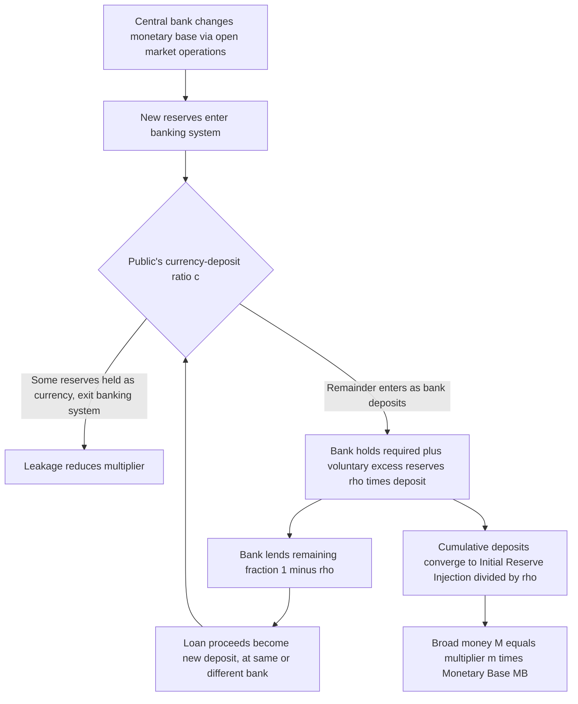

## Money Multiplier and the Deposit Expansion Process

### Overview

The money multiplier is the ratio that links the monetary base (central-bank money) to the broader money supply (bank deposits plus currency), formalizing how a given quantity of reserves in the banking system can support a larger stock of deposit money through successive rounds of lending and re-depositing. This entry develops the formal derivation of the multiplier, its behavioral determinants, its empirical instability, and its role in the deposit expansion process — building on, but adding analytical depth beyond, the general institutional description of fractional reserve banking.

---

### Defining the Multiplier

**Key Points**

The money multiplier $m$ is defined as the ratio of a chosen broad money aggregate $M$ to the monetary base $MB$:

$$m = \frac{M}{MB} \quad \Longleftrightarrow \quad M = m \times MB$$

This identity is the foundation of the **money supply function** in traditional monetary models: since the central bank is presumed to control $MB$ relatively directly (through open market operations and other balance-sheet actions), the multiplier $m$ translates that control into an implied effect on the broader, economically relevant money stock $M$ that households and firms actually use for transactions.

---

### Deriving the Multiplier from Behavioral Ratios

**Setup**

Define two portfolio-choice ratios reflecting the behavior of the non-bank public and of commercial banks respectively:

- **Currency-deposit ratio**: $c \equiv \dfrac{C}{D}$ — the fraction of deposits the public chooses to hold as currency instead.
- **Reserve-deposit ratio**: $\rho \equiv \dfrac{R}{D}$ — total reserves held by banks (required plus any excess) as a fraction of deposits, where $\rho = rr + e$ ($rr$ the required reserve ratio, $e$ the excess-reserves ratio banks choose to hold).

The monetary base is the sum of currency and total bank reserves:

$$MB = C + R = cD + \rho D = (c+\rho)D$$

The broad money stock is currency plus deposits:

$$M = C + D = cD + D = (c+1)D$$

Dividing the two expressions for $M$ and $MB$ by $D$ and forming the ratio yields the multiplier:

$$m = \frac{M}{MB} = \frac{(c+1)D}{(c+\rho)D} = \frac{1+c}{c+\rho}$$

**Special case check**: if the public holds no currency ($c=0$) and banks hold no excess reserves ($e=0$, so $\rho = rr$), the formula collapses to $m = \dfrac{1}{rr}$, recovering the simple textbook multiplier as the special case in which the only "leakage" from the deposit-expansion chain is the required reserve.

---

### The Deposit Expansion Process as a Geometric Series

**Formal Derivation**

Consider an initial injection of reserves $\Delta R_0$ into the banking system, with no currency leakage ($c=0$) for analytical simplicity, and a constant reserve ratio $\rho$ applied uniformly at each bank in the chain. At each successive round $n$, a bank receiving a new deposit $D_n$ holds $\rho D_n$ as reserves and lends out $(1-\rho)D_n$, which becomes the next round's deposit $D_{n+1} = (1-\rho)D_n$.

Starting from $D_0 = \Delta R_0$ (the initial deposit equals the initial reserve injection, assuming it enters the system as a deposit at the first bank), the sequence of deposits created at each round is:

$$D_0,\; D_0(1-\rho),\; D_0(1-\rho)^2,\; D_0(1-\rho)^3, \; \ldots, \; D_0(1-\rho)^n, \ldots$$

The **total cumulative deposit creation** across all rounds is the sum of this infinite geometric series with common ratio $(1-\rho)$:

$$D_{total} = D_0 \sum_{n=0}^{\infty} (1-\rho)^n = D_0 \cdot \frac{1}{1-(1-\rho)} = \frac{D_0}{\rho}$$

This confirms the simple multiplier result: total deposits created equal the initial injection divided by the reserve ratio, $\dfrac{1}{\rho}$ times the initial reserve injection.

**Convergence condition**: the geometric series converges only because $0 < \rho \le 1$ ensures $|1-\rho| < 1$; if $\rho = 0$ (no reserve requirement and no voluntary reserve-holding at all), the series would not converge, formally corresponding to an unbounded (infinite) deposit-expansion process — a reminder that some strictly positive reserve-holding behavior is what makes the deposit multiplier a finite, well-defined number.

---

### Diagram: The Deposit Expansion Series, Round by Round

<svg xmlns="http://www.w3.org/2000/svg" viewBox="0 0 780 400" font-family="Arial, sans-serif">
<text x="390" y="25" text-anchor="middle" font-size="16" font-weight="bold">Deposit Expansion as a Geometric Series (svg_diagram)</text>
<line x1="70" y1="340" x2="740" y2="340" stroke="black" stroke-width="2" />
<line x1="70" y1="340" x2="70" y2="60" stroke="black" stroke-width="2" />
<text x="405" y="370" text-anchor="middle" font-size="13">Round n</text>
<text x="30" y="200" text-anchor="middle" font-size="13" transform="rotate(-90 30 200)">New Deposit Created</text>
<rect x="90" y="80" width="50" height="260" fill="#1f77b4" />
<text x="115" y="360" text-anchor="middle" font-size="11">0</text>
<text x="115" y="70" text-anchor="middle" font-size="10">1000</text>
<rect x="180" y="150" width="50" height="190" fill="#1f77b4" opacity="0.85" />
<text x="205" y="360" text-anchor="middle" font-size="11">1</text>
<text x="205" y="140" text-anchor="middle" font-size="10">800</text>
<rect x="270" y="200" width="50" height="140" fill="#1f77b4" opacity="0.72" />
<text x="295" y="360" text-anchor="middle" font-size="11">2</text>
<text x="295" y="190" text-anchor="middle" font-size="10">640</text>
<rect x="360" y="235" width="50" height="105" fill="#1f77b4" opacity="0.6" />
<text x="385" y="360" text-anchor="middle" font-size="11">3</text>
<text x="385" y="225" text-anchor="middle" font-size="10">512</text>
<rect x="450" y="260" width="50" height="80" fill="#1f77b4" opacity="0.48" />
<text x="475" y="360" text-anchor="middle" font-size="11">4</text>
<text x="475" y="250" text-anchor="middle" font-size="10">410</text>
<rect x="540" y="278" width="50" height="62" fill="#1f77b4" opacity="0.35" />
<text x="565" y="360" text-anchor="middle" font-size="11">5</text>

<text x="670" y="200" font-size="12" font-style="italic">Series converges to</text>

<text x="670" y="216" font-size="12" font-style="italic">D0 / rho as n to infinity</text>

</svg>

---

### Comparative Statics of the Deposit Expansion Process

| Parameter change | Effect on multiplier $m$ | Underlying mechanism |
| --- | --- | --- |
| Required reserve ratio $rr$ rises | $m$ falls | Larger fraction of each round's deposit is impounded as reserves rather than re-lent |
| Excess reserve ratio $e$ rises | $m$ falls | Banks voluntarily hold more idle reserves, reducing the re-lending fraction each round |
| Currency-deposit ratio $c$ rises | $m$ falls | Cash withdrawn from the banking system exits the deposit-expansion chain entirely at that round |
| Number of expansion rounds (conceptually, $n \to \infty$) | Cumulative deposits converge to the finite limit $D_0/\rho$ | The geometric series' partial sums approach but never formally reach the closed-form limit in finite time |

---

### Diagram: Full Multiplier Process from Base Money to Broad Money

---

### Worked Numerical Example: Solving for the Multiplier from Behavioral Ratios

**Example**

Suppose empirical data for an economy show: currency-deposit ratio $c = 0.25$ (the public holds 25 cents in currency for every dollar of deposits), required reserve ratio $rr = 0.08$, and banks voluntarily hold excess reserves equal to $e = 0.02$ of deposits (perhaps for precautionary liquidity management). Then $\rho = rr + e = 0.08 + 0.02 = 0.10$.

$$m = \frac{1+c}{c+\rho} = \frac{1+0.25}{0.25+0.10} = \frac{1.25}{0.35} \approx 3.57$$

If the monetary base is $MB = \$800$bn, the implied broad money stock is:

$$M = m \times MB = 3.57 \times 800 \approx \$2{,}857\text{bn}$$

Compare this to the *simple* textbook multiplier that ignores currency and excess reserves, $m_{simple} = 1/rr = 1/0.08 = 12.5$, which would imply $M = 12.5 \times 800 = \$10{,}000$bn — nearly **3.5 times larger** than the realistic estimate. This large gap illustrates why the simple multiplier, while pedagogically useful for introducing the mechanism, substantially **overstates** actual deposit expansion once realistic currency-holding and excess-reserve behavior are incorporated. **[Inference]** The specific numeric ratios used here are illustrative; actual empirical values for $c$, $rr$, and $e$ vary considerably by country, period, and (for $e$) by the prevailing interest-rate environment (e.g., excess reserve holdings rise sharply when interest is paid on reserves at a competitive rate, or during periods of heightened risk aversion by banks).

---

### Empirical Instability of the Money Multiplier

**Key Points**

- The money multiplier is **not a fixed structural constant**; it varies over time as $c$, $rr$, and $e$ respond to changes in interest rates, financial regulation, payment technology, and banks' risk preferences.
- **Excess reserves are particularly volatile**: during periods of financial stress or heightened uncertainty, banks often sharply increase voluntary reserve holdings (raising $e$, lowering $m$) even when required reserve ratios are unchanged, as a precautionary response to elevated counterparty and liquidity risk.
- **Large-scale central bank asset purchase programs** (quantitative easing) that substantially expand the monetary base have, in various historical episodes, coincided with a falling (not rising) measured multiplier, because the resulting reserve expansion was accompanied by an even larger proportional increase in banks' excess reserve holdings rather than a proportional expansion of lending — a pattern that significantly weakened the historical empirical reliability of the simple multiplier as a forecasting tool for the broader money supply following such episodes. **[Unverified]** The precise magnitude and duration of multiplier declines following any specific quantitative easing episode is data- and period-specific and should be checked against contemporaneous central bank and academic analysis rather than treated as a fixed, generalizable number.
- This empirical instability is a central reason the multiplier framework, while retained as a useful pedagogical and accounting identity, is treated with caution as a tool for **predicting** or **precisely targeting** the broader money supply in modern monetary policy practice, reinforcing the shift (discussed in the money-creation topic) toward interest-rate-based and endogenous-money-oriented operating frameworks.

---

### The Multiplier as an Ex Post Accounting Identity versus an Ex Ante Behavioral Model

**Key Points**

A useful conceptual distinction:

- As an **ex post accounting identity**, $m = M/MB$ is definitionally true by construction for any observed $M$ and $MB$ — it always "holds" numerically, regardless of the underlying causal story.
- As an **ex ante behavioral/causal model** — the claim that a *given, exogenous* change in $MB$ will predictably generate a corresponding $m$-scaled change in $M$, with $m$ approximately stable and forecastable in advance — the multiplier framework is considerably more contestable, and is precisely the aspect challenged by the endogenous-money perspective and by the empirical instability documented above.
- **Practical implication for interpreting monetary statistics**: a rising or falling *measured* multiplier over time can be validly computed after the fact from data, but should not automatically be read as evidence that the central bank could have *precisely engineered* a particular $M$ outcome by choosing a particular $MB$ target, given how endogenously $c$, $rr$-compliance behavior, and especially $e$ respond to prevailing economic and financial conditions.

---

### Multi-Bank versus Single-Bank Perspective

**Key Points**

- **From a single bank's perspective**, an individual bank generally cannot count on retaining a new deposit within its own walls through further internal lending rounds — loan proceeds are typically paid out to third parties who often bank elsewhere, meaning a single small bank's own lending is constrained essentially by the reserves and deposits actually on its own balance sheet at a point in time, not by the systemwide multiplier logic.
- **The multiplier is fundamentally a systemwide (aggregate banking system) concept**: it describes the cumulative effect of the deposit-redepositing chain occurring across the banking system as a whole, as loan proceeds circulate between many different banks, each holding back a fraction and re-lending the rest, converging to the aggregate result derived above — not a description of what any single bank can unilaterally accomplish with its own reserves.
- This distinction is important pedagogically: introductory treatments sometimes present the multiplier process using a sequence of *different named banks* (Bank A, Bank B, Bank C, as in the worked examples above) precisely to make clear that the expansion is a systemwide, multi-institution phenomenon rather than something occurring within a single bank's books.

---

### Summary Formula Reference

$$m_{simple} = \frac{1}{rr}$$

$$m_{general} = \frac{1+c}{c+\rho}, \quad \rho = rr + e$$

$$M = m \times MB$$

$$D_{total} = \frac{D_0}{\rho} \quad \text{(cumulative deposit expansion from an initial injection } D_0\text{)}$$

---

**Related Topics**

- Money creation and the fractional reserve banking system
- Monetary aggregates: M0, M1, M2, and broader measures
- Central bank operating frameworks and reserve-supply elasticity
- Quantitative easing and its effect on bank reserves and the multiplier
- Endogenous money theory and the "loans create deposits" view
- Interest on reserves and its effect on banks' excess reserve holdings
- Bank capital regulation as a constraint on credit and deposit creation
- Historical monetary targeting and the practical failure of stable multiplier-based forecasting
- Diamond-Dybvig model and liquidity transformation in banking
- Financial accelerator and the bank lending channel of monetary policy