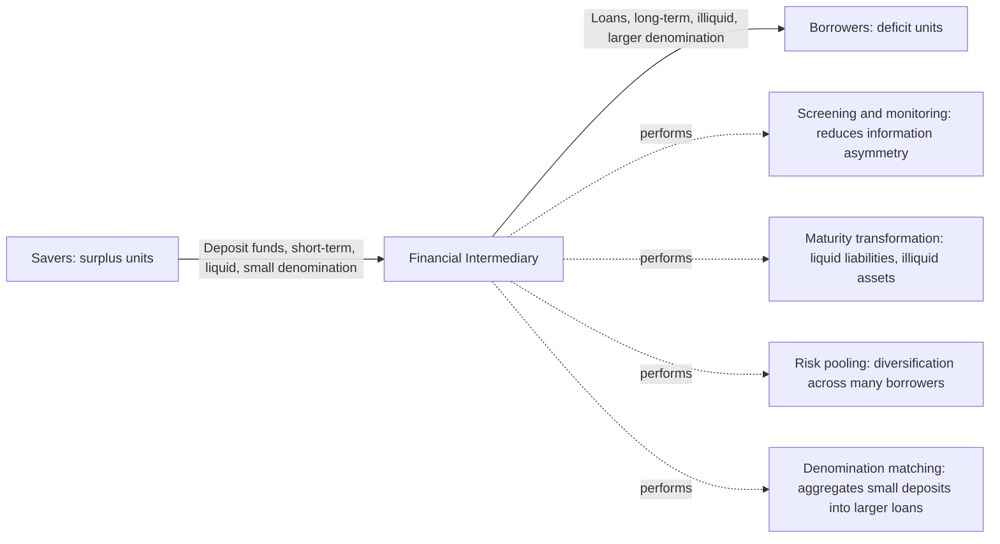
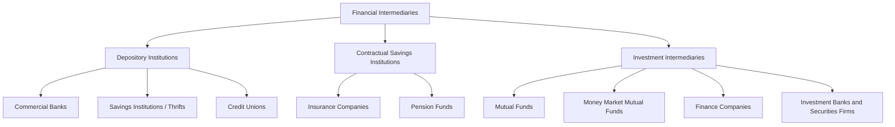

## Commercial Banks and Financial Intermediaries

### Overview

Financial intermediaries are institutions that channel funds from savers (surplus units) to borrowers (deficit units), transforming the characteristics of financial claims in ways that make both parties better off than they could achieve through direct, unintermediated finance. Commercial banks are the most prominent example, but the broader intermediary universe includes savings institutions, credit unions, insurance companies, pension funds, mutual funds, and a range of non-bank ("shadow banking") entities. Understanding why intermediaries exist, what economic functions they perform, and how they differ from one another is foundational to monetary and financial economics.

---

### Why Financial Intermediaries Exist: The Economic Rationale

**Key Points**

In a hypothetical frictionless world with complete information and costless contracting, savers and borrowers could contract directly with one another, and intermediaries would add no value. Financial intermediaries exist because real-world capital markets are characterized by several frictions that direct finance handles poorly:

- **Information asymmetry**: Borrowers typically know more about their own creditworthiness and project quality than potential lenders (adverse selection, as in Akerlof's "lemons" problem) and can take hidden actions after receiving funds that lenders cannot easily observe (moral hazard). Intermediaries specialize in **screening** (evaluating creditworthiness before lending) and **monitoring** (overseeing borrower behavior after lending), spreading the fixed costs of information-gathering over many transactions in ways an individual saver could not efficiently replicate.
- **Transaction costs**: Direct matching of individual savers with individual borrowers involves substantial search, negotiation, and contracting costs; intermediaries achieve **economies of scale** in transaction processing, standardizing contracts and pooling many small transactions.
- **Liquidity and maturity mismatch demands**: Savers often want liquid, short-term claims (able to withdraw funds on short notice), while borrowers (particularly for productive investment) often need long-term, illiquid funding commitments. Intermediaries perform **maturity transformation** (or "asset transformation"), issuing short-term, liquid liabilities (like demand deposits) while holding longer-term, illiquid assets (like business loans or mortgages) — a function formalized in the Diamond-Dybvig (1983) framework.
- **Risk pooling and diversification**: By aggregating funds from many savers and lending to many different borrowers, an intermediary can diversify idiosyncratic default risk across its loan portfolio in ways an individual direct lender to a single borrower could not, reducing the risk borne by any individual saver for a given expected return.
- **Denomination matching**: Intermediaries can aggregate many small individual savings amounts into the larger loan sizes borrowers typically require, and conversely can break large pooled asset holdings into small denominations suitable for individual savers (e.g., mutual fund shares).

---

### Diagram: The Intermediation Function

---

### Commercial Banks: Balance Sheet Structure

**Key Points**

A commercial bank's balance sheet reflects its core intermediation function — funding relatively illiquid, longer-term assets with shorter-term, more liquid liabilities.

**Typical Assets** (uses of funds):

- **Reserves**: vault cash and balances held at the central bank, used to meet reserve requirements and settle interbank payments.
- **Loans**: commercial and industrial loans, consumer loans, residential and commercial mortgages — typically the largest and least liquid component of assets, generating the bulk of interest income.
- **Securities holdings**: government bonds, agency securities, and other marketable instruments held for liquidity management, income, and (in some jurisdictions) regulatory collateral purposes.
- **Other assets**: fixed assets (premises, equipment), interbank lending, and various other claims.

**Typical Liabilities** (sources of funds):

- **Deposits**: demand deposits (checking accounts), savings deposits, and time deposits (certificates of deposit) — the primary funding source for most commercial banks, and the component that feeds directly into the monetary aggregates (M1/M2) covered elsewhere in this chapter.
- **Borrowed funds**: interbank borrowing, repurchase agreements, wholesale funding, and central bank borrowing facilities.
- **Bank capital (equity)**: shareholders' equity, the loss-absorbing buffer that protects depositors and other creditors; the focus of capital adequacy regulation (discussed below).

$$\text{Assets} = \text{Liabilities} + \text{Bank Capital}$$

$$\text{Reserves} + \text{Loans} + \text{Securities} + \text{Other Assets} = \text{Deposits} + \text{Borrowed Funds} + \text{Capital}$$

---

### Diagram: Simplified Commercial Bank Balance Sheet

<svg xmlns="http://www.w3.org/2000/svg" viewBox="0 0 700 380" font-family="Arial, sans-serif">
<text x="350" y="25" text-anchor="middle" font-size="16" font-weight="bold">Simplified Commercial Bank Balance Sheet (svg_diagram)</text>

<text x="175" y="55" text-anchor="middle" font-size="14" font-weight="bold">Assets</text>

<text x="525" y="55" text-anchor="middle" font-size="14" font-weight="bold">Liabilities + Capital</text>

<line x1="350" y1="60" x2="350" y2="340" stroke="black" stroke-width="1.5" />
<rect x="70" y="70" width="210" height="45" fill="#1f77b4" />
<text x="175" y="97" text-anchor="middle" font-size="12" fill="white">Reserves</text>
<rect x="70" y="120" width="210" height="140" fill="#2ca02c" />
<text x="175" y="195" text-anchor="middle" font-size="13" fill="white">Loans</text>
<text x="175" y="212" text-anchor="middle" font-size="10" fill="white">(largest, least liquid)</text>
<rect x="70" y="265" width="210" height="55" fill="#ff7f0e" />
<text x="175" y="297" text-anchor="middle" font-size="12" fill="white">Securities and Other Assets</text>
<rect x="420" y="70" width="210" height="170" fill="#9467bd" />
<text x="525" y="160" text-anchor="middle" font-size="13" fill="white">Deposits</text>
<text x="525" y="177" text-anchor="middle" font-size="10" fill="white">(primary funding source)</text>
<rect x="420" y="245" width="210" height="45" fill="#8c564b" />
<text x="525" y="272" text-anchor="middle" font-size="12" fill="white">Borrowed Funds</text>
<rect x="420" y="295" width="210" height="30" fill="#d62728" />
<text x="525" y="315" text-anchor="middle" font-size="11" fill="white">Bank Capital (Equity)</text>
</svg>

---

### The Bank's Core Economic Functions Revisited: Term and Risk Transformation

- **Maturity/liquidity transformation**: banks fund long-term, illiquid loans with short-term, liquid deposits, bearing the risk that deposit withdrawals could exceed available liquid assets (the source of bank-run vulnerability discussed in the fractional-reserve-banking topic).
- **Credit risk transformation**: banks issue relatively safe, largely fixed-value deposit liabilities (further protected by deposit insurance in most modern systems) while holding riskier loan assets whose returns are variable and subject to default risk — the bank's capital buffer, and its diversification across many borrowers, absorb this risk transformation.
- **Liquidity insurance**: beyond simple maturity transformation, banks provide a form of insurance to depositors against idiosyncratic liquidity needs (an unexpected need for cash), pooling many depositors' uncorrelated liquidity shocks so that, absent panic-driven runs, only a predictable fraction of deposits needs to be held in liquid form at any time — the theoretical basis of the Diamond-Dybvig model referenced in the fractional-reserve topic.

---

### Types of Financial Intermediaries: A Comparative Taxonomy

**Key Points**

**Depository Institutions**

- **Commercial banks**: the largest category by assets in most financial systems; accept deposits and make a broad range of loans to businesses, consumers, and (via mortgages) households.
- **Savings institutions (thrifts/savings and loan associations)**: historically specialized in residential mortgage lending, funded by household savings deposits; in many jurisdictions their regulatory and functional distinction from commercial banks has narrowed considerably over recent decades.
- **Credit unions**: member-owned, not-for-profit depository cooperatives, typically serving a defined membership base (occupational, community, or associational), and generally smaller in scale than commercial banks individually, though collectively significant in some markets.

**Contractual Savings Institutions**

- **Insurance companies**: collect premiums in exchange for contingent future payouts (life, health, property/casualty insurance), investing premium income in long-duration assets to match the typically long-duration, relatively predictable nature of their insurance liabilities.
- **Pension funds**: pool contributions from employers and/or employees to fund future retirement benefits, typically investing over very long horizons given the long-dated nature of pension liabilities.

**Investment Intermediaries**

- **Mutual funds**: pool investor funds to purchase diversified portfolios of securities, issuing redeemable shares to investors; open-ended mutual funds allow investors to redeem shares (and receive newly issued shares) at net asset value on a rolling basis.
- **Money market mutual funds**: a specialized category of mutual fund investing in short-term, high-quality debt instruments, historically marketed as offering a stable net asset value and check-writing-like liquidity — functionally close to bank deposits despite not being a depository institution, which has made them a recurring focus of the "shadow banking" and monetary-aggregate classification discussions covered elsewhere in this chapter.
- **Finance companies**: extend loans (particularly consumer and business installment credit) funded not by deposits but by issuing commercial paper, bonds, and other wholesale liabilities in capital markets.
- **Investment banks and securities firms**: primarily facilitate capital-market transactions (underwriting new securities issuance, mergers and acquisitions advisory, trading), distinct in core function from the deposit-taking, loan-making role of commercial banks, though in many jurisdictions these functions can be housed within the same diversified financial holding company structure.

---

### Diagram: Taxonomy of Financial Intermediaries

---

### Commercial Banks versus Non-Bank Intermediaries: Key Distinctions

| Dimension | Commercial Banks | Typical Non-Bank Intermediaries |
| --- | --- | --- |
| Primary funding source | Deposits (often insured, highly liquid liabilities) | Wholesale market funding, premiums, contributions, or fund-share issuance |
| Access to central bank facilities | Direct access to central bank lending facilities and, typically, payment/settlement systems | Generally limited or no direct access, historically (varies by jurisdiction and evolving regulation) |
| Primary regulatory framework | Prudential bank regulation: capital, liquidity, and reserve requirements; deposit insurance oversight | Varies by type: insurance regulation, securities regulation, pension regulation — generally distinct regimes from bank prudential regulation |
| Role in money creation | Directly participates in deposit/money creation (see money-multiplier topic) | Generally does not create transaction-money in the same sense, though money market funds and similar vehicles occupy a liquidity role close to bank deposits |
| Typical asset duration | Broad mix, often including relatively short-to-medium duration commercial loans alongside long-duration mortgages | Often skewed toward the duration matching the institution's specific liability structure (e.g., very long for pension funds and life insurers) |

---

### Bank Capital Regulation and the Basel Framework

**Key Points**

- **Capital adequacy requirements** mandate that banks hold a minimum level of loss-absorbing capital relative to their risk-weighted assets, ensuring banks have a buffer to absorb unexpected losses before those losses threaten depositors or require public-sector intervention.
- The **Basel framework** (developed through the Basel Committee on Banking Supervision, an international standard-setting body) provides internationally coordinated capital and liquidity standards that most major jurisdictions have incorporated, in some form, into domestic bank regulation, though implementation details and timing vary by jurisdiction. **[Unverified]** The specific current numerical capital and liquidity requirements in force in any given jurisdiction, and the exact implementation stage of the most recent Basel standards, should be verified against that jurisdiction's current banking regulator publications, since these requirements are periodically revised and phased in over extended transition periods.
- Beyond capital, **liquidity regulation** (such as minimum liquidity coverage ratio and net stable funding ratio requirements in many post-2008-crisis regulatory frameworks) directly addresses the maturity-transformation vulnerability inherent to the intermediary business model, requiring banks to hold sufficient high-quality liquid assets to withstand a specified short-term stress scenario.

---

### Financial Intermediation and Economic Growth

**Key Points**

A substantial empirical and theoretical literature in financial development economics (associated notably with work by Ross Levine and others) links the depth and efficiency of financial intermediation to long-run economic growth, through several channels:

- **Efficient capital allocation**: well-functioning intermediaries channel savings toward their most productive uses by screening project quality, in principle raising aggregate total factor productivity relative to an economy where capital allocation is driven by less-informed direct finance or non-market mechanisms.
- **Reduced cost of external finance**: as covered in the financing-constraints topic in the Investment Theory chapter, well-developed intermediary sectors can lower the external finance premium firms face, easing financing constraints on investment.
- **Risk-sharing and consumption smoothing**: intermediaries (particularly insurance companies and diversified banks) allow households and firms to smooth consumption and investment against idiosyncratic shocks that would otherwise be far more costly to bear individually.
- **Cross-country evidence**: studies comparing financial development indicators (e.g., private credit to GDP, stock market capitalization to GDP) across countries have generally found positive associations with subsequent growth, though the literature continues to actively debate the direction of causality, the precise channels involved, and whether the relationship is uniform across different stages of development or types of financial system (bank-based versus market-based). **[Inference]** The strength, universality, and causal direction of the finance-growth relationship remains a genuinely debated empirical question in the literature rather than a fully settled consensus finding.

---

### Shadow Banking and Non-Bank Financial Intermediation

**Key Points**

- **"Shadow banking"** refers to credit intermediation activities conducted by entities and through activities largely outside the traditional, regulated commercial banking system, yet performing economically similar functions (maturity transformation, credit intermediation, liquidity provision) — examples commonly cited include certain money market funds, securitization vehicles, and various non-bank lenders.
- Because shadow-banking entities generally do not have direct access to central bank liquidity facilities or (in most cases) deposit insurance in the way regulated commercial banks do, they can be particularly vulnerable to run-like dynamics during periods of stress, a concern that came to prominence following the 2007-2009 global financial crisis, in which stress in short-term wholesale funding markets (repo markets, asset-backed commercial paper, money market funds) played a significant role in the crisis's propagation.
- Post-crisis regulatory reform in many jurisdictions has sought to extend elements of prudential oversight to systemically important non-bank intermediation activities, though the scope, form, and current state of such regulation continues to evolve and varies substantially by jurisdiction and specific activity. **[Unverified]** Current regulatory treatment of specific shadow-banking activities in any given jurisdiction should be checked against that jurisdiction's most recent financial-stability and regulatory publications.

---

### Worked Example: Comparing Direct Finance and Intermediated Finance

**Example**

Consider a small business seeking $50,000 to fund a new piece of equipment, and 500 individual savers each willing to lend $100.

**Direct finance route**: the business would need to locate, individually negotiate terms with, and service 500 separate small creditors — an administratively prohibitive transaction-cost burden for a loan of this size, and each individual saver would bear the full, undiversified default risk of this single small business with no ability to spread that risk across other borrowers.

**Intermediated finance route**: each of the 500 savers instead deposits $100 into a commercial bank (a liquid, insured claim they can withdraw on short notice), and the bank — having pooled these and many other deposits, and having developed the specialized capacity to screen and monitor small business borrowers — extends the $50,000 loan as a single transaction, bearing (and diversifying, across its full loan portfolio) the credit risk itself, while depositors' savings remain safe, liquid, and administratively simple to hold. This illustrates concretely why the four core functions identified above — cost reduction, information specialization, liquidity/maturity transformation, and risk pooling — generate a clear efficiency gain from intermediation relative to the hypothetical direct-finance alternative.

---

**Related Topics**

- Money creation and the fractional reserve banking system
- Monetary aggregates: M0, M1, M2, and broader measures
- Diamond-Dybvig model of bank runs and liquidity transformation
- Bank capital regulation and the Basel framework
- Financing constraints and the bank lending channel of monetary policy
- Shadow banking and the 2007-2009 global financial crisis
- Deposit insurance and lender-of-last-resort facilities
- Financial development and long-run economic growth
- Asymmetric information: adverse selection and moral hazard in credit markets
- Securitization and the transformation of bank-originated loans into tradable securities