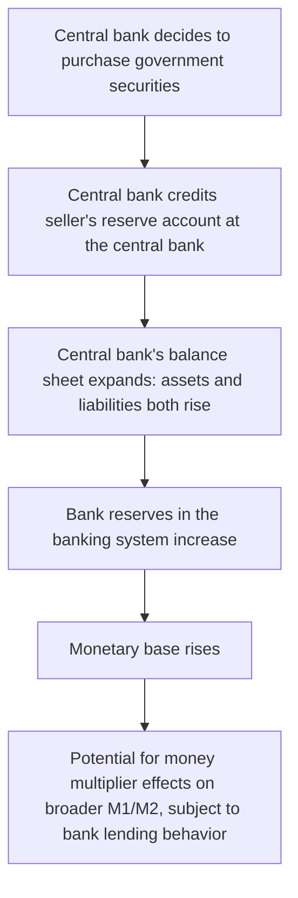
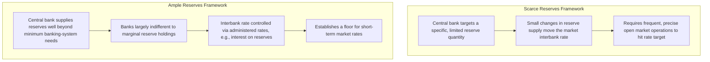

## Central Bank Balance Sheet and Reserves

### Overview

The central bank's balance sheet is the operational foundation from which monetary policy is implemented and the monetary base is created. Every asset the central bank acquires and every liability it issues has direct implications for the quantity of reserves available to the banking system, the level of interest rates, and the transmission of policy to the broader economy. Understanding the structure of this balance sheet — and how its size and composition have evolved, particularly through large-scale asset purchase programs — is essential to understanding modern central banking operations.

---

### The Basic Structure of the Central Bank Balance Sheet

**Key Points**

Like any balance sheet, the central bank's must satisfy: $\text{Assets} = \text{Liabilities} + \text{Capital}$. However, unlike a commercial bank, the central bank has the unique institutional feature of being able to create its own liabilities (currency and reserves) essentially without cost, giving it a distinctive role in the financial system.

**Typical Assets:**

- **Government securities**: holdings of domestic government bonds and bills, acquired primarily through open market operations; typically the largest asset category for most central banks in normal times.
- **Lending to depository institutions**: loans extended through standing lending facilities (e.g., discount-window-type facilities) or emergency liquidity facilities, generally collateralized.
- **Foreign exchange reserves**: holdings of foreign currency-denominated assets, particularly significant for central banks that intervene in foreign exchange markets or maintain reserves for balance-of-payments purposes.
- **Gold holdings**: a legacy asset category still held by many central banks, though no longer formally backing currency issuance in the modern fiat-money era.
- **Other assets acquired via large-scale asset purchase (LSAP) programs**: in the period following the 2007-2009 financial crisis and subsequently, several major central banks substantially expanded the range and quantity of assets purchased, including longer-maturity government bonds, agency mortgage-backed securities, and (more selectively, depending on the central bank) corporate bonds.

**Typical Liabilities:**

- **Currency in circulation**: physical banknotes and coin issued by the central bank and held by the public and by banks in their vaults; a non-interest-bearing liability of the central bank.
- **Reserve balances of depository institutions**: the deposits commercial banks hold at the central bank, used to satisfy reserve requirements (where applicable) and settle interbank payments; in many current operating frameworks, these balances earn interest set by the central bank.
- **Reverse repurchase agreements and other short-term liabilities**: instruments used to absorb reserves temporarily from the banking system as part of day-to-day liquidity management.
- **Government deposits**: the treasury's own operating account, typically held at the central bank in many institutional arrangements.

**Capital**: central banks typically hold a comparatively small capital base relative to the size of their balance sheet, reflecting their unique backstop role (ultimately, a central bank's ability to meet its liabilities is not constrained in the same way as a commercial bank's, since its liabilities are the very unit of account of the economy).

$$\text{Government Securities} + \text{Lending} + \text{FX Reserves} + \text{Other Assets} = \text{Currency} + \text{Bank Reserves} + \text{Other Liabilities} + \text{Capital}$$

---

### Diagram: Simplified Central Bank Balance Sheet

<svg xmlns="http://www.w3.org/2000/svg" viewBox="0 0 700 380" font-family="Arial, sans-serif">
<text x="350" y="25" text-anchor="middle" font-size="16" font-weight="bold">Simplified Central Bank Balance Sheet (svg_diagram)</text>

<text x="175" y="55" text-anchor="middle" font-size="14" font-weight="bold">Assets</text>

<text x="525" y="55" text-anchor="middle" font-size="14" font-weight="bold">Liabilities + Capital</text>

<line x1="350" y1="60" x2="350" y2="340" stroke="black" stroke-width="1.5" />

<rect x="70" y="70" width="210" height="150" fill="#1f77b4" />
<text x="175" y="140" text-anchor="middle" font-size="13" fill="white">Government Securities</text>
<text x="175" y="157" text-anchor="middle" font-size="10" fill="white">(largest asset in normal times)</text>
<rect x="70" y="225" width="210" height="55" fill="#2ca02c" />
<text x="175" y="257" text-anchor="middle" font-size="12" fill="white">Lending to Banks</text>
<rect x="70" y="285" width="210" height="45" fill="#ff7f0e" />
<text x="175" y="312" text-anchor="middle" font-size="12" fill="white">FX Reserves, Gold, Other</text>
<rect x="420" y="70" width="210" height="90" fill="#9467bd" />
<text x="525" y="120" text-anchor="middle" font-size="13" fill="white">Currency in Circulation</text>
<rect x="420" y="165" width="210" height="120" fill="#d62728" />
<text x="525" y="220" text-anchor="middle" font-size="13" fill="white">Bank Reserve Balances</text>
<text x="525" y="237" text-anchor="middle" font-size="10" fill="white">(often interest-bearing)</text>
<rect x="420" y="290" width="210" height="40" fill="#8c564b" />
<text x="525" y="314" text-anchor="middle" font-size="11" fill="white">Other Liabilities and Capital</text>
</svg>

---

### How Central Bank Balance Sheet Actions Create Reserves

**Key Points**

Because the central bank issues its own liabilities to fund asset purchases, an **asset purchase directly and mechanically creates reserves**, illustrated with a simplified T-account transaction:

**Before**: Central bank holds $0 in government securities beyond its existing base; Bank X holds a government bond as an asset.

**Central bank purchases a $100 government bond from Bank X**, crediting Bank X's reserve account:

| Central Bank Assets | Central Bank Liabilities |
| --- | --- |
| Government Securities: +$100 | Bank X's Reserve Balance: +$100 |

This transaction simultaneously **expands the central bank's balance sheet** (larger on both sides) and **increases the monetary base** (bank reserves rise by $100), illustrating the direct link between central bank asset acquisition and base money creation that underlies the money-multiplier framework covered elsewhere in this chapter. The reverse — a central bank sale of securities — mechanically **drains reserves** from the banking system through the identical mechanism in reverse.

---

### Diagram: Balance Sheet Expansion via Asset Purchase

---

### Required Reserves, Excess Reserves, and Total Reserves

**Key Points**

- **Required reserves**: the portion of reserve balances banks must hold to satisfy statutory or regulatory reserve requirements, where such requirements remain in force (as discussed in the money-creation topic, several major central banks have reduced or eliminated formal reserve requirements for large classes of institutions in recent years).
- **Excess reserves**: reserve balances held above and beyond any required minimum, held voluntarily by banks for liquidity management, precautionary, or (where reserves are remunerated at an attractive rate) yield-driven reasons.
- **Total reserves**: the sum of required and excess reserves, representing the full quantity of bank reserve balances held at the central bank — this total reserves figure is a core component of the monetary base (M0).

$$\text{Total Reserves} = \text{Required Reserves} + \text{Excess Reserves}$$

---

### Two Operating Frameworks: Reserve Scarcity versus Ample/Abundant Reserves

**Key Points**

Central banks have historically operated under, and continue to operate under, different frameworks for how the *quantity* versus *price* of reserves is managed:

**1. Scarce (or "limited") reserves framework**

Under this traditional approach, the central bank targets a specific, relatively limited quantity of reserves in the banking system, such that small changes in reserve supply (via open market operations) produce meaningful movements in the market-determined interbank interest rate (e.g., the federal funds rate in the U.S. context), because reserves are scarce enough relative to demand that supply and demand interact actively to determine price. This framework requires frequent, fine-tuned open market operations to hit a specific interbank rate target.

**2. Ample (or "abundant") reserves framework**

Under this more recently prevalent approach — which became widespread among several major central banks following large-scale asset purchase programs undertaken in response to the 2007-2009 financial crisis and subsequent episodes — the central bank supplies a **large quantity of reserves**, well beyond the level needed to satisfy reserve requirements or ordinary payment-settlement needs, such that the marginal demand for additional reserves by banks is effectively very low (i.e., banks are largely indifferent to holding a bit more or less, because reserves are so abundant). Under this framework, the central bank controls short-term interest rates primarily through **administered rates** — most notably, the interest rate it pays on reserve balances themselves (interest on reserves, IOR) — which establishes a floor (or near-floor) for market interbank rates, since banks generally have little incentive to lend reserves to one another at a rate below what they can earn risk-free at the central bank. This is sometimes termed a **"floor system"** of monetary policy implementation.

**[Unverified]** Which specific operating framework (scarce-reserves versus ample-reserves, or some hybrid/intermediate variant) any given central bank currently employs, and the precise administered rates and facilities in use, should be verified against that central bank's current operational documentation, since frameworks have evolved substantially over the past two decades and continue to be adjusted.

---

### Diagram: Scarce Reserves vs. Ample Reserves Operating Frameworks

---

### The Central Bank's Balance Sheet as a Policy Tool: Quantitative Easing

**Key Points**

- **Quantitative easing (QE)** refers to large-scale central bank purchases of longer-maturity government securities and, in some programs, other assets (such as agency mortgage-backed securities or, more selectively, corporate bonds), undertaken with the explicit aim of influencing financial conditions **beyond** what conventional short-term policy-rate adjustments alone could achieve — particularly relevant when short-term policy rates are already at or near their effective lower bound.
- **Mechanisms of transmission** commonly cited for QE include: a **portfolio-balance effect** (removing longer-duration or specific-risk assets from private portfolios, inducing investors to rebalance toward other assets, potentially lowering yields and risk premia more broadly); a **signaling effect** (large asset purchases may signal the central bank's commitment to maintaining accommodative policy for an extended period); and, in stressed-market episodes, a **market-functioning/liquidity effect** (directly supporting the functioning of specific, temporarily impaired market segments).
- QE programs mechanically produce a **large expansion of the central bank's balance sheet** (both the asset side, via securities holdings, and the liability side, via a corresponding expansion of bank reserves), which is why the size of the central bank's balance sheet (often expressed relative to GDP) became a widely tracked policy indicator following the widespread adoption of such programs after 2008 and again during the 2020 pandemic-response period.
- **Balance sheet reduction ("quantitative tightening" or QT)**: the reverse process, in which the central bank allows its securities holdings to run off (as bonds mature, without full reinvestment) or, less commonly, actively sells securities, mechanically draining reserves from the banking system and shrinking the balance sheet back toward a smaller size over time.

**[Unverified]** The current size, composition, and trajectory (expanding, contracting, or holding steady) of any specific central bank's balance sheet, and the specific asset categories currently being purchased or run off, change over time with policy decisions and should be verified against that central bank's most recent balance-sheet data releases and policy communications.

---

### Diagram: Balance Sheet Expansion (QE) and Contraction (QT) Cycle

<svg xmlns="http://www.w3.org/2000/svg" viewBox="0 0 780 340" font-family="Arial, sans-serif">
<text x="390" y="25" text-anchor="middle" font-size="16" font-weight="bold">Central Bank Balance Sheet: QE and QT Cycle (svg_diagram)</text>
<line x1="70" y1="300" x2="740" y2="300" stroke="black" stroke-width="2" />
<line x1="70" y1="300" x2="70" y2="60" stroke="black" stroke-width="2" />
<text x="405" y="325" text-anchor="middle" font-size="13">Time</text>
<text x="30" y="180" text-anchor="middle" font-size="13" transform="rotate(-90 30 180)">Balance Sheet Size</text>

<path d="M 90 260 L 200 260 Q 300 260, 350 130 L 420 100 Q 500 100, 560 100 Q 650 100, 700 220" stroke="`#1f77b4`" stroke-width="3" fill="none" />

<text x="150" y="280" font-size="11">Normal, pre-crisis size</text>

<text x="380" y="90" font-size="11" fill="`#1f77b4`" font-weight="bold">QE: large asset purchases</text>

<text x="480" y="125" font-size="11">Elevated, stable balance sheet</text>

<text x="640" y="245" font-size="11" fill="`#d62728`" font-weight="bold">QT: runoff / balance sheet reduction</text>

</svg>

---

### Reserve Requirements as a Direct Policy Tool: Historical Role

**Key Points**

- Historically, some central banks adjusted the **required reserve ratio** itself as a direct lever to influence the potential money multiplier and credit conditions — raising the ratio to tighten conditions (locking up more reserves per dollar of deposits) or lowering it to ease conditions.
- This tool has fallen into relatively limited or discontinued use as a primary policy instrument in several major economies in recent decades, in favor of interest-rate-based tools (policy rate adjustments, interest on reserves, and — where relevant — large-scale asset purchases/sales), reflecting both the practical difficulties of using reserve-ratio changes for fine-tuned, frequent policy adjustment and the broader shift toward ample-reserves operating frameworks in which reserve requirements play a diminished operational role. **[Unverified]** Current use (or disuse) of reserve-ratio adjustments as an active policy tool varies by central bank and should be checked against that institution's current framework.

---

### Standing Facilities and Reserve Management

**Key Points**

- **Discount window / standing lending facilities**: central banks typically offer standing facilities allowing eligible depository institutions to borrow reserves directly from the central bank against acceptable collateral, generally at a rate set above the central bank's main policy rate, providing a **ceiling** on how high short-term market rates can rise (since a bank facing a high market borrowing rate can instead borrow directly from the central bank at the standing facility rate).
- **Standing repo/reverse repo facilities**: many central banks also maintain standing facilities to inject reserves temporarily (via repurchase agreements, effectively short-term collateralized loans to eligible counterparties) or absorb reserves temporarily (via reverse repurchase agreements, effectively short-term collateralized borrowing by the central bank from eligible counterparties), providing fine-tuned, day-to-day flexibility in managing the reserve supply within a targeted operating range.
- **The interest-rate "corridor"**: taken together, a **lending facility rate** (ceiling) and, in many frameworks, a **deposit/reverse-repo facility rate** (floor) create a corridor within which the market-determined interbank rate is expected to trade, with the central bank's policy rate target typically set within or at the edge of this corridor, depending on the specific framework in use.

---

### Diagram: The Interest Rate Corridor Framework

<svg xmlns="http://www.w3.org/2000/svg" viewBox="0 0 700 320" font-family="Arial, sans-serif">
<text x="350" y="25" text-anchor="middle" font-size="16" font-weight="bold">Interest Rate Corridor (svg_diagram)</text>
<line x1="80" y1="270" x2="620" y2="270" stroke="black" stroke-width="2" />
<line x1="80" y1="270" x2="80" y2="60" stroke="black" stroke-width="2" />
<text x="350" y="295" text-anchor="middle" font-size="12">Time</text>
<text x="35" y="170" text-anchor="middle" font-size="12" transform="rotate(-90 35 170)">Interest Rate</text>
<line x1="80" y1="100" x2="620" y2="100" stroke="#d62728" stroke-width="2" stroke-dasharray="5,3" />
<text x="630" y="104" font-size="11" fill="#d62728">Lending facility (ceiling)</text>
<line x1="80" y1="220" x2="620" y2="220" stroke="#2ca02c" stroke-width="2" stroke-dasharray="5,3" />
<text x="630" y="224" font-size="11" fill="#2ca02c">Deposit / IOR rate (floor)</text>

<path d="M 100 160 Q 200 150, 300 165 Q 400 155, 500 160 Q 550 158, 600 162" stroke="`#1f77b4`" stroke-width="2.5" fill="none" />

<text x="350" y="140" text-anchor="middle" font-size="11" fill="`#1f77b4`">Market interbank rate</text>

</svg>

---

### Central Bank Balance Sheet and Sovereign/Fiscal Interactions

**Key Points**

- Central bank purchases of government securities in the secondary market (as opposed to direct primary-market financing of government deficits, which is prohibited or heavily restricted in many jurisdictions' legal frameworks to preserve central bank independence) are the standard channel through which government debt appears on the central bank's balance sheet.
- **Remittances to the treasury**: central banks typically remit any net income earned on their asset holdings (interest income on securities, net of operating expenses and interest paid on reserves) to the government treasury, a flow that can turn negative (requiring the treasury to cover a central bank operating loss, or the central bank to carry a deferred asset, depending on the institutional framework) when interest paid on a large stock of reserves and reverse repos exceeds interest earned on the asset portfolio — a dynamic that received particular attention following large-scale balance sheet expansions combined with subsequent policy-rate increases in several major economies in recent years. **[Unverified]** The specific current remittance status, accounting treatment of any operating losses, and institutional rules governing this for any given central bank should be checked directly, as these arrangements and outcomes vary by country and period.

---

### Summary: Key Balance Sheet Identities

$$\text{Monetary Base (M0)} = \text{Currency in Circulation} + \text{Total Bank Reserves}$$

$$\text{Total Bank Reserves} = \text{Required Reserves} + \text{Excess Reserves}$$

$$\Delta(\text{Central Bank Assets}) = \Delta(\text{Central Bank Liabilities}) \quad \text{(for any given transaction, holding capital fixed)}$$

$$\text{Central Bank Balance Sheet Size} \approx \text{Government Securities} + \text{Other Assets}$$

---

**Related Topics**

- Money creation and the fractional reserve banking system
- Money multiplier and the deposit expansion process
- Monetary aggregates: M0, M1, M2, and broader measures
- Open market operations and monetary policy implementation
- Quantitative easing and quantitative tightening
- Interest on reserves and corridor/floor operating systems
- Central bank independence and fiscal-monetary interactions
- Standing facilities: discount window, repo, and reverse repo operations
- Effective lower bound on policy interest rates
- Central Bank Digital Currency (CBDC) and its potential balance sheet implications