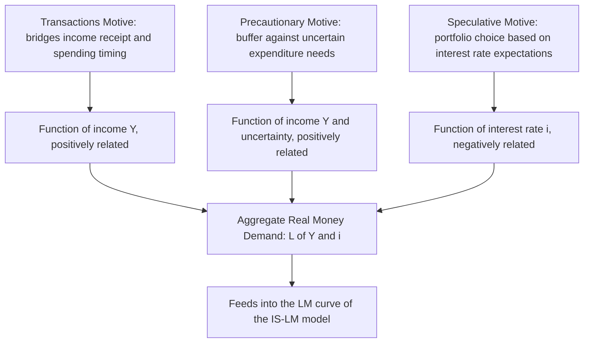

## Demand for Money: Transactions, Precautionary, and Speculative Motives

### Overview

The demand for money asks why economic agents choose to hold a portion of their wealth in the form of money — an asset that, particularly in the case of non-interest-bearing currency, typically earns a lower explicit return than most alternative financial assets. **John Maynard Keynes**, in *The General Theory of Employment, Interest and Money* (1936), organized the motives for holding money into three categories: **transactions**, **precautionary**, and **speculative** demand. This tripartite framework, later formalized and extended by economists including William Baumol, James Tobin, and Milton Friedman, remains the foundational organizing structure for understanding money demand in monetary economics.

---

### The Transactions Motive

**Core Idea**

Money is held to bridge the timing gap between the receipt of income and the making of expenditures. Because income is typically received periodically (e.g., a monthly or biweekly paycheck) while spending occurs more continuously throughout the period, agents hold money balances to facilitate ordinary, anticipated purchases of goods and services.

**Keynes's Original Treatment**

In Keynes's original formulation, transactions demand for money was treated as **primarily a function of income** ($Y$), reflecting the idea that higher income and transaction volume require proportionally larger money balances to conduct routine business:

$$L_1 = L_1(Y), \quad \frac{\partial L_1}{\partial Y} > 0$$

---

### The Baumol-Tobin Inventory-Theoretic Model of Transactions Demand

**Setup**

**William Baumol (1952)** and **James Tobin (1956)**, working independently, extended the transactions-demand analysis by applying **inventory theory** — treating the decision of how much money to hold as analogous to a firm's decision about how much inventory of a good to hold, trading off the cost of holding money (foregone interest) against the cost of converting between money and interest-bearing assets (brokerage or transaction fees).

**Assumptions**: an individual receives income $Y$ (in cash or an interest-bearing account) at the start of a period and spends it at a constant, steady rate throughout the period, exhausting it by the period's end. The individual can hold funds either as **non-interest-bearing money** (for immediate transactions) or as an **interest-bearing asset** (bonds, earning interest rate $i$), but converting between the two incurs a fixed transaction/brokerage cost $b$ per conversion.

**The Optimization Problem**

If the individual makes $n$ equal withdrawals of interest-bearing funds into money over the period, then each withdrawal is of size $Y/n$, and average money holdings (given the linear spend-down pattern within each sub-period) are:

$$\bar{M} = \frac{Y}{2n}$$

Total costs consist of: (1) brokerage costs from making $n$ withdrawals, $bn$, and (2) forgone interest on average money balances held, $i \cdot \bar{M} = i \cdot \frac{Y}{2n}$:

$$TC(n) = bn + \frac{iY}{2n}$$

**Minimizing total cost** with respect to $n$ (taking the derivative and setting it to zero):

$$\frac{dTC}{dn} = b - \frac{iY}{2n^2} = 0 \implies n^* = \sqrt{\frac{iY}{2b}}$$

Substituting back into the average money demand expression yields the celebrated **square-root formula**:

$$\bar{M}^* = \frac{Y}{2n^*} = \sqrt{\frac{bY}{2i}}$$

**Key Implications**:

1. **Economies of scale in money holding**: money demand rises with income $Y$, but **less than proportionally** — specifically with an income elasticity of $\frac{1}{2}$ (a doubling of income leads to less than a doubling of optimal money holdings), because the fixed brokerage cost $b$ is spread over a larger transaction volume as income rises.
2. **Interest sensitivity**: money demand is **negatively related to the interest rate** $i$, with an interest elasticity of $-\frac{1}{2}$ — as interest rates rise, the opportunity cost of holding non-interest-bearing money increases, inducing more frequent (smaller) conversions and lower average money balances.
3. **Brokerage cost sensitivity**: money demand rises with the transaction/brokerage cost $b$ (with elasticity $+\frac{1}{2}$) — the more costly it is to convert between assets, the more money one holds at a time to economize on the number of costly conversions.

---

### Diagram: The Baumol-Tobin Sawtooth Money-Holding Pattern

<svg xmlns="http://www.w3.org/2000/svg" viewBox="0 0 760 380" font-family="Arial, sans-serif">
<text x="380" y="25" text-anchor="middle" font-size="16" font-weight="bold">Baumol-Tobin Money Holdings over a Pay Period (svg_diagram)</text>
<line x1="70" y1="330" x2="700" y2="330" stroke="black" stroke-width="2" />
<line x1="70" y1="330" x2="70" y2="50" stroke="black" stroke-width="2" />
<text x="385" y="360" text-anchor="middle" font-size="13">Time within pay period</text>
<text x="30" y="190" text-anchor="middle" font-size="13" transform="rotate(-90 30 190)">Money Holdings</text>

<path d="M 100 90 L 220 330 L 220 90 L 340 330 L 340 90 L 460 330 L 460 90 L 580 330" stroke="`#1f77b4`" stroke-width="2.5" fill="none" />

<line x1="70" y1="210" x2="700" y2="210" stroke="gray" stroke-dasharray="4,3" />
<text x="710" y="214" font-size="11">Average holding = Y / 2n</text>

<text x="150" y="80" font-size="11">Withdrawal Y/n</text>

<text x="150" y="350" font-size="11">Spent down to zero</text>

</svg>

---

### The Precautionary Motive

**Core Idea**

Beyond planned, routine transactions, agents hold additional money balances as a buffer against **unforeseen contingencies** — unexpected expenses, timing mismatches between income and spending, or opportunities that require immediate liquidity. Keynes described this as holding money "to provide for contingencies requiring sudden expenditures."

**Determinants**

- **Uncertainty**: greater uncertainty about the timing or magnitude of future income and expenditure needs increases precautionary money demand, since money provides a costlessly liquid buffer against such uncertainty relative to less liquid alternative assets.
- **Income level**: similar to the transactions motive, precautionary balances tend to scale with income, since the scale of potential unexpected expenditure needs is generally larger for higher-income agents and businesses.
- **Access to credit and liquid asset alternatives**: the availability of credit lines, overdraft facilities, and easily-liquidated near-money assets (as discussed in the monetary-aggregates topic) can substitute for precautionary money holdings, reducing the amount of pure liquid money balances an agent needs to hold for this purpose.
- **Interest rate sensitivity**: like transactions balances, precautionary money balances are also generally considered to be somewhat sensitive to the interest rate, since holding a larger buffer in an interest-bearing but still reasonably liquid near-money asset becomes relatively more attractive as rates rise, though the theoretical treatment of precautionary demand's interest elasticity has historically received less rigorous, formal modeling attention than the transactions motive (the Baumol-Tobin framework and its extensions).

$$L_2 = L_2(Y, \sigma^2_{shock}, i), \quad \frac{\partial L_2}{\partial Y} > 0, \; \frac{\partial L_2}{\partial \sigma^2_{shock}} > 0, \; \frac{\partial L_2}{\partial i} < 0 \text{ (typically presumed)}$$

where $\sigma^2_{shock}$ represents the variance/uncertainty of income and expenditure timing.

**Relationship to Transactions Demand**: in much of the subsequent literature (and in many textbook treatments), transactions and precautionary demand are often combined into a single function of income and the interest rate, since both motives generate money demand that increases with the scale of economic activity and decreases with the opportunity cost of holding money, and empirically the two motives are difficult to cleanly separate in aggregate data.

---

### The Speculative Motive

**Core Idea**

Keynes's most distinctive and, at the time, most innovative contribution was the **speculative demand for money** — the idea that agents hold money not merely as a transactions or precautionary buffer, but as a deliberate **portfolio choice** between money and interest-bearing bonds, based on expectations about future interest rate (and hence bond price) movements.

**The Mechanism**

Bond prices and interest rates are inversely related: $P_B = \frac{\text{Coupon}}{i}$ (for a simplified perpetuity/consol bond). If an individual expects the interest rate to **rise** in the future, they expect bond prices to **fall**, and so they would prefer to hold **money now** (avoiding an anticipated capital loss on bonds) and purchase bonds later once the price has fallen. Conversely, if an individual expects the interest rate to **fall** (bond prices to rise), they prefer to hold **bonds now** to capture the anticipated capital gain, minimizing money holdings.

**Keynes's Aggregate Speculative Demand Function**

Because different individuals in an economy hold differing expectations about future interest rate movements (and different individuals will change their expectations at different threshold interest rate levels), aggregating across many such individuals generates a smooth, **downward-sloping** aggregate speculative money demand function with respect to the *current* level of the interest rate — as the current rate falls, progressively more individuals conclude that rates are "too low" and likely to rise (implying anticipated bond-price declines), inducing them to shift from bonds into money:

$$L_3 = L_3(i), \quad \frac{\partial L_3}{\partial i} < 0$$

---

### The Liquidity Trap

**Key Points**

Keynes further proposed that at a sufficiently **low** interest rate, speculative money demand could become **perfectly (or near-perfectly) interest-elastic** — a **liquidity trap** — because at such a low rate, virtually all agents would expect the rate to rise in the future (having little room to fall further and considerable room to rise), and would therefore hold any additional money injected into the economy entirely as idle balances rather than using it to purchase bonds or otherwise increase spending.

**Implications**:

- In a liquidity trap, conventional monetary policy (expanding the money supply via open market operations) becomes **ineffective** at further lowering interest rates or stimulating aggregate demand, since the additional money is simply absorbed into idle speculative balances rather than driving down rates further.
- This provided a key theoretical rationale, within the Keynesian framework, for why **fiscal policy** might be a more effective stabilization tool than monetary policy during severe economic downturns characterized by very low interest rates.
- **[Inference]** The empirical relevance and precise conditions under which a genuine liquidity trap arises (versus interest rates simply being low for other reasons, such as weak investment demand or low expected future short rates without money demand becoming literally infinite-elastic) has been debated extensively across different historical episodes (the 1930s Great Depression, and more recently the near-zero and negative interest rate environments in several economies following the 2007-2009 crisis and subsequently); this remains a topic of active discussion rather than a matter with a single, universally agreed-upon empirical resolution.

---

### Diagram: The Speculative Demand for Money and the Liquidity Trap

<svg xmlns="http://www.w3.org/2000/svg" viewBox="0 0 700 380" font-family="Arial, sans-serif">
<text x="350" y="25" text-anchor="middle" font-size="16" font-weight="bold">Speculative Money Demand and the Liquidity Trap (svg_diagram)</text>
<line x1="80" y1="330" x2="620" y2="330" stroke="black" stroke-width="2" />
<line x1="80" y1="330" x2="80" y2="60" stroke="black" stroke-width="2" />
<text x="350" y="360" text-anchor="middle" font-size="13">Speculative Money Demand, L3</text>
<text x="35" y="195" text-anchor="middle" font-size="13" transform="rotate(-90 35 195)">Interest Rate, i</text>

<path d="M 110 90 Q 250 150, 350 230 Q 450 290, 500 300 L 600 300" stroke="`#1f77b4`" stroke-width="2.5" fill="none" />

<line x1="80" y1="300" x2="600" y2="300" stroke="#d62728" stroke-dasharray="4,3" />
<text x="605" y="304" font-size="11" fill="#d62728">Liquidity trap floor rate</text>

<text x="450" y="320" font-size="11" font-style="italic">Perfectly elastic region:</text>

<text x="450" y="340" font-size="11" font-style="italic">money demand infinite at floor rate</text>

</svg>

---

### Combining the Motives: The Total Money Demand Function

**Key Points**

Aggregating across all three motives yields the standard **Keynesian money demand (liquidity preference) function**:

$$\frac{M^d}{P} = L(Y, i) = L_1(Y) + L_2(Y) + L_3(i)$$

which is typically simplified in subsequent textbook and applied macroeconomic treatments (combining transactions and precautionary motives, both increasing in income, with speculative motives, decreasing in the interest rate) into the widely used reduced form:

$$\frac{M^d}{P} = L(Y, i), \quad \frac{\partial L}{\partial Y} > 0, \; \frac{\partial L}{\partial i} < 0$$

This function is the demand-side building block of the **LM curve** in the IS-LM model of aggregate demand, linking money demand directly to the determination of equilibrium output and interest rates in that framework.

---

### Diagram: Three Motives Combining into Aggregate Money Demand

---

### Friedman's Portfolio-Theoretic Reformulation

**Key Points**

**Milton Friedman (1956)**, in his restatement of the quantity theory, offered an alternative, portfolio-choice-based framework for money demand that de-emphasized Keynes's tripartite motive classification in favor of treating money as one asset within a broader wealth portfolio, alongside bonds, equities, and durable goods. In Friedman's formulation, money demand depends on:

- **Permanent income** (rather than current income), reflecting money demand as tied to an agent's longer-run wealth position rather than transitory income fluctuations.
- **The relative expected returns on alternative assets** (bonds, equities, and the expected rate of inflation, which represents the "return" on holding durable goods relative to money).
- A general **stability presumption**: Friedman and subsequent monetarist-influenced researchers argued that the money demand function, appropriately specified, was empirically quite **stable** — a claim central to the monetarist policy prescription of steady, rule-based money-supply growth, and one that was later challenged by episodes of apparent money-demand instability (partly linked to the financial-innovation and monetary-aggregate boundary issues discussed in the monetary-aggregates topic).

$$\frac{M^d}{P} = f\left(Y^{permanent}, \, r_{bonds}, \, r_{equities}, \, \pi^e, \, \text{other factors}\right)$$

**[Inference]** The degree of empirical stability of estimated money demand functions is itself a matter of extensive, evolving empirical debate rather than a settled fact, with periods of apparent stability followed by periods of instability (often linked to specific financial innovations or regulatory changes) documented across various studies and countries.

---

### Worked Numerical Example: Applying the Baumol-Tobin Formula

**Example**

An individual receives $3,600 in income at the start of a month, spent at a steady rate over the month. The individual faces a fixed brokerage cost of $4 per conversion between an interest-bearing account and cash, and the (monthly-equivalent) interest rate is $i = 0.01$ (1% per month).

**Optimal number of withdrawals**:

$$n^* = \sqrt{\frac{iY}{2b}} = \sqrt{\frac{0.01 \times 3{,}600}{2 \times 4}} = \sqrt{\frac{36}{8}} = \sqrt{4.5} \approx 2.12$$

Rounding to a practical integer, the individual would make approximately 2 withdrawals over the month.

**Optimal average money holding**:

$$\bar{M}^* = \sqrt{\frac{bY}{2i}} = \sqrt{\frac{4 \times 3{,}600}{2 \times 0.01}} = \sqrt{\frac{14{,}400}{0.02}} = \sqrt{720{,}000} \approx \$848.53$$

**Sensitivity check**: if the interest rate instead **doubles** to $i = 0.02$, the model predicts optimal average money holdings should fall, consistent with the negative interest elasticity:

$$\bar{M}^{*'} = \sqrt{\frac{4 \times 3{,}600}{2 \times 0.02}} = \sqrt{\frac{14{,}400}{0.04}} = \sqrt{360{,}000} = \$600.00$$

Consistent with the model's $-\frac{1}{2}$ interest elasticity, doubling $i$ reduces optimal average money holdings by a factor of $\frac{1}{\sqrt{2}} \approx 0.707$ (from $848.53 to $600, a roughly 29% reduction), illustrating the predicted (though partial, not proportional) sensitivity of transactions balances to the opportunity cost of holding money.

---

### Empirical Testing and Real-World Refinements

**Key Points**

- Empirical estimates of income and interest elasticities of money demand have generally found statistically significant relationships broadly consistent in *sign* with the theoretical predictions above (positive income elasticity, negative interest elasticity), though the estimated **magnitudes** of these elasticities vary considerably across studies, time periods, countries, and the specific monetary aggregate examined (narrow versus broad money). **[Unverified]** Specific numeric elasticity estimates are highly sensitive to sample period, country, and monetary aggregate definition and are not restated here as universal constants; current estimates should be checked against recent applied econometric studies for the specific context of interest.
- The rise of low-cost electronic payment methods, widespread cash-management technology, and (in various contexts) direct interest-bearing checking and near-instant transfer between checking and savings accounts has, over recent decades, generally **reduced the fixed "brokerage cost" ($b$) parameter** central to the Baumol-Tobin model, a change consistent with observed longer-run declines in currency and narrow-money holdings relative to income in many economies, though the magnitude and pace of this effect vary by country and by which specific payment and cash-management innovations became available and adopted over the relevant period.
- **Financial innovation and monetary aggregate instability**: as discussed in the monetary-aggregates topic, ongoing financial innovation continues to complicate stable, consistent empirical estimation of money demand functions over long time spans, since the underlying assets included in any given aggregate (and hence its true "moneyness" and liquidity characteristics) can shift discretely at redefinition dates.

---

**Related Topics**

- Functions and definitions of money
- Monetary aggregates: M0, M1, M2, and broader measures
- The IS-LM model and the derivation of the LM curve
- Quantity theory of money and Friedman's restatement
- Liquidity trap and the effectiveness of monetary versus fiscal policy at the zero/effective lower bound
- Velocity of money and its relationship to money demand stability
- Term structure of interest rates and bond price-yield relationships
- Portfolio theory and asset allocation under uncertainty
- Financial innovation and its effect on money demand elasticities
- Monetarism and money-supply targeting frameworks