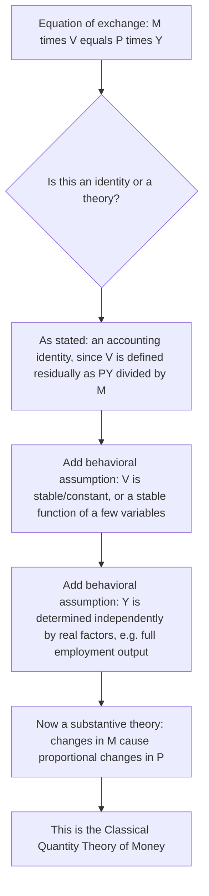
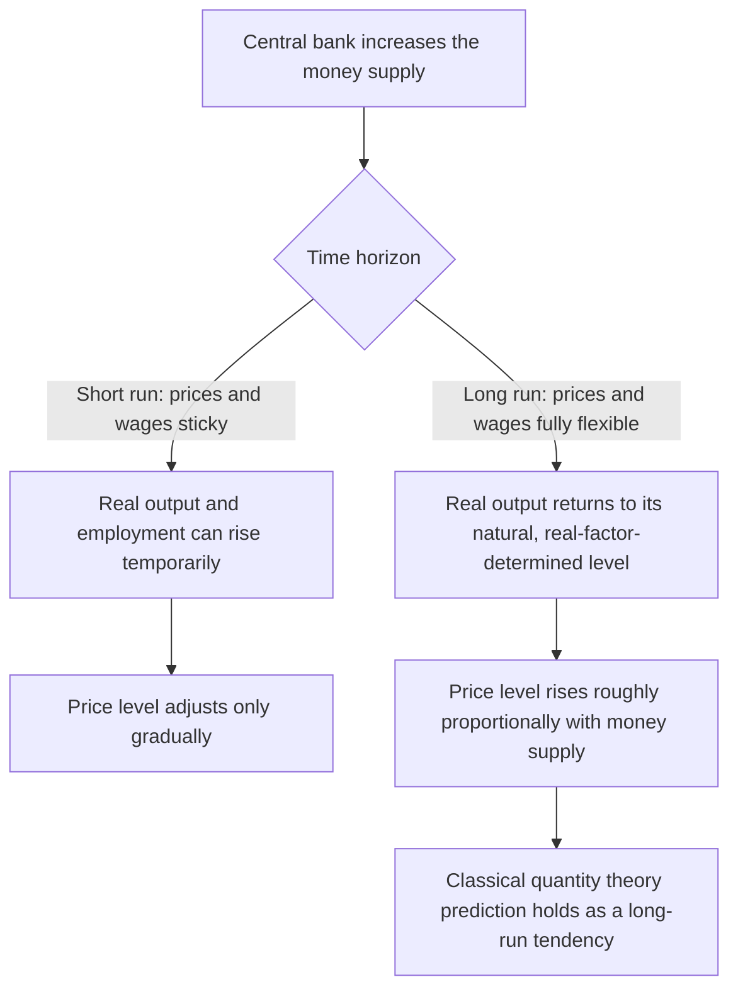

## Quantity Theory of Money and the Equation of Exchange

### Overview

The quantity theory of money is one of the oldest and most influential propositions in monetary economics, asserting a direct, predictable relationship between the quantity of money in an economy and the price level. Its formal expression, the **equation of exchange**, provides an accounting identity linking money, velocity, prices, and output — a relationship that becomes a substantive economic *theory* only once additional behavioral assumptions are layered onto the identity. This topic traces the equation's derivation, the classical and monetarist theories built upon it, and its ongoing empirical and policy relevance.

---

### The Equation of Exchange: An Accounting Identity

**Core Formulation**

The equation of exchange, associated originally with Irving Fisher's formalization in *The Purchasing Power of Money* (1911), states:

$$MV = PY$$

where:

- $M$ = the quantity of money in circulation (some chosen monetary aggregate)
- $V$ = the **velocity of money** — the average number of times a unit of money is used in transactions to purchase final goods and services over a given period
- $P$ = the price level (a general price index)
- $Y$ = real output (real GDP)

**Fisher's Original Transactions Version**

Fisher's original formulation used total transactions ($T$) rather than real output ($Y$), and a transactions-based price level ($P_T$):

$$MV_T = P_T T$$

The modern **income version** (replacing total transactions with real GDP, and transactions velocity with income velocity) is more commonly used in contemporary macroeconomics because it links more directly to national income accounting and standard macroeconomic models.

**Why the Equation Is Definitionally True**

As stated, $MV = PY$ is an **accounting identity**, not yet a behavioral theory: velocity $V$ is typically *defined residually* as $V \equiv \frac{PY}{M}$ (nominal GDP divided by the money stock), meaning the equation holds true by construction for any observed values of $M$, $P$, and $Y$ — it cannot be empirically "false" as stated. The equation becomes a substantive **theory** of the price level only once an independent behavioral assumption is added about how $V$ (and $Y$) behave, transforming a definitional relationship into a testable causal claim.

---

### Diagram: From Identity to Theory

---

### The Classical Quantity Theory of Money

**Key Points**

The classical quantity theory, developed by economists in the tradition running from early quantity theorists through Fisher and the Cambridge school (Marshall, Pigou), rests on two key behavioral assumptions layered onto the equation of exchange:

**1. Velocity ($V$) is stable (or constant) in the short-to-medium run**

Velocity is presumed to be determined by relatively slow-moving institutional and technological factors — the frequency of wage payments, the structure of the banking and payments system, and general payment habits and conventions — none of which change quickly enough to generate significant short-run velocity fluctuations. Under this assumption, $V$ can be treated as approximately constant, $V = \bar{V}$.

**2. Real output ($Y$) is determined independently of the money supply**

In the classical framework, real output is determined by the real side of the economy — the quantity and productivity of labor and capital, technology, and the economy's supply-side production function — and tends toward its full-employment (or "natural") level, independent of monetary factors. Money is, in this sense, considered **"neutral"** with respect to real output, at least in the long run: changes in the money supply do not affect real variables like output or employment.

**The Resulting Theory: Strict Proportionality**

Given these two assumptions, rearranging the equation of exchange:

$$P = \frac{M\bar{V}}{Y}$$

With $\bar{V}$ constant and $Y$ determined independently by real factors, **any change in the money supply $M$ translates directly and proportionally into a change in the price level $P$**:

$$\%\Delta P \approx \%\Delta M$$

This is the core classical proposition: **inflation is fundamentally a monetary phenomenon**, driven by growth in the money supply in excess of the growth of real output, with velocity playing essentially no independent role.

---

### Diagram: The Classical Quantity Theory Causal Chain

<svg xmlns="http://www.w3.org/2000/svg" viewBox="0 0 780 300" font-family="Arial, sans-serif">
<text x="390" y="25" text-anchor="middle" font-size="16" font-weight="bold">Classical Quantity Theory: Causal Chain (svg_diagram)</text>
<rect x="40" y="100" width="150" height="60" rx="8" fill="#1f77b4" />
<text x="115" y="135" text-anchor="middle" font-size="13" fill="white">Money Supply, M</text>
<rect x="240" y="100" width="150" height="60" rx="8" fill="#2ca02c" />
<text x="315" y="125" text-anchor="middle" font-size="12" fill="white">Velocity, V</text>
<text x="315" y="142" text-anchor="middle" font-size="10" fill="white">assumed stable</text>
<rect x="440" y="100" width="150" height="60" rx="8" fill="#ff7f0e" />
<text x="515" y="125" text-anchor="middle" font-size="12" fill="white">Real Output, Y</text>
<text x="515" y="142" text-anchor="middle" font-size="10" fill="white">set by real factors</text>
<rect x="640" y="100" width="120" height="60" rx="8" fill="#d62728" />
<text x="700" y="135" text-anchor="middle" font-size="13" fill="white">Price Level, P</text>
<line x1="190" y1="130" x2="230" y2="130" stroke="black" stroke-width="2" marker-end="url(#aq)" />
<line x1="390" y1="130" x2="430" y2="130" stroke="black" stroke-width="2" marker-end="url(#aq)" />
<line x1="590" y1="130" x2="630" y2="130" stroke="black" stroke-width="2" marker-end="url(#aq)" />
<text x="390" y="220" text-anchor="middle" font-size="12" font-style="italic">Result: change in M translates proportionally into change in P, holding V and Y fixed</text>

</svg>

---

### The Cambridge Cash-Balance Approach

**Key Points**

An alternative, though closely related, formalization developed by the **Cambridge school** (notably Alfred Marshall and Arthur Cecil Pigou) expresses money demand directly, rather than via the transactions-velocity framing:

$$M^d = k \cdot P \cdot Y$$

where $k$ is the **Cambridge k**, representing the fraction of nominal income that agents wish to hold as money balances. Setting money demand equal to the given money supply $M^s = M$ and rearranging:

$$M = k P Y \implies P = \frac{M}{kY}$$

**Relationship to the Fisher equation**: comparing this to $P = \dfrac{M\bar{V}}{Y}$ reveals that $k$ is simply the **reciprocal of velocity**, $k = \dfrac{1}{V}$. While mathematically equivalent to the Fisher transactions approach under the stability assumptions, the Cambridge formulation is conceptually significant because it frames money holding explicitly as a **portfolio/demand decision** made by individual agents (how much of my income do I wish to hold as money?) rather than as a mechanical transactions-velocity relationship — a framing that anticipates and connects directly to the later, more fully developed Keynesian liquidity-preference theory of money demand.

---

### Milton Friedman's Restatement of the Quantity Theory

**Key Points**

**Milton Friedman (1956)**, in "The Quantity Theory of Money: A Restatement," reformulated the classical quantity theory not as a rigid mechanical proportionality rule, but as a **theory of the demand for money** grounded in portfolio choice, treating money as one asset among several that individuals hold as part of their wealth portfolio (alongside bonds, equities, physical capital, and human capital).

**Key features of Friedman's reformulation**:

- Money demand depends on **permanent income** (a longer-run measure of wealth/income, smoothing over transitory fluctuations) rather than current income, and on the **relative expected returns** of alternative assets (interest rates on bonds, expected returns on equities, and expected inflation, representing the implicit "return" to holding real goods rather than money).
- Friedman argued that empirically, money demand (and hence velocity, its reciprocal counterpart in Cambridge-equation terms) was a **reasonably stable, predictable function** of a small number of variables, even though it need not be a literal constant — a somewhat weaker and more empirically defensible claim than assuming $V$ is a fixed number, but still supporting the core monetarist conclusion that **money supply growth is the primary determinant of nominal income and, in the long run, inflation**.
- This reformulation underpinned the modern **monetarist** policy prescription — most closely associated with Friedman himself — for central banks to target a steady, predictable rate of money supply growth (a "money growth rule") rather than attempting to fine-tune the economy through discretionary interest-rate or fiscal interventions, on the grounds that stable money growth would translate (via a reasonably stable velocity/money-demand function) into stable, predictable nominal income growth.

---

### Money Neutrality and the Short Run versus Long Run Distinction

**Key Points**

- **Long-run monetary neutrality**: a widely shared proposition across much of modern macroeconomics (including many New Keynesian models, not merely classical/monetarist ones) is that in the **long run**, once prices and wages have fully adjusted, changes in the money supply affect only nominal variables (the price level, nominal wages, nominal exchange rates) and have **no lasting effect on real variables** (real output, real employment, the real interest rate) — a proposition broadly consistent with the classical quantity theory's core prediction.
- **Short-run non-neutrality**: in the **short run**, due to nominal rigidities (sticky prices and wages, as emphasized in Keynesian and New Keynesian frameworks, covered elsewhere in the broader macroeconomics curriculum), changes in the money supply **can** affect real output and employment temporarily, before prices fully adjust — meaning the strict, immediate proportionality between money and prices predicted by the classical quantity theory is generally understood to be, at best, a **long-run** tendency rather than a precise short-run, period-by-period relationship.
- This long-run/short-run distinction is a central organizing theme reconciling the quantity theory's classical proportionality prediction with the observed short-run real effects of monetary policy widely documented in empirical business-cycle research and incorporated into standard macroeconomic teaching.

---

### Diagram: Long-Run Neutrality versus Short-Run Non-Neutrality

---

### Worked Numerical Example: Applying the Equation of Exchange

**Example**

Suppose an economy has a money stock of $M = \$2{,}000$bn, real GDP of $Y = \$10{,}000$bn (in constant/base-year dollars), and a price index of $P = 1.20$ (base year = 1.00).

**Step 1 — Compute nominal GDP:**

$$\text{Nominal GDP} = P \times Y = 1.20 \times 10{,}000 = \$12{,}000\text{bn}$$

**Step 2 — Compute implied velocity (residually, from the identity):**

$$V = \frac{PY}{M} = \frac{12{,}000}{2{,}000} = 6.0$$

This states that, on average, each unit of the money stock was used approximately 6 times over the period to purchase final goods and services (in nominal terms).

**Step 3 — Applying the classical proportionality prediction**: suppose the central bank increases the money supply by 10% (to $M' = \$2{,}200$bn), and (per the classical assumptions) velocity remains constant at $V=6.0$ and real output remains at its independently-determined level $Y = 10{,}000$. Then:

$$P' = \frac{M'V}{Y} = \frac{2{,}200 \times 6.0}{10{,}000} = \frac{13{,}200}{10{,}000} = 1.32$$

The price level rises from 1.20 to 1.32 — precisely a **10% increase**, matching the 10% increase in the money supply, illustrating the classical theory's proportionality prediction under its stated assumptions. **[Inference]** This exact proportionality result is a direct, mechanical consequence of the assumed constancy of $V$ and $Y$ in this example; it is not a description of how prices necessarily respond to money-supply changes in actual short-run data, where velocity and output typically both respond as well, as discussed in the empirical section below.

---

### Empirical Behavior of Velocity: Historical Instability

**Key Points**

- Contrary to the simplifying assumption of constant velocity underlying the strict classical theory, empirical velocity for most monetary aggregates has exhibited **substantial historical variation** over time, rather than remaining fixed.
- **Sources of velocity variation** commonly cited in the literature include: financial innovation (as covered extensively in the monetary-aggregates topic, new payment technologies and account types change how intensively a given money stock is "used" per period), interest rate movements (higher rates increase the opportunity cost of holding money, inducing more rapid turnover — a link formalized through the money-demand/velocity relationship, since $V = 1/k$ and $k$ itself depends on the interest rate in richer money-demand models), and shifts in the composition of the aggregate being measured (e.g., the definitional M1/M2 boundary changes discussed in the monetary-aggregates topic mechanically alter measured velocity for the affected aggregate).
- **Historical episodes of pronounced velocity instability** — including notable shifts in M1 and M2 velocity in the U.S. beginning in the early 1980s, associated with financial deregulation and innovation — significantly undermined confidence in strict monetarist money-supply-targeting frameworks as a reliable, mechanical guide for monetary policy, and were an important contributing factor in the broad shift by many central banks toward interest-rate-based (rather than money-supply-quantity-based) policy frameworks from the 1980s onward. **[Unverified]** Specific magnitudes and dates of velocity shifts for any particular aggregate and country should be checked against the relevant historical monetary data series rather than treated as fixed, universally cited figures.

---

### Quantity Theory in Open Economies and Hyperinflation Episodes

**Key Points**

- The quantity theory's core proportionality prediction has found some of its **strongest empirical support** in episodes of extreme, sustained high-rate money supply growth — particularly documented hyperinflation episodes — where money supply growth vastly dominates any plausible variation in velocity or real output growth, making the quantity-theoretic relationship between money growth and inflation comparatively easy to discern in the data relative to more moderate-inflation environments where velocity and output fluctuations are proportionally more significant relative to the money-growth signal.
- **Cagan's model of hyperinflation** (Phillip Cagan, 1956) formalizes money demand during hyperinflations as depending primarily on **expected inflation** itself (rather than income, given that transactions-related income effects become comparatively minor relative to the overwhelming effect of rapidly eroding real money balances during extreme inflation), providing a specialized extension of quantity-theoretic reasoning to this specific, empirically well-documented context.
- **[Inference]** The relatively cleaner empirical fit of the quantity theory during hyperinflation episodes, contrasted with its noisier and more contested fit during moderate-inflation, normal-velocity-variation periods, is a commonly drawn distinction in the monetary-economics literature, though the precise degree of "cleanliness" of fit even during hyperinflations can vary by specific episode and data quality.

---

### Modern Perspectives: Quantity Theory in Contemporary Macroeconomics

**Key Points**

- Contemporary mainstream macroeconomic models — including most New Keynesian dynamic stochastic general equilibrium (DSGE) frameworks used in central bank research and policy analysis — generally do **not** feature the money supply as the primary, direct policy instrument or transmission variable; instead, they typically model the central bank as directly setting a short-term nominal interest rate (per a monetary policy rule such as a Taylor rule), with the money supply then adjusting *endogenously* to satisfy money demand at that chosen interest rate, rather than the money supply being the exogenously controlled variable driving the process, as in the classical/monetarist causal story.
- Despite this shift in operational emphasis, the quantity theory's **long-run core insight — that sustained, high inflation is fundamentally associated with sustained, excessive money supply growth relative to real output growth — remains broadly accepted** as a long-run proposition among most mainstream macroeconomists, even as the short-run, mechanical money-supply-targeting policy framework historically associated with strict monetarism has been largely supplanted by interest-rate-based frameworks in most major central banks' current operational practice. **[Inference]** The degree of continued emphasis on monitoring monetary aggregates (even if not as the primary operational target) varies by central bank and period, and should not be assumed uniform without checking specific institutional practice.

---

### Summary Formula Reference

$$MV = PY \quad \text{(equation of exchange, an identity)}$$

$$V \equiv \frac{PY}{M} \quad \text{(velocity, defined residually)}$$

$$M^d = kPY, \quad k = \frac{1}{V} \quad \text{(Cambridge cash-balance approach)}$$

$$P = \frac{M\bar{V}}{Y} \quad \text{(classical theory, under constant } V \text{ and independently-determined } Y\text{)}$$

$$\%\Delta P \approx \%\Delta M - \%\Delta Y + \%\Delta V \quad \text{(approximate growth-rate decomposition)}$$

---

**Related Topics**

- Functions and definitions of money
- Monetary aggregates: M0, M1, M2, and broader measures
- Demand for money: transactions, precautionary, and speculative motives
- Monetarism and money-supply growth rules
- Money neutrality and the classical dichotomy
- Cagan's model of hyperinflation
- Taylor rules and interest-rate-based monetary policy frameworks
- New Keynesian DSGE models and endogenous money supply
- Velocity of money: historical instability and financial innovation
- Inflation as a monetary phenomenon: historical and cross-country evidence