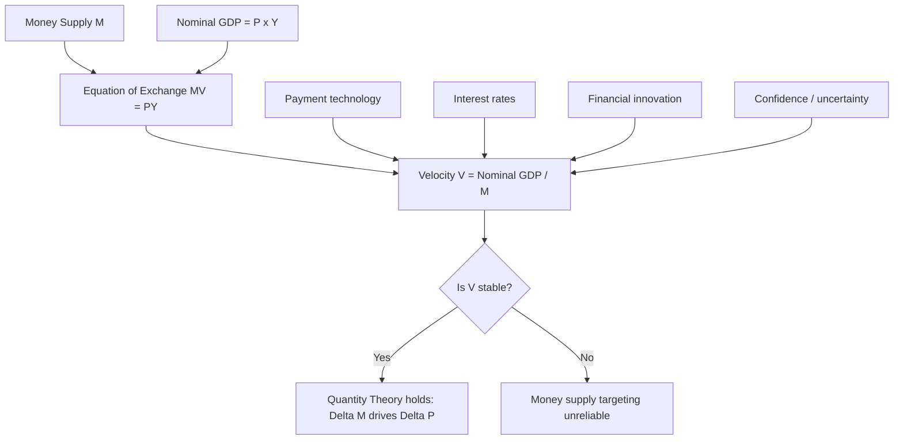

## Velocity of Money and Its Stability

### Definition and Conceptual Foundation

The velocity of money measures the rate at which money circulates through the economy over a given period — specifically, the number of times the average unit of currency is used to purchase final goods and services. It is a flow concept relating the money stock (a stock variable) to nominal income (a flow variable).

**Key Points**

- Velocity is not directly observable; it is derived residually from the equation of exchange
- It reflects the intensity of money usage in transactions, not the physical speed of currency movement
- Different velocity measures exist depending on which monetary aggregate and which income concept are used

### The Equation of Exchange

The foundational identity linking velocity to other macroeconomic variables is the equation of exchange, attributed to Irving Fisher:

$$MV = PY$$

Where:

- $M$ = money supply (stock of money in circulation)
- $V$ = velocity of money (transactions or income velocity)
- $P$ = price level (GDP deflator or similar index)
- $Y$ = real output (real GDP)

Since $PY$ represents nominal GDP, this can be rewritten as:

$$V = \frac{PY}{M} = \frac{\text{Nominal GDP}}{M}$$

This is an **identity**, not a behavioral equation — it holds true by definition because $V$ is calculated as whatever value makes the equation balance, given observed $M$, $P$, and $Y$.

### Types of Velocity

#### Income Velocity of Money

The most commonly used measure in macroeconomics, defined as:

$$V_Y = \frac{\text{Nominal GDP}}{M}$$

This measures how many times the money stock turns over in generating a year's worth of income (final goods and services), excluding intermediate transactions.

#### Transactions Velocity

Fisher's original formulation used total transactions value $T$ rather than final output:

$$MV_T = PT$$

Transactions velocity is broader than income velocity because it captures all transactions (including intermediate goods, financial asset trades, and secondhand sales), not just final output. In practice, transactions velocity is difficult to measure because comprehensive transactions data is not systematically collected, so income velocity is the standard empirical proxy.

#### Velocity by Monetary Aggregate

Because $M$ can refer to different monetary aggregates, velocity is aggregate-specific:

$$V_1 = \frac{\text{Nominal GDP}}{M1}, \quad V_2 = \frac{\text{Nominal GDP}}{M2}$$

M1 velocity (currency plus checkable/demand deposits) tends to be higher and more volatile than M2 velocity (M1 plus savings deposits, small time deposits, and retail money market funds), since M1 components turn over more frequently in transactions while M2 includes assets held more as stores of value.

### The Quantity Theory of Money and the Stability Assumption

The classical **Quantity Theory of Money (QTM)** transforms the identity $MV = PY$ into a behavioral theory by adding an assumption: that $V$ is stable (constant or predictably trending) in the short-to-medium run, and that $Y$ is determined independently by real factors (labor, capital, technology) at or near full employment.

Under these assumptions:

$$\%\Delta M + \%\Delta V \approx \%\Delta P + \%\Delta Y$$

If $V$ is stable ($\%\Delta V \approx 0$) and $Y$ is fixed by supply-side factors in the long run, then changes in the money supply translate proportionally into changes in the price level:

$$\%\Delta M \approx \%\Delta P$$

This is the theoretical basis for monetarism's core claim: inflation is fundamentally a monetary phenomenon, and controlling money supply growth controls inflation.

**Key Points**

- Stability of $V$ is the linchpin assumption that converts an accounting identity into a predictive, policy-relevant theory
- If $V$ were perfectly stable, the money supply would be an excellent and sufficient policy instrument for controlling nominal income and inflation
- The quantity theory does not require $V$ to be constant in absolute terms — only stable and predictable enough that its movements do not swamp the relationship between $M$ and $PY$

### Determinants of Velocity

Velocity is influenced by the economy's underlying institutional and behavioral structure, which changes gradually but is not immutable:

- **Payment technology and financial infrastructure**: Electronic payments, credit cards, and real-time settlement systems allow money to "do more work," raising velocity over long horizons as transaction costs fall
- **Financial innovation**: New instruments that serve as near-money substitutes (money market funds, sweep accounts) affect how tightly measured $M$ corresponds to actual transactions capacity
- **Interest rates**: Higher opportunity cost of holding non-interest-bearing money (per the Baumol-Tobin inventory-theoretic model of money demand) induces economizing on cash balances, raising velocity; falling rates typically coincide with falling velocity
- **Institutional habits**: Payment frequency conventions (e.g., weekly vs. monthly wages) affect average cash balances relative to income
- **Confidence and uncertainty**: During crises, precautionary money hoarding raises desired money balances relative to spending, which mechanically lowers velocity
- **Regulatory and interest-rate environment**: Near-zero interest rate policy regimes reduce the opportunity cost of holding money, which tends to depress velocity

### The Link Between Velocity and Money Demand

Velocity is the inverse of the fraction of income the public chooses to hold as money balances. This connects to the **Cambridge cash-balance approach**:

$$M^d = kPY$$

Where $k$ is the fraction of nominal income the public wishes to hold as money. Comparing to $MV = PY$:

$$V = \frac{1}{k}$$

A stable velocity is therefore equivalent to a stable and predictable money demand function. Much of the empirical debate over "is velocity stable" is functionally identical to the debate over "is money demand stable" — if the public's desired ratio of money holdings to income shifts unpredictably, $V$ will be unstable, and vice versa.

**Example**

If $k = 0.2$ (the public holds money balances equal to 20% of nominal annual income), then $V = 1/0.2 = 5$: each unit of money supports five units of nominal income per year.

### Empirical Behavior and Historical Instability

The empirical stability of velocity has varied significantly across historical periods and monetary aggregates:

- From roughly the 1950s through the early 1980s, M1 velocity in the United States exhibited a relatively stable, mildly upward trend, lending empirical support to monetarist prescriptions (e.g., Milton Friedman's constant money-growth-rate rule)
- Beginning in the early 1980s, M1 velocity became markedly unstable and unpredictable, coinciding with financial deregulation (interest-bearing checking accounts, money market deposit accounts) that altered the composition and opportunity cost of M1 holdings
- This breakdown famously undermined the Federal Reserve's use of M1 as a primary monetary policy target and contributed to central banks broadly shifting away from strict monetary aggregate targeting toward interest-rate-based frameworks (e.g., Taylor-rule-style approaches)
- M2 velocity was comparatively more stable than M1 velocity through the 1980s and 1990s but also displayed instability during and after the 2008 financial crisis and again during 2020–2021
- During the 2020–2021 period, M2 grew extremely rapidly (driven by pandemic-era fiscal transfers and quantitative easing) while nominal GDP growth was disrupted, causing a sharp, historically unprecedented decline in measured M2 velocity [Unverified: exact magnitude and duration of post-2021 velocity reversion are still debated among economists as data continues to be revised]

**Key Points**

- No monetary aggregate has proven velocity-stable across all historical episodes and policy regimes
- Structural breaks in velocity tend to coincide with financial innovation, deregulation, or extraordinary macroeconomic shocks
- Velocity instability is a primary empirical objection raised against strict monetarist policy rules

### Diagram: Velocity Determination Loop

### Why Velocity Instability Matters for Policy

If $V$ is unstable, then even accurate control of $M$ does not translate predictably into control of nominal GDP or the price level, because the missing link ($V$) can move independently and offset or amplify the effect of money supply changes. This has several practical implications:

- **Monetary aggregate targeting becomes unreliable**: Central banks cannot use $M$ growth rates alone as a reliable lever for inflation control if $V$ swings unpredictably
- **Shift toward interest rate targeting**: Most major central banks (the Federal Reserve, European Central Bank, Bank of England) now target short-term interest rates (e.g., the federal funds rate) rather than monetary aggregates, partly because interest rate transmission channels are less contaminated by velocity instability
- **Money supply data loses forecasting value**: Rapid M2 growth without a corresponding velocity assumption cannot, by itself, be used to forecast inflation reliably — this was a central point of contention in debates over whether 2021–2022 inflation was primarily monetary in origin or driven by supply shocks and fiscal stimulus [Inference: attribution of that specific inflation episode to monetary versus non-monetary causes remains a contested empirical question among economists]

### Velocity Across the Business Cycle

Velocity tends to exhibit procyclical tendencies:

- **Expansions**: Rising confidence and transaction demand for money, combined with rising interest rates (raising the opportunity cost of idle balances), tend to push velocity upward
- **Recessions/crises**: Precautionary demand for liquidity rises, interest rates often fall, and desired money holdings relative to income increase — pushing velocity downward
- This cyclicality is one reason short-run velocity is more volatile than the long-run institutional trend, complicating the use of velocity as a stable structural parameter in short-run policy models

### Relationship to Monetarism vs. Keynesian Views

| Perspective | View on Velocity |
| --- | --- |
| Classical/Monetarist (Fisher, Friedman) | Velocity stable or predictably trending in the short-to-medium run; supports money-supply-based policy rules |
| Keynesian | Velocity can shift substantially due to changes in liquidity preference (money demand), especially near the zero lower bound (liquidity trap), undermining simple money-supply targeting |
| Post-1980s consensus (most central banks) | Velocity too unstable empirically for reliable use as a policy target; interest-rate-based frameworks preferred |

The Keynesian liquidity trap scenario represents an extreme case of velocity instability: when interest rates approach zero, the opportunity cost of holding money vanishes, money demand becomes highly elastic, and additional money injections are absorbed into idle balances rather than spent — driving velocity sharply downward and severing the link between $M$ growth and $PY$ growth.

### Common Misconceptions

- **Misconception**: Velocity is a policy tool a central bank can directly control. **Correction**: Velocity is an emergent outcome of the public's payment habits and portfolio choices; central banks influence it only indirectly (e.g., via interest rates).
- **Misconception**: $MV = PY$ proves that money supply growth causes inflation. **Correction**: The equation is an identity true by construction; causation and the direction of any relationship depend on additional behavioral assumptions (particularly velocity stability), which must be tested empirically rather than assumed.
- **Misconception**: A falling velocity means money is "disappearing" from the economy. **Correction**: Falling velocity means the existing money stock is being held longer relative to income generated, not that the money supply itself is shrinking.

### Next Steps

- Quantity Theory of Money and classical dichotomy
- Money demand theories: Baumol-Tobin inventory model, Keynesian liquidity preference
- Monetary aggregates: M0, M1, M2, M3 and their construction
- Monetarism and Friedman's k-percent rule
- Liquidity trap and zero lower bound dynamics
- Central bank operating frameworks: monetary targeting vs. inflation targeting vs. interest rate rules
- Quantitative easing and its effects on money supply and velocity (2008–2009, 2020–2021 episodes)
- Fisher effect and the relationship between money growth, inflation, and nominal interest rates