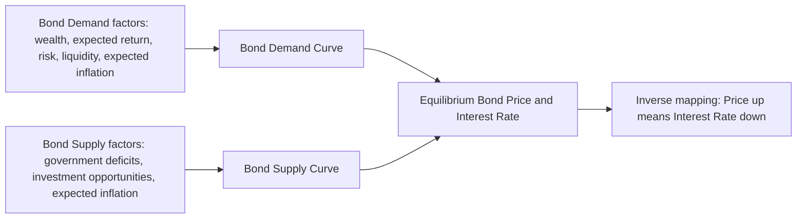
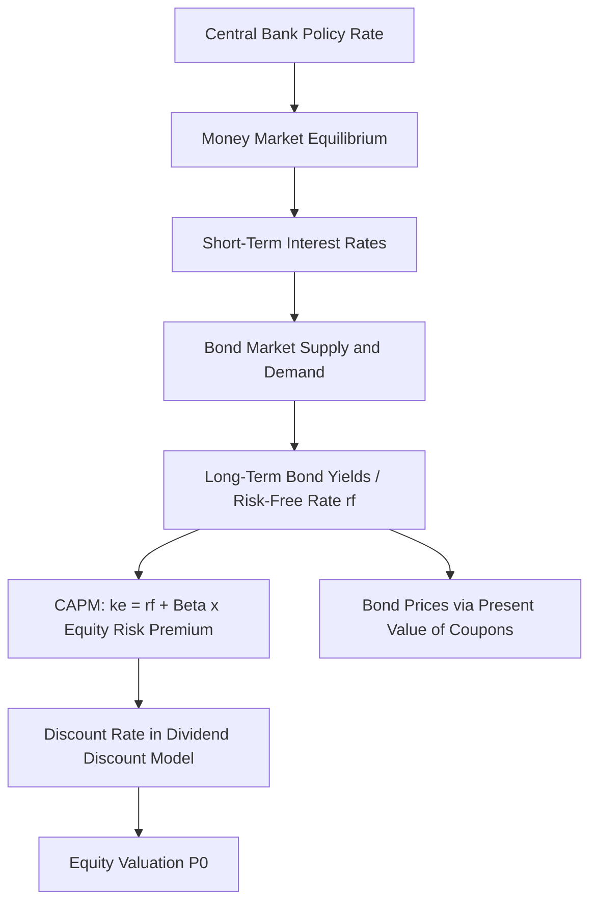

## Financial Markets: Bonds, Equities, and Interest Rate Determination

### Overview and Role in the Macroeconomy

Financial markets channel funds from savers (surplus units) to borrowers and investors (deficit units), performing the core intermediation function alongside banks. Bond and equity markets are the two principal direct-finance channels through which this occurs, and the interest rates and prices determined in these markets influence consumption, investment, and monetary policy transmission throughout the economy.

**Key Points**

- Financial markets are distinguished from financial intermediaries (banks) in that funds flow directly from lender-savers to borrower-spenders via tradable instruments
- Bond markets and equity markets differ fundamentally in the nature of the claim they represent: debt versus ownership
- Interest rates determined in bond markets serve as a key input to equity valuation, investment decisions, and monetary policy

### Bond Markets

#### Bond Fundamentals

A bond is a debt instrument representing a promise by the issuer to pay the holder a specified stream of cash flows (coupons) and return the principal (face value) at maturity.

Key bond characteristics:

- **Face value (par value)**: The amount repaid at maturity, typically $1,000 for corporate bonds
- **Coupon rate**: The fixed annual interest rate paid on face value
- **Maturity**: The date principal is repaid
- **Yield to maturity (YTM)**: The discount rate that equates the present value of all future cash flows to the current market price

#### Bond Pricing

The price of a bond is the present discounted value of its future cash flows:

$$P = \sum_{t=1}^{n} \frac{C}{(1+i)^t} + \frac{F}{(1+i)^n}$$

Where:

- $P$ = current bond price
- $C$ = periodic coupon payment
- $F$ = face value
- $i$ = yield to maturity (discount rate)
- $n$ = number of periods to maturity

For a simple one-year discount (zero-coupon) bond:

$$P = \frac{F}{1+i} \quad \Rightarrow \quad i = \frac{F-P}{P}$$

**Example**

A one-year discount bond with face value $1,000 selling for $950 has:

$$i = \frac{1000 - 950}{950} = 0.0526 = 5.26\%$$

#### The Inverse Price-Yield Relationship

Bond prices and yields move inversely. As market interest rates rise, the present value of a bond's fixed future cash flows falls, so the price of existing bonds falls to bring their yield in line with new market rates.

**Key Points**

- This inverse relationship is central to understanding capital gains/losses on bond holdings when interest rates change
- Longer-maturity bonds exhibit greater price sensitivity to interest rate changes (higher duration) than shorter-maturity bonds
- Duration measures the weighted-average time to receipt of cash flows and approximates the percentage price change for a given change in yield: $\%\Delta P \approx -D \times \Delta i$

#### Bond Market Segments

| Segment | Description |
| --- | --- |
| Government/Treasury bonds | Sovereign debt, generally considered the risk-free benchmark within a currency area |
| Municipal bonds | Sub-sovereign government debt, often tax-advantaged |
| Corporate bonds | Issued by firms; priced with a risk (default) premium over government benchmarks |
| Money market instruments | Short-term debt (T-bills, commercial paper, certificates of deposit), maturity under one year |

### Determinants of Bond Prices: Supply and Demand Framework

#### The Loanable Funds Framework (Bond Market Approach)

Interest rate determination can be modeled as the price that equilibrates the supply of and demand for bonds (equivalently, the supply of and demand for loanable funds).

$$B^d = B^s \quad \text{at equilibrium}$$

- **Demand for bonds** (supply of loanable funds) is inversely related to the bond price (positively related to the interest rate), reflecting savers' willingness to lend
- **Supply of bonds** (demand for loanable funds) is positively related to the bond price (inversely related to the interest rate), reflecting borrowers' willingness to issue debt

Shifts in bond demand arise from:

- Wealth (higher wealth increases demand for bonds as an asset)
- Expected returns on bonds relative to alternative assets
- Risk of bonds relative to alternatives
- Liquidity of bonds relative to alternatives
- Expected inflation (lower expected inflation raises expected real return, increasing demand)

Shifts in bond supply arise from:

- Government budget deficits (increased Treasury issuance)
- Business investment opportunities (increased corporate borrowing)
- Expected inflation (higher expected inflation raises nominal borrowing incentives, increasing supply)

#### Diagram: Bond Market Equilibrium

#### The Liquidity Preference Framework (Money Market Approach)

An equivalent framework (Keynes's liquidity preference theory) determines the interest rate via equilibrium in the money market:

$$M^s = M^d(i, Y)$$

Money demand is inversely related to the interest rate (opportunity cost of holding non-interest-bearing money) and positively related to income. An increase in the money supply, holding money demand constant, lowers the equilibrium interest rate (the **liquidity effect**) — this is the mechanism by which central bank open market operations affect short-term rates.

**Key Points**

- The loanable funds and liquidity preference frameworks are complementary, not contradictory; they emphasize different markets (bonds vs. money) that are linked via the same underlying interest rate
- Central bank policy actions (e.g., asset purchases, policy rate changes) operate through both frameworks simultaneously

### The Term Structure of Interest Rates

The relationship between bonds' time to maturity and their yields, visualized as the yield curve, is explained by several competing/complementary theories:

- **Expectations theory**: Long-term rates equal the average of expected future short-term rates; an upward-sloping curve implies expectations of rising short-term rates
- **Segmented markets theory**: Bonds of different maturities are traded in separate markets with distinct supply/demand, so yields are determined independently by maturity-specific conditions
- **Liquidity premium (preferred habitat) theory**: Combines expectations theory with a term premium — investors require additional compensation for holding longer-maturity, less liquid instruments, so the yield curve is normally upward-sloping even absent expected rate increases

$$i_{nt} = \frac{i_t + i^e_{t+1} + \ldots + i^e_{t+n-1}}{n} + l_{nt}$$

Where $l_{nt}$ is the liquidity/term premium for an $n$-period bond, increasing with maturity.

**Key Points**

- Yield curve inversions (long-term rates below short-term rates) have historically preceded recessions in the United States, though this relationship is empirical and not structural in all economic environments [Inference: predictive reliability of inversions varies across cycles and is subject to ongoing debate]
- The term structure is a key input for central bank communication and market expectations about future policy rates

### Equity Markets

#### Equity Fundamentals

Common stock represents residual ownership claims on a corporation's assets and earnings, with no fixed maturity or guaranteed payment, distinguishing it fundamentally from debt.

Key features:

- **Dividends**: Discretionary distributions of earnings to shareholders, not contractually guaranteed
- **Capital gains**: Price appreciation, the other primary component of equity returns
- **Residual claim**: Equity holders are paid after all debt obligations in bankruptcy, bearing higher risk than bondholders
- **Voting rights**: Common shares typically confer governance rights absent from bonds

#### Equity Valuation: The Dividend Discount Model

The most standard theoretical valuation framework values a share as the present discounted value of expected future dividends:

$$P_0 = \sum_{t=1}^{\infty} \frac{E(D_t)}{(1+k_e)^t}$$

Where $k_e$ is the required rate of return on equity (incorporating a risk premium over the risk-free rate).

For the special case of constant expected dividend growth (the **Gordon Growth Model**):

$$P_0 = \frac{D_1}{k_e - g}$$

Where $D_1$ is next period's expected dividend and $g$ is the constant expected growth rate of dividends, valid only when $k_e > g$.

**Example**

A stock expected to pay a $2 dividend next year, with required return $k_e = 10\%$ and expected dividend growth $g = 4\%$:

$$P_0 = \frac{2}{0.10 - 0.04} = \frac{2}{0.06} \approx \$33.33$$

#### Interest Rates and Equity Valuation

Interest rates enter equity valuation through the required rate of return $k_e$, which is typically decomposed via the Capital Asset Pricing Model (CAPM):

$$k_e = r_f + \beta(r_m - r_f)$$

Where $r_f$ is the risk-free rate (typically proxied by a government bond yield), $\beta$ measures the stock's systematic risk relative to the market, and $(r_m - r_f)$ is the equity market risk premium.

**Key Points**

- Rising risk-free rates (bond yields) mechanically raise $k_e$, lowering the present value of future dividends/earnings for a given growth expectation — this is the primary channel connecting bond market and equity market movements
- Growth stocks (high expected $g$, cash flows weighted toward the distant future) are more sensitive to discount rate changes than value/mature stocks (cash flows weighted toward the near term), analogous to duration in bond markets
- Equity risk premiums are not directly observable and must be estimated, introducing model uncertainty into valuation exercises [Unverified: precise equity risk premium magnitude is a matter of ongoing empirical estimation and disagreement among practitioners]

#### Efficient Markets Hypothesis (EMH)

The EMH posits that asset prices fully reflect available information, implying that consistently outperforming the market via that information set is not possible.

| Form | Information Set Reflected |
| --- | --- |
| Weak form | Past prices and trading volume |
| Semi-strong form | All publicly available information |
| Strong form | All information, including private/insider information |

**Key Points**

- The EMH implies stock prices follow approximately a random walk in its weak form, since predictable patterns would be arbitraged away
- Empirical anomalies (momentum, value effects, excess volatility relative to fundamentals) have generated substantial debate over the EMH's empirical validity, giving rise to behavioral finance as an alternative/complementary framework [Inference: the extent to which anomalies reflect genuine inefficiency versus mismeasured risk remains contested in the academic literature]

### Comparing Bond and Equity Markets

| Dimension | Bonds | Equities |
| --- | --- | --- |
| Claim type | Debt (contractual) | Residual ownership |
| Payment | Fixed/scheduled coupon | Discretionary dividend |
| Priority in bankruptcy | Senior to equity | Subordinate (residual) |
| Risk profile | Generally lower (for investment-grade) | Generally higher |
| Sensitivity to interest rates | Direct, via discounting (duration) | Indirect, via discount rate in valuation models |
| Maturity | Fixed/defined | Perpetual (no maturity) |

### Diagram: Interest Rate Transmission from Bond Market to Equity Valuation

### Risk Structure of Interest Rates

Beyond the term structure (maturity-based differences), yields also differ across bonds of the same maturity due to the **risk structure**:

- **Default risk**: Higher perceived probability of issuer default requires a higher yield (risk/default premium) to compensate investors; credit rating agencies (Moody's, S&P, Fitch) assess this risk
- **Liquidity**: Less liquid, less frequently traded bonds require a liquidity premium
- **Tax treatment**: Tax-exempt bonds (e.g., US municipal bonds) can trade at lower pre-tax yields than otherwise comparable taxable bonds because after-tax returns are equalized across investors' relevant tax brackets

$$i_{corporate} = i_{risk-free} + \text{default premium} + \text{liquidity premium} - \text{tax adjustment (if applicable)}$$

### Market Interlinkages and Macroeconomic Feedback

- Bond and equity markets are connected through investor portfolio rebalancing: rising bond yields make bonds relatively more attractive versus equities, potentially triggering capital reallocation ("rotation") that pressures equity valuations
- Both markets serve as forward-looking indicators incorporated into monetary policy decision-making, since asset prices embed market expectations about future growth, inflation, and policy rates
- Financial market volatility and asset price movements feed into the wealth effect channel of monetary transmission: rising asset prices increase perceived household wealth, supporting consumption, and vice versa

### Next Steps

- Term structure theories in depth: expectations, segmented markets, and preferred habitat models
- Duration and convexity: quantifying bond price sensitivity to interest rate changes
- Capital Asset Pricing Model and modern portfolio theory
- Monetary policy transmission mechanisms: interest rate channel, credit channel, wealth channel, exchange rate channel
- Credit risk and bond ratings methodology
- Behavioral finance and deviations from the Efficient Markets Hypothesis
- Central bank asset purchase programs (quantitative easing) and their effects on bond yields and equity valuations
- Yield curve inversion as a recession predictor: historical evidence and limitations