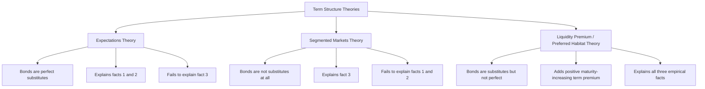

## Term Structure of Interest Rates and the Yield Curve

### Definition and Conceptual Foundation

The term structure of interest rates describes the relationship between the yields on bonds of identical credit quality and differing maturities. Its graphical representation — yield plotted against maturity at a given point in time — is the **yield curve**. The term structure isolates the effect of maturity alone on yield, holding default risk, liquidity, and tax treatment constant (typically constructed using government/Treasury securities, which are treated as free of default risk).

**Key Points**

- The yield curve is a snapshot at a single point in time across a spectrum of maturities, distinct from the risk structure of interest rates (which examines yield differences across bonds of the same maturity but different issuers)
- Yield curves are typically constructed from a homogeneous class of bonds (e.g., US Treasury securities) to isolate maturity effects from credit and liquidity effects
- The shape of the yield curve is a widely watched indicator of market expectations about future interest rates, inflation, and economic activity

### Typical Yield Curve Shapes

| Shape | Description | Common Interpretation |
| --- | --- | --- |
| Normal (upward-sloping) | Long-term yields exceed short-term yields | Market expects rising short-term rates and/or economic expansion; compensation for term risk |
| Flat | Little difference between short- and long-term yields | Transition phase; uncertainty about future rate direction |
| Inverted (downward-sloping) | Short-term yields exceed long-term yields | Market expects future short-term rate declines, often associated with anticipated economic slowdown |
| Humped | Medium-term yields exceed both short- and long-term yields | Mixed expectations; near-term rate increases followed by longer-run declines |

### Diagram: Yield Curve Shapes (SVG)

<svg xmlns="http://www.w3.org/2000/svg" viewBox="0 0 720 420">
\<style\>
.axis { stroke: #333; stroke-width: 2; }
.gridline { stroke: #ddd; stroke-width: 1; }
.label { font-family: sans-serif; font-size: 13px; fill: #222; }
.title { font-family: sans-serif; font-size: 15px; fill: #111; font-weight: bold; }
.normal { stroke: #2166ac; stroke-width: 3; fill: none; }
.inverted { stroke: #b2182b; stroke-width: 3; fill: none; }
.flat { stroke: #4d4d4d; stroke-width: 3; fill: none; stroke-dasharray: 6,4; }
.humped { stroke: #1b7837; stroke-width: 3; fill: none; stroke-dasharray: 2,3; }
\</style\>
<text x="180" y="25" class="title">Yield Curve Shapes (svg_diagram)</text>

<line x1="70" y1="360" x2="670" y2="360" class="axis" />
<line x1="70" y1="360" x2="70" y2="50" class="axis" />
<text x="330" y="400" class="label">Maturity (years)</text>
<text x="20" y="200" class="label" transform="rotate(-90 20 200)">Yield (%)</text>

<text x="65" y="375" class="label">0</text>

<text x="185" y="375" class="label">5</text>

<text x="305" y="375" class="label">10</text>

<text x="425" y="375" class="label">20</text>

<text x="545" y="375" class="label">30</text>

<line x1="70" y1="300" x2="670" y2="300" class="gridline" />
<line x1="70" y1="240" x2="670" y2="240" class="gridline" />
<line x1="70" y1="180" x2="670" y2="180" class="gridline" />
<line x1="70" y1="120" x2="670" y2="120" class="gridline" />

<path d="M 70,320 C 200,270 350,180 670,110" class="normal" />
<text x="500" y="130" class="label" fill="#2166ac">Normal</text>

<path d="M 70,140 C 200,190 350,260 670,320" class="inverted" />
<text x="500" y="340" class="label" fill="#b2182b">Inverted</text>

<path d="M 70,230 L 670,225" class="flat" />
<text x="500" y="215" class="label" fill="#4d4d4d">Flat</text>

<path d="M 70,300 C 200,150 350,150 670,260" class="humped" />
<text x="330" y="150" class="label" fill="#1b7837">Humped</text>
</svg>

### Empirical Facts of the Term Structure

Three key empirical regularities that any theory of the term structure must explain:

1. **Yields on bonds of different maturities move together over time.** Short- and long-term rates tend to rise and fall together, though not by identical magnitudes.
2. **Yield curves tend to slope upward when short-term rates are low, and are more likely to be inverted (or flat) when short-term rates are high.** This pattern connects the curve's shape to the current level and cyclical position of rates.
3. **The yield curve is typically upward-sloping on average** (normal shape is the historical modal shape), rather than flat or randomly shaped.

### Theory 1: Expectations Theory (Pure Expectations Hypothesis)

The expectations theory states that the interest rate on a long-term bond equals the average of the short-term interest rates that market participants expect to occur over the life of the long-term bond. It rests on the assumption that bonds of different maturities are perfect substitutes, so investors are indifferent between holding a single long-term bond or a sequence of short-term bonds, provided expected returns are equal.

For an $n$-period bond:

$$i_{nt} = \frac{i_t + i^e_{t+1} + i^e_{t+2} + \ldots + i^e_{t+(n-1)}}{n}$$

Where $i_{nt}$ is today's yield on the $n$-period bond, $i_t$ is today's one-period rate, and $i^e_{t+k}$ are expected future one-period rates.

**Example**

If the current one-year rate is 4%, and the market expects one-year rates of 5% next year and 6% the year after, the current three-year rate under pure expectations theory is:

$$i_{3t} = \frac{4\% + 5\% + 6\%}{3} = 5\%$$

**Key Points**

- The expectations theory successfully explains empirical facts 1 and 2: if short rates are expected to remain near their current level, changes in short rates move long rates similarly (fact 1); and if current short rates are low, they are more likely expected to rise toward their average level in the future, generating an upward-sloping curve (fact 2)
- It fails to explain fact 3: since short-term rates are equally likely, historically, to rise or fall, pure expectations theory would predict yield curves are upward- and downward-sloping with roughly equal frequency, which is not observed empirically
- Under this theory, an inverted yield curve strictly implies the market expects future short-term rates to fall

### Theory 2: Segmented Markets Theory

Segmented markets theory holds that bonds of different maturities are not substitutes at all; each maturity segment has its own independent market where the interest rate is determined purely by supply and demand for bonds of that specific maturity, with no reference to expected returns on other maturities.

**Key Points**

- Investors are assumed to have strict maturity preferences (e.g., driven by the maturity structure of their liabilities — pension funds prefer long maturities, money market funds prefer short maturities), with no cross-substitution
- This theory readily explains fact 3 (habitual upward slope), if attributed to typically stronger demand (lower required yield) for short-term bonds and weaker demand (higher required yield) for long-term bonds
- It fails to explain facts 1 and 2, since there is no mechanism in the theory linking yields across maturities — nothing requires short and long rates to move together or the curve's shape to depend systematically on the level of rates

### Theory 3: Liquidity Premium Theory (Preferred Habitat Theory)

The liquidity premium theory (closely related to, and often presented jointly with, the preferred habitat theory) combines elements of both prior theories: it assumes bonds of different maturities are substitutes but not perfect substitutes, so expected returns on one bond do influence the expected returns on bonds of other maturities, but investors have preferences for particular maturity "habitats" and must be compensated with a term/liquidity premium to hold bonds outside that habitat — typically to hold longer-maturity, less liquid instruments.

$$i_{nt} = \frac{i_t + i^e_{t+1} + \ldots + i^e_{t+(n-1)}}{n} + l_{nt}$$

Where $l_{nt}$ is the liquidity (term) premium for the $n$-period bond, assumed to be positive and generally increasing with maturity ($l_{nt} > 0$ and rising in $n$).

**Key Points**

- This theory successfully explains all three empirical facts: it retains the expectations-based comovement mechanism (fact 1) and the expectations-driven relationship between rate levels and curve shape (fact 2), while the positive, maturity-increasing term premium explains the tendency toward an upward-sloping average curve (fact 3)
- It is the most widely accepted theory among the three, as it nests the expectations theory as a special case (when $l_{nt} = 0$) while adding the empirically necessary term premium
- An inverted curve under this theory implies the market expects future short rates to fall by enough to outweigh the positive term premium — a stronger signal of anticipated rate declines than under pure expectations theory

### Diagram: Term Structure Theories Comparison

### Using the Yield Curve to Forecast Interest Rates and Recessions

#### Extracting Market Expectations

Under the expectations or liquidity premium theories, the yield curve can be used to back out the market's implied expectations of future short-term rates — a technique used extensively by central banks and market participants (forward rate analysis).

The **forward rate** implied between period $n$ and $n+1$ can be approximated by rearranging the expectations equation to isolate the expected future short rate embedded in the difference between two adjacent-maturity yields.

#### The Yield Curve as a Recession Indicator

An inverted yield curve — most commonly measured as the spread between the 10-year and 2-year (or 10-year and 3-month) Treasury yields turning negative — has preceded most US recessions historically.

**Key Points**

- The mechanism: an inversion signals the market expects the central bank to cut short-term policy rates in the future, typically in response to an anticipated economic slowdown; it may also reflect tightening current monetary policy pushing short rates above their long-run expected average
- This relationship is a robust historical correlation rather than a guaranteed structural law; lead times between inversion and recession onset have varied considerably across cycles, and false signals have occurred [Inference: the causal mechanism connecting inversion to recession, versus inversion being a symptom of shared underlying causes, remains a subject of ongoing research and debate]
- Central banks and market participants also monitor near-term forward spreads (e.g., the spread between the expected 3-month rate 18 months forward and the current 3-month rate) as an alternative indicator, since some research suggests these have stronger predictive properties than long-short spreads [Unverified: relative predictive superiority across indicators is contested and sensitive to sample period]

### Interpreting the Yield Curve in Practice

| Signal | Typical Interpretation |
| --- | --- |
| Steepening normal curve | Expectations of stronger growth and/or rising inflation ahead |
| Flattening from normal | Late-cycle dynamics; monetary policy tightening raising short rates faster than long rates |
| Inversion | Market pricing in future policy easing, often associated with anticipated slowdown |
| Bull steepening (short rates falling faster) | Market pricing in imminent policy easing/rate cuts |
| Bear flattening (short rates rising faster) | Market pricing in continued/accelerating policy tightening |

### Policy Relevance

- Central banks monitor the entire term structure, not just short-term policy rates, because long-term rates (mortgage rates, corporate borrowing rates) are more directly relevant to household and business decisions, and are influenced by the full expected future path of policy rates plus term premia
- Central bank communication and forward guidance operate precisely through the expectations channel embedded in the term structure: signaling the likely future path of short-term rates shifts long-term yields today, even without an immediate change in the current policy rate
- Quantitative easing programs (large-scale asset purchases concentrated in longer maturities) are understood, in part, as an attempt to directly compress the term/liquidity premium component of long-term yields when short-term policy rates are constrained near zero

### Next Steps

- Forward rate calculation and the forward rate as a predictor of future spot rates
- Quantitative easing and its impact on the term premium
- Federal Reserve forward guidance and its transmission through the yield curve
- Duration and convexity: pricing sensitivity across the term structure
- Historical case studies of yield curve inversions and subsequent recessions
- Risk structure of interest rates: default risk, liquidity, and tax effects
- Central bank policy rate frameworks and the transmission mechanism to long-term rates