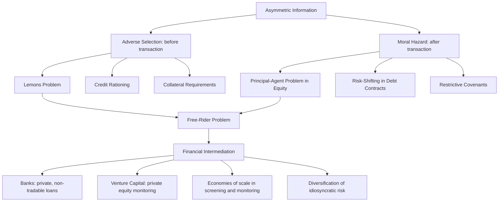

## Financial Intermediation and Asymmetric Information

### Overview and Core Problem

Financial intermediation refers to the process by which financial institutions (banks, insurance companies, pension funds, mutual funds) channel funds from savers to borrowers indirectly, rather than savers and borrowers transacting directly in financial markets. The economic rationale for the existence and scale of financial intermediaries rests heavily on **asymmetric information** — a situation in which one party to a financial transaction has less accurate information than the other party, creating frictions that raw markets cannot efficiently resolve on their own.

**Key Points**

- Asymmetric information is the central theoretical justification for why intermediated finance (bank lending) coexists with, and often dominates, direct finance (securities markets) in most economies
- The two canonical problems arising from asymmetric information are adverse selection (occurring before the transaction) and moral hazard (occurring after the transaction)
- Financial intermediaries develop specialized capabilities — screening, monitoring, diversification, and long-term relationships — that reduce the costs asymmetric information imposes on the financial system

### Adverse Selection

#### Definition and Mechanism

Adverse selection arises **before** a transaction occurs, from the fact that potential borrowers most likely to produce an undesirable (adverse) outcome — the least creditworthy borrowers — are precisely those most eager to seek a loan or issue a security, while lenders cannot easily distinguish good borrowers from bad ones.

#### The Lemons Problem

The classic formalization is Akerlof's "lemons problem," originally developed for used car markets and directly applicable to securities markets: if buyers (lenders/investors) cannot distinguish high-quality ("peaches") from low-quality ("lemons") borrowers or securities, they will only be willing to pay an average price reflecting the pooled quality of the market.

**Key Points**

- At this average price, owners of genuinely high-quality securities/firms are unwilling to sell (since the price undervalues them), causing them to exit the market
- This exit lowers the average quality remaining in the market, causing buyers to lower their price further, triggering further exit of higher-quality sellers — a potential unraveling ("adverse selection death spiral")
- Applied to securities markets: since outside investors cannot easily distinguish good firms from bad firms, high-quality firms may find it too costly to raise funds by issuing securities directly, even though direct finance would otherwise be efficient, explaining why firms rely heavily on financial intermediaries who can better assess creditworthiness

#### Adverse Selection in Practice: Consequences

- Explains why relatively few firms use securities markets to finance new investment relative to bank loans, particularly smaller and younger firms with less public information available
- Explains the prevalence of **collateral and net worth requirements** in lending: collateral reduces the lender's loss in default and reduces the borrower's incentive to misrepresent quality, since only borrowers confident in repayment will offer valuable collateral
- Explains **credit rationing**: rather than raising interest rates indefinitely to compensate for information asymmetry (which itself worsens the pool by discouraging good borrowers — a phenomenon distinct from but related to adverse selection), lenders may simply deny credit to some borrowers at any price

#### Tools to Mitigate Adverse Selection

| Tool | Mechanism |
| --- | --- |
| Private information production and sale | Credit rating agencies, financial analysts producing and selling information about borrower quality |
| Government regulation to increase information | Mandatory disclosure requirements (e.g., securities registration, audited financial statements) |
| Financial intermediation | Banks specialize in producing private information about borrowers and profit from lending based on it, avoiding the free-rider problem of publicly sold information |
| Collateral and net worth | Reduces lender losses and screens out low-quality borrowers unwilling/unable to pledge assets |

**Key Points**

- The **free-rider problem** partially explains why private information production alone cannot fully solve adverse selection: once information is produced and made public (or leaks via market prices/actions), other investors can free-ride on it without paying, reducing the incentive for costly information production in the first place
- Banks largely solve the free-rider problem because they make private loans rather than purchasing securities in an open market, so the information they produce is not immediately available to free-riding competitors — this is a central theoretical explanation for why bank lending remains the dominant source of external finance for most non-large firms

### Moral Hazard

#### Definition and Mechanism

Moral hazard arises **after** a transaction occurs, from the risk that the borrower might engage in activities that are undesirable (immoral) from the lender's point of view, because they increase the probability of default, and the lender cannot perfectly monitor or control the borrower's behavior after funds are disbursed.

#### Moral Hazard in Equity Contracts: The Principal-Agent Problem

Equity contracts are particularly susceptible to moral hazard because they represent a claim on profits under conditions where managers (agents) may have different incentives than outside shareholders (principals) who bear residual risk without direct control over day-to-day decisions.

**Key Points**

- Managers may pursue perquisites, empire-building, or personal benefits rather than profit maximization on behalf of dispersed shareholders — the classic **principal-agent problem**
- The problem is worsened by the separation of ownership and control characteristic of large public corporations
- This is sometimes summarized as explaining why debt contracts are more common than equity contracts for external finance overall: debt fixes the payment obligation regardless of the firm's profitability level, reducing (though not eliminating) the lender's exposure to the firm's day-to-day operating decisions

#### Tools to Mitigate Moral Hazard in Equity Markets

- **Monitoring (costly state verification)**: Auditing firm accounts and activities to enforce the equity contract, though this monitoring itself is costly and subject to the same free-rider problem as information production for adverse selection (once one shareholder monitors, other shareholders benefit without bearing the cost)
- **Government regulation**: Mandated disclosure, penalties for fraud, and mandated corporate governance standards
- **Financial intermediation via venture capital**: Venture capital firms solve the free-rider problem by acquiring large equity stakes in start-up firms, keeping the firms private (equity is not resold to the public until the firm is established, often via IPO), and staff themselves sit on the firm's board and directly monitor decisions

#### Moral Hazard in Debt Contracts

Moral hazard in debt markets arises because, once a loan is made, the borrower has an incentive to undertake riskier investment projects than the lender would prefer, since the borrower captures the upside of a risky bet while the lender bears a disproportionate share of the downside (the borrower's liability is limited, typically, to the collateral pledged or the firm's assets).

**Key Points**

- This asymmetry of payoff structure (upside captured by equity/borrower, downside partly borne by the lender) is the mechanism, distinct from but related to the equity principal-agent problem
- Tools to reduce debt-contract moral hazard: net worth and collateral requirements (aligning the borrower's incentives more closely with the lender's by giving the borrower more at stake), restrictive covenants, and monitoring/enforcement of those covenants

#### Restrictive Covenants

Loan contracts include restrictive covenants — contractual provisions that limit or encourage certain borrower activities to reduce moral hazard:

| Covenant Type | Purpose |
| --- | --- |
| Covenants discouraging undesirable behavior | Restrict investment in high-risk projects or ventures outside the lender's approved scope |
| Covenants encouraging desirable behavior | Require maintenance of minimum collateral value, minimum net worth, or working capital levels |
| Covenants requiring information disclosure | Periodic financial reporting enabling ongoing monitoring |
| Covenants restricting activity | Limits on dividend payments, additional borrowing, or asset sales that would weaken the lender's position |

**Key Points**

- Enforcing restrictive covenants is itself costly (requires monitoring and legal enforcement), which is a core reason banks — with scale economies in monitoring across a large loan portfolio — dominate debt-based intermediation relative to individual bondholders in dispersed public debt markets
- This is another manifestation of the free-rider problem: individual bondholders in a widely-held bond issue have limited individual incentive to monitor covenant compliance, since monitoring benefits all bondholders collectively while the cost falls on whoever performs it

### The Theory of Financial Intermediation as a Solution

Financial intermediaries exist, in this framework, primarily because they possess comparative advantages in overcoming the specific frictions asymmetric information creates:

1. **Economies of scale in information production**: Banks pool the fixed costs of screening and monitoring across a large volume of loans, making information-intensive lending profitable in a way it would not be for a single small investor
2. **Expertise in risk assessment**: Repeated lending relationships build specialized underwriting knowledge (e.g., industry-specific credit risk assessment)
3. **Diversification**: Intermediaries pool many borrowers' risks, reducing the intermediary's own exposure to any single borrower's idiosyncratic default risk — a form of risk-sharing unavailable to an individual direct lender
4. **Long-term relationships**: Repeated interaction between a bank and a borrower over multiple loan cycles allows information gathered in earlier interactions to reduce screening and monitoring costs in later ones (relationship banking), and gives the borrower a reputational incentive to avoid moral hazard to preserve future access to credit
5. **Solving the free-rider problem structurally**: By making private, non-tradable loans rather than investing via tradable public securities, banks capture the returns to their own information production and monitoring effort, rather than having it appropriated by other market participants

### Diagram: Asymmetric Information Problems and Intermediation Solutions

### Implications for the Structure of the Financial System

- **Debt dominance**: The theory explains the widely observed empirical fact that debt instruments are a far larger source of external business finance than marketable equity in most economies, since debt contracts are inherently less exposed to certain moral hazard problems than equity, holding other factors constant
- **Bank dominance over securities markets for smaller/opaque borrowers**: Firms lacking established public track records or extensive collateral rely disproportionately on bank intermediation rather than public bond or equity issuance, since banks alone can economically produce the private information needed to lend to them
- **Regulatory rationale**: The pervasiveness of information asymmetry problems provides a core economic rationale for financial regulation — disclosure requirements, licensing/chartering of banks, and prudential supervision are partly justified as reducing information asymmetry costs at the system level rather than requiring each lender to independently solve them
- **Financial crises and asymmetric information**: Episodes of financial instability are often explained, in part, through this framework — sudden increases in perceived adverse selection or moral hazard risk (e.g., uncertainty about which borrowers/institutions are insolvent) can cause credit markets to seize up even among otherwise solvent counterparties, a phenomenon closely associated with the work of Mishkin and others on financial crisis propagation [Inference: the relative weight of asymmetric-information channels versus other mechanisms (liquidity spirals, fire sales, network contagion) in any specific historical crisis is a matter of ongoing empirical assessment]

### Common Misconceptions

- **Misconception**: Adverse selection and moral hazard are the same problem. **Correction**: Adverse selection is a pre-contractual information problem (who applies for/holds the asset); moral hazard is a post-contractual incentive problem (how the party behaves once the contract exists).
- **Misconception**: More information disclosure always fully solves these problems. **Correction**: Disclosure reduces but rarely eliminates asymmetric information, since some information (e.g., manager effort, true intentions, private future plans) is inherently difficult to verify or disclose credibly, and the free-rider problem limits the private incentive to produce costly information even when public disclosure exists.
- **Misconception**: Banks are simply intermediaries that connect savers to borrowers with no independent economic function. **Correction**: The asymmetric information framework establishes that banks perform an economically distinct, value-adding function — information production and monitoring — that justifies their existence beyond mere balance-sheet intermediation.

### Next Steps

- Bank regulation and prudential supervision as responses to asymmetric information
- The 2007–2009 financial crisis through the asymmetric information lens (subprime mortgage adverse selection, shadow banking moral hazard)
- Credit rationing models (Stiglitz-Weiss framework)
- Venture capital and private equity as information-intensive intermediation
- Bank balance sheet structure and management (asset/liability management)
- Deposit insurance and its moral hazard implications for bank risk-taking
- Securitization and the "originate-to-distribute" model's effect on screening incentives
- Credit rating agencies: role, conflicts of interest, and regulatory reliance