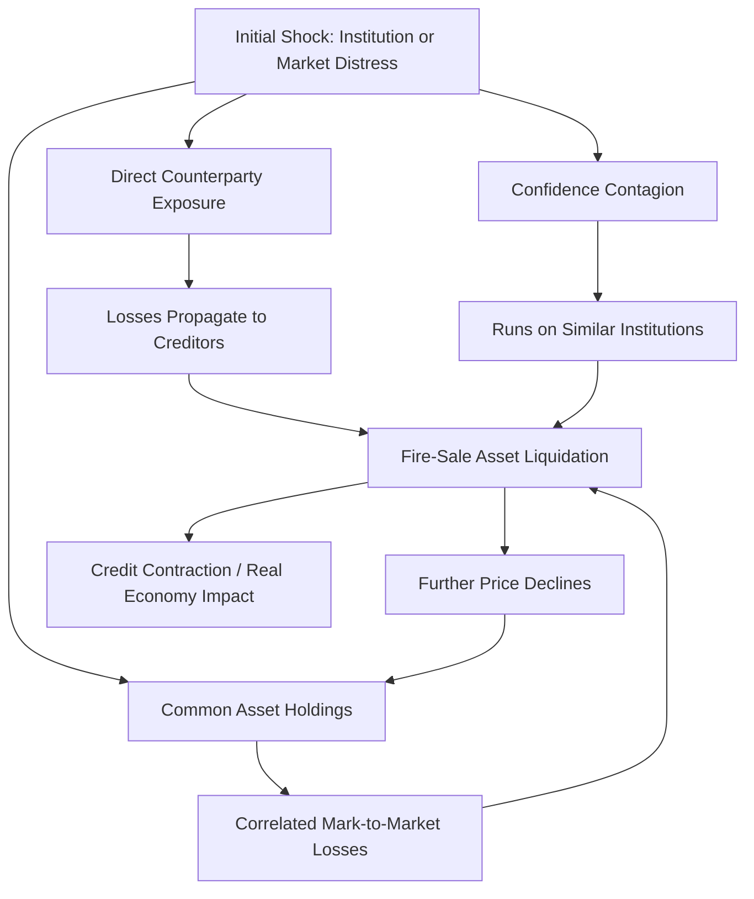

## Financial Regulation and Systemic Risk

### Definition and Rationale for Financial Regulation

Financial regulation encompasses the body of laws, rules, and supervisory practices governing financial institutions and markets, designed to address market failures inherent to finance — principally asymmetric information problems (adverse selection and moral hazard), externalities associated with systemic risk, and the fragility created by maturity transformation.

**Key Points**

- Financial regulation serves dual, sometimes competing objectives: protecting individual consumers/investors (micro-level, institution-specific safety) and safeguarding the stability of the financial system as a whole (macro-level, systemic safety)
- The distinction between **microprudential regulation** (focused on the safety and soundness of individual institutions) and **macroprudential regulation** (focused on risks to the financial system as a whole) has become central to post-2008 regulatory frameworks
- Financial regulation is inherently a response to market failure: absent intervention, private incentives do not fully internalize the systemic costs an individual institution's failure or excessive risk-taking can impose on the broader economy

### Systemic Risk: Definition and Sources

**Systemic risk** is the risk that the failure or distress of one financial institution, or a disruption in one market, triggers a cascading breakdown across the broader financial system, with consequences extending well beyond the initially affected entity.

#### Sources of Systemic Risk

| Source | Mechanism |
| --- | --- |
| Interconnectedness | Direct counterparty exposures (interbank lending, derivatives contracts) transmit distress from one institution to its creditors and counterparties |
| Common exposures | Multiple institutions holding similar assets suffer correlated losses simultaneously when those assets' values decline |
| Fire-sale externalities | Forced asset sales by a distressed institution depress market prices, inflicting mark-to-market losses on other holders of similar assets |
| Procyclicality | Risk-taking, leverage, and asset prices tend to rise together during booms and fall together during busts, amplifying cyclical swings |
| Contagion via confidence/information | Doubt about one institution's solvency can trigger runs on similar institutions, even absent direct financial linkages, due to information asymmetry about which institutions are actually at risk |
| Too-big-to-fail institutions | Very large or interconnected institutions may take excessive risk anticipating government rescue, knowing their failure would be systemically damaging |

**Key Points**

- Systemic risk is fundamentally a **negative externality**: an individual institution's risk-taking decisions do not fully account for the costs imposed on the broader system if that risk-taking contributes to a systemic crisis
- This externality provides the core economic rationale for regulation that goes beyond simply protecting each institution's own depositors/creditors — a purely microprudential approach can be individually rational for each institution while still leaving the system as a whole excessively fragile (the "fallacy of composition" in financial stability)

### The Too-Big-to-Fail Problem

An institution is considered "too big to fail" (TBTF) when policymakers believe its disorderly failure would impose unacceptable systemic costs, creating an implicit expectation of government support in a crisis.

**Key Points**

- TBTF status generates a **moral hazard** distortion: institutions perceived as TBTF can borrow more cheaply (reflecting an implicit government guarantee priced into their funding costs) and have reduced incentive to manage risk prudently, since expected losses in a crisis are partially socialized
- This dynamic incentivizes institutions to grow larger and more interconnected specifically to secure TBTF status — a phenomenon sometimes described as an incentive toward excessive size and complexity
- Post-2008 reforms explicitly targeted TBTF through enhanced capital/liquidity requirements for systemically important institutions and resolution frameworks intended to allow orderly failure without a full bailout ("living wills"/resolution plans)

### Diagram: Systemic Risk Transmission Channels

### Core Regulatory Tools

#### Capital Requirements

Capital requirements mandate that financial institutions fund a minimum proportion of their assets with equity (loss-absorbing capital) rather than debt, providing a buffer against losses before creditors/depositors/taxpayers are exposed.

The **Basel framework** (developed by the Basel Committee on Banking Supervision) establishes internationally coordinated capital standards:

$$\text{Capital Ratio} = \frac{\text{Regulatory Capital}}{\text{Risk-Weighted Assets}} \geq \text{Minimum Threshold}$$

- **Basel III** (developed following the 2007–2009 crisis) raised minimum common equity capital requirements, introduced capital conservation and countercyclical capital buffers, and added a non-risk-based leverage ratio requirement as a backstop to risk-weighted measures [Unverified: precise current numerical thresholds vary by jurisdiction and implementation phase; consult current Basel Committee/national regulator publications for exact figures]
- **Countercyclical capital buffers**: An explicitly macroprudential tool, allowing regulators to require additional capital buffers during credit booms (when systemic risk is building) that can be released during downturns to support continued lending

#### Liquidity Requirements

Introduced comprehensively for the first time at the international level under Basel III, in direct response to the funding liquidity failures observed during the 2007–2009 crisis:

- **Liquidity Coverage Ratio (LCR)**: Requires banks to hold sufficient high-quality liquid assets to survive a 30-day acute stress scenario
- **Net Stable Funding Ratio (NSFR)**: Requires banks to maintain a stable funding profile relative to the liquidity of their assets over a one-year horizon, discouraging excessive reliance on short-term wholesale funding to fund illiquid long-term assets

#### Deposit Insurance

Government-backed guarantees on deposits up to a specified limit, designed to prevent self-fulfilling bank runs by removing depositors' incentive to withdraw funds preemptively out of fear that other depositors will do so first.

**Key Points**

- Deposit insurance directly addresses a coordination-failure form of systemic risk (bank runs) but introduces its own moral hazard: insured depositors have reduced incentive to monitor bank risk-taking, potentially encouraging excessive risk-taking by banks absent other constraints
- This trade-off is a canonical illustration of the tension in financial regulation: tools that solve one market failure (panic-driven runs) can exacerbate another (moral hazard), requiring complementary regulation (capital requirements, supervision) to offset the induced risk-taking incentive

#### Supervision and Examination

Ongoing, direct oversight of individual institutions' risk management, asset quality, and compliance, typically including:

- On-site examinations and off-site monitoring
- Stress testing: simulating institutions' resilience under adverse macroeconomic scenarios (e.g., the US Federal Reserve's Comprehensive Capital Analysis and Review, CCAR/DFAST programs)
- Prompt corrective action frameworks: graduated supervisory responses triggered automatically as an institution's capital position deteriorates

#### Resolution Frameworks

Mechanisms enabling authorities to wind down or restructure a failing financial institution in an orderly manner without triggering broader systemic disruption or requiring a full taxpayer-funded bailout:

- **Living wills/resolution plans**: Requirements for large institutions to develop and submit credible plans for their own orderly resolution in the event of failure
- **Bail-in mechanisms**: Provisions allowing certain classes of creditors/bondholders to absorb losses (via conversion to equity or write-down) in resolution, reducing reliance on public funds
- **Special resolution regimes**: Legal frameworks (e.g., Orderly Liquidation Authority under US Dodd-Frank legislation) providing resolution authorities powers beyond standard bankruptcy proceedings, tailored to the speed and complexity needs of financial institution failures

### Macroprudential vs. Microprudential Regulation

| Dimension | Microprudential | Macroprudential |
| --- | --- | --- |
| Objective | Safety and soundness of individual institutions | Stability of the financial system as a whole |
| Risk perspective | Risk taken as given from outside (partial equilibrium) | Risk endogenous to collective behavior (general equilibrium) |
| Example tools | Institution-specific capital requirements, supervision | Countercyclical capital buffers, systemic institution surcharges, loan-to-value limits |
| Underlying assumption | Individual institution soundness sums to system soundness | System risk can exceed the sum of individual institution risks due to interconnectedness and correlated behavior |

**Key Points**

- The 2007–2009 crisis is widely interpreted as revealing the inadequacy of a purely microprudential regulatory approach: individual institutions could appear well-capitalized and compliant on a standalone basis while collectively generating substantial systemic fragility
- This recognition drove the post-crisis creation of dedicated macroprudential oversight bodies, such as the Financial Stability Oversight Council (FSOC) in the United States and the European Systemic Risk Board (ESRB) in the European Union

### Systemically Important Financial Institutions (SIFIs)

Regulators designate certain institutions as **Systemically Important Financial Institutions** (or, globally, **Global Systemically Important Banks**, G-SIBs) based on criteria including size, interconnectedness, complexity, cross-jurisdictional activity, and substitutability of the services provided.

**Key Points**

- G-SIB designation triggers enhanced regulatory requirements: additional capital surcharges above standard Basel minimums, more stringent liquidity requirements, and mandatory resolution planning
- The designation framework aims to internalize the systemic externality directly: institutions whose failure would impose the greatest systemic costs bear correspondingly higher regulatory costs in normal times
- Designation criteria and thresholds are periodically reviewed and updated by the Basel Committee and national regulators [Unverified: current specific G-SIB list composition and surcharge levels change periodically; consult current Financial Stability Board publications for up-to-date designations]

### International Coordination

Given the cross-border nature of modern finance, systemic risk regulation involves substantial international coordination:

- **Basel Committee on Banking Supervision**: Sets internationally coordinated bank capital and liquidity standards (Basel I, II, III frameworks)
- **Financial Stability Board (FSB)**: Coordinates international regulatory policy development, monitors global financial stability risks (including shadow banking/non-bank financial intermediation), and designates globally systemically important institutions
- **International Monetary Fund (IMF)**: Conducts Financial Sector Assessment Programs evaluating national financial system stability and regulatory frameworks

**Key Points**

- International coordination aims to prevent regulatory arbitrage, wherein financial activity migrates to jurisdictions with laxer regulatory standards, and to ensure consistent treatment of cross-border institutions during resolution
- Coordination is voluntary and implemented through national legislation; enforcement mechanisms are limited to peer pressure, reputational considerations, and mutual market access arrangements rather than supranational legal authority [Inference: the practical effectiveness of international coordination in preventing regulatory arbitrage is contested and varies by jurisdiction and time period]

### Regulatory Trade-offs and Ongoing Debates

- **Regulation vs. financial innovation and credit availability**: Tighter capital and liquidity requirements enhance stability but may raise the cost of credit intermediation, potentially reducing credit availability, particularly for smaller borrowers — a persistent policy trade-off
- **Regulatory arbitrage and activity migration**: Stricter bank regulation can push credit intermediation activity toward less-regulated non-bank entities (shadow banking/non-bank financial intermediation), potentially shifting rather than eliminating systemic risk
- **Complexity and compliance costs**: Highly detailed regulatory frameworks (e.g., extensive Basel risk-weighting methodologies) impose substantial compliance costs and may create incentives for regulatory gaming (structuring transactions to minimize measured risk-weighted assets rather than genuinely reducing risk)
- **Calibration uncertainty**: Setting the "right" level of capital/liquidity requirements involves balancing crisis-prevention benefits against ongoing economic costs, with no consensus formula, and estimates of optimal capital levels vary substantially across academic and policy studies [Unverified: no single authoritative consensus figure for "optimal" bank capital levels exists in the economics literature; estimates vary by methodology and assumptions]

### Next Steps

- Basel III capital and liquidity framework in detail
- Bank runs, deposit insurance, and the FDIC's role in the United States
- The 2007–2009 financial crisis: causes, propagation, and policy response
- Shadow banking and non-bank financial intermediation risks
- Stress testing methodologies (CCAR, DFAST, and international equivalents)
- Resolution regimes and bail-in mechanisms
- Central bank as lender of last resort
- Macroprudential policy tools: countercyclical buffers, loan-to-value and debt-to-income limits