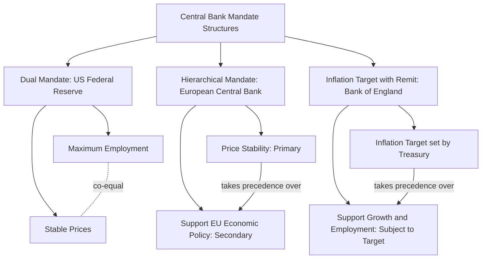

## Goals and Mandates of Central Banks

### Overview

Central banks are entrusted with statutory or constitutional mandates that define the objectives their monetary policy actions are meant to achieve. These mandates vary across jurisdictions but generally cluster around a common set of macroeconomic goals, balanced against institutional structures designed to grant central banks sufficient independence to pursue them credibly.

**Key Points**

- Mandates are typically established by legislation (e.g., a central bank's founding statute or subsequent amendments) rather than left to the discretion of the central bank itself
- Most modern central bank mandates reflect an evolution away from narrow historical objectives (such as maintaining a fixed exchange rate under the gold standard) toward explicit macroeconomic stabilization goals
- The specific combination and relative priority of goals differs meaningfully across major central banks, with important consequences for policy strategy and communication

### The Six Traditional Goals of Monetary Policy

Macroeconomics texts commonly identify six goals that monetary policy has historically been tasked with pursuing, though not all are given equal or explicit statutory weight by every central bank:

| Goal | Description |
| --- | --- |
| Price stability | Low and stable inflation, avoiding both high inflation and deflation |
| High employment | Minimizing cyclical unemployment, ideally near the natural rate of unemployment |
| Economic growth | Supporting sustainable long-run growth in output and living standards |
| Interest rate stability | Avoiding excessive volatility in interest rates, which can disrupt planning and investment decisions |
| Financial market and institution stability | Preventing financial crises and maintaining the smooth functioning of credit intermediation |
| Foreign exchange market stability | Avoiding excessive volatility in the exchange rate, particularly relevant for economies with significant trade exposure or foreign-currency-denominated debt |

**Key Points**

- Price stability has come to be regarded by most central banks and economists as the primary, foundational goal, based on the view that sustained low inflation is a precondition for achieving the other goals over the long run
- Several goals are largely complementary in the long run (price stability tends to support sustainable growth and financial stability) but can conflict sharply in the short run (e.g., raising interest rates to control inflation may raise unemployment and slow growth temporarily)
- Not every central bank statute explicitly enumerates all six goals; many focus statutory language narrowly on price stability while treating the others as either secondary/implicit objectives or matters left to the central bank's operational discretion

### Price Stability as the Primary Goal

#### Rationale

The now-widespread consensus prioritizing price stability rests on several arguments:

- **Inflation distorts price signals**: Under inflation, it becomes harder for economic agents to distinguish relative price changes (reflecting genuine shifts in supply/demand for specific goods) from general price level increases, impairing efficient resource allocation
- **Inflation redistributes wealth arbitrarily**: Unanticipated inflation transfers wealth from creditors to debtors (in fixed nominal-rate contracts) and erodes the real value of fixed nominal incomes, imposing costs unrelated to any productive economic activity
- **Inflation uncertainty raises risk premiums**: Volatile or unpredictable inflation raises the risk premium demanded on long-term nominal contracts, potentially reducing long-term investment and financial market depth
- **Deflation risks**: Sustained deflation raises the real burden of debt, can trigger deflationary spirals (falling prices reducing spending, further depressing prices), and constrains conventional monetary policy by pushing real interest rates up even as nominal rates approach the zero lower bound

**Key Points**

- Most central banks with explicit inflation targets (see below) target a low positive inflation rate (commonly around 2%, though country-specific) rather than exactly zero inflation, reflecting a deliberate buffer against deflation risk and measurement biases in price indices
- The consensus around price stability as primary strengthened substantially following the high-inflation experiences of the 1970s in many advanced economies, which demonstrated the costs of allowing inflation to become entrenched and the difficulty of subsequently reducing it (disinflation) without significant output/employment costs

### Central Bank Mandate Structures: Comparative Overview

#### The US Federal Reserve: The Dual Mandate

The Federal Reserve operates under a statutory **dual mandate**, established in the Federal Reserve Act as amended, directing the Federal Open Market Committee to pursue:

1. Maximum employment
2. Stable prices
3. (A third goal, moderate long-term interest rates, is also named in the statute but is generally treated as a natural consequence of achieving the first two rather than an independent operational target)

**Key Points**

- The dual mandate explicitly gives employment co-equal statutory standing alongside price stability, distinguishing the Fed's mandate structure from single-mandate central banks
- In practice, the Federal Reserve has articulated numerical or qualitative interpretations of both goals — a 2% longer-run inflation objective (as measured by the personal consumption expenditures price index) and an assessment of maximum employment based on a broad range of labor market indicators rather than a single fixed numerical unemployment target [Unverified: specific current framework language and any numerical thresholds are subject to periodic Federal Reserve strategic framework reviews; consult current Federal Reserve publications for the precise current formulation]

#### European Central Bank: Hierarchical Mandate

The European Central Bank operates under a statutory mandate, established in the Treaty on the Functioning of the European Union, giving explicit **primacy to price stability**, with support for broader European Union economic policy objectives (including growth and employment) designated as a secondary objective, pursued only "without prejudice to" the primary price stability objective.

**Key Points**

- This hierarchical structure differs meaningfully from the Federal Reserve's co-equal dual mandate: price stability is not merely prioritized in practice but is legally paramount, with other objectives explicitly subordinate
- The ECB has articulated its price stability objective as a symmetric 2% inflation target over the medium term, following its most recent strategy review [Unverified: exact current strategic framework details should be confirmed against current ECB publications, as strategy reviews are conducted periodically]

#### Bank of England: Inflation Targeting with Remit

The Bank of England operates under an inflation target set by HM Treasury (currently 2%, as measured by the Consumer Price Index), which the Bank's Monetary Policy Committee is mandated to pursue, subject to a secondary objective of supporting the government's broader economic policy, including growth and employment objectives, without prejudice to the primary inflation target [Unverified: verify exact current target and remit details against current Bank of England and HM Treasury publications, as remit letters are reissued periodically].

#### Other Common Mandate Structures

- **Single mandate (pure inflation targeting)**: Central banks whose statutes specify price stability as essentially the sole explicit objective, with other outcomes treated as consequences rather than independent targets (various inflation-targeting central banks globally adopt variations of this structure)
- **Multiple explicit objectives**: Some central bank statutes explicitly list several co-equal goals beyond just inflation and employment, including financial stability or exchange rate considerations, particularly common among emerging market central banks with significant external sector exposure

### Diagram: Central Bank Mandate Structures Compared

### Central Bank Independence

#### Rationale

Central bank independence — insulation of monetary policy decision-making from short-term political pressure — is widely regarded as institutionally important for credibly achieving price stability mandates, based on the **time-inconsistency problem**:

- Policymakers may face a short-run temptation to pursue expansionary monetary policy (e.g., ahead of elections, or to reduce the real value of government debt) even when doing so is inconsistent with long-run price stability
- If the public anticipates this temptation, inflation expectations rise even without actual expansionary policy, embedding an **inflationary bias** into the economy without any corresponding gain in output or employment
- Delegating monetary policy to an institution insulated from short-term political pressure, with a credible commitment to price stability, can reduce this inflationary bias by removing (or reducing) the political temptation ex ante

**Key Points**

- This theoretical foundation, associated significantly with the work of Kydland and Prescott and later Barro and Gordon on time inconsistency, provided key intellectual support for the global trend toward greater central bank independence beginning in the 1980s and 1990s
- Empirical cross-country studies have generally found a negative association between central bank independence and average inflation rates, though the precise causal mechanisms and the direction of causality have been debated in the academic literature [Inference: the strength and universality of this empirical relationship across all country samples and time periods remains a subject of ongoing econometric debate]

#### Dimensions of Independence

| Dimension | Description |
| --- | --- |
| Goal independence | Central bank sets its own policy objectives, rather than having them dictated by elected government (rare in practice; most central banks have goals set or approved by legislature/government) |
| Instrument independence | Central bank has full discretion over which policy tools to use and how to use them to achieve a given, externally set goal (the more common form of independence among major central banks) |
| Personnel independence | Central bank leadership serves fixed terms, often longer than typical electoral cycles, with protections against arbitrary removal |
| Budgetary independence | Central bank's operational budget is not subject to routine legislative appropriation, reducing direct leverage political bodies might otherwise hold |

**Key Points**

- Most major central banks (Federal Reserve, ECB, Bank of England) possess substantial instrument independence — discretion over how to achieve statutorily or politically set goals — rather than full goal independence
- Independence is typically accompanied by **accountability mechanisms** (mandatory reporting to legislatures, testimony requirements, published minutes/meeting records, and periodic mandate reviews) intended to preserve democratic legitimacy despite insulation from direct political control over individual policy decisions

### The Time Inconsistency Problem: Formal Intuition

$$\text{Policymaker's temptation: } \pi^e \text{ low} \Rightarrow \text{surprise expansion} \Rightarrow \text{temporary output gain}$$

$$\text{Rational expectations: } \pi^e \text{ adjusts upward to anticipate the temptation} \Rightarrow \text{higher average inflation, no lasting output gain}$$

**Example**

If the public believes a central bank will always resist the temptation to inflate away debt or boost employment temporarily, inflation expectations remain anchored near the target. If instead the public believes political pressure will periodically induce surprise monetary expansions, expected inflation rises persistently above target, embedding higher average inflation into wage and price-setting behavior even without any actual persistent employment gain — this is the theoretical cost of a lack of credible commitment.

### Goal Conflicts and Trade-offs

- **Price stability vs. employment (short run)**: Contractionary policy to control inflation can raise unemployment temporarily, reflecting the short-run Phillips curve trade-off; this tension underlies debates over the appropriate pace of monetary tightening or easing
- **Price stability vs. financial stability**: Very low interest rate environments aimed at supporting employment/inflation objectives can encourage excessive risk-taking and asset price inflation, creating financial stability risks that may only become apparent with a lag
- **Domestic goals vs. exchange rate stability**: For open economies, pursuing domestic price stability or employment objectives can generate exchange rate volatility, which may itself have adverse effects on trade-exposed sectors or foreign-currency debt burdens — formalized in the "impossible trinity" (a country cannot simultaneously maintain free capital mobility, a fixed exchange rate, and independent monetary policy)

### Financial Stability as an Emerging Explicit Mandate

Following the 2007–2009 financial crisis, many central banks have seen their mandates or operational responsibilities expanded or clarified to include explicit financial stability objectives, often exercised through **macroprudential policy tools** distinct from traditional interest-rate-based monetary policy:

- The Federal Reserve gained expanded supervisory and macroprudential responsibilities under the Dodd-Frank Act and participates in the Financial Stability Oversight Council
- The Bank of England's Financial Policy Committee was established with an explicit financial stability remit, operating alongside the Monetary Policy Committee
- The European Central Bank assumed direct banking supervisory responsibilities for significant institutions under the Single Supervisory Mechanism

**Key Points**

- This institutional evolution reflects the post-crisis recognition that price stability alone does not guarantee financial stability — a period of low, stable inflation (the "Great Moderation" preceding 2007) coexisted with substantial financial system fragility
- The relationship between monetary policy (interest rate setting) and financial stability objectives (often pursued via separate macroprudential tools) remains an active area of policy design, since using interest rates to address financial stability concerns can conflict with the primary price stability/employment mandate [Inference: the optimal division of labor between interest-rate policy and macroprudential tools for managing financial stability is not settled in the academic or policy literature]

### Next Steps

- Time inconsistency and the case for central bank independence (Kydland-Prescott, Barro-Gordon frameworks)
- Inflation targeting frameworks and their implementation
- The Phillips curve and short-run inflation-unemployment trade-offs
- Macroprudential policy tools and their relationship to monetary policy
- Federal Reserve institutional structure: FOMC, regional banks, and governance
- The impossible trinity and open-economy monetary policy constraints
- Central bank communication and forward guidance
- Comparative central banking: mandate structures across major economies