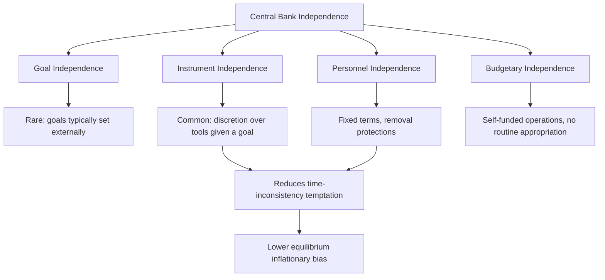

## Central Bank Independence

### Definition and Conceptual Foundation

Central bank independence refers to the degree of institutional insulation a central bank has from direct political control in the formulation and execution of monetary policy. It is not a binary condition but a matter of degree, spanning multiple distinct dimensions of autonomy from the executive and legislative branches of government.

**Key Points**

- Independence is a design feature of institutional architecture, established through legislation (a central bank's founding statute or subsequent amendments) rather than an inherent or automatic feature of any monetary authority
- The concept must be distinguished from accountability: independent central banks are typically still required to report to and be scrutinized by elected bodies, even while retaining discretion over specific policy decisions
- Independence is generally considered a means to an end (credible price stability) rather than an end in itself

### The Time Inconsistency Problem

The core theoretical justification for central bank independence rests on the **time inconsistency problem**, formalized in the work of Kydland and Prescott (1977) and extended by Barro and Gordon (1983).

#### The Mechanism

A discretionary policymaker faces a temptation, at any given moment, to pursue a monetary expansion beyond what is consistent with long-run price stability, because a surprise expansion can generate a short-run boost to output and employment (exploiting a short-run Phillips curve trade-off) before inflation expectations adjust.

$$\pi = \pi^e + \gamma(u^n - u) + \varepsilon$$

Where $\pi$ is actual inflation, $\pi^e$ is expected inflation, $u^n$ is the natural rate of unemployment, $u$ is actual unemployment, and $\gamma$ is a sensitivity parameter. A policymaker tempted to push $u$ below $u^n$ via surprise inflation faces the problem that rational agents anticipate this temptation.

**Key Points**

- If the public believes the policymaker will systematically attempt to exploit this trade-off, expected inflation $\pi^e$ rises to reflect that anticipated behavior, even in the absence of any actual attempt to surprise the public in a given period
- The result is an **inflationary bias**: average inflation settles at a level higher than optimal, without any corresponding permanent gain in output or employment, since rational expectations eliminate the systematic real effects of anticipated policy
- This is termed "time inconsistency" because the policy that is optimal to announce in advance (low inflation) differs from what may appear optimal to implement once expectations are already formed (a surprise expansion), undermining the credibility of any announced commitment made under full discretion

**Example**

A government facing a large stock of fixed-nominal-rate debt has an ex-post incentive to generate surprise inflation to reduce the real value of that debt. If bondholders anticipate this incentive when the debt is issued, they demand a higher nominal interest rate upfront to compensate for expected inflation, raising borrowing costs without the government ever needing to act on the temptation. Credible commitment to low inflation, if believable, avoids this cost entirely.

### Delegation as a Solution: The Rogoff "Conservative" Central Banker

Kenneth Rogoff's (1985) analysis proposed that delegating monetary policy to a central banker who places relatively more weight on price stability (relative to output stabilization) than society's true underlying preferences reduces the equilibrium inflationary bias, because such a central banker has a diminished temptation to exploit the short-run Phillips curve trade-off in the first place.

**Key Points**

- This delegation solution formalizes the case for appointing a central bank leadership demonstrably committed to price stability, structurally insulated from the day-to-day political incentives that generate the inflationary bias
- A trade-off exists in this framework: a central banker who is "too conservative" (places excessive weight on price stability relative to output) reduces inflationary bias but may respond suboptimally to genuine supply shocks that warrant some accommodation, illustrating that independence is not costless in all circumstances [Inference: the practical calibration of "optimal conservatism" is a theoretical construct not directly observable or measurable in real-world central bank appointments]

### Dimensions of Central Bank Independence

| Dimension | Description | Typical Prevalence |
| --- | --- | --- |
| Goal independence | Central bank sets its own policy objectives without external dictation | Rare; most central banks have goals set or approved by legislature |
| Instrument independence | Central bank has full discretion over which tools to use and how to achieve externally set goals | Common among major central banks (Fed, ECB, Bank of England) |
| Personnel independence | Leadership serves fixed, often long terms, with protection against arbitrary removal | Common, though term lengths and removal protections vary |
| Budgetary/financial independence | Central bank's operating budget is not subject to routine legislative appropriation | Varies; many major central banks are self-funded from operations |
| Legal independence | Explicit statutory or constitutional provisions protecting independence from being altered by ordinary legislative majority | Varies substantially across jurisdictions |

**Key Points**

- The distinction between goal independence and instrument independence is analytically important: most prominent independent central banks operate with a politically or legislatively determined objective (e.g., a specific inflation target or dual mandate) but retain full discretion over the timing, magnitude, and choice of policy instruments used to pursue it
- Personnel independence is typically operationalized via staggered, fixed terms for board/committee members that exceed a single electoral cycle, reducing any single government's ability to reshape the institution's leadership entirely during one term in office

### Diagram: Central Bank Independence Dimensions

### Institutional Examples

#### US Federal Reserve

The Federal Reserve possesses substantial instrument independence: the Federal Open Market Committee sets the federal funds rate target and other policy tools without requiring approval from Congress or the President for individual decisions. Federal Reserve Board governors serve staggered 14-year terms, and the Fed funds its own operations from earnings on its securities portfolio rather than through congressional appropriation.

**Key Points**

- Congress retains ultimate statutory authority over the Federal Reserve's mandate (it could, in principle, legislatively amend or abolish the Federal Reserve Act) and requires regular reporting, including semiannual monetary policy testimony to Congress
- The President appoints (with Senate confirmation) the Chair and other Board governors, providing a channel of political influence over personnel, albeit constrained by staggered terms limiting how quickly any single administration can reshape the Board

#### European Central Bank

The ECB is often cited as possessing an unusually high degree of legal independence, since its independence and price-stability-primacy mandate are enshrined in the Treaty on the Functioning of the European Union — an international treaty requiring unanimous agreement among member states to amend, making it substantially more insulated from unilateral national political pressure than a central bank whose independence rests on ordinary domestic legislation.

**Key Points**

- ECB Executive Board members serve single, non-renewable eight-year terms, a structure specifically designed to eliminate any incentive to pursue policies aimed at securing reappointment
- National central bank governors within the Eurosystem (who also sit on the ECB Governing Council) are similarly protected from removal for policy disagreements under EU treaty provisions

#### Bank of England

The Bank of England was granted operational independence over interest rate policy in 1997, a landmark reform separating interest rate decision-making (delegated to the Monetary Policy Committee) from the inflation target itself (which remains set by HM Treasury, reflecting instrument independence without full goal independence).

### Empirical Evidence on Independence and Inflation

A substantial body of empirical cross-country research, particularly influential studies from the late 1980s and 1990s (e.g., work by Alesina, Grilli, Masciandaro, Tabellini, and Cukierman), constructed indices of central bank independence and generally found a negative correlation between measured independence and average inflation rates across advanced economies.

**Key Points**

- These findings provided influential empirical support for the global wave of central bank independence reforms undertaken from the late 1980s through the 2000s (including the Bank of England's 1997 reform and the ECB's founding design in the 1990s)
- The relationship has been found to be less robust, or differently characterized, in some studies of developing and emerging economies, where formal legal independence indices may not correspond closely to actual operational independence in practice (a gap sometimes termed the difference between "de jure" and "de facto" independence) [Inference: the precise causal mechanism — whether independence directly causes lower inflation, or whether both independence and low inflation reflect a common underlying societal preference for price stability — remains debated in the literature]
- Correlation-based cross-country evidence cannot fully establish causality, since countries that grant their central banks independence may differ systematically in other ways (institutional quality, historical inflation experience, political culture) that also influence inflation outcomes

### Independence and Accountability: The Necessary Counterpart

Independence from short-term political control is generally paired with robust accountability mechanisms to preserve democratic legitimacy:

- **Reporting requirements**: Regular testimony before legislative committees (e.g., the Federal Reserve Chair's semiannual congressional testimony)
- **Transparency practices**: Publication of meeting minutes, voting records, and economic projections, allowing external scrutiny of the reasoning behind policy decisions
- **Explicit mandates**: Legislatively or politically set objectives (inflation targets, dual mandates) against which the central bank's performance can be externally evaluated
- **Judicial and constitutional constraints**: Legal limits on the scope of central bank authority, ensuring independence does not extend to unchecked or unlimited power

**Key Points**

- This pairing reflects the view that independence over policy *instruments*, combined with externally imposed *goals* and *transparency*, achieves the credibility benefits of insulation from short-term political pressure without sacrificing democratic accountability for outcomes
- Critics of central bank independence have raised concerns about democratic legitimacy — the delegation of significant macroeconomic policy authority to unelected officials — particularly when central banks' expanded post-2008 roles (large-scale asset purchases, financial stability responsibilities) involve decisions with substantial distributional consequences traditionally associated with fiscal rather than monetary policy [Inference: the appropriate boundary between monetary policy independence and decisions with fiscal-like distributional effects remains an actively debated question in political economy]

### Threats to Independence and Contemporary Debates

- **Political pressure during election cycles or economic downturns**: Elected officials may publicly criticize central bank decisions perceived as economically painful (e.g., interest rate increases during a slowdown), testing the practical robustness of formal independence protections
- **Fiscal dominance concerns**: In environments of very high government debt, concerns can arise that a central bank may face implicit pressure to keep interest rates low to ease the government's debt-servicing burden, potentially compromising price stability objectives — a scenario termed "fiscal dominance"
- **Expanded post-crisis mandates**: The extension of central bank responsibilities into financial stability, macroprudential regulation, and (in some cases) quasi-fiscal interventions (large-scale asset purchases including corporate and sub-sovereign debt) has raised questions about whether traditional independence justifications, designed originally around narrow interest-rate-setting, extend cleanly to this broader operational scope [Unverified: the resolution of this institutional design question is still evolving and subject to ongoing academic and policy discussion]

### Next Steps

- Time inconsistency and dynamic policy games (Kydland-Prescott, Barro-Gordon models)
- Inflation targeting as an operational framework for independent central banks
- Rules versus discretion in monetary policy (Taylor rule frameworks)
- Fiscal dominance and the interaction between monetary and fiscal policy
- Central bank transparency and communication strategy
- Comparative institutional design: Federal Reserve, ECB, and Bank of England governance structures
- Quantitative easing and the blurring of monetary-fiscal policy boundaries