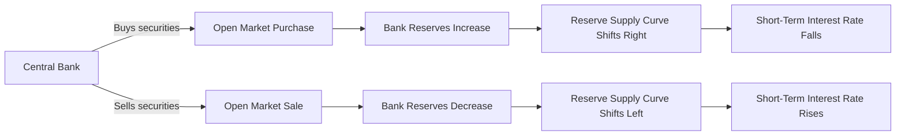
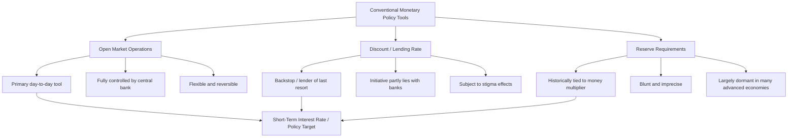

## Conventional Monetary Policy Tools: Open Market Operations, Discount Rate, Reserve Requirements

### Overview

Conventional monetary policy tools are the traditional instruments central banks use to influence the money supply, short-term interest rates, and bank reserve conditions under normal (non-crisis) economic circumstances, prior to the balance-sheet expansion tools (quantitative easing) developed extensively after 2008. The three classical tools are open market operations, the discount (lending) rate, and reserve requirements.

**Key Points**

- These tools operate primarily by affecting the supply of and demand for bank reserves, thereby influencing the short-term interest rate at which banks lend reserves to one another
- Open market operations are, in virtually all modern central banking systems, the dominant and most frequently used tool, while the discount rate and reserve requirements play more specialized or, in many jurisdictions, largely dormant roles
- All three tools ultimately aim to influence the same broad transmission chain: reserve conditions → short-term interest rates → broader financial conditions → aggregate demand → inflation and output

### Open Market Operations

#### Definition and Mechanism

Open market operations (OMOs) are the purchase and sale of government securities (and, in some contexts, other eligible assets) by the central bank in the open market, used to directly adjust the quantity of reserves in the banking system.

- **Open market purchases**: The central bank buys securities, crediting the seller's bank with new reserves, thereby **increasing** the reserve supply and, all else equal, **lowering** the short-term interest rate
- **Open market sales**: The central bank sells securities, debiting the buyer's bank's reserve account, thereby **decreasing** the reserve supply and, all else equal, **raising** the short-term interest rate

$$R^s \uparrow \text{ (OMO purchase)} \Rightarrow i \downarrow \quad \text{(equilibrium in the market for reserves)}$$

#### Types of Open Market Operations

| Type | Description |
| --- | --- |
| Dynamic operations | Intended to produce a permanent change in the level of reserves, typically outright purchases or sales of securities |
| Defensive operations | Intended to offset temporary fluctuations in reserve supply (e.g., due to seasonal factors or fluctuations in the Treasury's account balance), typically conducted via repurchase agreements (repos) and reverse repurchase agreements |

**Key Points**

- Repurchase agreements (repos) function as temporary open market purchases: the central bank buys securities with an agreement to resell them back to the counterparty at a specified future date, temporarily injecting reserves
- Reverse repurchase agreements function as temporary open market sales: the central bank sells securities with an agreement to repurchase them later, temporarily draining reserves
- Most day-to-day central bank operations are defensive in nature, offsetting technical factors that would otherwise move the market interest rate away from the desired policy target, rather than implementing discretionary changes in policy stance

#### Advantages of Open Market Operations

- **Control**: The central bank fully controls the volume of open market operations, unlike the discount rate, where the initiative to borrow lies partly with commercial banks
- **Flexibility and reversibility**: Operations can be conducted in any volume, in either direction, and reversed quickly if a policy error is realized
- **Speed of implementation**: Operations can be executed immediately, without the administrative or communication lags associated with announcing a discount rate or reserve requirement change
- **No announcement effect required for effectiveness**: OMOs can be implemented flexibly without necessarily requiring a major policy announcement, allowing incremental, precise reserve management

**Key Points**

- These operational advantages are the primary reason open market operations, rather than reserve requirement changes or (in most times) discount rate lending, are the primary day-to-day tool used by virtually all major modern central banks to implement policy

### Diagram: Open Market Operations Mechanism

### The Discount Rate (Central Bank Lending Facility Rate)

#### Definition and Mechanism

The discount rate (termed differently across jurisdictions — e.g., the "discount window" rate in the United States, the "marginal lending facility" rate in the Eurozone) is the interest rate the central bank charges commercial banks for direct loans, typically used to meet short-term reserve shortfalls.

**Key Points**

- Central bank lending through this facility functions as a backstop source of liquidity, particularly important during periods of financial stress when interbank lending markets may become impaired due to counterparty risk concerns
- Historically, in the US context, the discount rate was actively used as a signaling tool for the general stance of monetary policy; in the modern operating framework, the discount rate (specifically the "primary credit" rate) is typically set at a spread **above** the central bank's target policy rate, making it a backstop rather than a primary funding source under normal conditions [Unverified: exact current spread and facility structure should be verified against current Federal Reserve or relevant central bank publications, as these have been revised over time]

#### The Federal Reserve's Discount Window Structure

| Credit Type | Description |
| --- | --- |
| Primary credit | Available to financially sound depository institutions, at a rate typically set above the target federal funds rate, with minimal restrictions on use of funds |
| Secondary credit | Available to institutions not eligible for primary credit, at a higher rate, subject to greater scrutiny |
| Seasonal credit | Available to smaller institutions with pronounced seasonal swings in deposits/loans (e.g., agricultural or tourism-dependent banks) |

**Key Points**

- Because primary credit is priced above the target policy rate, banks under normal circumstances prefer to borrow reserves from each other in the interbank market at the (lower) prevailing market rate, using the discount window only when interbank markets are unable or unwilling to supply sufficient funds
- Stigma effects are a long-recognized practical limitation: banks may avoid borrowing from the discount window even when it would be economically advantageous, out of concern that doing so signals financial weakness to counterparties or regulators, potentially undermining its intended function as a routine liquidity backstop during stress episodes [Inference: the precise magnitude of stigma-driven underutilization in any specific episode is difficult to measure directly and is inferred from indirect evidence such as low utilization during periods of apparent market stress]

#### The Lender of Last Resort Function

The discount/lending facility is the primary mechanism through which central banks fulfill their historical **lender of last resort** role — providing emergency liquidity to solvent but illiquid institutions during periods of financial panic, a function tracing back to classical analyses (notably Bagehot's dictum: lend freely, against good collateral, at a penalty rate, to solvent institutions).

**Key Points**

- This function is distinguished conceptually from routine monetary policy implementation: it is aimed at preventing individual institution illiquidity from triggering systemic panic, rather than adjusting the aggregate reserve supply to achieve a broad policy stance
- During acute financial crises (e.g., 2007–2009, March 2020), central banks have significantly expanded emergency lending facilities beyond the traditional discount window, extending liquidity support to a broader range of institutions and, in some cases, non-bank entities, reflecting the evolving structure of modern credit intermediation (see: shadow banking)

### Reserve Requirements

#### Definition and Mechanism

Reserve requirements mandate that depository institutions hold a specified fraction of certain deposit liabilities as reserves — either as vault cash or as deposits at the central bank — rather than lending them out.

$$\text{Required Reserves} = r \times D$$

Where $r$ is the required reserve ratio and $D$ is the relevant deposit base subject to the requirement.

**Key Points**

- Reserve requirements historically played a central role in the classic (though simplified) **money multiplier** model of money supply determination, in which a lower required reserve ratio, holding the monetary base constant, permits a larger expansion of the deposit money supply through repeated bank lending and redeposit
- In practice, reserve requirement changes were historically considered a relatively blunt policy tool: even small changes in the required ratio can have large, difficult-to-calibrate effects on the money supply, given the multiplier mechanism's sensitivity, making this tool less precise than open market operations for fine-tuning policy

#### Decline in Active Use of Reserve Requirements

Many major central banks have substantially reduced or eliminated the active use of reserve requirements as a monetary policy tool in recent decades:

- The Federal Reserve reduced reserve requirement ratios to zero for all depository institutions in March 2020, effectively eliminating reserve requirements as an active US monetary policy tool [Unverified: verify current status against current Federal Reserve regulatory publications, as this could in principle be revised]
- This shift reflects, in part, the transition to an **ample reserves operating framework**, in which the central bank pays interest on reserve balances and controls short-term rates primarily through administered rates (e.g., interest on reserve balances, overnight reverse repo rates) rather than through scarcity-based reserve management requiring precise reserve requirement calibration
- Some central banks (particularly in emerging market economies) continue to use reserve requirements more actively, sometimes for macroprudential purposes (e.g., adjusting requirements on foreign-currency-denominated deposits to manage capital flow volatility) rather than purely as a conventional monetary policy instrument [Unverified: specific country practices vary and change over time; consult current central bank publications for jurisdiction-specific details]

#### Disadvantages of Reserve Requirements as a Policy Tool

- **Imprecision**: Small percentage-point changes can produce disproportionately large swings in deposit creation capacity via the money multiplier, making fine adjustment difficult
- **Disruption to bank operations**: Frequent changes complicate bank liquidity management and planning
- **Competitive distortion**: If applied unevenly across institution types (e.g., banks vs. non-bank competitors not subject to the requirement), reserve requirements can create competitive disadvantages, encouraging financial activity to migrate to less-regulated entities (see: shadow banking)

### Diagram: Conventional Monetary Policy Tools Compared

### The Ample Reserves Operating Framework

Since the 2007–2009 financial crisis and the associated large-scale asset purchase programs, most major central banks (notably the Federal Reserve) have transitioned from a framework in which reserves were kept relatively scarce (requiring active, frequent open market operations to hit a target rate) to an **ample reserves framework**, in which reserve balances in the banking system are kept plentiful, and the policy rate is instead controlled primarily through administered interest rates:

- **Interest on Reserve Balances (IORB)**: The rate the central bank pays banks on reserves held at the central bank, setting a floor-like anchor for short-term market rates, since banks have little incentive to lend reserves in the market below what they can earn risk-free at the central bank
- **Overnight Reverse Repurchase Agreement (ON RRP) facility**: Allows a broader set of counterparties (including non-bank money market participants) to invest with the central bank overnight, reinforcing the interest rate floor across a wider set of market participants

**Key Points**

- Under this framework, traditional fine-tuning open market operations to manage reserve scarcity became less central to daily policy implementation, since abundant reserves largely eliminate scarcity-driven volatility in short-term rates, though open market operations remain available and are used for balance sheet management (e.g., quantitative tightening, reinvestment operations)
- This represents an important structural evolution from the pre-2008 "scarce reserves" framework, in which the discount rate, reserve requirements, and frequent, precisely calibrated open market operations played comparatively larger roles in day-to-day rate control [Unverified: precise current operational details of the ample reserves framework are subject to ongoing refinement; consult current Federal Reserve technical publications for the current implementation framework]

### Summary Comparison of Conventional Tools

| Tool | Primary Use Today | Control by Central Bank | Typical Frequency of Change |
| --- | --- | --- | --- |
| Open market operations | Primary rate implementation and balance sheet management | Full | Continuous/daily |
| Discount/lending rate | Backstop liquidity, lender of last resort | Full, but usage initiative lies with banks | Infrequent, tied to policy rate changes |
| Reserve requirements | Largely dormant in advanced economies; some macroprudential use in emerging markets | Full | Rare |

### Next Steps

- Ample reserves operating framework and administered rate tools (IORB, ON RRP)
- Quantitative easing and large-scale asset purchase programs
- The federal funds market and interbank lending rate determination
- Lender of last resort function and Bagehot's dictum in historical and modern practice
- Money multiplier model and its limitations as a description of deposit creation
- Central bank balance sheet management and quantitative tightening
- Macroprudential use of reserve requirements in emerging market economies