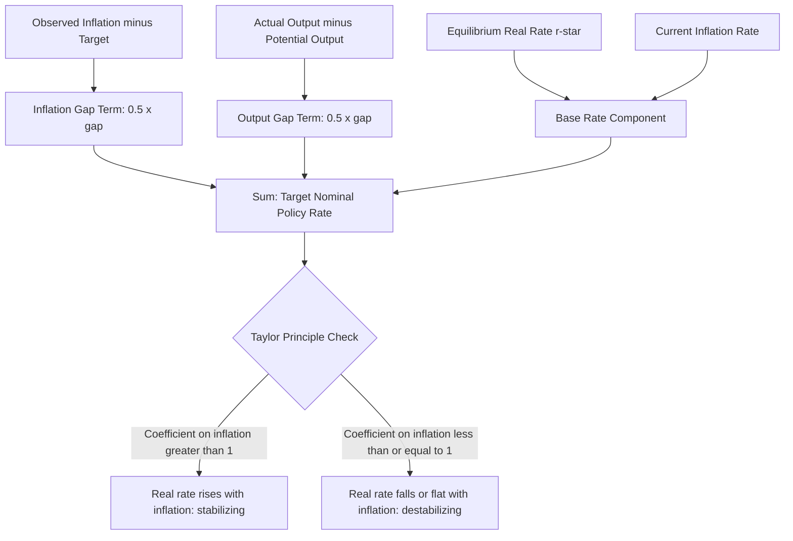

## Taylor Rule and Monetary Policy Reaction Functions

### Definition and Purpose

A monetary policy reaction function is a systematic rule describing how a central bank's policy instrument (typically a short-term interest rate) responds to observable macroeconomic conditions, most commonly inflation and some measure of real economic activity. The **Taylor rule**, proposed by John Taylor (1993), is the most widely referenced specific reaction function in both academic analysis and practical policy discussion.

**Key Points**

- Reaction functions serve both a descriptive purpose (characterizing how central banks have actually behaved historically) and a normative/prescriptive purpose (suggesting how policy rates should be set to achieve stated objectives)
- The Taylor rule was originally proposed as a positive description that approximated actual Federal Reserve behavior reasonably well during the period Taylor studied, and subsequently gained influence as a normative benchmark against which actual policy could be evaluated
- Reaction functions formalize the "rules versus discretion" debate in monetary policy by providing a concrete, quantifiable rule-based alternative to purely discretionary policy setting

### The Taylor Rule: Formal Specification

The original Taylor rule specifies the target nominal federal funds rate as:

$$i_t = \pi_t + r^* + 0.5(\pi_t - \pi^*) + 0.5(y_t - y^*)$$

Where:

- $i_t$ = target nominal policy interest rate
- $\pi_t$ = current inflation rate (typically over the preceding four quarters)
- $\pi^*$ = target inflation rate
- $r^*$ = the equilibrium (neutral) real interest rate
- $y_t - y^*$ = the output gap, i.e., the percentage deviation of actual real GDP from potential (full-employment) real GDP

This is often rewritten to emphasize the rule's underlying logic:

$$i_t = r^* + \pi_t + 0.5(\pi_t - \pi^*) + 0.5(\text{output gap})$$

**Key Points**

- Taylor's original specification set both response coefficients (on the inflation gap and the output gap) at 0.5, and assumed $r^* = 2\%$ and $\pi^* = 2\%$, based on rough approximations to historical US data available at the time [Unverified: these specific numerical parameters were Taylor's original illustrative calibration; subsequent research and different central bank contexts have used varying parameter estimates]
- The rule implies the policy rate should rise when inflation exceeds its target and/or when output exceeds potential (a positive output gap, i.e., the economy is "overheating"), and should fall in the opposite circumstances

**Example**

Suppose $r^* = 2\%$, $\pi^* = 2\%$, current inflation $\pi_t = 4\%$, and the output gap is $+2\%$ (output 2% above potential). The Taylor rule prescribes:

$$i_t = 2\% + 4\% + 0.5(4\% - 2\%) + 0.5(2\%) = 2\% + 4\% + 1\% + 1\% = 8\%$$

### The Taylor Principle

A critical structural feature of the Taylor rule is that the coefficient on the inflation gap term is **greater than zero** when applied to the *real* interest rate response, ensuring that a rise in inflation leads to a **more than one-for-one** increase in the *nominal* interest rate — this is known as the **Taylor principle**.

$$\frac{\partial i_t}{\partial \pi_t} = 1 + 0.5 = 1.5 > 1$$

**Key Points**

- Satisfying the Taylor principle ensures that the *real* interest rate rises when inflation rises, since $r = i - \pi$; if the nominal rate rose only one-for-one with inflation (a coefficient of exactly 1), the real rate would remain unchanged, providing no additional restraining force on aggregate demand as inflation increases
- Violating the Taylor principle (responding to inflation less than one-for-one in nominal terms) can generate self-reinforcing inflation dynamics, since a rising real money supply or falling real interest rate in response to higher inflation would tend to stimulate further demand and inflation, rather than restraining it
- This principle is widely used retrospectively to critique 1970s US monetary policy, where many economists and Taylor himself have argued the Federal Reserve's response coefficient to inflation was insufficiently large, allowing the real federal funds rate to fall as inflation rose and contributing to the sustained high-inflation environment of that decade [Inference: precise historical estimation of the Federal Reserve's actual reaction function coefficients during the 1970s varies across different econometric studies and specification choices]

### Diagram: Taylor Rule Logic

### Interpreting the Rule's Components

| Component | Economic Interpretation |
| --- | --- |
| $r^*$ (neutral real rate) | The real interest rate consistent with output at potential and stable inflation in the long run; not directly observable, must be estimated |
| $\pi_t$ | Backward-looking measure of current inflation; specification varies (headline vs. core, different price indices) across empirical implementations |
| $\pi_t - \pi^*$ (inflation gap) | Signals whether current policy needs to be more or less restrictive to return inflation to target |
| $y_t - y^*$ (output gap) | Signals the current degree of slack or overheating in the economy, relevant both as an independent stabilization objective and as a leading indicator of future inflationary pressure via the Phillips curve relationship |

**Key Points**

- The output gap term reflects the notion that monetary policy should respond not only to current inflation but also proactively to signs of future inflationary pressure (or disinflationary slack) building in the real economy — a forward-looking rationale layered onto an otherwise largely backward/contemporaneous-looking rule
- Both $r^*$ and potential output $y^*$ are unobservable, model-dependent constructs that must be estimated using statistical filtering techniques or structural models, introducing substantial real-time measurement uncertainty into any practical application of the rule [Unverified: estimates of $r^*$ specifically have varied considerably across time and methodology in the academic literature, particularly following the 2008 crisis]

### Variants and Extensions of the Taylor Rule

#### Forward-Looking (Expectations-Based) Variants

Some reaction function specifications replace current, backward-looking inflation with expected future inflation, reflecting the view that monetary policy operates with a lag and should respond to anticipated rather than only realized conditions:

$$i_t = r^* + \pi^e_{t+k} + 0.5(\pi^e_{t+k} - \pi^*) + 0.5(y_t - y^*)$$

#### Interest Rate Smoothing (Partial Adjustment) Specifications

Empirical estimates of actual central bank behavior typically find that observed policy rates adjust only gradually toward the level the simple Taylor rule would prescribe, rather than jumping immediately to the prescribed level each period — modeled as:

$$i_t = \rho \, i_{t-1} + (1-\rho)\, i_t^{Taylor}$$

Where $\rho$ (the smoothing parameter, typically estimated between 0 and 1) captures the observed tendency of central banks to adjust policy rates gradually rather than abruptly.

**Key Points**

- Interest rate smoothing behavior is commonly attributed to central banks' desire to avoid unsettling financial markets with abrupt rate changes, preserve credibility by avoiding policy reversals, and account for genuine uncertainty about the true state of the economy that argues for cautious, incremental adjustment
- Empirically estimated smoothing parameters have varied across different studies and time periods, and the appropriate degree of smoothing remains a subject of ongoing research and debate [Unverified: no single universally accepted estimate of the "correct" smoothing parameter exists in the literature]

### The Taylor Rule as a Positive Description Versus a Normative Prescription

**Key Points**

- As a *positive* (descriptive) tool, the Taylor rule and its variants have been used extensively by researchers to characterize historical central bank behavior, assess consistency of policy across different chairs/governors and periods, and identify episodes where actual policy diverged notably from what the rule would prescribe
- As a *normative* (prescriptive) tool, some economists (including Taylor himself in various policy commentary) have advocated using rule-based approaches, potentially including some form of the Taylor rule, as a systematic anchor for policy decisions, arguing this would enhance predictability, transparency, and time-consistency
- Central banks, including the Federal Reserve, have generally resisted fully mechanical rule-based commitment, instead treating Taylor-rule-type calculations as one of several reference benchmarks informing, but not mechanically determining, discretionary policy decisions — sometimes termed "constrained discretion" [Unverified: the specific degree to which any given central bank formally incorporates Taylor-rule calculations into its decision process is an internal procedural matter that varies and is not always fully disclosed]

### Rules Versus Discretion: The Broader Debate

| Approach | Advantages | Disadvantages |
| --- | --- | --- |
| Strict rule-based policy | Time-consistency, transparency, predictability, reduced political pressure vulnerability | Inflexibility in responding to unusual or unforeseen shocks not captured by the rule's variables |
| Pure discretion | Flexibility to respond to any circumstance, including novel or unmodeled shocks | Subject to time-inconsistency problem and potential inflationary bias; less predictable for market participants |
| Constrained discretion | Retains flexibility while anchoring expectations via a stated framework, target, or reference rule | Requires credible communication to be effective; ambiguity about how much weight is given to the "constraint" versus discretion |

**Key Points**

- This tension mirrors the broader time-inconsistency literature (Kydland-Prescott, Barro-Gordon) underlying the case for central bank independence: rules can help commit a central bank credibly to a systematic response, reducing the temptation toward short-run exploitation of policy surprises, while discretion allows response to genuinely unanticipated circumstances a fixed rule could not have accounted for in advance
- Most major central banks today describe their actual practice as a form of "constrained discretion" or "flexible inflation targeting" — using rule-like benchmarks (including, often, an explicit numerical inflation target and various reaction function estimates) as reference points while retaining the ability to deviate based on judgment in unusual circumstances

### Practical Limitations of the Taylor Rule in Application

- **Real-time data uncertainty**: Both current inflation and the output gap are subject to significant data revisions after initial release, meaning the rule's prescription calculated in real time can differ substantially from what a retrospective calculation using final revised data would suggest
- **Uncertainty about $r^*$**: Estimates of the neutral real interest rate have varied significantly over time, particularly following the 2008 financial crisis and subsequent period of persistently low interest rates across many advanced economies, with substantial academic debate over whether $r^*$ has structurally declined and why [Unverified: the causes and permanence of any such decline remain actively debated in the macroeconomics literature]
- **Zero lower bound constraint**: When the rule's prescription implies a negative nominal interest rate (e.g., during severe downturns with large negative output gaps and low inflation), conventional interest rate policy cannot implement the prescribed rate, requiring unconventional tools (quantitative easing, forward guidance, negative rate policy in some jurisdictions) to approximate the intended degree of accommodation
- **Choice of variable definitions**: Different specifications for inflation (headline vs. core, different price indices) and for potential output/the output gap (different estimation methodologies) can produce meaningfully different rule prescriptions from the same underlying economic conditions, limiting the rule's practical precision as a single definitive benchmark

### Next Steps

- Time inconsistency and the case for central bank independence
- The Phillips curve and its role in output-gap-based reaction functions
- The zero lower bound and unconventional monetary policy tools
- Estimating the natural/neutral real interest rate ($r^*$)
- Flexible inflation targeting and constrained discretion frameworks
- Real-time data revisions and their implications for policy rule application
- Alternative reaction function specifications (e.g., nominal GDP targeting rules)