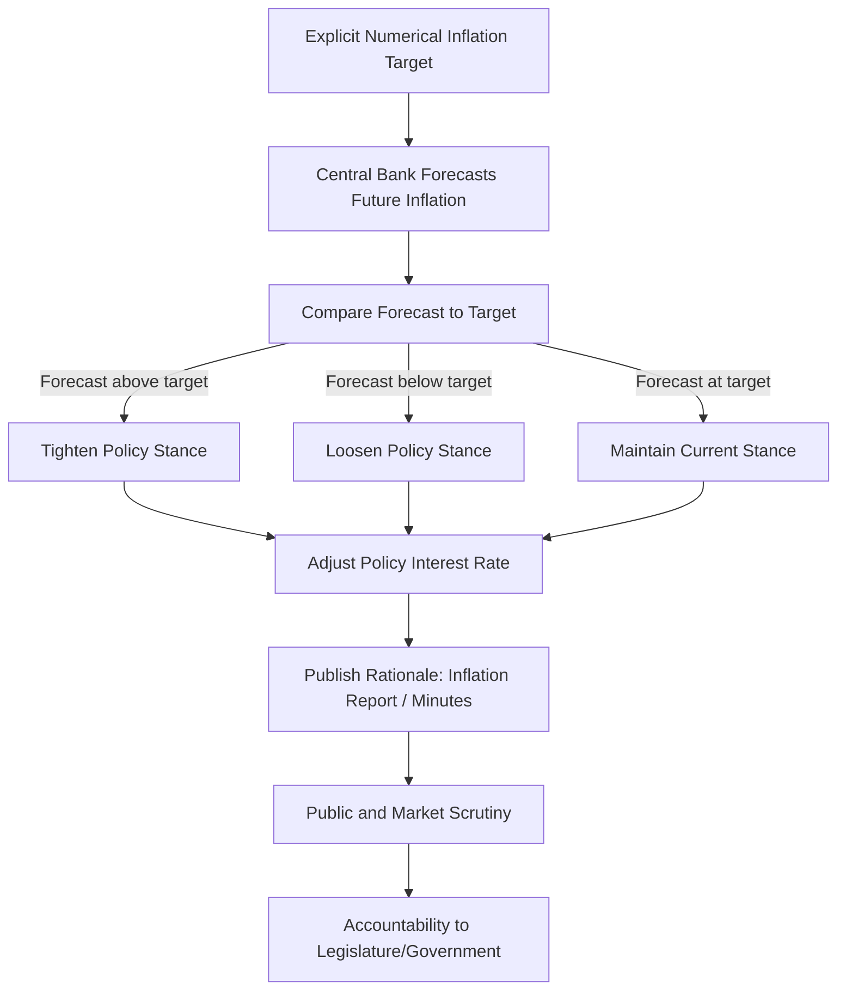

## Inflation Targeting Frameworks

### Definition and Core Elements

Inflation targeting is a monetary policy framework in which a central bank publicly announces a numerical target (or target range) for inflation over a specified horizon and conducts policy with that target as its primary, publicly stated nominal anchor, while committing to transparency and accountability mechanisms tied to achieving it.

**Key Points**

- Inflation targeting is a *framework* for organizing and communicating monetary policy decisions, not a mechanical rule specifying exact instrument settings (unlike the Taylor rule, which is a specific reaction function sometimes used as a reference tool within an inflation targeting framework)
- The framework emerged as a practical response to the perceived failures of both monetary targeting (undermined by unstable velocity/money demand) and exchange rate targeting (vulnerable to speculative attacks and loss of independent monetary policy), particularly following high-inflation experiences and monetary instability in the late 1980s and early 1990s
- New Zealand's Reserve Bank was the first central bank to formally adopt inflation targeting, in 1990, followed shortly thereafter by Canada, the United Kingdom, Sweden, and a growing number of both advanced and emerging market economies through the 1990s and 2000s

### Core Elements of an Inflation Targeting Framework

| Element | Description |
| --- | --- |
| Explicit numerical target | A publicly announced target inflation rate or range (commonly around 2% for many advanced economies, though rates vary by country and economic circumstances) |
| Institutional commitment to price stability as primary goal | Price stability is elevated as the predominant, though not always sole, objective of monetary policy |
| Increased transparency | Regular publication of inflation forecasts, policy rationale, and often explicit central bank communication about the reasoning behind decisions |
| Accountability mechanisms | Formal reporting requirements to government/legislature, and in some frameworks, explicit consequences or public explanation requirements if the target is missed by a significant margin |
| Forward-looking orientation | Policy decisions guided by inflation forecasts over a specified horizon (commonly one to two years ahead) rather than solely current or past inflation, reflecting the lags in monetary policy transmission |

**Key Points**

- The forward-looking nature of inflation targeting is a critical operational feature: since monetary policy affects inflation with a substantial lag (commonly estimated at numerous quarters), effective inflation targeting requires the central bank to act on inflation forecasts rather than waiting for inflation to visibly deviate from target before responding
- Transparency requirements typically include regular publication of an inflation report or monetary policy report detailing the central bank's economic outlook, risks to that outlook, and the reasoning underlying recent policy decisions

### Diagram: Inflation Targeting Framework Structure

### Rationale for Adopting Inflation Targeting

#### Addressing the Time Inconsistency Problem

A publicly announced, numerical inflation target provides a clear, externally verifiable commitment device, helping to anchor inflation expectations and reduce the inflationary bias associated with discretionary policy under time inconsistency (see: central bank independence, Kydland-Prescott framework). If the public and financial markets believe the central bank will act to keep inflation near the announced target, inflation expectations become anchored near that target, which itself helps realize low and stable actual inflation through the expectations channel of price and wage setting.

#### Providing a Clear Nominal Anchor After the Failure of Alternatives

- **Monetary targeting** faced the practical problem of unstable velocity/money demand, undermining the reliable link between money growth and inflation outcomes (see: velocity of money instability, particularly the post-1980s US M1 experience)
- **Exchange rate targeting** (pegging the domestic currency to a foreign anchor currency) constrains independent domestic monetary policy (per the "impossible trinity") and exposes the pegging country to imported monetary conditions from the anchor country, as well as heightened vulnerability to speculative currency attacks if the peg's credibility is questioned
- Inflation targeting offered a framework anchored directly to the central bank's actual ultimate objective (price stability) rather than an intermediate target (money supply or exchange rate) whose relationship to that ultimate objective could break down

#### Enhancing Transparency and Accountability

By requiring a public numerical target and regular published communication, inflation targeting was intended to make monetary policy more comprehensible and evaluable by the public, financial markets, and elected officials, strengthening democratic accountability for an independent central bank's performance.

### Flexible Inflation Targeting

Most modern inflation targeting central banks practice **flexible inflation targeting**, distinguished from a hypothetical "strict" inflation targeting approach that would focus exclusively on hitting the inflation target with no regard for output or employment volatility.

**Key Points**

- Flexible inflation targeting explicitly incorporates concern for output and employment stability alongside the inflation objective, typically by allowing the horizon over which the target is expected to be achieved to lengthen following large supply shocks, rather than demanding immediate correction regardless of the output cost
- This approach recognizes that supply shocks (e.g., oil price shocks) can push inflation away from target in ways that would require severe and costly demand contraction to fully offset in the short run; flexible frameworks generally accept a more gradual return to target in such circumstances
- The distinction between strict and flexible inflation targeting is largely a matter of degree and emphasis in practice, since virtually all actual central bank inflation targeting frameworks incorporate some consideration of real economic stabilization, whether through an explicit dual mandate (as with the US Federal Reserve) or through flexibility embedded in the targeting horizon itself

### Target Design Choices

#### Point Target Versus Target Range

| Design | Description | Example Approach |
| --- | --- | --- |
| Point target | A single numerical target (e.g., exactly 2%) | Common among many contemporary inflation targeters |
| Target range | A band around a central value (e.g., 1%–3%) | Used by some central banks to signal acceptable variation without implying overly precise fine-tuning |
| Point target with tolerance band | A central point target combined with an explicit band for acceptable deviation | A hybrid approach adopted by various central banks |

#### Headline Versus Core Inflation

- **Headline inflation**: Measures the full basket of goods and services, including volatile components such as food and energy prices
- **Core inflation**: Excludes food and energy (or other volatile components), intended to better reflect underlying, persistent inflation trends less subject to transient supply shocks

**Key Points**

- Central banks often reference core inflation measures for policy analysis and forecasting purposes (since it filters out transient volatility that monetary policy cannot meaningfully address, given policy transmission lags), even while the formal, publicly communicated target is typically specified in terms of headline inflation, which is what households and businesses directly experience
- The choice of price index itself (e.g., Consumer Price Index versus a personal consumption expenditures price index, as used by the Federal Reserve) can produce measurably different inflation readings, reflecting differences in basket composition, weighting methodology, and substitution effects, making this specification choice practically significant

### Case Studies: Comparative Inflation Targeting Frameworks

| Central Bank | Target | Notable Features |
| --- | --- | --- |
| Reserve Bank of New Zealand | Explicit target range | First central bank to formally adopt inflation targeting (1990); pioneering framework subsequently emulated globally |
| Bank of Canada | 2% point target within a 1%–3% control range | Long-standing framework subject to periodic joint review with the Canadian government |
| Bank of England | 2% target (CPI-based) | Set by HM Treasury; Governor must write an open public letter explaining any deviation beyond 1 percentage point in either direction |
| European Central Bank | 2% symmetric target over the medium term | Operates under a hierarchical mandate giving price stability legal primacy over other objectives |
| US Federal Reserve | 2% longer-run objective (PCE-based) | Operates under a dual mandate giving inflation and employment co-equal statutory standing, rather than a single-objective inflation targeting regime in the strictest sense |

**Key Points**

- The Federal Reserve is sometimes described as practicing a variant of flexible inflation targeting given its explicit numerical 2% longer-run inflation objective, though its formal dual mandate structure technically distinguishes it from central banks whose statutes designate inflation targeting as the singular or clearly primary explicit framework
- Accountability mechanisms vary meaningfully across frameworks: the Bank of England's public open-letter requirement represents an unusually explicit, formalized accountability trigger compared to the more general reporting and testimony obligations common among other major central banks [Unverified: exact current accountability mechanism details and thresholds should be verified against current central bank/government publications, as these provisions can be revised]

### Adoption in Emerging Market Economies

Inflation targeting has been adopted by a substantial number of emerging market and developing economies since the late 1990s and 2000s (including, at various points, Brazil, Chile, South Africa, and others), often as part of a broader shift away from fixed or managed exchange rate regimes following currency crises.

**Key Points**

- Emerging market inflation targeters have generally needed to give somewhat greater weight to exchange rate developments than advanced economy inflation targeters, given greater exposure to foreign-currency-denominated debt, larger trade sector shares of GDP, and more volatile capital flows — sometimes described as "inflation targeting lite" or requiring more explicit exchange rate consideration within the broader framework [Unverified: the precise degree of exchange rate weighting varies substantially by country and period and is not standardized across emerging market inflation targeters]
- Credibility-building has often taken longer to establish in emerging market contexts with histories of high or volatile inflation, requiring sustained multi-year track records of actually achieving announced targets before inflation expectations became durably anchored

### Strengths and Criticisms of Inflation Targeting

#### Strengths

- Provides a clear, easily monitored nominal anchor that the public and markets can use to form inflation expectations
- Enhances policy transparency and accountability relative to purely discretionary approaches
- Has been associated, in numerous empirical studies, with improved inflation performance (lower average inflation and reduced inflation volatility) among adopting countries, particularly emerging markets transitioning away from historically higher-inflation regimes [Inference: isolating the causal contribution of the inflation targeting framework itself, as opposed to concurrent structural reforms or a broader global disinflationary trend during the adoption period, is methodologically challenging and debated in the empirical literature]

#### Criticisms

- **Insufficient attention to financial stability**: Critics have argued that a framework focused predominantly on consumer price inflation can overlook the buildup of financial imbalances (asset price bubbles, excessive credit growth) that do not necessarily manifest in elevated consumer price inflation before a crisis — a criticism given particular prominence following the 2007–2009 financial crisis, which occurred during a period of generally low and stable inflation in many advanced economies (the "Great Moderation")
- **Rigid focus on a single indicator**: Some critics argue that excessive focus on a single numerical inflation target can lead to insufficient responsiveness to other relevant macroeconomic developments, though flexible inflation targeting frameworks are explicitly designed to mitigate this concern
- **Difficulty at the zero lower bound**: When policy rates approach the zero lower bound, conventional inflation targeting's primary instrument (the short-term interest rate) becomes constrained, requiring supplementary unconventional tools (quantitative easing, forward guidance) to pursue the inflation target further, complicating both implementation and communication

### Post-Crisis Evolution: Broadening the Framework

Following the 2007–2009 financial crisis, several inflation-targeting central banks incorporated explicit financial stability considerations into their broader institutional frameworks (often through separate macroprudential policy committees or tools, rather than by fundamentally redefining the inflation target itself):

- Establishment of dedicated financial stability/macroprudential bodies (e.g., the Bank of England's Financial Policy Committee) operating alongside, but organizationally distinct from, the monetary policy committee responsible for the inflation target
- Periodic strategic framework reviews by major central banks (including the Federal Reserve's 2020 framework review and the European Central Bank's subsequent strategy reviews) reassessing how inflation targets should be pursued, including discussion of asymmetric responses around the zero lower bound and average inflation targeting concepts [Unverified: specific outcomes and current status of these framework reviews should be verified against current central bank publications, as reviews are conducted periodically and their conclusions can be revised or superseded]

### Next Steps

- Time inconsistency and central bank independence as foundations for credible targeting
- The Taylor rule as a reference benchmark within inflation targeting frameworks
- Velocity of money instability and the historical shift away from monetary targeting
- The impossible trinity and exchange rate targeting alternatives
- Zero lower bound constraints and unconventional monetary policy tools
- Macroprudential policy and its relationship to inflation-targeting central banks
- Average inflation targeting and asymmetric policy response frameworks
- Comparative case studies: emerging market inflation targeting adoption and credibility-building