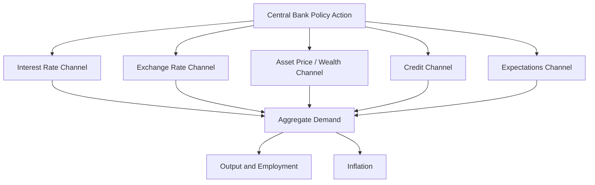
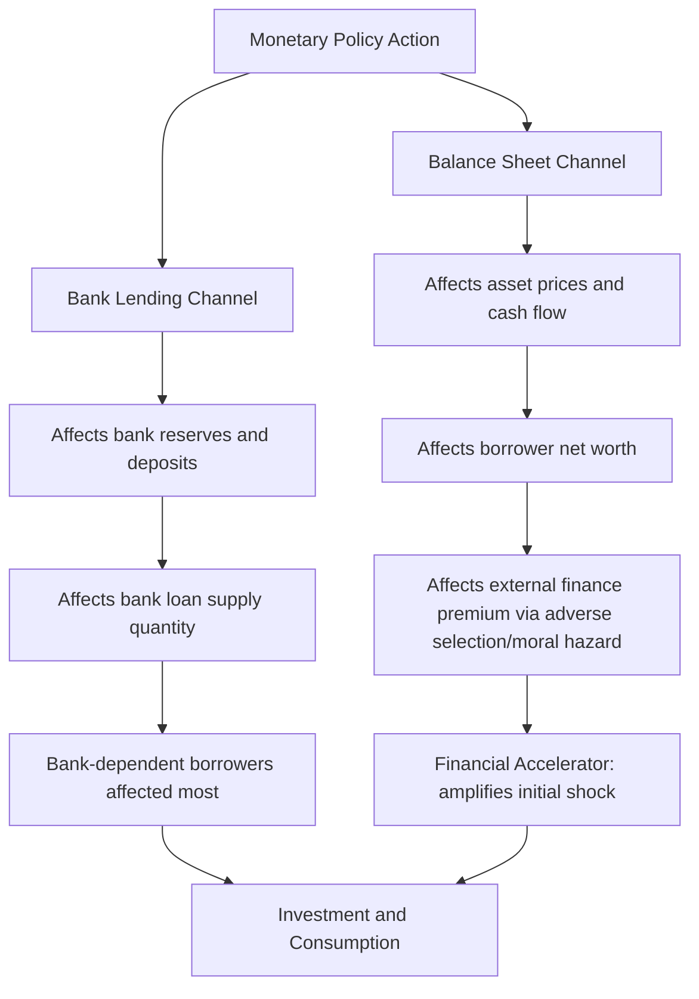

## Monetary Policy Transmission Mechanisms

### Definition and Overview

Monetary policy transmission mechanisms describe the various channels through which a central bank's policy actions (typically changes in short-term interest rates or the size/composition of its balance sheet) propagate through the financial system to ultimately affect real economic variables — aggregate demand, output, employment, and inflation. Understanding these channels is essential for interpreting how, why, and with what lags monetary policy actions affect the broader economy.

**Key Points**

- Transmission occurs through multiple, often simultaneously operating channels, and the relative strength of each channel can vary across countries, time periods, and financial system structures
- Monetary policy is widely understood to operate with "long and variable lags" (a phrase associated with Milton Friedman), meaning transmission from a policy action to its full effect on output and inflation is neither instantaneous nor precisely predictable in timing or magnitude
- No single channel fully explains observed transmission in all circumstances; most macroeconomic analysis treats the channels as complementary rather than mutually exclusive

### Diagram: Overview of Monetary Policy Transmission Channels

### The Traditional Interest Rate Channel

#### Mechanism

The traditional (Keynesian IS-LM-style) interest rate channel is the most textbook-standard transmission mechanism: a change in the central bank's short-term policy rate affects other market interest rates (via arbitrage across the term structure and risk structure of interest rates), which in turn affects the cost of borrowing for consumption and investment decisions.

$$i \downarrow \Rightarrow r \downarrow \Rightarrow I \uparrow, C \uparrow \Rightarrow AD \uparrow \Rightarrow Y \uparrow$$

Where a policy rate cut ($i \downarrow$) lowers real borrowing costs ($r \downarrow$), stimulating investment ($I$) and interest-sensitive consumption ($C$, particularly durable goods and housing), raising aggregate demand ($AD$) and output ($Y$).

**Key Points**

- This channel operates through the **real** interest rate, not merely the nominal rate, since investment and durable consumption decisions depend on the real cost of borrowing relative to expected returns; this reintroduces the importance of inflation expectations in transmission (see: Fisher equation, $r \approx i - \pi^e$)
- The channel's effectiveness depends on the interest sensitivity of investment and consumption demand, which can vary across sectors, over the business cycle, and across countries with different financial structures
- Long-term rates (relevant for mortgages and business investment financing) respond to short-term policy rate changes indirectly, through the expectations and term-premium components of the term structure, meaning the pass-through from a policy rate change to the rates that most directly affect spending decisions is neither immediate nor mechanically one-to-one

### The Exchange Rate Channel

#### Mechanism

For open economies, changes in domestic interest rates relative to foreign interest rates affect capital flows and, consequently, the exchange rate, which in turn affects net exports (the trade balance component of aggregate demand).

$$i \downarrow \text{(relative to foreign rates)} \Rightarrow \text{capital outflow} \Rightarrow E \downarrow \text{(currency depreciates)} \Rightarrow NX \uparrow \Rightarrow AD \uparrow$$

A domestic interest rate decrease, relative to foreign rates, reduces the relative attractiveness of domestic-currency-denominated assets, prompting capital outflows that depreciate the domestic currency ($E \downarrow$), making domestic goods relatively cheaper abroad and foreign goods relatively more expensive domestically, boosting net exports ($NX$).

**Key Points**

- This channel is generally considered more significant for smaller, more open economies with a larger trade sector relative to GDP than for large, relatively closed economies (such as the United States), where domestic demand effects tend to dominate the exchange rate channel in aggregate significance [Inference: the precise relative importance of the exchange rate channel versus other channels for any specific economy is an empirical question subject to ongoing research and can shift with structural changes in trade openness]
- The exchange rate channel interacts directly with the "impossible trinity": countries maintaining fixed or managed exchange rates sacrifice independent use of this channel, or indeed independent monetary policy generally, in favor of exchange rate stability

### The Asset Price and Wealth Channel

#### Mechanism (Tobin's q Channel)

Lower interest rates raise the present value of expected future corporate earnings, tending to raise equity prices. Higher equity valuations relative to the replacement cost of physical capital (Tobin's q) increase firms' incentive to issue new equity and invest in new physical capital, since new investment can be financed favorably relative to its cost.

$$i \downarrow \Rightarrow \text{equity prices} \uparrow \Rightarrow q \uparrow \Rightarrow I \uparrow$$

Where $q = \frac{\text{market value of firms}}{\text{replacement cost of capital}}$; a high $q$ signals that issuing equity to fund new capital investment is relatively cheap compared to the market valuation obtained, encouraging investment.

#### Mechanism (Wealth Effects Channel)

Lower interest rates raise the value of household financial assets (equities, bonds) and, often, housing wealth, increasing perceived household wealth and, per the life-cycle/permanent-income hypothesis of consumption, increasing current consumption spending.

$$i \downarrow \Rightarrow \text{asset prices} \uparrow \Rightarrow \text{household wealth} \uparrow \Rightarrow C \uparrow \Rightarrow AD \uparrow$$

**Key Points**

- The wealth effect channel's magnitude depends significantly on the distribution of asset ownership across households, since wealth effects concentrate disproportionately among households holding significant financial or housing assets, with more limited direct transmission to households with minimal asset holdings [Inference: the precise marginal propensity to consume out of asset-driven wealth gains, and how it varies across the wealth distribution, is estimated differently across empirical studies]
- Housing wealth effects have received particular attention given housing's broad ownership distribution relative to equities in many economies, and given housing's dual role as both an asset and a source of collateral for borrowing (connecting to the balance sheet channel below)

### The Credit Channel

The credit channel emphasizes that monetary policy affects the economy not only through the price of credit (interest rates) but also through the *quantity* and *availability* of credit, particularly relevant when informational frictions (adverse selection, moral hazard) make credit rationing a meaningful phenomenon (see: financial intermediation and asymmetric information).

#### Bank Lending Channel

Monetary policy actions that affect bank reserves and deposits can directly constrain banks' capacity or willingness to extend loans, particularly affecting borrowers (typically smaller firms and individuals) who are especially dependent on bank credit and lack ready access to alternative funding sources such as public securities markets.

$$\text{Contractionary policy} \Rightarrow \text{bank reserves/deposits} \downarrow \Rightarrow \text{bank loan supply} \downarrow \Rightarrow I \downarrow, C \downarrow$$

**Key Points**

- This channel is distinct from the traditional interest rate channel because it operates through the *quantity* of credit banks are willing/able to supply, not merely through the price (interest rate) of that credit — a bank-dependent borrower may be denied credit entirely, regardless of the interest rate they would be willing to pay, if the bank lacks sufficient loanable funds or perceives elevated risk
- The strength of the bank lending channel has been argued to have diminished somewhat over recent decades in economies where securitization and market-based finance have grown relative to traditional balance-sheet bank lending, since banks facing reserve constraints can, in principle, sell loans or access wholesale funding markets to sustain lending, though this substitutability is imperfect and was notably impaired during periods of financial market stress (e.g., 2007–2009) [Inference: the precise current strength of the bank lending channel relative to historical periods is debated and depends on the specific financial structure of the economy in question]

#### Balance Sheet Channel (Broad Credit Channel)

Monetary policy affects borrowers' net worth and cash flow, which in turn affects the severity of adverse selection and moral hazard problems lenders face when extending credit to them, thereby affecting the terms and availability of external financing (the "external finance premium").

$$i \downarrow \Rightarrow \text{asset prices} \uparrow, \text{ cash flow} \uparrow \Rightarrow \text{borrower net worth} \uparrow \Rightarrow \text{external finance premium} \downarrow \Rightarrow I \uparrow$$

Lower interest rates raise asset values (including collateral value) and improve cash flow, strengthening borrowers' balance sheets. Since stronger net worth reduces the adverse selection and moral hazard problems a lender faces (a borrower with more at stake has less incentive to take excessive risks, and stronger collateral reduces lender losses in default), the premium lenders charge for external finance relative to the risk-free rate falls, further stimulating investment beyond what the direct interest rate effect alone would predict.

**Key Points**

- This mechanism is closely associated with the **financial accelerator** concept (developed extensively by Bernanke, Gertler, and Gilchrist), whereby modest initial changes in interest rates or asset prices can be amplified into larger fluctuations in credit availability and real economic activity through their effect on balance sheet strength and the resulting external finance premium
- The balance sheet channel helps explain why financial crises (in which asset prices and borrower net worth deteriorate sharply) tend to produce credit contractions that amplify, rather than merely accompany, the initial real economic shock — a mechanism prominently invoked in analyses of the 2007–2009 financial crisis

### The Expectations Channel (Signaling and Forward Guidance)

Modern transmission analysis places substantial emphasis on the role of central bank communication in shaping expectations about the *future* path of policy, not merely the current policy rate setting, since spending decisions (particularly long-lived investment and durable consumption) depend on expected future borrowing costs over the relevant planning horizon, not just today's rate.

$$\text{Forward guidance} \Rightarrow \text{expected future policy path} \Rightarrow \text{long-term rates} \Rightarrow \text{current spending decisions}$$

**Key Points**

- This channel becomes especially important, and is used especially deliberately, when the current short-term policy rate is constrained at the zero (or effective) lower bound, since the central bank cannot lower the current rate further but can still influence long-term rates and financial conditions by credibly signaling that rates will remain low for an extended future period
- Effective use of this channel requires central bank communication to be genuinely credible; if markets doubt the central bank's ability or willingness to follow through on forward guidance, the intended transmission effect on current long-term rates and spending decisions is weakened

### Diagram: Credit Channel Sub-Mechanisms

### Lags in Monetary Policy Transmission

**Key Points**

- Transmission lags are commonly decomposed into an **inside lag** (the time between an economic shock occurring and the central bank recognizing it and deciding to act, itself involving recognition and decision/implementation sub-lags) and an **outside lag** (the time between a policy action and its full effect on the real economy, working through the various channels above)
- The outside lag is generally considered the longer and more variable of the two, commonly estimated in empirical studies to extend over multiple quarters to as long as one to two years for the fullest effect on output and inflation, though the precise timing varies across studies, countries, and economic circumstances [Unverified: no single universally agreed-upon lag length exists; estimates depend substantially on model specification and the historical period examined]
- These lags are central to the practical case for forward-looking policy (as in inflation targeting frameworks): because effects manifest with a substantial and variable lag, central banks must act based on forecasts of future economic conditions rather than waiting for current data to fully confirm a diagnosed problem

### Transmission Channel Effectiveness: Variation Across Circumstances

| Factor | Effect on Transmission Strength |
| --- | --- |
| Degree of financial market development | More developed capital markets can strengthen asset price/wealth channels; underdeveloped markets may amplify reliance on the bank lending channel |
| Household/firm balance sheet health | Weaker balance sheets amplify the balance sheet channel (financial accelerator effects are stronger when net worth is already fragile) |
| Degree of trade openness | Greater openness strengthens the relative importance of the exchange rate channel |
| Credibility of central bank communication | Stronger credibility enhances the effectiveness of the expectations/forward guidance channel |
| Proximity to the zero lower bound | Constrains the traditional interest rate channel, increasing relative reliance on expectations, balance sheet (quantitative easing), and possibly exchange rate channels |

### Unconventional Transmission at the Zero Lower Bound

When the policy rate is constrained near zero, central banks have relied on unconventional tools whose transmission operates substantially through the channels described above, but via different instruments:

- **Quantitative easing (large-scale asset purchases)**: Operates partly through a **portfolio balance channel** (reducing the supply of long-term securities available to private investors, compressing term premia and long-term yields) and partly by reinforcing the expectations channel (signaling sustained future accommodation)
- **Forward guidance**: Operates directly and primarily through the expectations channel described above
- **Negative interest rate policy** (adopted by some central banks, notably the European Central Bank and Bank of Japan, though not the US Federal Reserve): Attempts to extend the traditional interest rate channel below the zero bound, though its transmission effectiveness and side effects (e.g., on bank profitability and lending incentives) have been subjects of considerable empirical and policy debate [Unverified: comparative assessments of negative interest rate policy effectiveness vary substantially across studies and the specific country context examined]

### Next Steps

- The zero lower bound and unconventional monetary policy (quantitative easing, forward guidance)
- The financial accelerator model (Bernanke-Gertler-Gilchrist framework)
- Financial intermediation and asymmetric information as the microfoundation of the credit channel
- The impossible trinity and open-economy monetary policy constraints
- Tobin's q theory of investment
- Inflation targeting and the forward-looking orientation of modern monetary policy
- Empirical estimation of monetary policy transmission lags (VAR-based and structural model approaches)