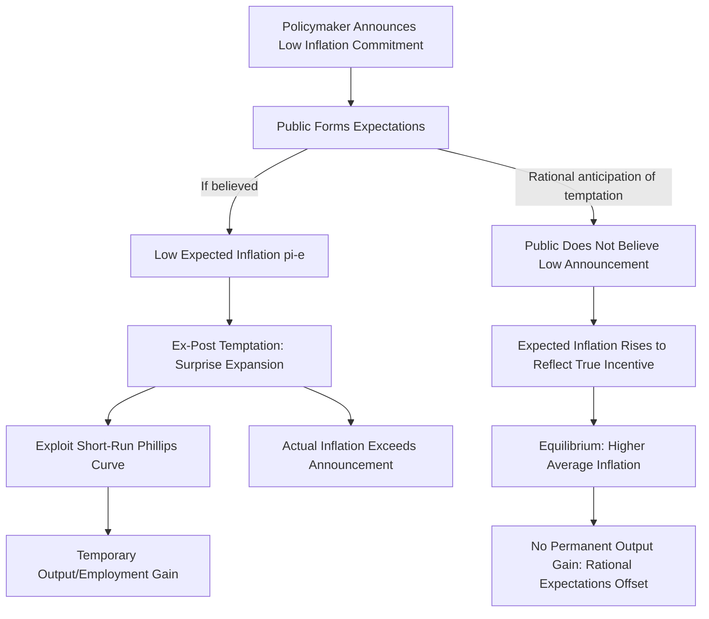

## Time Inconsistency Problem in Monetary Policy

### Definition and Conceptual Foundation

The time inconsistency problem describes a situation in which a policy that is optimal to *announce* in advance ceases to be optimal to actually *implement* once economic agents have made decisions based on that announcement — even though nothing about the policymaker's underlying preferences has changed. In monetary policy, this manifests as a persistent temptation for policymakers to deviate from a previously announced low-inflation commitment once inflation expectations have already been formed, generating a systematic inflationary bias under discretionary policy.

**Key Points**

- The problem was formalized in a general dynamic policy context by Finn Kydland and Edward Prescott (1977) and applied specifically to monetary policy by Robert Barro and David Gordon (1983), work that later contributed to Kydland and Prescott's 2004 Nobel Memorial Prize in Economic Sciences
- Time inconsistency is fundamentally distinct from simple policy unpredictability or error; it describes a structural incentive problem that persists even under a fully rational, well-intentioned policymaker, arising purely from the sequential nature of policy announcement, expectation formation, and policy implementation
- The theoretical framework provided a rigorous foundation for the case for central bank independence and rule-based policy commitment, reshaping central banking institutional design globally from the 1980s onward

### The Core Mechanism

#### Step-by-Step Logic

1. A policymaker announces a commitment to low inflation, intending to anchor inflation expectations at a low level
2. If the announcement is believed, the public sets expected inflation ($\pi^e$) low, and wage/price-setting behavior throughout the economy reflects that low expectation
3. Given low expected inflation already embedded in contracts and prices, the policymaker now faces an *ex-post* incentive to generate a surprise monetary expansion, since unexpected inflation can produce a temporary boost to output and employment (exploiting the short-run Phillips curve trade-off) without immediately being anticipated or offset
4. If the policymaker acts on this temptation, actual inflation exceeds the previously announced/expected level
5. Rational economic agents, anticipating this systematic temptation in advance, do not actually believe the low-inflation announcement in the first place, and instead set inflation expectations at a higher level consistent with the policymaker's true incentives
6. The equilibrium outcome is higher average inflation than intended, with **no corresponding permanent gain** in output or employment, since rational anticipation eliminates the systematic real effects of the (now fully expected) inflationary tendency

**Key Points**

- The critical insight is that the inflationary bias arises purely from the *structure of incentives* facing a discretionary policymaker, not from any policymaker error, malice, or genuine belief that surprise inflation is desirable in isolation
- This differs importantly from a one-time credibility failure: the problem is a persistent, structural feature of discretionary policymaking under rational expectations, re-arising in every period in which the policymaker retains full discretion and faces the same underlying temptation

### Formal Illustration

#### The Expectations-Augmented Phillips Curve

$$\pi = \pi^e + \gamma(u^n - u) + \varepsilon$$

Where $\pi$ is actual inflation, $\pi^e$ is expected inflation, $u^n$ is the natural rate of unemployment, $u$ is actual unemployment, $\gamma > 0$ is a sensitivity parameter, and $\varepsilon$ is a supply shock term.

A policymaker aiming to reduce unemployment below its natural rate ($u < u^n$) requires generating inflation surprises ($\pi > \pi^e$). But since agents form expectations rationally, anticipating this incentive, $\pi^e$ adjusts upward in equilibrium to reflect it.

#### The Barro-Gordon Policymaker Loss Function

The Barro-Gordon framework models the policymaker as minimizing a loss function penalizing both inflation and unemployment deviations from targets:

$$L = \frac{1}{2}\left[(\pi - \pi^*)^2 + \lambda(u - ku^n)^2\right]$$

Where $\pi^*$ is the socially optimal (typically zero or low) inflation rate, $\lambda$ is the relative weight placed on unemployment stabilization, and $k < 1$ reflects a policymaker's desire to push unemployment below its natural rate (often motivated by pre-existing labor market distortions creating an inefficiently high natural rate that the policymaker would like to counteract).

**Key Points**

- The parameter $k < 1$ is analytically important: it is the presence of a policymaker desire to push unemployment *below* the natural rate (rather than merely stabilize it *at* the natural rate) that generates the systematic inflationary bias in this framework; without this ambition, the discretionary and commitment solutions would coincide
- Under discretion, the equilibrium (Nash) solution to this framework yields a positive average inflation rate above $\pi^*$, determined by the parameters $\lambda$, $k$, and $\gamma$ — while under a credible commitment to $\pi = \pi^*$, this bias is eliminated entirely, at the cost of forgoing any temptation-driven attempt to exploit short-run trade-offs

### Diagram: The Time Inconsistency Mechanism

### Rules Versus Discretion

The time inconsistency framework provides the foundational economic argument for the "rules versus discretion" debate in monetary policy:

| Approach | Description | Outcome in the Framework |
| --- | --- | --- |
| Discretion | Policymaker retains full freedom to reoptimize policy each period given current conditions | Systematic inflationary bias; higher average inflation with no permanent output/employment gain |
| Commitment (binding rule) | Policymaker binds itself in advance to a specific, verifiable policy rule and cannot deviate | Inflationary bias eliminated; lower average inflation achieved without any output cost, since the temptation itself is credibly removed |

**Key Points**

- This is a striking theoretical result: moving from discretion to a credible binding commitment is a **Pareto improvement** in the model — average inflation falls with *no* corresponding cost in terms of average output or employment, since the temptation-driven inflation under discretion produced no genuine average benefit in the first place under rational expectations
- The practical challenge is that binding commitment is difficult to achieve credibly in practice: a policymaker's mere announcement of a rule does not, by itself, resolve the time inconsistency problem, since the incentive to renege remains present at each subsequent decision point unless some institutional mechanism makes deviation costly or difficult

### Institutional Solutions to Time Inconsistency

#### Central Bank Independence

Delegating monetary policy to an institution insulated from short-term political pressure reduces the practical temptation to generate surprise inflation for short-term political gain (e.g., ahead of elections, or to reduce the real value of government debt), addressing the *source* of the temptation rather than merely announcing a rule that remains subject to it.

#### The Rogoff "Conservative" Central Banker Solution

Kenneth Rogoff (1985) proposed appointing a central bank leader who places relatively greater weight on inflation stabilization (a smaller $\lambda$ in the loss function above) than society's true average preferences, reducing the equilibrium inflationary bias precisely because such an appointee has a structurally smaller temptation to exploit the short-run trade-off.

**Key Points**

- This solution formalizes the intuitive case for selecting demonstrably "hawkish" central bank leadership as an institutional commitment device, distinct from simply asking any policymaker to behave differently
- A trade-off exists: an excessively conservative central banker (too large a reduction in $\lambda$) reduces inflationary bias but may also respond suboptimally to genuine supply shocks warranting some real economic accommodation, illustrating that eliminating the temptation entirely is not necessarily first-best in the presence of other objectives [Inference: real-world calibration of "optimal" central banker conservatism is a theoretical construct, not a directly observable or measurable appointment criterion in practice]

#### Explicit Inflation Targets and Numerical Commitments

Publicly announcing a specific, numerical inflation target creates a transparent, externally verifiable benchmark against which the central bank's performance can be judged, raising the reputational and institutional cost of deviation and thereby strengthening the credibility of the underlying commitment (see: inflation targeting frameworks).

#### Reputation and Repeated-Game Solutions

An alternative class of solutions, developed in the broader dynamic game theory literature, models central bank credibility as sustained through **reputation** in a repeated interaction between the policymaker and the public: a policymaker who deviates from an announced low-inflation policy suffers a loss of credibility that raises expected inflation (and associated costs) in future periods, creating a self-enforcing incentive to maintain commitment even absent a formal binding rule, provided the policymaker sufficiently values its long-run reputation relative to any short-run temptation.

**Key Points**

- Reputation-based solutions suggest that even without an explicit legal commitment mechanism, a sufficiently patient and forward-looking policymaker operating in a repeated (rather than one-shot) setting may sustain low-inflation outcomes close to the full-commitment solution, provided credibility, once established, is not lightly risked
- This reputational logic underlies the practical emphasis modern central banks place on maintaining consistency and predictability in their communications and actions over time, since a single episode of reneging on commitments can impose a persistent, multi-period credibility cost extending well beyond the immediate temptation-driven benefit

### Empirical and Historical Relevance

**Key Points**

- The 1970s "Great Inflation" episode in the United States and other advanced economies is frequently cited as a real-world illustration consistent with time-inconsistency dynamics, wherein sustained attempts to exploit perceived Phillips curve trade-offs are argued by many economists to have contributed to persistently rising inflation without lasting employment gains [Inference: the precise degree to which actual 1970s policy reflected deliberate time-inconsistency-style exploitation, as opposed to genuine forecasting errors about the natural rate of unemployment or supply shock misdiagnosis, remains debated among economic historians]
- The global trend toward central bank independence, explicit inflation targets, and transparent policy frameworks from the 1980s through the 2000s is widely regarded by economists and policymakers as substantially motivated by, and consistent with, the theoretical lessons of the time inconsistency literature
- Cross-country empirical studies generally found a negative correlation between measures of central bank independence and average inflation rates during this period, offering indirect empirical support for the framework's practical relevance, though establishing rigorous causality from correlational cross-country evidence remains methodologically challenging [Inference: the empirical literature does not universally agree on the precise magnitude or robustness of this relationship across all country samples and time periods]

### Time Inconsistency Beyond Pure Inflation-Unemployment Trade-offs

The time inconsistency framework has been extended and applied to other monetary and fiscal policy contexts:

- **Debt monetization temptation**: Governments with large stocks of fixed-nominal-rate debt face an analogous ex-post temptation to generate surprise inflation specifically to reduce the real value of that debt, a dynamic termed "fiscal dominance" when it meaningfully constrains central bank behavior
- **Exchange rate policy**: Similar dynamics can arise in the context of currency pegs, where a government may face a temptation to devalue unexpectedly for short-run competitive gain, undermining the credibility of announced peg commitments
- **Financial regulation**: Analogous time-inconsistency logic has been applied to bank regulatory forbearance, wherein regulators may face an ex-post temptation to relax enforcement of struggling institutions despite the ex-ante desirability of strict, credible enforcement rules

### Common Misconceptions

- **Misconception**: The time inconsistency problem implies policymakers are dishonest or acting in bad faith. **Correction**: The framework applies even to a fully well-intentioned, rational policymaker; the bias arises structurally from the sequential game between policymaker and public, not from any assumed dishonesty.
- **Misconception**: Simply announcing a policy rule solves the time inconsistency problem. **Correction**: A mere announcement, absent some credible institutional mechanism making deviation costly, remains subject to the same underlying temptation in each subsequent period; genuine solutions require either binding institutional constraints (independence, legal commitment) or sustained reputational stakes.
- **Misconception**: The framework implies discretion is always inferior to rules in every monetary policy context. **Correction**: The model's stark result depends on specific assumptions (particularly a policymaker desire to push unemployment persistently below its natural rate); most modern central banks operate under "constrained discretion" frameworks that attempt to capture commitment-like credibility benefits while retaining flexibility to respond to unmodeled or unusual shocks.

### Next Steps

- Central bank independence: dimensions, empirical evidence, and institutional design
- The Rogoff conservative central banker model in detail
- Inflation targeting frameworks as a practical commitment mechanism
- The Taylor rule and systematic monetary policy reaction functions
- The Phillips curve and the natural rate of unemployment hypothesis
- Reputation and credibility in repeated policy games
- Fiscal dominance and the interaction between fiscal and monetary policy commitment problems