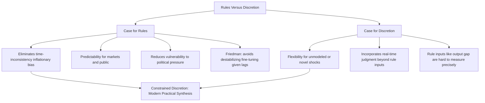

## Rules Versus Discretion Debate

### Overview and Central Question

The rules versus discretion debate concerns whether monetary policy is better conducted by committing in advance to a fixed, pre-announced rule governing how the policy instrument responds to economic conditions, or by granting policymakers ongoing freedom to exercise judgment and respond flexibly to evolving circumstances as they arise. This debate sits at the foundation of modern monetary policy institutional design and is closely linked to, but broader than, the specific time inconsistency problem.

**Key Points**

- The debate predates the formal time inconsistency literature, tracing back to earlier disagreements (notably associated with Milton Friedman) about whether discretionary "fine-tuning" of the economy by policymakers does more harm than good, given uncertainty about the economy's structure and the timing of policy effects
- The time inconsistency framework (Kydland-Prescott, Barro-Gordon) later provided a rigorous theoretical foundation specifically explaining *why* discretion can be systematically inferior to commitment, even when the discretionary policymaker is fully rational and well-intentioned
- In practice, essentially no major central bank operates under either a purely mechanical rule or unconstrained pure discretion; actual practice occupies a spectrum, commonly described as "constrained discretion"

### The Case for Rules

#### Friedman's Original Critique of Discretion

Milton Friedman's earlier critique of discretionary monetary policy (developed well before the formal time inconsistency literature) emphasized practical, knowledge-based limitations rather than strategic/incentive-based ones:

- **Long and variable lags**: Monetary policy affects the economy only after a substantial and unpredictable lag, meaning a discretionary policymaker attempting to respond to current conditions risks having the policy's effects arrive only after the underlying economic circumstance has already changed, potentially destabilizing rather than stabilizing the economy
- **Imperfect knowledge of the economy's structure**: Policymakers do not know the true structural model of the economy with precision, making discretionary fine-tuning prone to significant estimation and forecasting error
- **The k-percent rule proposal**: Friedman proposed that the central bank simply grow the money supply at a fixed, low, pre-announced rate (matching the long-run growth rate of real output) rather than attempting discretionary countercyclical adjustment, removing the scope for policy error and destabilizing discretionary intervention entirely

**Key Points**

- Friedman's critique is sometimes described as a "knowledge-based" case for rules, distinct from the later "incentive-based" case developed by the time inconsistency literature — the former emphasizes the risk of well-intentioned but poorly informed intervention, while the latter emphasizes the systematic bias arising even under full information and full rationality
- The practical viability of a strict money-growth rule of Friedman's k-percent type was substantially undermined by the subsequent empirical breakdown of stable velocity/money demand (particularly the post-1980s US M1 experience), reducing this specific rule's practical influence even as its underlying knowledge-based caution about discretion retained broader relevance

#### The Time Inconsistency Case for Rules

As developed extensively in the Kydland-Prescott and Barro-Gordon framework, discretionary policy generates a systematic inflationary bias because a discretionary policymaker cannot credibly resist the ex-post temptation to exploit a perceived short-run inflation-unemployment trade-off, even when doing so produces no lasting benefit once rational expectations adjust (see: time inconsistency problem). A credible binding rule eliminates this temptation entirely, achieving lower average inflation with no corresponding average output cost in the theoretical framework.

**Key Points**

- This is a distinctly different, and in some ways stronger, argument than Friedman's original knowledge-based case: it applies even to a hypothetical fully-informed, rational policymaker, showing that the problem with discretion is structural/strategic rather than purely informational
- The theoretical result that credible commitment achieves a Pareto improvement over discretion (lower inflation with no output cost) provided substantial intellectual momentum for the global shift toward central bank independence and rule-like policy frameworks from the 1980s onward

#### Additional Arguments for Rules

- **Predictability and reduced uncertainty**: A known, systematic rule allows households, firms, and financial markets to form more precise expectations about future policy, potentially reducing risk premia and improving planning
- **Reduced vulnerability to political pressure**: A publicly committed rule provides a clear benchmark against which political interference or pressure toward short-term expansionary policy can be publicly identified and resisted
- **Transparency and accountability**: A rule-based framework makes it easier for the public and legislature to evaluate whether the central bank is meeting its stated objectives, supporting democratic accountability for an otherwise independent institution

### The Case for Discretion

#### Flexibility to Respond to Unmodeled Shocks

No pre-specified rule, however carefully designed, can fully anticipate every possible future economic circumstance, particularly genuinely novel shocks (financial crises, pandemics, unprecedented supply disruptions) that a rule's designers could not have foreseen or explicitly incorporated into the rule's variables.

**Key Points**

- Strict adherence to a fixed rule during an unanticipated crisis could, in principle, prevent a central bank from taking clearly beneficial stabilizing action that falls outside the rule's original design, imposing real economic costs from rigid rule-following
- The 2007–2009 financial crisis and the 2020 pandemic-driven downturn are commonly cited as examples where extensive discretionary policy innovation (emergency lending facilities, quantitative easing, coordinated international action) addressed circumstances that pre-crisis conventional policy rules had not been designed to address [Inference: whether a sufficiently well-designed rule *could* in principle have been specified in advance to handle such circumstances, versus requiring genuine ex-post discretion, is a matter of ongoing theoretical and policy debate]

#### Superior Use of Real-Time Information and Judgment

A discretionary policymaker can incorporate the full range of available information, including qualitative judgment about unusual or ambiguous circumstances, rather than being restricted to the specific quantitative variables a formal rule specifies (e.g., a Taylor rule's reliance on measured inflation and an output gap estimate, which is often subject to substantial real-time measurement uncertainty).

**Key Points**

- This argument is particularly relevant given the well-documented difficulty of accurately measuring key rule inputs (such as the output gap or the neutral real interest rate $r^*$) in real time, since these are unobservable, model-dependent constructs subject to significant subsequent revision
- Proponents of discretion argue that a skilled, credible policymaker exercising judgment can outperform a mechanical formula precisely in circumstances where the formula's key inputs are most uncertain or when the underlying economic relationships (e.g., the Phillips curve) may be shifting in ways not captured by historical rule calibration

### Diagram: Rules Versus Discretion — Competing Considerations

### Constrained Discretion: The Practical Synthesis

Most contemporary central banks describe their actual operating approach as **constrained discretion** — a framework that attempts to capture the credibility and expectation-anchoring benefits associated with rule-like commitment, while preserving sufficient flexibility to respond to genuinely unusual or unmodeled circumstances.

#### Key Features of Constrained Discretion in Practice

- **Explicit numerical objectives** (e.g., an inflation target) serve a rule-like anchoring function for long-run expectations, without specifying a rigid, mechanical instrument-setting formula for every circumstance
- **Reference use of formal rules** (e.g., calculating Taylor rule prescriptions) as one input among several informing, but not mechanically determining, actual policy decisions
- **Transparency and regular communication** (published forecasts, meeting minutes, press conferences) substitute in part for a literal binding rule, by making the systematic logic underlying discretionary decisions publicly observable and evaluable over time, supporting a degree of the same credibility benefit a formal rule would provide
- **Institutional independence** (see: central bank independence) addresses the specific political-pressure dimension of the time inconsistency problem directly, reducing reliance on a rigid rule as the sole mechanism for resolving that particular concern

**Key Points**

- This synthesis reflects an attempt to capture the theoretical benefits identified in the time-inconsistency literature (credibility, anchored expectations, reduced inflationary bias) without incurring the practical costs of genuinely rigid rule-following identified by proponents of discretion (inability to respond to unmodeled shocks, reliance on uncertain and revisable rule inputs)
- The specific balance struck between rule-like commitment and discretionary flexibility varies across central banks and has evolved over time within individual institutions, particularly following major crisis episodes that have tested the limits of pre-existing frameworks

### Historical Illustration: The Volcker Disinflation

The Federal Reserve's conduct of monetary policy from October 1979 to October 1982 under Chairman Paul Volcker is frequently analyzed through the rules-versus-discretion lens: the Federal Reserve adopted a more explicit, rule-like operating procedure (targeting non-borrowed reserves, a form of quasi-monetary targeting) partly as a **credibility-enhancing commitment device**, deliberately accepting substantial federal funds rate volatility and a severe recession in the pursuit of establishing credible, lasting disinflation.

**Key Points**

- This episode is often cited as an example of a central bank deliberately adopting more rule-like, publicly announced procedures specifically to enhance the credibility of a disinflationary commitment, consistent with the time-inconsistency-based case for commitment mechanisms
- The subsequent successful and durable disinflation achieved, without a rapid return to high inflation once the recession ended, is frequently cited as supporting evidence for the credibility-building value of visible policy commitment, though the specific causal contribution of the announced procedural framework versus the sheer severity of the accompanying monetary tightening is debated among economic historians [Inference: precisely isolating the credibility-enhancing effect of the announced framework from the direct real-economy effects of the associated tight monetary policy is methodologically difficult and remains a subject of historical and economic analysis]

### Rules Versus Discretion at the Zero Lower Bound

The debate takes on additional dimensions when policy rates are constrained at or near the zero lower bound, since conventional rule-based prescriptions (such as a standard Taylor rule) can imply a negative nominal interest rate that cannot be directly implemented:

- Strict reliance on a conventional rule becomes infeasible, requiring either explicit modification of the rule framework or a shift toward more discretionary reliance on unconventional tools (quantitative easing, forward guidance)
- Forward guidance itself represents an interesting hybrid case: central banks have sometimes adopted explicit, rule-like conditional commitments (e.g., committing to maintain low rates until specific quantitative thresholds for unemployment or inflation are met) precisely to try to recapture some of the credibility benefits of rule-based commitment even while operating in a discretionary crisis-response mode

**Key Points**

- This zero-lower-bound context illustrates a broader theme in the rules-versus-discretion debate: even strong proponents of rule-like commitment generally acknowledge that some structural flexibility or periodic rule modification is necessary to handle circumstances (such as the effective lower bound constraint) that simple historical rule calibrations did not anticipate

### Comparison Summary

| Dimension | Pure Rules | Pure Discretion | Constrained Discretion (Modern Practice) |
| --- | --- | --- | --- |
| Time-inconsistency bias | Eliminated | Present | Substantially mitigated via independence and explicit targets |
| Flexibility for novel shocks | Limited | Full | Retained, informed by judgment and communication |
| Predictability for markets | High | Low | Moderate to high, via transparency and stated objectives |
| Reliance on uncertain real-time data | High (if rule uses estimated variables like the output gap) | Present but not formally binding | Present, but treated as one input among several |
| Historical prevalence among major central banks today | Rare in strict form | Rare in strict form | Dominant |

### Next Steps

- Time inconsistency problem: formal theoretical foundations
- The Taylor rule as a reference tool within constrained discretion frameworks
- Central bank independence: institutional mechanisms and empirical evidence
- Inflation targeting frameworks as a practical embodiment of constrained discretion
- The Volcker disinflation: monetary history and policy credibility
- The zero lower bound and the limits of conventional policy rules
- Forward guidance design: Odyssean versus Delphic commitment strategies