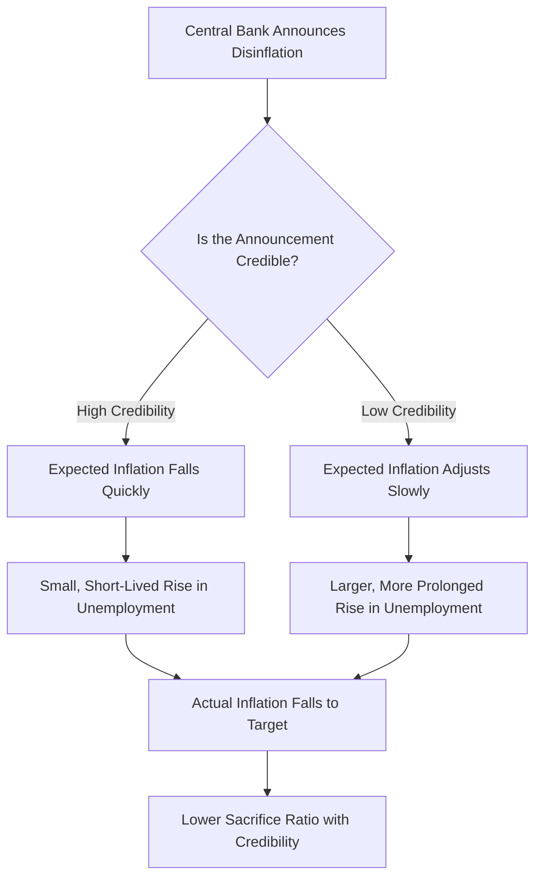
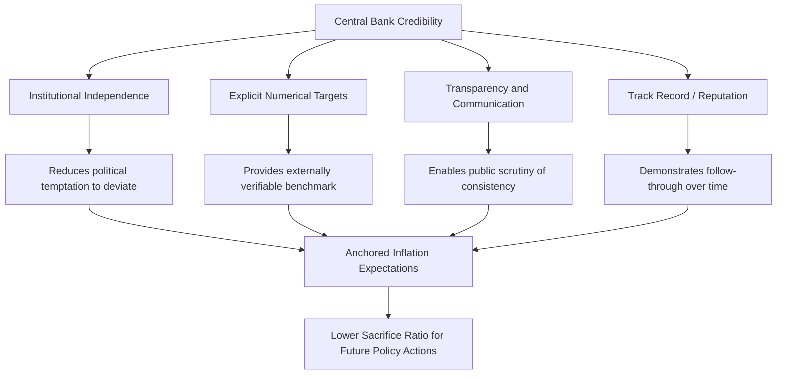

## Credibility, Reputation, and Central Bank Commitment

### Definition and Conceptual Foundation

Central bank credibility refers to the degree to which the public, financial markets, and other economic agents believe that a central bank will actually follow through on its announced policy objectives and commitments. Credibility is not a fixed institutional attribute but an earned, dynamic property that shapes how effectively monetary policy announcements translate into corresponding shifts in inflation expectations and, ultimately, real economic outcomes.

**Key Points**

- Credibility is the practical resolution mechanism that determines whether the theoretical benefits of policy commitment described in the time inconsistency literature are actually realized in practice, since a stated commitment with no credibility behind it produces no meaningful anchoring of expectations
- Reputation is one of the primary mechanisms (alongside formal institutional independence) through which credibility can be built and sustained over time, particularly in settings where a fully binding, legally enforceable commitment mechanism is unavailable or impractical
- Credibility affects the *cost* of achieving a given inflation outcome: a highly credible central bank can generally achieve disinflation or maintain low inflation with smaller output/employment costs than a low-credibility central bank facing the same objective, because expectations adjust more readily to a believed announcement

### Why Credibility Matters: The Expectations Channel

The practical importance of credibility flows directly from the expectations-augmented Phillips curve framework central to modern monetary economics:

$$\pi = \pi^e + \gamma(u^n - u) + \varepsilon$$

If a central bank's disinflation announcement is fully credible, inflation expectations $\pi^e$ adjust downward immediately and in line with the announcement, allowing actual inflation $\pi$ to fall toward the new target with minimal need for the economy to actually experience above-natural unemployment ($u > u^n$) as a mechanism of adjustment. If the announcement lacks credibility, expectations remain anchored to past behavior, and actual disinflation can only be achieved by generating a costly period of above-natural unemployment to force inflation down through the Phillips curve relationship itself.

**Example**

Two central banks each announce an identical commitment to reduce inflation from 8% to 2%. If Central Bank A has high credibility (perhaps due to a long track record of following through on stated commitments), wage and price setters quickly revise their expectations toward 2%, and the economy can transition to lower inflation with a relatively mild and short-lived rise in unemployment. If Central Bank B has low credibility (perhaps due to past broken promises), wage and price setters continue setting contracts closer to the historical 8% pattern, requiring a more prolonged period of elevated unemployment before actual inflation is forced down to the new target — the same announced policy goal, achieved at a substantially higher real economic cost.

**Key Points**

- This differential cost of disinflation based on credibility is sometimes referred to as the "sacrifice ratio" — the cumulative output or unemployment cost per percentage point of inflation reduction achieved — with theory and much empirical work suggesting the sacrifice ratio should be smaller for more credible central banks [Inference: precise empirical estimation of sacrifice ratios and their sensitivity to credibility varies substantially across studies, countries, and time periods, and isolating credibility's specific contribution from other factors is methodologically challenging]
- Credibility therefore functions as a form of costless (or low-cost) disinflation technology: the same nominal policy commitment produces different real economic consequences depending on how believable it is perceived to be

### Diagram: Credibility and the Cost of Disinflation

### Reputation as a Commitment Mechanism

#### The Repeated-Game Logic

In the absence of a fully binding, legally enforceable rule, reputation offers an alternative commitment device grounded in repeated interaction between the central bank and the public over time. If economic agents update their trust in the central bank based on its observed track record, a central bank that values its future credibility has an ongoing incentive to honor current commitments, since reneging would impose costs (higher future inflation expectations, higher future sacrifice ratios for any future disinflation) that can outweigh any short-run temptation-driven gain.

**Key Points**

- Reputation-based models suggest that a sufficiently patient, forward-looking policymaker operating in a repeated (rather than one-shot) game with the public can sustain outcomes close to the theoretical full-commitment solution, even without formal institutional bindingness, provided the policymaker weighs future credibility sufficiently heavily relative to any immediate temptation
- This logic explains why central banks place such heavy emphasis on *consistency* in their communications and actions over time: a single episode of deviating from stated intentions can impose a persistent, multi-period credibility cost that extends well beyond whatever short-run benefit motivated the initial deviation
- Reputation can be asymmetric in its build-up and erosion: credibility is often characterized as slow and costly to build (requiring a sustained track record of following through on commitments, often across multiple economic cycles) but comparatively fast to lose (a single high-profile broken commitment or policy reversal can substantially damage accumulated credibility) [Inference: the precise asymmetry in build-up versus erosion speed is a commonly cited characterization in the policy and academic literature, though it is difficult to quantify precisely and may vary by circumstance]

### Institutional Mechanisms for Building Credibility

#### Central Bank Independence

As established in the time inconsistency literature, institutional independence from short-term political pressure directly addresses one of the primary sources of temptation to deviate from a low-inflation commitment, thereby supporting credibility at the outset, independent of any subsequently accumulated reputation (see: central bank independence).

#### Explicit, Numerical Targets

A publicly stated, numerical target (e.g., a 2% inflation target under an inflation targeting framework) provides an externally verifiable benchmark against which the central bank's actual performance can be judged by the public, media, and legislature, raising the reputational stakes of any deviation and thereby reinforcing the credibility of the underlying commitment.

#### Transparency and Communication

Regular, detailed publication of economic forecasts, the reasoning behind policy decisions, and (in many frameworks) individual policymaker views (e.g., meeting minutes, dissent records, projection materials) allows external observers to assess whether the central bank's actions are genuinely consistent with its stated framework over time, supporting the kind of ongoing public scrutiny that underpins reputation-based credibility mechanisms.

#### Track Record and Historical Consistency

**Key Points**

- A sustained multi-year (often multi-cycle) history of actually achieving stated objectives is generally considered the single most important practical driver of credibility, since announcements and institutional design alone cannot fully substitute for demonstrated follow-through
- This is a particularly significant consideration for newly independent central banks or those transitioning from a history of high or volatile inflation (common among emerging market inflation-targeting adopters), which often require an extended period of consistent target achievement before inflation expectations become durably anchored near the announced target [Unverified: the specific length of time required to establish durable credibility varies substantially by country history and circumstance and is not governed by any fixed rule]

### Diagram: Mechanisms Supporting Central Bank Credibility

### Credibility and Forward Guidance

Modern central bank communication, particularly forward guidance about the likely future path of policy, relies heavily on pre-existing credibility to be effective: if markets do not believe a central bank's stated intention to keep rates low (or high) for a specified future period, the intended transmission effect on current long-term interest rates and spending decisions is substantially weakened or eliminated (see: monetary policy transmission mechanisms, expectations channel).

**Key Points**

- Forward guidance is sometimes categorized into **Delphic guidance** (simply communicating the central bank's forecast of future economic conditions and likely policy responses, without an explicit commitment) and **Odyssean guidance** (an explicit commitment to a specific future policy action or conditional threshold, intended to bind future policy in a way similar to Ulysses binding himself to the mast)
- Odyssean guidance places particularly heavy demands on credibility, since it explicitly asks the public to believe the central bank will follow through on a specific future commitment even when future economic conditions might otherwise tempt a different course of action — directly analogous to the general commitment problem addressed by the broader time inconsistency literature

### Consequences of Credibility Loss

**Key Points**

- A loss of credibility, once it occurs, tends to be self-reinforcing in the short-to-medium term: if the public no longer trusts a central bank's announcements, subsequent announcements (even genuinely sincere ones) may fail to shift expectations, requiring the central bank to demonstrate through *actual, costly policy actions* (rather than mere announcements) that it remains committed to its stated objectives — a more expensive route to achieving the same expectational anchoring that credible communication alone could otherwise provide
- Historical episodes of high and volatile inflation (such as the 1970s in several advanced economies) are frequently interpreted, in part, through this credibility lens: a series of policy actions and communications inconsistent with sustained low-inflation commitment eroded public trust, contributing to entrenched high inflation expectations that subsequently required a costly, credibility-rebuilding disinflation (associated with the Volcker-era Federal Reserve in the US context) to reverse [Inference: the specific causal weight of credibility erosion, relative to other contributing factors such as oil price shocks and natural rate misestimation, in explaining the 1970s inflation episode remains debated among economic historians]
- Rebuilding lost credibility generally requires policymakers to accept a period of policy that is more restrictive, and imposes greater real economic costs, than would otherwise be necessary if credibility had been maintained throughout — a form of "credibility premium" that must be paid to restore the expectational anchoring previously lost

### Credibility in Emerging Market and Transition Economy Contexts

**Key Points**

- Central banks in economies with a history of high inflation, hyperinflation episodes, or currency crises typically face a substantially steeper credibility-building challenge than those in economies with longer histories of institutional stability, since the public's prior beliefs about the likelihood of future policy deviation are shaped heavily by past national experience
- Some emerging market central banks have pursued more aggressive institutional signaling (e.g., unusually strict formal independence provisions, or initial reliance on exchange rate pegs as a more easily verifiable form of external commitment) specifically to accelerate credibility-building, given the practical difficulty of relying purely on gradual reputation accumulation when starting from a low-credibility baseline [Unverified: the comparative effectiveness of different credibility-building strategies across specific emerging market contexts is a subject of ongoing empirical and policy research, and outcomes have varied considerably across countries]

### Credibility as Distinct From, But Related To, Independence

| Concept | Description | Relationship |
| --- | --- | --- |
| Central bank independence | An institutional/legal structure insulating decision-making from direct political control | A structural precondition that facilitates credibility but does not by itself guarantee it |
| Credibility | The public's actual belief that stated commitments will be honored | An earned, dynamic outcome, built through consistent behavior over time, reinforced by (but not solely determined by) formal independence |
| Reputation | The specific historical track record underpinning current credibility | The evidentiary basis from which current credibility is inferred by rational, forward-looking agents |

**Key Points**

- A formally independent central bank does not automatically possess high credibility if its actual track record has been inconsistent, just as, in principle, a central bank without full formal independence could still achieve meaningful credibility through an unusually strong and consistent track record, though the latter case is less commonly observed and formal independence is generally regarded as substantially easier to sustain credibility from
- This distinction highlights that institutional design (independence, targets, transparency) and behavioral consistency over time are complementary but analytically separate contributors to the ultimate outcome of interest: the public's actual confidence in future policy behavior

### Next Steps

- Time inconsistency problem: theoretical foundations underlying the need for credibility
- Central bank independence: institutional dimensions and empirical evidence
- Inflation targeting frameworks and their role in credibility-building
- Forward guidance: Odyssean versus Delphic communication strategies
- The Volcker disinflation as a historical credibility-building episode
- Sacrifice ratio estimation and its relationship to policy credibility
- Emerging market central banking and credibility-building strategies under high-inflation histories