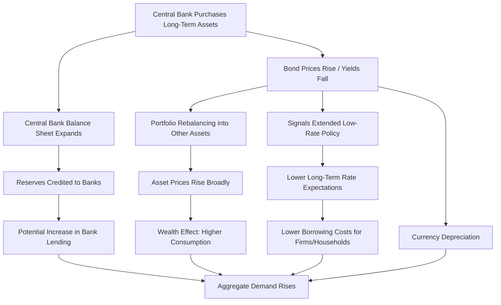

## Quantitative Easing

### Definition and Conceptual Overview

Quantitative easing (QE) is a form of unconventional monetary policy in which a central bank purchases longer-term financial assets—typically government bonds and sometimes private-sector securities such as mortgage-backed securities (MBS) or corporate bonds—using newly created central bank reserves. The objective is to lower long-term interest rates, increase the money supply, and stimulate aggregate demand when conventional interest-rate policy has become ineffective.

QE is generally deployed when the central bank's policy rate (e.g., the federal funds rate) has reached or is near the **zero lower bound (ZLB)**, leaving no further room for conventional rate cuts to stimulate the economy. At this point, central banks shift from a "price-based" tool (adjusting the interest rate) to a "quantity-based" tool (adjusting the size and composition of their balance sheet).

**Key Points**

- QE expands the central bank's balance sheet by creating reserves to purchase assets.
- It targets long-term yields directly, rather than only the short-term policy rate.
- It is typically implemented after conventional rate cuts are exhausted (ZLB).
- It is distinct from ordinary open market operations (OMOs) in scale, duration, and the type of assets purchased.

### Historical Context and Motivation

Central banks conduct conventional monetary policy primarily by setting a short-term interest rate (the policy rate) and using standard open market operations to keep the market rate near that target. This works well under normal conditions, but during severe downturns—such as the 2008 Global Financial Crisis (GFC) or the 2020 COVID-19 recession—policy rates can fall to zero (or slightly below, in some jurisdictions) without adequately stabilizing the economy.

Once nominal rates are at or near zero, a central bank cannot lower them much further because:

1. Cash is an alternative store of value with a nominal return of zero, so deeply negative deposit rates can trigger a shift into physical currency (the "cash constraint" on negative rates).
2. Financial institutions may be unwilling or unable to pass negative rates on to depositors, straining bank profitability.

This constraint is known as the **zero lower bound problem**. QE emerged as the primary tool to continue providing monetary accommodation once this bound is reached. Japan's central bank pioneered modern QE in the early 2000s to combat deflation, and it was subsequently adopted at large scale by the U.S. Federal Reserve, the Bank of England, and the European Central Bank following the GFC, and again during the COVID-19 pandemic.

### Transmission Mechanisms

QE is theorized to affect the economy through several interconnected channels. Understanding these channels is essential because QE does not operate through the same interest-rate channel as conventional policy.

#### 1. Portfolio Balance Channel

When the central bank purchases long-term government bonds, it removes duration risk and interest-rate risk from the market. Investors who sold those bonds must reallocate their portfolios into other assets (corporate bonds, equities, or other close substitutes), pushing up the prices of these substitute assets and lowering their yields. This compresses term premiums and risk premiums across a broad range of assets, not just the ones purchased directly.

#### 2. Signaling Channel (Policy Commitment)

Large-scale asset purchases signal that the central bank intends to keep short-term rates low for an extended period, since raising rates while simultaneously expanding the balance sheet would be inconsistent. This shapes market expectations of the future path of short-term rates, which affects long-term rates through the expectations hypothesis of the term structure.

#### 3. Liquidity/Market Functioning Channel

During periods of financial stress, QE (or QE-like interventions) can restore liquidity to dysfunctional markets by acting as a large, price-insensitive buyer, narrowing bid-ask spreads and reducing liquidity premiums.

#### 4. Bank Lending / Reserves Channel

QE credits reserves to the banking system. In theory, if banks are reserve-constrained, this could support additional lending. In practice, under a floor system with interest paid on reserves, banks are rarely reserve-constrained, so this channel is considered weaker than originally assumed. [Inference] The empirical strength of the bank lending channel is disputed and appears highly dependent on the banking sector's capital position and risk appetite at the time.

#### 5. Exchange Rate Channel

Lower domestic yields relative to foreign yields tend to depreciate the domestic currency, improving net exports—an indirect stimulus to aggregate demand.

**Illustration: QE Transmission Pathway**

### Balance Sheet Mechanics

When a central bank conducts QE, it purchases assets (typically from commercial banks and other financial institutions, not directly from the government in most jurisdictions, due to legal prohibitions on monetary financing) and pays for them by crediting the sellers' reserve accounts at the central bank.

**Simplified balance sheet effect:**

Central Bank (assets side): Government bonds ↑

Central Bank (liabilities side): Bank reserves ↑

Commercial Bank (assets side): Bonds ↓, Reserves ↑ (net asset composition changes, not total assets)

This operation is often loosely described as the central bank "printing money," but the more precise characterization is that it is a swap of one type of central bank liability (reserves) for a private-sector asset (bonds), rather than the creation of physical currency. Whether this expansion of the monetary base translates into broader money supply growth (M2, M3) depends on whether commercial banks and the private sector extend new loans, which is not automatic.

The size of QE programs is typically measured relative to GDP or in absolute currency terms. For example, the Federal Reserve's balance sheet grew from roughly $0.9 trillion pre-2008 to over $4.5 trillion by 2015 following multiple rounds of QE, and to nearly $9 trillion following the pandemic-era expansion. [Unverified: exact peak figures vary slightly by reporting date and source; consult the Federal Reserve's H.4.1 release for precise historical balance sheet data.]

### Major Historical Episodes

#### Bank of Japan (2001–2006, and later QQE from 2013)

Japan was the first major central bank to adopt QE, initially targeting current account balances held by financial institutions at the BOJ, in response to prolonged deflation and a stagnant banking sector following its 1990s asset-price collapse. In 2013, the BOJ launched **Quantitative and Qualitative Monetary Easing (QQE)**, expanding purchases to include exchange-traded funds (ETFs) and real estate investment trusts (J-REITs), later paired with **Yield Curve Control (YCC)** in 2016, which explicitly targeted the 10-year government bond yield rather than a purchase quantity.

#### U.S. Federal Reserve (QE1–QE3, 2008–2014)

- **QE1 (2008–2010):** Purchases of agency MBS, agency debt, and Treasury securities in response to the GFC and the collapse of mortgage markets.
- **QE2 (2010–2011):** Additional Treasury purchases aimed at combating disinflationary pressures and supporting a sluggish recovery.
- **QE3 (2012–2014):** Open-ended purchases ($85 billion/month, later tapered) explicitly tied to labor market outcomes, introducing state-contingent forward guidance alongside asset purchases.

#### European Central Bank (Public Sector Purchase Programme, 2015 onward)

The ECB launched its **Expanded Asset Purchase Programme (APP)**, including the **Public Sector Purchase Programme (PSPP)**, to counter the risk of deflation in the Eurozone, given constraints unique to a currency union (purchases allocated across member states according to the ECB capital key).

#### Pandemic-Era QE (2020)

Most major central banks (Fed, ECB, BOE, BOJ) launched extremely large and rapid asset purchase programs in March 2020 to stabilize dysfunctional bond markets and support fiscal deficits incurred to finance pandemic relief. The Fed's **Pandemic Emergency Purchase Programme (PEPP)**-equivalent actions and unlimited QE commitment ("QE infinity") marked one of the fastest balance sheet expansions in history.

### QE vs. Related Unconventional Tools

It is important to distinguish QE from other unconventional monetary policy tools, as they are often conflated in casual usage.

| Tool | Mechanism | Primary Goal |
| --- | --- | --- |
| Quantitative Easing (QE) | Large-scale purchases of long-term assets, expanding the balance sheet | Lower long-term yields, ease broad financial conditions |
| Credit Easing | Purchases targeted at specific distressed credit markets (e.g., corporate bonds, ABS) | Restore functioning in specific credit market segments |
| Yield Curve Control (YCC) | Commit to purchasing whatever quantity is needed to hold a specific yield target | Directly anchor a point (or points) on the yield curve |
| Negative Interest Rate Policy (NIRP) | Setting the policy rate below zero | Push banks to lend rather than hold reserves |
| Forward Guidance | Communication about the future path of policy | Shape expectations without immediate balance sheet action |
| Quantitative Tightening (QT) | Reducing the balance sheet (letting assets mature or actively selling) | Reverse QE's effects; tighten financial conditions |

**Key Points**

- QE is quantity-focused (size of purchases); YCC is price-focused (target yield level), with quantity purchased becoming a residual, potentially unlimited, variable.
- Credit easing is narrower in scope than QE, targeting specific impaired markets rather than broad-based long-term rates.
- QT is the mirror-image unwind of QE and carries its own distinct transmission risks.

### Effects on Key Macroeconomic Variables

#### Interest Rates and Yield Curves

QE is designed to flatten the yield curve by compressing term premiums on long-duration securities while short-term rates remain anchored near zero. Empirical event studies around QE announcement dates generally find statistically significant declines in long-term government bond yields at announcement, though the magnitude and persistence of the effect are debated in the literature. [Inference] Some research suggests the "announcement effect" (a one-time repricing at the time of an unexpected announcement) is larger than the ongoing "flow effect" from actual purchases, implying that QE efficacy partly depends on surprise and credibility rather than sheer volume.

#### Inflation

The direct pass-through from QE to consumer price inflation has historically been weaker than initially predicted by simple quantity-theory-of-money reasoning. During the 2008–2015 period, large-scale QE in the U.S., UK, and Eurozone coincided with persistently below-target inflation, suggesting that expanding the monetary base does not mechanically translate into a proportional rise in the price level, particularly when money velocity declines and when banks hold excess reserves rather than expanding credit.

$$MV = PY$$

where $M$ is the money supply, $V$ is the velocity of money, $P$ is the price level, and $Y$ is real output. A rise in $M$ during QE was frequently offset by a fall in $V$, muting the inflationary impact predicted by a naive reading of this identity. [Inference] The extent to which this offsetting velocity decline is a structural feature of a liquidity trap versus a temporary artifact of post-crisis deleveraging remains a subject of ongoing debate among macroeconomists.

#### Asset Prices and Wealth Effects

QE has been strongly associated with rising equity valuations and compressed corporate bond spreads, consistent with the portfolio balance channel. Critics argue this contributed to asset-price inflation and wealth inequality, since asset ownership is concentrated among higher-income households, though isolating QE's causal contribution from other simultaneous factors (fiscal policy, global growth trends) is methodologically difficult.

#### Exchange Rates

Unilateral QE tends to depreciate the domestic currency relative to trading partners that are not easing simultaneously, which can generate "currency war" concerns when multiple central banks pursue QE at the same time, partially offsetting each other's exchange-rate effects.

#### Bank Reserves and Money Supply

QE mechanically increases the monetary base (M0) by construction, but its effect on broader money aggregates (M2) depends on the money multiplier and bank lending behavior, which can remain subdued even as reserves surge—as observed prominently in the years following 2008–2009 in the U.S. and Eurozone.

### Risks, Limitations, and Criticisms

**Key Points**

- **Diminishing returns:** Successive rounds of QE (QE2, QE3) are generally found to have had progressively smaller marginal effects on yields than QE1, consistent with the announcement/surprise-driven view of transmission.
- **Asset price bubbles:** Sustained QE can encourage excessive risk-taking ("search for yield") as investors move into riskier assets to compensate for compressed yields on safe assets.
- **Distributional concerns:** Because QE inflates the value of financial assets, its benefits may accrue disproportionately to asset-holding households, raising equity concerns.
- **Central bank balance sheet risk:** Holding large quantities of long-duration bonds exposes the central bank to mark-to-market losses if interest rates subsequently rise, potentially generating reported accounting losses (though these do not impair a central bank's operational capacity, since it cannot become insolvent in domestic currency in the conventional sense).
- **Exit strategy complexity:** Unwinding QE (via QT) risks disrupting bond markets if done too quickly, as seen in the 2013 "Taper Tantrum," when merely signaling a future slowdown in purchases caused a sharp, disorderly rise in U.S. Treasury yields and volatility in emerging markets.
- **Fiscal-monetary boundary blurring:** Large-scale sovereign bond purchases can be perceived as facilitating deficit financing, raising concerns about central bank independence and the incentives it creates for fiscal authorities. [Inference] This concern is more acute in currency unions like the Eurozone, where purchases of a member state's debt can be interpreted as an implicit fiscal transfer or as circumventing the prohibition on monetary financing of governments.

### Illustration: Central Bank Balance Sheet Expansion Under QE (svg_diagram)

<svg xmlns="http://www.w3.org/2000/svg" viewBox="0 0 760 420" font-family="Helvetica, Arial, sans-serif">
<text x="380" y="30" text-anchor="middle" font-size="18" font-weight="bold" fill="#1a1a1a">Central Bank Balance Sheet Expansion Under QE (svg_diagram)</text>

<text x="150" y="65" text-anchor="middle" font-size="14" font-weight="bold" fill="#333">Before QE</text>

<rect x="40" y="80" width="220" height="260" fill="none" stroke="#333" stroke-width="2" />

<line x1="150" y1="80" x2="150" y2="340" stroke="#333" stroke-width="2" />

<text x="95" y="100" text-anchor="middle" font-size="12" font-weight="bold">Assets</text>

<text x="205" y="100" text-anchor="middle" font-size="12" font-weight="bold">Liabilities</text>

<rect x="55" y="110" width="80" height="60" fill="`#a8d5ba`" stroke="#333" />

<text x="95" y="145" text-anchor="middle" font-size="11">Gov. Bonds</text>

<rect x="165" y="110" width="80" height="60" fill="`#f4c27a`" stroke="#333" />

<text x="205" y="145" text-anchor="middle" font-size="11">Reserves</text>

<rect x="165" y="175" width="80" height="45" fill="`#e8a5a5`" stroke="#333" />

<text x="205" y="200" text-anchor="middle" font-size="11">Currency</text>

<line x1="290" y1="200" x2="350" y2="200" stroke="#333" stroke-width="2" marker-end="url(#arrow)" />
<text x="320" y="190" text-anchor="middle" font-size="11" font-style="italic">QE Purchase</text>

<text x="610" y="65" text-anchor="middle" font-size="14" font-weight="bold" fill="#333">After QE</text>

<rect x="500" y="80" width="220" height="290" fill="none" stroke="#333" stroke-width="2" />

<line x1="610" y1="80" x2="610" y2="370" stroke="#333" stroke-width="2" />

<text x="555" y="100" text-anchor="middle" font-size="12" font-weight="bold">Assets</text>

<text x="665" y="100" text-anchor="middle" font-size="12" font-weight="bold">Liabilities</text>

<rect x="515" y="110" width="80" height="130" fill="`#4a9b6e`" stroke="#333" />

<text x="555" y="150" text-anchor="middle" font-size="11" fill="#fff">Gov. Bonds</text>

<text x="555" y="168" text-anchor="middle" font-size="10" fill="#fff">(Expanded)</text>

<rect x="625" y="110" width="80" height="130" fill="`#e08b23`" stroke="#333" />

<text x="665" y="150" text-anchor="middle" font-size="11" fill="#fff">Reserves</text>

<text x="665" y="168" text-anchor="middle" font-size="10" fill="#fff">(Expanded)</text>

<rect x="625" y="245" width="80" height="45" fill="`#e8a5a5`" stroke="#333" />

<text x="665" y="270" text-anchor="middle" font-size="11">Currency</text>

<text x="380" y="400" text-anchor="middle" font-size="11" fill="#555">Bonds move from bank/investor holdings to the central bank; reserves are credited in exchange.</text>

</svg>

### Worked Example

**Example**

Suppose the economy is in a liquidity-trap-like scenario: the policy rate is at 0.25% and further cuts are infeasible. The 10-year government bond yield is 3.0%. The central bank announces $600 billion in purchases of long-term government bonds over eight months (an approach modeled on the Fed's QE2 program).

Mechanically:

1. The central bank credits participating banks' reserve accounts by $600 billion in aggregate as it buys bonds.
2. Increased demand for long-duration bonds raises their price and lowers their yield—suppose the 10-year yield falls from 3.0% to 2.5% (a 50 basis-point decline) due to the combined portfolio-balance and signaling channels.
3. Firms refinancing debt or issuing new long-term bonds benefit from lower borrowing costs, and mortgage rates linked to the 10-year yield also decline, potentially stimulating housing activity.
4. Investors who sold bonds to the central bank reallocate proceeds into equities and corporate credit, raising asset prices and producing a wealth effect that modestly boosts consumption via $C = C_0 + c(Y - T) + \text{wealth effect}$, where $c$ is the marginal propensity to consume.

[Inference] The precise magnitude of the yield decline and subsequent output effect in this stylized example is illustrative; actual empirical estimates vary substantially by episode, country, and macroeconometric methodology (e.g., event-study vs. structural VAR approaches).

### Empirical Debates and Open Questions

- **Effectiveness at the zero lower bound:** There is broad consensus that QE lowers long-term yields somewhat, but disagreement persists over how much of this effect translates into higher output and inflation versus simply repricing financial assets.
- **State dependence:** [Inference] QE's effectiveness appears to depend on the state of financial markets—purchases during acute liquidity crises (2008, March 2020) plausibly have larger effects via the liquidity/market-functioning channel than purchases conducted during calmer periods, where the portfolio-balance channel alone must do the work.
- **International spillovers:** QE in a major reserve-currency economy can trigger capital flows into emerging markets ("hot money"), currency appreciation pressures, and asset bubbles abroad—a frequently cited criticism from EM policymakers during and after the Fed's QE programs.
- **Long-run exit costs:** The 2022–2023 global QT and rate-hiking cycle renewed debate over whether the scale of post-2008 and post-2020 QE contributed to the subsequent inflation surge, though most mainstream analyses attribute the 2021–2023 inflation primarily to pandemic-related supply constraints and fiscal stimulus, with QE's role considered secondary and disputed. [Speculation] The relative weighting of monetary versus fiscal and supply-side drivers of that inflation episode remains an active area of academic disagreement.

### Conclusion

Quantitative easing represents a fundamental shift in the central bank's policy toolkit—from adjusting the price of reserves (the short-term interest rate) to adjusting their quantity and the composition of the central bank's balance sheet. It operates through portfolio-balance, signaling, liquidity, bank-lending, and exchange-rate channels, with empirical evidence most strongly supporting its capacity to lower long-term yields and stabilize dysfunctional markets during crises, and more mixed evidence regarding its pass-through to inflation and real output. Its risks—diminishing marginal returns, asset-price distortions, distributional effects, and complex exit dynamics—remain central to ongoing macroeconomic policy debates, particularly following the large-scale QE and subsequent QT episodes of the post-2008 and post-pandemic eras.

**Related Topics**

- Zero lower bound and the liquidity trap
- Yield curve control (Bank of Japan model)
- Quantitative tightening (QT) and balance sheet normalization
- Forward guidance as a monetary policy tool
- Negative interest rate policy (NIRP)
- The money multiplier and endogenous money theory
- Term premium and the expectations hypothesis of interest rates
- Central bank independence and fiscal dominance
- Taper Tantrum (2013) as a case study in exit-strategy risk
- Unconventional monetary policy in emerging market economies