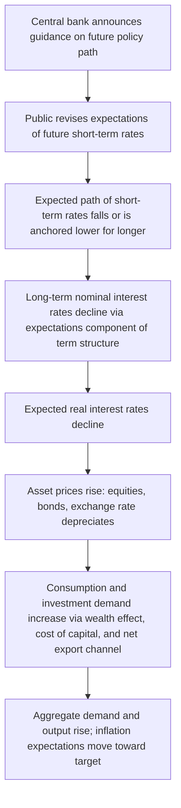

## Forward Guidance as a Policy Tool

### Definition and Conceptual Foundation

Forward guidance is a monetary policy instrument through which a central bank communicates its intentions, conditions, and likely future path for policy instruments—primarily the policy interest rate—to influence current economic conditions through the management of expectations. Rather than acting solely through the current setting of the policy rate, the central bank uses public statements about the future to shape household and firm behavior today.

The theoretical foundation rests on the idea that economic decisions—consumption, investment, borrowing—depend not only on current interest rates but on the expected path of interest rates over the relevant decision horizon. Since long-term interest rates can be approximated (under the expectations hypothesis of the term structure) as an average of expected future short-term rates plus a term premium:

$$i_{n,t} = \frac{1}{n}\sum_{k=0}^{n-1} E_t[i_{t+k}] + \phi_{n,t}$$

where $i_{n,t}$ is the yield on an $n$-period bond at time $t$, $E_t[i_{t+k}]$ is the expected short-term rate $k$ periods ahead, and $\phi_{n,t}$ is the term premium, a central bank can move long-term rates—which matter most for investment and durable consumption decisions—by managing expectations of future short-term rates, even when the current short-term rate is unchanged or constrained.

### Rationale and the Zero Lower Bound Problem

Forward guidance became especially prominent as a policy tool after the 2008 Global Financial Crisis, when policy rates in major economies fell to or near the zero lower bound (ZLB), also referred to as the effective lower bound (ELB).

**Key Points**

- Conventional monetary policy operates by adjusting the short-term nominal policy rate.
- At the ZLB, the central bank cannot lower the current policy rate further to provide additional stimulus.
- Forward guidance allows the central bank to provide additional accommodation by committing to keep rates low for longer than markets would otherwise expect, thereby lowering the entire expected future path of short-term rates and, consequently, current long-term rates.
- This works through lowering real interest rates: if the central bank credibly commits to holding nominal rates low even after inflation begins to rise, expected inflation increases (or is prevented from falling), which lowers the real rate given by the Fisher relation:

$$r_t \approx i_t - E_t[\pi_{t+1}]$$

A lower expected real rate stimulates consumption and investment via the intertemporal consumption Euler equation and the standard investment-demand channel.

### Types of Forward Guidance

Central banks and the academic literature commonly distinguish between several forms of forward guidance, differing in the degree of commitment and the conditions attached.

#### Odyssean vs. Delphic Guidance

- **Odyssean forward guidance**: A genuine policy commitment, named after Odysseus binding himself to the mast. The central bank commits to a future action (e.g., holding rates at zero) even if future conditions would otherwise call for a different action, sacrificing future flexibility to make the promise credible. This is the theoretically potent form because it manipulates expectations by altering the actual future reaction function.
- **Delphic forward guidance**: The central bank simply announces its forecast of future economic conditions and the likely resulting policy path, without binding itself to depart from its normal reaction function. Named after the Oracle of Delphi, it conveys information rather than commitment. Delphic guidance can sometimes be counterproductive: if a central bank projects low future rates because it expects weak growth, this may signal bad news about the economy and depress rather than stimulate current spending. [Inference: Whether the net effect of Delphic guidance is expansionary or contractionary in a given episode depends on how markets interpret the underlying informational content, and empirical results vary by country and episode.]

#### Qualitative Guidance

Statements using descriptive language without explicit numerical thresholds or calendar dates, such as indicating that rates will remain low "for an extended period" or "for some time." This form retains flexibility but sacrifices precision, and its effectiveness depends heavily on the credibility and consistency of the communicating institution.

#### Calendar-Based (Time-Contingent) Guidance

The central bank specifies a fixed date or time horizon over which the current policy stance is expected to be maintained (e.g., "the federal funds rate will remain near zero at least through mid-2013").

**Key Points**

- Advantage: clarity and ease of communication.
- Disadvantage: the guidance is not contingent on how the economy actually evolves. If economic conditions improve or deteriorate faster than expected, the central bank faces a dilemma between honoring the stated date (losing responsiveness) or deviating from it (damaging credibility).

#### State-Contingent (Threshold-Based) Guidance

The central bank commits to maintaining its policy stance until specified economic conditions are met, typically expressed as numerical thresholds for unemployment and inflation. The U.S. Federal Reserve's 2012–2014 guidance is a widely studied example, where the Federal Open Market Committee indicated that exceptionally low rates would likely be appropriate at least as long as the unemployment rate remained above a stated threshold and projected inflation remained below a stated ceiling, subject to not exceeding stated limits on medium-term inflation expectations.

**Key Points**

- Advantage: automatically adapts to the state of the economy, reducing the credibility problem associated with calendar-based guidance.
- Disadvantage: more complex to communicate; multiple thresholds can create ambiguity about which condition binds, and threshold design requires careful selection of indicators that the public can observe and verify.

### Transmission Mechanism

Forward guidance operates through the following chain:

The credibility of the commitment is central to the mechanism's strength. If economic agents do not believe the central bank will follow through—particularly if honoring the guidance would require tolerating above-target inflation once the economy recovers—the expectational channel is weakened. This is formalized in the time-inconsistency literature: a central bank has an incentive to renege on a promise to keep rates low once inflation begins to rise, and if the public anticipates this, the promise loses force. Solving this **time-inconsistency problem** is why Odyssean guidance is often reinforced by institutional commitments (e.g., explicit numerical thresholds, or embedding guidance within an average-inflation-targeting framework).

### Illustrative Example

Consider an economy at the zero lower bound where the natural rate of interest $r^*$ is temporarily negative due to a demand shock (e.g., deleveraging following a financial crisis). Absent forward guidance, the central bank sets $i_t = 0$ today but the public expects the central bank to raise rates as soon as inflation approaches target, say in four quarters. Expected future short rates are therefore positive from quarter 5 onward, keeping long-term rates and real rates too high to close the output gap.

**Example**

- Without guidance: the public expects the central bank to follow a standard Taylor-rule reaction function, raising $i_t$ promptly once inflation and output gaps normalize. Long-term rate: $i_{n,t}$ reflects an early "liftoff."
- With Odyssean forward guidance: the central bank commits to holding $i_t = 0$ for eight quarters, longer than the Taylor rule would imply given the expected recovery path. This lowers $E_t[i_{t+k}]$ for $k = 5, \dots, 8$, pulling down $i_{n,t}$ today.
- Effect: lower long-term real rates today stimulate current investment and durable consumption, accelerating the closing of the output gap and helping to prevent a deflationary spiral, even though the current short-term rate itself has not changed.

### Empirical Evidence and the "Forward Guidance Puzzle"

Standard New Keynesian models predict that forward guidance about rate changes far in the future should have very large effects on current consumption and output—effects that grow, rather than shrink, the further into the future the promised rate change occurs. This counterintuitive and empirically implausible prediction is known as the **forward guidance puzzle**.

[Unverified: The magnitude of this puzzle and its resolution remain active areas of research; the mechanisms below represent leading but not universally agreed-upon explanations in the literature.]

Proposed resolutions include:

- **Incomplete information/imperfect common knowledge**: Not all agents fully process or believe distant forward guidance, dampening its effect relative to the full-information rational expectations benchmark.
- **Bounded rationality and finite planning horizons**: Models incorporating cognitive discounting (agents discount the effect of events further in the future more heavily than implied by the standard discount factor) bring model predictions closer to observed, more moderate responses.
- **Incomplete markets and heterogeneous agents (HANK models)**: When a fraction of households are credit-constrained ("hand-to-mouth"), the aggregate response to distant income changes signaled by forward guidance is muted relative to representative-agent models.
- **Discounted Euler equations**: Ad hoc discounting of expected future variables in the IS curve reduces the sensitivity of current output to distant guidance.

### Central Bank Case Studies

**Federal Reserve (United States)**

- December 2008–2015: Near-zero federal funds rate accompanied by evolving guidance language, moving from qualitative ("extended period") to calendar-based (specific dates) to threshold-based (unemployment and inflation thresholds announced in December 2012).
- Post-2020: Guidance tied to the Flexible Average Inflation Targeting (FAIT) framework, where the Fed indicated it would seek inflation moderately above 2% for some time following periods of below-target inflation, an explicit attempt to make guidance more credible by embedding it in the stated framework rather than a one-off promise.

**European Central Bank**

- Introduced explicit forward guidance in July 2013, initially indicating rates would remain at low levels for an extended period, later evolving to state-contingent formulations tied to the ECB's inflation outlook and the horizon of net asset purchases.

**Bank of England and Bank of Japan**

- The Bank of England introduced threshold-based guidance in 2013 linked to unemployment, later abandoned as unemployment fell faster than expected, illustrating the credibility risk of overly rigid state-contingent thresholds.
- The Bank of Japan has used forward guidance extensively alongside quantitative and qualitative easing and yield curve control, including guidance tied to achieving and stably exceeding a 2% inflation target.

[Inference: Cross-country comparisons of forward guidance effectiveness are complicated by simultaneous use of other unconventional tools such as quantitative easing, making it difficult to isolate the guidance channel econometrically.]

### Interaction with Other Unconventional Tools

Forward guidance is rarely used in isolation at the ZLB; it typically complements:

- **Quantitative easing (QE)**: Large-scale asset purchases can itself serve as a signal of future policy intentions ("signaling channel of QE"), reinforcing forward guidance, in addition to QE's direct portfolio-balance and duration-risk-premium effects.
- **Negative interest rate policy (NIRP)**: Guidance about the future path of policy rates below zero, as employed by the ECB, BOJ, and other central banks, extends the same expectational logic below the conventional zero bound.
- **Yield curve control (YCC)**: A more explicit and mechanical variant, adopted by the Bank of Japan, where the central bank directly targets a level for longer-term yields rather than merely signaling an expected path, backed by a commitment to purchase unlimited quantities of bonds if needed to defend the target.

### Risks and Limitations

**Key Points**

- **Credibility risk**: If a central bank deviates from its guidance (e.g., raising rates before a stated threshold is met, or before a stated date), it risks damaging its credibility for future guidance episodes, a cost captured in reputational/time-inconsistency models of monetary policy.
- **Constrained flexibility**: Committing to a future path can force the central bank into a suboptimal response if unexpected shocks (e.g., a supply-driven inflation surge) occur during the guidance horizon, creating tension between honoring guidance and fulfilling the price-stability mandate.
- **Threshold design difficulty**: Selecting observable, verifiable, and appropriately calibrated thresholds (e.g., which unemployment measure, which inflation gauge) is technically and politically difficult; overly generous thresholds may be reached too quickly, while overly conservative ones reduce the guidance's near-term stimulative effect.
- **Financial stability concerns**: Prolonged periods of guided low rates may encourage excessive risk-taking, asset price inflation, and maturity mismatches in the financial sector (the "reach for yield" phenomenon).
- **Forward guidance puzzle**: As discussed above, guidance about the distant future may produce theoretically implausible or empirically overstated effects in standard models, complicating policy calibration.

### Formal Modeling Sketch (New Keynesian Framework)

In a basic New Keynesian model, forward guidance can be represented by adding a sequence of anticipated monetary policy shocks $\varepsilon_{t+k}$, announced at time $t$ but realized at $t+k$, to the standard Taylor-rule-based nominal rate equation:

$$i_{t+k} = \bar{i} + \phi_\pi (\pi_{t+k} - \pi^*) + \phi_y \tilde{y}_{t+k} + \varepsilon_{t+k}, \quad \varepsilon_{t+k} \text{ known at } t$$

Combined with the dynamic IS curve:

$$\tilde{y}_t = E_t[\tilde{y}_{t+1}] - \frac{1}{\sigma}\left(i_t - E_t[\pi_{t+1}] - r_t^*\right)$$

and the New Keynesian Phillips curve:

$$\pi_t = \beta E_t[\pi_{t+1}] + \kappa \tilde{y}_t$$

a preannounced future cut in $\varepsilon_{t+k}$ (i.e., a promise of a lower future rate than the reaction function alone would dictate) propagates backward through these forward-looking equations, raising current output gap $\tilde{y}_t$ and current inflation $\pi_t$ even though $i_t$ itself is unchanged today. This is the formal mechanism generating both the stimulative potential of forward guidance and, in its unmodified form, the forward guidance puzzle referenced above.

### Diagram: Yield Curve Effect of Credible Forward Guidance (svg_diagram)

<svg xmlns="http://www.w3.org/2000/svg" viewBox="0 0 700 420">
<text x="350" y="30" text-anchor="middle" font-size="18" font-weight="bold" fill="#1a1a2e">Effect of Forward Guidance on the Yield Curve (svg_diagram)</text>
<line x1="80" y1="360" x2="650" y2="360" stroke="#333" stroke-width="2" />
<line x1="80" y1="360" x2="80" y2="60" stroke="#333" stroke-width="2" />
<text x="365" y="400" text-anchor="middle" font-size="14" fill="#333">Maturity (quarters)</text>
<text x="30" y="210" text-anchor="middle" font-size="14" fill="#333" transform="rotate(-90 30 210)">Yield (%)</text>

<text x="80" y="375" font-size="11" text-anchor="middle" fill="#333">0</text>

<text x="220" y="375" font-size="11" text-anchor="middle" fill="#333">4</text>

<text x="360" y="375" font-size="11" text-anchor="middle" fill="#333">8</text>

<text x="500" y="375" font-size="11" text-anchor="middle" fill="#333">12</text>

<text x="640" y="375" font-size="11" text-anchor="middle" fill="#333">16</text>

<path d="M 80 320 Q 220 200 360 140 T 640 90" stroke="#c0392b" stroke-width="3" fill="none" />
<text x="590" y="80" font-size="13" fill="#c0392b" font-weight="bold">Without guidance</text>
<path d="M 80 320 Q 220 300 360 250 T 640 170" stroke="#2980b9" stroke-width="3" fill="none" />
<text x="500" y="200" font-size="13" fill="#2980b9" font-weight="bold">With credible forward guidance</text>
<circle cx="80" cy="320" r="5" fill="#333" />
<text x="95" y="325" font-size="11" fill="#333">Policy rate at ZLB (both cases)</text>
<line x1="360" y1="60" x2="360" y2="360" stroke="#888" stroke-width="1" stroke-dasharray="4,4" />
<text x="365" y="65" font-size="11" fill="#555">Guidance horizon (8Q)</text>
<path d="M 130 340 L 130 310" stroke="#555" stroke-width="1" marker-end="url(#arrow)" />
</svg>

### Related Topics

- Time inconsistency and the credibility problem in monetary policy
- The Taylor rule and systematic monetary policy reaction functions
- Quantitative easing and the portfolio-balance channel
- Yield curve control (Bank of Japan case study)
- The expectations hypothesis and the term structure of interest rates
- Flexible Average Inflation Targeting (FAIT) and price-level targeting frameworks
- The zero lower bound and secular stagnation
- New Keynesian DSGE modeling and the Euler equation
- Heterogeneous Agent New Keynesian (HANK) models and the forward guidance puzzle
- Central bank communication strategy and central bank independence