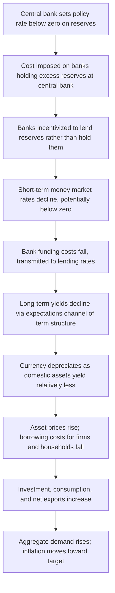

## Negative Interest Rate Policy

### Definition and Conceptual Foundation

Negative interest rate policy (NIRP) is an unconventional monetary policy tool in which a central bank sets its key policy rate—typically the rate paid or charged on commercial bank reserves held at the central bank—below zero. Rather than paying interest to commercial banks for holding reserves, the central bank charges banks a fee for holding excess reserves, effectively taxing idle liquidity to encourage lending, investment, and spending.

The theoretical rationale extends the logic of conventional interest rate policy past what was long assumed to be a hard floor at zero (the zero lower bound, ZLB). The Fisher relation linking nominal rates, real rates, and expected inflation:

$$r_t \approx i_t - E_t[\pi_{t+1}]$$

implies that if a central bank can push the nominal policy rate $i_t$ below zero, it can further reduce the real interest rate $r_t$ even when expected inflation $E_t[\pi_{t+1}]$ is low, providing additional monetary accommodation beyond what a floor of $i_t = 0$ would allow.

### Motivation: Breaching the Zero Lower Bound

Conventional macroeconomic theory long held that nominal interest rates could not meaningfully fall below zero because economic agents retain the option of holding physical currency, which yields a nominal return of exactly zero. If bank deposits or short-term instruments offered a rate below zero, agents would in principle withdraw funds and hold cash instead, arbitraging away the negative rate. This is the traditional statement of the **zero lower bound (ZLB)**.

**Key Points**

- NIRP was adopted by several central banks after the Global Financial Crisis and during the subsequent low-inflation, low-growth environment, when conventional policy rate cuts to zero were judged insufficient to close persistent output and inflation gaps.
- The tool relies on the fact that the ZLB is not a strict physical constraint but an *effective* lower bound (ELB) determined by the costs of holding and transacting in physical cash (storage, insurance, security, and transaction costs for large-scale cash holding by financial institutions), which permit policy rates to fall modestly below zero before triggering large-scale cash substitution.
- NIRP is generally applied only to a subset of bank reserves (often reserves in excess of a required or exempted tier) rather than to all money in the economy, limiting the direct pass-through to household depositors.

### Transmission Mechanism

The mechanism combines several standard channels of monetary transmission—the interest rate channel, the exchange rate channel, and the asset price/portfolio-rebalancing channel—applied at rates below the conventional zero threshold.

### Implementation Mechanics

**Key Points**

- **Tiered reserve systems**: To limit the direct cost to the banking sector, several central banks employing NIRP have implemented tiered or multi-rate systems, in which only a portion of a bank's reserves (the amount exceeding a specified multiple of required reserves) is subject to the negative rate, while the remainder earns zero or a positive rate. This mitigates the erosion of bank profitability associated with an across-the-board negative rate.
- **Interest rate corridors**: NIRP is typically implemented within a corridor system involving a deposit facility rate (the rate paid on reserves, which becomes negative), a main policy/refinancing rate, and a marginal lending facility rate, with the deposit rate serving as the binding negative rate in an environment of ample excess liquidity.
- **Pass-through to retail depositors**: Banks have generally been reluctant to pass negative rates on to retail household depositors, given the risk of triggering cash withdrawals and reputational/customer-relationship costs, though negative rates have been passed through more readily to large corporate and institutional depositors.

### Central Bank Case Studies

[Unverified: Specific rate levels and policy dates below reflect publicly documented central bank announcements as of Claude's training; users should verify current rate settings, as central banks have since exited or adjusted these policies.]

- **Danmarks Nationalbank (Denmark)**: Among the earliest adopters, introducing a negative deposit rate in 2012, primarily to defend the krone's peg to the euro rather than for standard domestic demand-management purposes.
- **European Central Bank**: Introduced a negative deposit facility rate in June 2014, progressively lowering it in subsequent years as part of a broader package with quantitative easing and long-term refinancing operations, with an explicit aim of raising inflation toward the ECB's target.
- **Swiss National Bank**: Adopted a negative policy rate in December 2014, motivated substantially by the need to counteract strong upward pressure on the Swiss franc following the discontinuation of its exchange-rate floor against the euro in January 2015.
- **Sveriges Riksbank (Sweden)**: Implemented a negative repo rate beginning in 2015, aimed at raising inflation from below-target levels, later exiting negative territory in 2019 citing diminishing marginal benefits and rising concerns about financial stability.
- **Bank of Japan**: Introduced a negative rate on a portion of financial institutions' current account balances in 2016 under a tiered system ("Quantitative and Qualitative Monetary Easing with a Negative Interest Rate"), combined subsequently with yield curve control.

### Illustrative Example

**Example**

Consider a commercial bank holding ¥100 billion in reserves at the central bank, of which ¥20 billion falls into a tier subject to a policy rate of −0.10%. Under a tiered system:

- Reserves in the exempt tier (e.g., required reserves and a macro add-on): earn 0% or a small positive rate.
- Reserves in the negative-rate tier (¥20 billion): the bank pays $¥20{,}000{,}000{,}000 \times 0.0010 = ¥20{,}000{,}000$ annually to the central bank for holding this portion idle.

This cost creates an incentive at the margin for the bank to extend additional loans, purchase securities, or otherwise deploy the reserves rather than hold them, rather than a flat charge on the bank's entire reserve holdings.

### Effects on Financial Institutions

**Key Points**

- **Bank net interest margins**: A central concern with NIRP is compression of bank profitability. Banks earn income on the spread between lending rates and deposit/funding rates; if lending rates fall alongside negative policy rates but deposit rates are constrained near zero by the reluctance to pass negative rates to retail depositors, the interest margin compresses, potentially reducing bank profitability and, in turn, banks' capacity or willingness to lend—a possible "reversal rate" phenomenon (see below).
- **Money market fund and pension fund effects**: Negative rates can compress returns for money market funds and challenge the business models of pension funds and insurers that rely on positive fixed-income yields to meet long-term liabilities.
- **Reversal rate hypothesis**: [Inference: This is a theoretical proposition, not a universally confirmed empirical finding, and the precise threshold is model- and country-dependent.] Some monetary economists have proposed that below a certain threshold, further rate cuts become contractionary rather than expansionary, because the negative effect on bank profitability and lending capacity outweighs the positive effect on borrowing incentives—termed the "reversal interest rate."

### Effects on Households and Cash Demand

**Key Points**

- Negative rates on bank reserves have generally not translated into negative rates on ordinary retail savings accounts in most jurisdictions that have implemented NIRP, due to banks' reluctance to risk deposit flight into physical cash.
- Where negative rates have been passed to large depositors (e.g., some corporate accounts, or in more extreme Swiss and Danish cases to some retail mortgage-linked savings products), the policy has tested the practical lower bound imposed by the option to hold cash.
- The existence and depth of the effective lower bound depend on the costs of large-scale cash storage; a very deeply negative rate could in principle induce large institutions to shift toward vault cash holdings, imposing storage and insurance costs that are absent from bank reserves, which effectively determines how far below zero rates can practically go.

### Exchange Rate Channel

For small open economies, NIRP can be a particularly potent tool through the exchange rate channel, per uncovered interest parity:

$$i_t - i_t^* \approx E_t[\Delta s_{t+1}]$$

where $i_t$ and $i_t^*$ are domestic and foreign interest rates and $E_t[\Delta s_{t+1}]$ is the expected rate of currency depreciation. Lowering the domestic policy rate below the foreign rate (or below zero when foreign rates are also low) creates an incentive for capital outflows, depreciating the domestic currency, which supports export competitiveness and imported inflation. This channel was central to the motivations of both the Swiss National Bank and Danmarks Nationalbank, both of which faced strong currency appreciation pressures.

### Interaction with Other Unconventional Tools

NIRP is typically deployed alongside other unconventional instruments rather than in isolation:

- **Quantitative easing (QE)**: Large-scale asset purchases work through the portfolio-balance channel and complement NIRP's effect on the short end of the yield curve, jointly compressing the entire yield curve.
- **Forward guidance**: Central banks often pair negative rates with guidance about how long negative rates (or accommodative policy generally) will persist, reinforcing the expectational channel discussed in relation to forward guidance as a distinct tool.
- **Long-term refinancing operations (targeted lending facilities)**: Programs such as the ECB's Targeted Longer-Term Refinancing Operations (TLTROs) have been used alongside NIRP to offset the negative effect on bank profitability by offering banks funding at negative rates conditional on their maintaining or expanding lending to the real economy, directly targeting the bank-lending channel.

### Risks and Limitations

**Key Points**

- **Bank profitability and financial stability risk**: Sustained negative rates can erode bank capital generation over time through margin compression, potentially inducing excessive risk-taking ("search for yield") as banks and institutional investors seek higher returns elsewhere to compensate for compressed net interest income.
- **Diminishing and possibly reversing effectiveness**: Empirical and theoretical work on the reversal rate suggests that the stimulative effect of rate cuts may weaken or reverse as rates are pushed further into negative territory, unlike the roughly linear effect assumed for cuts in positive-rate territory.
- **Effective lower bound uncertainty**: The exact threshold below which cash substitution or financial instability effects dominate is not precisely known ex ante and may vary by country, financial-system structure, and prevailing storage/transaction costs for cash, so central banks calibrate negative rates cautiously and incrementally.
- **Currency war concerns**: Because NIRP operates significantly through exchange rate depreciation for small open economies, its use can provoke concerns about competitive devaluation and retaliatory policy responses from trading partners, a criticism also leveled at aggressive QE programs.
- **Redistributive and political economy effects**: Savers, particularly retirees and pension holders dependent on fixed-income returns, may be adversely affected relative to borrowers, raising distributional and political-economy considerations distinct from the aggregate demand effects targeted by the policy.
- **Exit difficulty**: Once implemented, unwinding NIRP requires careful sequencing (with other tools such as tiering adjustments and rate normalization) to avoid disruptive effects on bank balance sheets and market expectations, and prolonged negative-rate regimes have in some cases proven difficult to exit before external inflationary shocks did so for the central bank (as observed when major central banks exited negative rates following the 2021–2022 global inflation surge). [Unverified: exact exit timing and sequencing details vary by central bank and should be verified against current central bank communications.]

### Diagram: Interest Rate Corridor with Negative Deposit Rate (svg_diagram)

<svg xmlns="http://www.w3.org/2000/svg" viewBox="0 0 700 380">
<text x="350" y="30" text-anchor="middle" font-size="18" font-weight="bold" fill="#1a1a2e">Interest Rate Corridor Under NIRP (svg_diagram)</text>
<line x1="100" y1="320" x2="600" y2="320" stroke="#333" stroke-width="2" />
<line x1="100" y1="60" x2="100" y2="320" stroke="#333" stroke-width="2" />
<text x="350" y="360" text-anchor="middle" font-size="13" fill="#333">Time</text>
<text x="40" y="190" text-anchor="middle" font-size="13" fill="#333" transform="rotate(-90 40 190)">Rate (%)</text>
<line x1="100" y1="120" x2="600" y2="120" stroke="#2980b9" stroke-width="2" stroke-dasharray="6,3" />
<text x="605" y="124" font-size="12" fill="#2980b9">Marginal lending facility (+0.25%)</text>
<line x1="100" y1="200" x2="600" y2="200" stroke="#555" stroke-width="2" />
<text x="605" y="204" font-size="12" fill="#555">Main policy rate (0.00%)</text>
<line x1="100" y1="200" x2="100" y2="320" stroke="none" />
<rect x="100" y="200" width="500" height="70" fill="#f4d1d1" opacity="0.4" />
<line x1="100" y1="270" x2="600" y2="270" stroke="#c0392b" stroke-width="3" />
<text x="605" y="274" font-size="12" fill="#c0392b" font-weight="bold">Deposit facility rate (−0.50%)</text>
<line x1="100" y1="200" x2="100" y2="200" stroke="#000" />
<text x="90" y="205" text-anchor="end" font-size="12" fill="#333">0%</text>
<line x1="95" y1="200" x2="105" y2="200" stroke="#333" stroke-width="1" />

<text x="90" y="274" text-anchor="end" font-size="12" fill="`#c0392b`">−0.5%</text>

<line x1="95" y1="270" x2="105" y2="270" stroke="#333" stroke-width="1" />

<text x="90" y="124" text-anchor="end" font-size="12" fill="`#2980b9`">+0.25%</text>

<line x1="95" y1="120" x2="105" y2="120" stroke="#333" stroke-width="1" />

<text x="130" y="245" font-size="11" fill="`#a94442`">Corridor width where excess reserves are charged</text>

</svg>

### Related Topics

- Forward guidance as a policy tool (interaction and complementarity with NIRP)
- Quantitative easing and the portfolio-balance channel
- The zero lower bound, effective lower bound, and secular stagnation
- Interest rate corridor systems and central bank operating frameworks
- Uncovered interest rate parity and exchange rate determination
- The reversal interest rate and bank lending channel of monetary policy
- Targeted longer-term refinancing operations (TLTROs) and bank-lending support facilities
- Yield curve control as a complementary or alternative tool
- Central bank digital currencies and implications for the effective lower bound
- Financial stability implications of prolonged low or negative interest rate environments