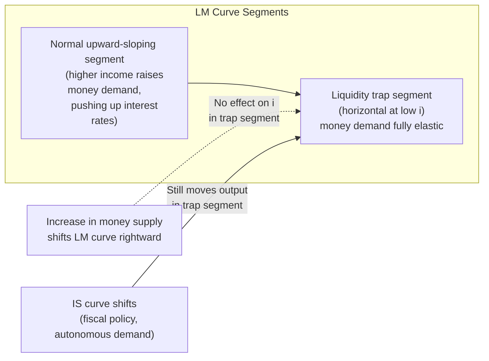
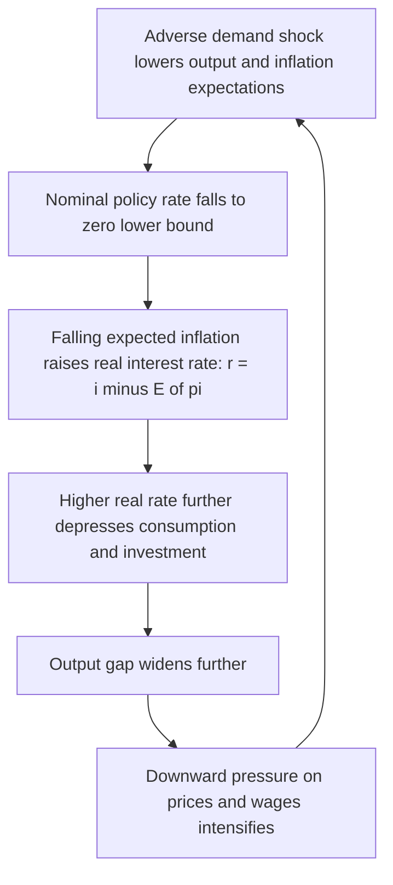

## Zero Lower Bound and Liquidity Trap

### Definition: Zero Lower Bound

The zero lower bound (ZLB), also referred to as the effective lower bound (ELB), refers to the constraint that nominal interest rates cannot fall much below zero, because economic agents retain the option to hold physical currency, which pays a nominal return of exactly zero. If a bank deposit or short-term instrument offered a sufficiently negative return, holders would in principle withdraw funds and hold cash instead, arbitraging away the negative rate.

**Key Points**

- The ZLB constrains a central bank's conventional policy tool—the short-term nominal policy interest rate—preventing it from being lowered indefinitely to stimulate demand.
- The bound is not a strict physical zero but is better described as an *effective* lower bound, since the practical costs of storing, insuring, and transacting in large quantities of physical cash allow nominal rates to fall modestly below zero (as demonstrated by negative interest rate policy) before large-scale cash substitution becomes attractive.
- The ZLB is a defining feature of monetary policy during periods of very low natural real interest rates $r^*$, low trend inflation, or large adverse demand shocks, since the nominal policy rate is bounded by $i_t \geq -\epsilon$ (where $\epsilon$ reflects effective lower bound costs) even when the interest rate implied by a standard policy rule (e.g., a Taylor rule) would call for a deeply negative rate.

### Definition: Liquidity Trap

The liquidity trap is a related but conceptually distinct idea originating in Keynesian economics, referring to a situation in which monetary policy becomes ineffective at stimulating aggregate demand because increases in the money supply fail to lower interest rates further or fail to translate into increased spending, as economic agents' demand for money becomes highly (in the limiting case, perfectly) interest-elastic.

**Key Points**

- In the original Keynesian liquidity-preference framework, a liquidity trap occurs when the demand for money becomes essentially horizontal with respect to the interest rate: at very low interest rates, agents are indifferent between holding money and holding bonds, because the opportunity cost of holding money (foregone interest) is negligible.
- In this situation, further increases in the money supply are simply absorbed into money holdings (hoarded) rather than driving interest rates down further or increasing spending, rendering conventional open market operations ineffective.
- Modern usage of the term "liquidity trap" is often used loosely to describe the ZLB predicament itself—i.e., a situation where the central bank cannot further lower rates and conventional monetary policy loses traction—though the precise mechanism (money demand elasticity vs. a literal floor on nominal rates) differs from Keynes's original formulation. [Inference: The degree to which the modern ZLB phenomenon is best understood through the lens of Keynes's original liquidity-preference mechanism versus simply as a floor-constraint problem is a matter of ongoing theoretical interpretation among macroeconomists.]

### The IS-LM Depiction of the Liquidity Trap

In the traditional IS-LM framework, the liquidity trap corresponds to the horizontal (flat) segment of the LM curve at very low interest rates.

In the liquidity trap segment, a rightward shift of the LM curve (expansionary monetary policy) has no effect on the equilibrium interest rate or output, because the LM curve is flat at that interest rate level. By contrast, a shift of the IS curve (e.g., via expansionary fiscal policy) still moves equilibrium output, which is the traditional Keynesian argument for the primacy of fiscal policy over monetary policy in a liquidity trap.

### Fisher Relation and the Real Rate Constraint

The macroeconomic significance of the ZLB is best understood through the Fisher relation connecting nominal rates, real rates, and expected inflation:

$$r_t \approx i_t - E_t[\pi_{t+1}]$$

If the natural real rate of interest $r_t^*$ (the real rate consistent with output at potential and stable inflation) falls below $-E_t[\pi_{t+1}]$, then the nominal policy rate required to close the output gap, $i_t^* = r_t^* + E_t[\pi_{t+1}]$, would need to be negative. If the ZLB prevents $i_t$ from falling to $i_t^*$, the actual real rate $r_t = i_t - E_t[\pi_{t+1}]$ remains above the natural rate $r_t^*$, leaving monetary policy too tight relative to what is needed, and the economy operates with a persistent negative output gap and downward pressure on inflation.

**Example**

Suppose the natural real rate $r_t^*$ has fallen to $-3\%$ due to a severe deleveraging shock, and expected inflation $E_t[\pi_{t+1}]$ is $1\%$. The interest rate rule would call for a nominal policy rate of:

$$i_t^* = r_t^* + E_t[\pi_{t+1}] = -3\% + 1\% = -2\%$$

If the effective lower bound prevents the central bank from setting $i_t$ below approximately $-0.5\%$, actual policy is constrained to $i_t = -0.5\%$, yielding an actual real rate of $r_t = -0.5\% - 1\% = -1.5\%$, which remains $1.5$ percentage points too high relative to the $-3\%$ rate needed to support output at potential. The resulting real rate gap is a direct source of the output gap and disinflationary pressure characteristic of ZLB episodes.

### Deflationary Spiral Dynamics

A particularly severe risk associated with the ZLB is a self-reinforcing deflationary spiral, in which falling inflation (or outright deflation) raises real interest rates precisely when the central bank is unable to offset this by lowering nominal rates further, since $i_t$ is already at its floor.

This feedback loop is the formal mechanism behind concerns about a deflationary spiral: because the central bank cannot lower $i_t$ to offset falling $E_t[\pi_{t+1}]$, the real rate rises endogenously as expected inflation falls, which further weakens demand and puts additional downward pressure on prices, reinforcing the initial deflationary shock.

### Causes of a Binding Zero Lower Bound

**Key Points**

- **Large adverse demand shocks**: Severe financial crises, deleveraging episodes, or pandemics can sharply reduce current and expected future aggregate demand, pushing the natural real rate $r^*$ deeply negative.
- **Secular stagnation**: A structural, longer-run decline in the natural real rate of interest, attributed by proponents to factors such as demographic aging, slower productivity growth, elevated desired saving (including precautionary saving and saving by aging populations), and a global "saving glut," can leave the natural rate persistently low or negative even absent an acute crisis, making ZLB episodes more frequent and more prolonged. [Inference: The secular stagnation hypothesis and the relative importance of its proposed drivers remain subjects of active debate among macroeconomists rather than settled fact.]
- **Low trend inflation targets**: A low inflation target (e.g., 2%) provides a smaller buffer of nominal interest rate "room" before the ZLB binds, compared to a higher inflation target, since the average nominal policy rate over the business cycle is lower the lower is trend inflation—an argument advanced by some economists for raising inflation targets to increase policy space.

### Policy Responses to a Binding Zero Lower Bound

Because the ZLB disables the conventional interest-rate channel of monetary policy, central banks facing a binding ZLB have developed a suite of unconventional tools, several of which are covered as related items in this chapter:

- **Forward guidance**: Communicating an intention to hold rates low for longer than a standard reaction function would imply, lowering the expected future path of short rates and thus current long-term real rates even while the current short rate is stuck at the ZLB.
- **Negative interest rate policy (NIRP)**: Pushing the policy rate modestly below the strict zero floor by exploiting the gap between the true (physical currency) ZLB and the higher effective lower bound faced by financial institutions.
- **Quantitative easing (QE)**: Large-scale asset purchases that lower long-term yields directly via portfolio-balance and duration-risk-premium effects, bypassing the need to move the short-term policy rate.
- **Yield curve control**: Directly targeting a level for medium- or long-term government bond yields, backed by a commitment to purchase unlimited quantities of bonds as needed.
- **Raising the inflation target or price-level/average-inflation targeting**: Structural approaches intended to increase the average distance of nominal rates from zero over time and to make monetary accommodation more credible during ZLB episodes by promising a period of above-target inflation to offset earlier shortfalls.
- **Expansionary fiscal policy**: Since the traditional Keynesian liquidity-trap analysis implies fiscal multipliers are typically larger at the ZLB (because expansionary fiscal policy does not crowd out private investment via higher interest rates when rates are already floored), many economists argue fiscal policy becomes a relatively more effective and important stabilization tool during ZLB episodes. [Inference: The magnitude of the increase in fiscal multipliers at the ZLB, while supported by a range of theoretical models, varies considerably across empirical studies and model specifications.]

### Fiscal-Monetary Interaction at the ZLB

**Key Points**

- Standard Mundell-Fleming and IS-LM intuition holds that fiscal expansion normally raises interest rates (crowding out some private investment) as government borrowing increases the demand for loanable funds. At a binding ZLB, however, the central bank is not raising rates in response to the fiscal expansion (since it is already at the floor), so this crowding-out channel is muted or absent, amplifying the output effect of a given fiscal stimulus relative to a normal-times environment.
- This forms the theoretical basis for the widely cited (though empirically debated) proposition that government spending multipliers are larger during ZLB episodes than during normal times, an argument that gained significant attention following the 2008 financial crisis and that continued to inform debate around COVID-19-era fiscal responses in 2020–2021.
- Coordination between fiscal and monetary authorities—sometimes discussed under headings such as "monetary-fiscal policy mix" or, in more extreme forms, ideas resembling fiscal dominance—becomes a more salient policy consideration once the central bank's conventional tool is constrained.

### Historical Episodes

[Unverified: Historical details below reflect widely documented macroeconomic episodes as of Claude's training; specific figures should be verified against primary central bank and government sources for precise dating and magnitudes.]

- **Japan, 1990s–2010s**: Often cited as the paradigmatic modern liquidity-trap/ZLB episode, following the bursting of Japan's asset price bubble in the early 1990s. The Bank of Japan lowered its policy rate to near zero by the late 1990s and subsequently pursued a series of unconventional measures—quantitative easing, negative rates, and yield curve control—against a backdrop of prolonged low growth and periods of outright deflation.
- **United States, European area, and other advanced economies, 2008–2015**: Following the Global Financial Crisis, major central banks including the Federal Reserve, Bank of England, and eventually the European Central Bank reduced policy rates to or near zero and adopted large-scale asset purchase programs and forward guidance, motivated by concerns about a binding ZLB constraint amid severe demand shortfalls.
- **Global response to COVID-19, 2020**: Central banks across advanced economies again reduced policy rates to or near zero (with several already below zero prior to the pandemic) and expanded asset purchase programs, while governments undertook large fiscal expansions, reflecting the fiscal-monetary policy mix considerations associated with a binding ZLB.

### Distinguishing the ZLB from the Liquidity Trap: A Note on Terminology

**Key Points**

- Strictly, the zero lower bound refers to the *constraint* on the nominal interest rate instrument itself (a floor near zero).
- The liquidity trap, in its original Keynesian sense, refers to a *behavioral* feature of money demand (infinite interest-elasticity) that renders open market operations ineffective even before considering whether rates have technically reached zero.
- In contemporary macroeconomic discourse and central banking practice, the two terms are frequently used interchangeably to describe situations in which conventional monetary policy has exhausted its capacity to stimulate demand via the short-term policy rate, though the precise underlying mechanism differs across the Keynesian liquidity-preference framework and modern New Keynesian ZLB models built around an explicit non-negativity (or near-zero) constraint on the nominal rate in the central bank's reaction function.

### Related Topics

- Forward guidance as a policy tool
- Negative interest rate policy
- Quantitative easing and the portfolio-balance channel
- Yield curve control
- Secular stagnation and the decline in the natural rate of interest
- Fiscal multipliers and the fiscal-monetary policy mix at the zero lower bound
- Price-level targeting and average-inflation targeting as frameworks for raising the inflation target's effective policy space
- The IS-LM model and its extensions to unconventional monetary policy
- Debt deflation and Irving Fisher's theory of deflationary spirals
- Japan's "Lost Decades" as a case study in prolonged ZLB dynamics