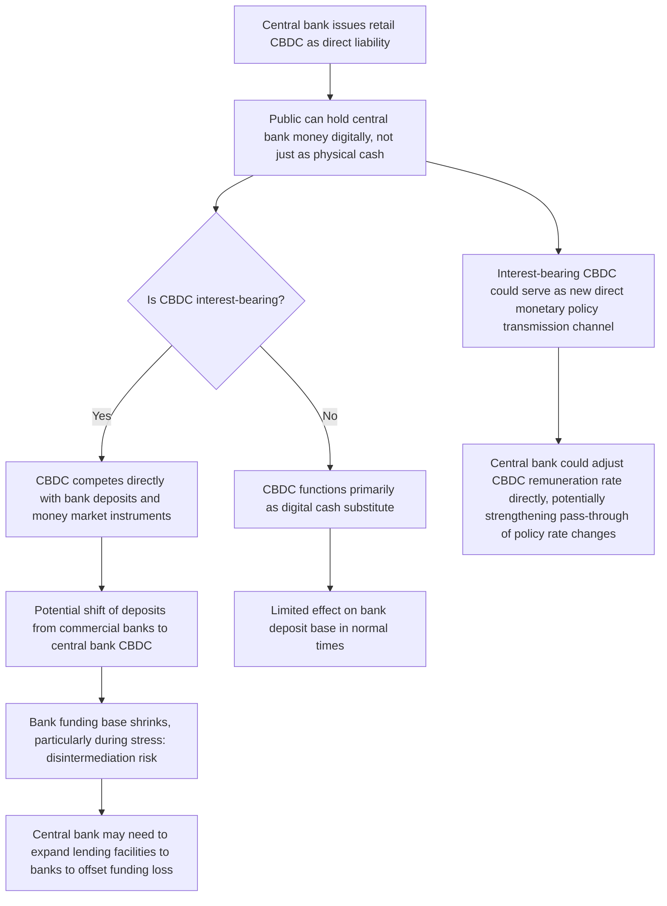

## Central Bank Digital Currencies

### Definition and Classification

A central bank digital currency (CBDC) is a digital form of a sovereign currency issued directly by a country's central bank, constituting a direct liability of the central bank rather than of a commercial bank or private company. This distinguishes a CBDC from both commercial bank deposits (which are liabilities of the issuing commercial bank, subject to that bank's credit risk) and privately issued stablecoins (which are liabilities of a private company, typically backed by a reserve of assets).

**Key Points**

- A CBDC sits on the central bank's balance sheet in the same conceptual position as physical banknotes and coins, but in digital form.
- CBDCs are generally categorized into two broad types:
  - **Retail CBDC**: Issued directly to households and businesses, functioning as a digital equivalent of physical cash for everyday transactions.
  - **Wholesale CBDC**: Restricted to financial institutions, used for interbank settlement and securities transactions, generally viewed as a natural digital extension of existing central bank reserve balances rather than a retail payment innovation.
- As of April 2026, five CBDCs are in live retail or quasi-retail production, with roughly 40 in pilot stage. [eco](https://eco.com/support/en/articles/12005811-what-is-a-cbdc-2026-update)

### Motivation and Policy Rationale

**Key Points**

- **Preserving access to central bank money**: As cash usage declines in many economies, some central banks view a retail CBDC as a way to ensure the public retains direct access to risk-free central bank money alongside privately issued forms of money (commercial bank deposits, stablecoins).
- **Payment system efficiency and innovation**: CBDCs are often framed as a tool for improving the speed, cost, and resilience of domestic and cross-border payments, and for providing a public digital payment rail that can support private-sector innovation on top of it.
- **Financial inclusion**: In several emerging-market and developing-economy deployments, retail CBDCs have been motivated substantially by financial inclusion objectives—providing a low-cost digital payment instrument to underbanked populations without requiring a commercial bank account.
- **Monetary sovereignty and competition with private/foreign digital money**: Central banks in several jurisdictions have cited a need to maintain monetary sovereignty and control over the payment system in the face of growing use of private stablecoins and, in some cases, foreign digital currencies.
- **Cross-border settlement efficiency**: Wholesale CBDC projects are frequently motivated by the goal of reducing the cost, time, and counterparty risk associated with cross-border interbank settlement, which today typically relies on correspondent banking networks.

### Design Dimensions

CBDC design involves several largely independent architectural choices, each carrying distinct macroeconomic and operational implications.

#### Access Model: Retail vs. Wholesale

Discussed above; the two models raise materially different considerations. Retail CBDC design must address competition with commercial bank deposits and implications for bank funding, while wholesale CBDC design is primarily an interbank settlement infrastructure question.

#### Architecture: Direct, Indirect (Two-Tier), and Hybrid Models

- **Direct model**: The central bank maintains the ledger and account/wallet relationship directly with end users. Rarely adopted in full due to the operational burden placed on the central bank (customer service, KYC/AML compliance, fraud handling).
- **Indirect (two-tier/intermediated) model**: The central bank issues the CBDC and maintains the core ledger, but commercial banks or licensed payment service providers handle customer-facing functions—onboarding, wallets, compliance, and customer support. This is the design favored by most major central bank CBDC investigations, including the digital euro project, as it preserves the existing role of commercial banks in the payment system.
- **Hybrid model**: A variant of the two-tier model in which the central bank retains a copy of transaction records or exercises direct oversight of the ledger, even though intermediaries handle the customer relationship, offering the central bank greater operational resilience and oversight than a fully indirect model.

#### Ledger Technology

- **Distributed ledger technology (DLT)/blockchain-based**: Some pilots (including several wholesale projects) use permissioned DLT platforms to explore benefits such as atomic settlement (simultaneous, all-or-nothing exchange of two assets) and programmability via smart contracts.
- **Conventional centralized ledger**: Many live retail CBDCs (e.g., early Bahamas and Jamaica deployments) use conventional centralized database architectures rather than DLT, reflecting that DLT is not a necessary condition for CBDC issuance—the defining feature of a CBDC is the nature of the liability (a central bank claim), not the underlying technology.
- [Inference: The choice between DLT and conventional architectures for large-scale retail CBDC systems remains an active area of central bank experimentation, and no clear technological consensus has emerged as the standard approach across jurisdictions.]

#### Remuneration (Interest-Bearing vs. Non-Interest-Bearing)

Whether a retail CBDC pays interest is a first-order design choice with significant implications for monetary transmission and bank disintermediation (discussed below). Russia's digital ruble design specifies no interest on individual holdings, a common design choice intended to limit competition with commercial bank deposits. [private](https://wiki.private.law/en/cbdc-landscape.md)

#### Holding Limits and Privacy

- **Holding limits (caps)**: Many designs, including the digital euro project, contemplate per-person holding caps on retail CBDC balances, intended to limit the scale of potential deposit substitution during stress periods (see disintermediation risk below).
- **Privacy**: Central banks have generally proposed a tiered privacy model—offering cash-like anonymity for very low-value transactions while requiring standard KYC/AML identification and transaction monitoring for larger transactions—reflecting the tension between privacy preferences (a frequently cited public concern in consultations) and anti-money-laundering/counter-terrorist-financing obligations.

### Transmission and Macroeconomic Channels

**Key Points**

- **Bank disintermediation risk**: If a CBDC is designed to be an attractive store of value (particularly if interest-bearing or perceived as safer than bank deposits during periods of financial stress), it could draw funds away from commercial bank deposits. This is a central concern raised by commercial banks and some central banks, since bank deposits fund a significant share of bank lending; a large-scale shift could raise bank funding costs and constrain credit supply.
- **Digital bank run risk**: In a crisis, a readily accessible, risk-free CBDC could make it easier and faster for depositors to withdraw funds from a troubled commercial bank than under a physical-cash-based system, potentially accelerating bank runs. This has motivated the widespread adoption of holding caps in retail CBDC designs.
- **A potential new monetary policy channel**: An interest-bearing CBDC could in principle give a central bank a more direct tool for transmitting policy rate changes to the public, though this remains largely a theoretical possibility rather than an implemented practice among major central banks, most of which have opted for non-interest-bearing retail CBDC designs specifically to avoid this degree of direct competition with the banking sector.
- **Implications for negative interest rate policy**: Some economists have noted that a purely electronic form of central bank money—particularly if physical cash were phased out or de-emphasized—could in principle allow deeper negative interest rates by removing the cash-substitution constraint that underlies the effective lower bound, though this remains a theoretical and politically contentious possibility rather than a stated design objective of current CBDC projects.

### Global Landscape (as of mid-2026)

[Unverified: Program statuses, dates, and figures below reflect information gathered via web search current to mid-2026 and are subject to further change; verify against central bank primary sources for the latest status.]

According to the Atlantic Council CBDC Tracker, 134 countries representing 98% of global GDP are exploring a CBDC in some form, up from 35 in 2020. By August 2026 the global landscape has split into three broad camps: the euro area and Russia are building retail CBDCs by statute, the United States has prohibited a retail CBDC and directed digital-dollar development toward private issuers, and Hong Kong, Switzerland, and effectively the United Kingdom have concentrated on wholesale experiments instead. [eco](https://eco.com/support/en/articles/15210561)[private](https://wiki.private.law/en/cbdc-landscape)

**Live Retail Deployments**

- Three retail CBDCs are live and circulating in the Bahamas (Sand Dollar), Jamaica (JAM-DEX), and Nigeria (eNaira). [eco](https://eco.com/support/en/articles/15210561)
- China's e-CNY has continued expanding cross-border functionality; in September 2025 the People's Bank of China opened an international e-CNY operations center in Shanghai, and by June 2026 26 institutions had joined the cross-border e-CNY transfer service, including a mainland subsidiary of a major international bank. Cumulative e-CNY transaction volume has reportedly reached into the trillions of yuan, though precise figures vary by source and reporting date. [private](https://wiki.private.law/en/cbdc-landscape)

**Digital Euro (Eurozone)**

- The European Central Bank has stated it aims to be ready for a potential first issuance of the digital euro during 2029, contingent on adoption of the digital euro Regulation in 2026, and plans a 12-month pilot starting in the second half of 2027.
- ECB research has found that many consumers would be open to using a digital form of central bank money—effectively a digital equivalent of cash.

**Digital Ruble (Russia)**

- Russia has set a mandatory statutory rollout calendar under Federal Law No. 248-FZ of 23 July 2025: from September 1, 2026, systemically important banks and their larger merchant clients must support digital ruble operations, with further waves extending obligations to smaller banks and merchants through September 2028. [private](https://wiki.private.law/en/cbdc-landscape.md)
- Adoption remains voluntary for individuals, who may hold one wallet per person through any participating bank, with no interest paid on balances. [private](https://wiki.private.law/en/cbdc-landscape.md)

**United States**

- Following passage of the GENIUS Act, signed into law on July 18, 2025, the Federal Reserve has been explicitly prohibited from issuing a retail CBDC, with U.S. policy instead directing digital-dollar-type functionality toward regulated private stablecoin issuers. [eco](https://eco.com/support/en/articles/15210561)

**United Kingdom**

- The Bank of England had made no final decision on the digital pound as of mid-2026; following a Blueprint design note in November 2025, the Deputy Governor indicated to Parliament in March 2026 that a retail CBDC decision was expected within the year. [private](https://wiki.private.law/en/cbdc-landscape.md)

**Wholesale-Focused Jurisdictions**

- Hong Kong shifted its emphasis toward wholesale applications after completing Phase 2 of the e-HKD pilot in October 2025, concluding that tokenized deposits achieve comparable results in retail scenarios, and redirecting focus to large-value settlement and asset tokenization. [private](https://wiki.private.law/en/cbdc-landscape)
- Switzerland's Helvetia pilot, settling tokenized securities in central bank money on a wholesale basis, has been extended to at least mid-2027, with the Swiss National Bank emphasizing this does not constitute a commitment to a permanent wholesale CBDC. [private](https://wiki.private.law/en/cbdc-landscape.md)
- Wholesale projects such as Project Agorá and the Swiss National Bank's Helvetia are live or in late-stage pilot internationally. [eco](https://eco.com/support/en/articles/12005811-what-is-a-cbdc-2026-update)

**Cross-Border Settlement Infrastructure**

- The mBridge platform, a multi-central-bank cross-border wholesale CBDC settlement project which the Bank for International Settlements exited in 2024, continues to operate under its remaining member central banks led by China, with cumulative settlement volumes reported in the hundreds of billions of yuan. [private](https://wiki.private.law/en/cbdc-landscape)

### CBDC vs. Stablecoin: A Clarifying Distinction

**Key Points**

- A CBDC is central bank money in digital form and a direct liability of the currency's issuer, distinct from a commercial bank deposit (a claim on a bank) and from a private stablecoin (a claim on a company). [private](https://wiki.private.law/en/cbdc-landscape)
- Because a CBDC carries the credit standing of the sovereign issuer, it is generally regarded as carrying negligible credit risk in the currency of issuance, analogous to physical cash—unlike stablecoins, whose credit quality depends on the composition and management of the issuer's reserve assets, and unlike bank deposits, which depend on the solvency of the issuing bank (subject to deposit insurance limits where applicable).
- Several advanced economies have, in effect, deprioritized retail CBDCs in favor of regulated private stablecoin frameworks, reflecting a policy choice about which institutional layer (public central bank vs. regulated private issuers) should provide the "digital cash" function in the payment system—a live and jurisdiction-specific policy debate rather than a settled global consensus. [eco](https://eco.com/support/en/articles/12005811-what-is-a-cbdc-2026-update)

### Risks and Open Policy Debates

**Key Points**

- **Financial stability and disintermediation**, as discussed above, remains the most frequently cited risk among commercial banks and several central banks, driving the widespread adoption of holding caps and non-interest-bearing designs.
- **Privacy versus compliance tension**: Public consultations across jurisdictions have consistently surfaced strong public concern about transaction surveillance and privacy, creating design pressure for cash-like anonymity at low transaction values, in tension with anti-money-laundering and counter-terrorism-financing requirements that apply to larger transactions.
- **Operational resilience and cyber risk**: A retail CBDC operating at national scale introduces a systemically important piece of digital infrastructure that must be resilient to outages, fraud, and cyberattack, raising significant operational and security engineering requirements for the central bank and its intermediary partners.
- **Cross-border spillovers and currency substitution**: A widely accessible, low-friction foreign retail CBDC could in principle facilitate currency substitution ("digital dollarization" or its equivalent) in economies with weaker currencies or higher inflation, a concern raised particularly by emerging-market central banks regarding major-currency CBDC projects.
- **Monetary sovereignty versus private-sector competition**: The divergent U.S. and EU/Russian approaches illustrate an unresolved global policy debate about whether the "digital cash" function of the future payment system should be provided primarily by central banks directly (retail CBDC) or by regulated private issuers operating under a central-bank-set regulatory perimeter (stablecoins)—a choice with distinct implications for monetary control, competition, and financial stability that different major economies are currently resolving in different directions.
- [Speculation: Given the substantial divergence in national approaches evident by mid-2026, it remains genuinely uncertain whether a single dominant global model (central-bank-issued retail CBDC vs. regulated private stablecoin) will emerge over the coming decade, or whether jurisdictions will continue to pursue materially different institutional architectures for digital sovereign money.]

### Related Topics

- Zero lower bound and liquidity trap (implications of CBDC for the effective lower bound)
- Negative interest rate policy (interaction with electronic/digital central bank money)
- The money supply, monetary base, and central bank balance sheet mechanics
- Stablecoins and private digital money: design and regulation
- Financial stability and the lender-of-last-resort function of central banks
- Cross-border payment systems and correspondent banking
- Bank disintermediation and the credit channel of monetary policy
- Financial inclusion and access to formal financial services
- Anti-money-laundering (AML) and know-your-customer (KYC) frameworks in digital payments
- Distributed ledger technology and permissioned blockchain architectures in financial infrastructure