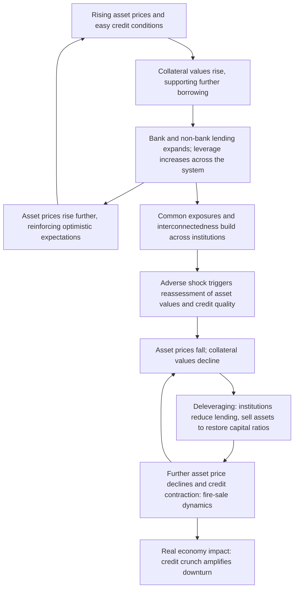

## Macroprudential Policy and Financial Stability Mandates

### Definition and Conceptual Foundation

Macroprudential policy refers to the use of regulatory and supervisory tools to safeguard the stability of the financial system *as a whole*, as distinct from microprudential regulation, which focuses on the safety and soundness of *individual* financial institutions. The core conceptual innovation of macroprudential policy is its focus on **systemic risk**—risk that arises from the interconnectedness of financial institutions, common exposures across the system, and the procyclical interaction between the financial system and the real economy—rather than on the idiosyncratic risk of any single firm.

**Key Points**

- A central insight motivating macroprudential policy is that a financial system can be unstable even if every individual institution appears well-capitalized and well-managed in isolation, because risks can build up collectively (e.g., through common asset exposures, correlated funding structures, or a shared procyclical response to rising asset prices) in ways that microprudential, firm-by-firm supervision does not capture.
- Macroprudential policy gained substantial prominence as a distinct policy domain following the 2008 Global Financial Crisis, which exposed the limitations of a purely microprudential regulatory approach and of monetary policy frameworks that did not explicitly account for financial stability risks.
- The tools of macroprudential policy are generally distinguished by whether they target the **time dimension** of systemic risk (how risk builds up and unwinds over the credit/financial cycle) or the **cross-sectional dimension** (how risk is distributed across institutions at a point in time, particularly through interconnectedness and common exposures).

### Relationship Between Macroprudential Policy and Monetary Policy

**Key Points**

- Monetary policy and macroprudential policy share overlapping transmission channels—both influence credit conditions, asset prices, and leverage in the economy—but are conventionally assigned to different mandates: monetary policy targets price stability (and, in dual-mandate frameworks, employment/output), while macroprudential policy targets financial stability.
- **The "leaning against the wind" debate**: A long-running debate concerns whether a central bank should use its conventional policy rate to address financial stability risks (e.g., raising rates to curb a credit or asset-price boom even if inflation and output objectives alone would not call for tightening) or whether financial stability risks should be addressed exclusively through dedicated macroprudential tools, leaving monetary policy focused narrowly on its price-stability mandate. [Inference: The relative weight that should be given to "leaning against the wind" via interest rates versus reliance on macroprudential tools remains an unresolved and actively debated question in both academic research and central bank practice, with substantial divergence in stated approaches across jurisdictions.]
- Macroprudential tools are generally viewed as more targeted instruments for addressing financial stability risks because they can be directed at specific sectors or types of risk-taking (e.g., mortgage lending standards) without the broad, economy-wide effects of an interest rate change, which affects all sectors simultaneously.
- In many jurisdictions, macroprudential policy is conducted by the central bank itself (sometimes through a dedicated financial stability committee), while in others it is assigned to a separate or joint body involving multiple regulatory agencies, reflecting differing institutional views on how closely financial stability and monetary policy mandates should be integrated.

### The Financial Cycle and Procyclicality

A foundational concept underlying macroprudential policy is the **financial cycle**—the tendency of credit growth, leverage, and asset prices (particularly real estate and equity prices) to move together in self-reinforcing upswings and downswings, often on a longer time horizon than the conventional business cycle.

**Key Points**

- **Procyclicality** refers to the tendency of financial system behavior to amplify, rather than dampen, the underlying business and financial cycle: lending standards loosen and leverage rises during upswings, while credit contracts and deleveraging accelerates during downswings, in both cases reinforcing the direction of the cycle.
- **Fire-sale dynamics** and **fallacy-of-composition** effects are central to why individually rational actions (e.g., a single bank selling assets to shore up its capital ratio) can be collectively destabilizing (widespread asset sales depress prices further, forcing further deleveraging across the system)—a canonical example of the systemic risk that macroprudential policy aims to address.
- Macroprudential tools that vary with the phase of the financial cycle (described below as "time-dimension" tools) are explicitly designed to counteract this procyclicality, building buffers during upswings that can be released during downswings.

### Time-Dimension Tools (Addressing Procyclicality)

#### Countercyclical Capital Buffer (CCyB)

A capital requirement that varies over the credit cycle, requiring banks to hold additional capital during periods of excessive credit growth (which can be released during downturns to absorb losses and support continued lending), formalized under the Basel III international regulatory framework.

**Example**

A national regulator observes that the credit-to-GDP gap—the deviation of the ratio of private credit to GDP from its long-run trend, a widely used (though imperfect) early-warning indicator for credit booms—has widened significantly. The regulator raises the countercyclical capital buffer rate from 0% to 1.5% of risk-weighted assets, requiring banks to build additional capital over a defined implementation period. If a downturn subsequently materializes, the regulator can release the buffer, freeing up bank capital to absorb losses or support continued lending rather than triggering a sharp credit contraction.

#### Loan-to-Value (LTV) and Debt-Service-to-Income (DSTI) Limits

Caps on the size of a loan relative to the value of the underlying collateral (LTV) or relative to a borrower's income and existing debt obligations (DSTI/DTI), typically applied to residential mortgage lending, aimed at limiting excessive household leverage during property market booms.

**Key Points**

- These borrower-based tools directly constrain the terms on which new credit is extended, distinguishing them from bank-based capital tools that operate indirectly through lender balance sheets.
- LTV and DSTI limits have been widely used in economies with a history of pronounced housing cycles, and are frequently tightened during periods of rapid house price appreciation and loosened during downturns.

#### Dynamic Provisioning

A requirement that banks build loan-loss provisions based on expected losses over the full credit cycle (rather than only recognizing losses once they materialize), building a buffer during good times that can be drawn down during downturns—an approach notably pioneered by the Bank of Spain prior to the Global Financial Crisis.

### Cross-Sectional Tools (Addressing Interconnectedness and Concentration Risk)

#### Capital Surcharges for Systemically Important Financial Institutions (SIFIs)

Additional capital requirements imposed on institutions designated as systemically important—whether globally (G-SIBs, global systemically important banks) or domestically (D-SIBs)—reflecting the greater potential damage to the financial system and real economy from the failure or distress of a large, interconnected institution relative to a smaller one, and intended to internalize this externality by requiring such institutions to hold a larger capital cushion.

#### Large Exposure Limits and Concentration Limits

Restrictions on the size of a financial institution's exposure to a single counterparty, sector, or asset class, intended to limit contagion risk arising from concentrated exposures and common risk factors across the system.

#### Liquidity Requirements

Standards such as the Liquidity Coverage Ratio (LCR, requiring sufficient high-quality liquid assets to survive a 30-day stress scenario) and the Net Stable Funding Ratio (NSFR, requiring a stable funding profile relative to the liquidity of assets held), both introduced under Basel III, aimed at reducing the risk of destabilizing liquidity and maturity-mismatch-driven runs, which played a central role in the 2008 crisis (particularly in wholesale funding markets and shadow banking).

### Institutional Architecture of Macroprudential Mandates

**Key Points**

- **Central-bank-housed model**: In some jurisdictions, the central bank itself holds macroprudential authority, often exercised through a dedicated financial policy or financial stability committee, on the premise that financial stability responsibilities are closely linked to the central bank's existing lender-of-last-resort function, payment system oversight, and monetary policy expertise.
- **Inter-agency committee model**: In other jurisdictions, macroprudential policy is coordinated through a dedicated council or committee bringing together the central bank, banking supervisors, securities regulators, and finance ministries, reflecting the view that systemic risk can arise across multiple parts of the financial system (banking, insurance, securities markets, shadow banking) that fall under different regulatory authorities.
- **Separate macroprudential authority model**: A smaller number of jurisdictions have established a dedicated standalone macroprudential authority distinct from both the central bank and existing microprudential supervisors.
- A recurring institutional design tension is between **independence and accountability**: macroprudential tools (e.g., LTV limits, capital buffers) can have significant distributional and political consequences (e.g., constraining first-time homebuyers' access to mortgage credit), raising questions about the appropriate degree of insulation from short-term political pressure versus democratic accountability, paralleling similar debates regarding central bank independence in the conduct of monetary policy.

### Early-Warning Indicators and Risk Assessment

**Key Points**

- **Credit-to-GDP gap**: The most widely referenced (though imperfect) early-warning indicator, measuring the deviation of the ratio of private-sector credit to GDP from its long-term trend; incorporated into the official Basel III guidance for calibrating the countercyclical capital buffer.
- **House price-to-income and house price-to-rent ratios**: Used to assess whether property valuations have diverged significantly from underlying fundamentals, informing the calibration of LTV/DSTI limits.
- **Bank leverage ratios, wholesale funding dependence, and maturity mismatch indicators**: Used to assess the vulnerability of the banking system to funding shocks and asset-price declines.
- **Interconnectedness and network analysis**: Techniques drawing on network theory to map exposures between financial institutions, used to identify concentrations of counterparty risk and channels for contagion.
- [Inference: The predictive reliability of any single early-warning indicator for future financial crises is limited and contested in the empirical literature; most macroprudential frameworks rely on a suite of indicators combined with supervisory judgment rather than any single metric applied mechanically.]

### Post-2008 International Regulatory Reforms

The 2008 Global Financial Crisis prompted a substantial expansion of the international regulatory architecture around financial stability, primarily codified under the **Basel III** framework developed by the Basel Committee on Banking Supervision, alongside enhanced macroprudential oversight arrangements established in major jurisdictions (such as dedicated financial stability oversight councils and committees created in the years following the crisis).

**Key Points**

- Basel III introduced higher minimum capital requirements, the countercyclical capital buffer, capital conservation buffers, the leverage ratio (a non-risk-weighted backstop measure), and the liquidity standards (LCR and NSFR) described above.
- The framework also introduced enhanced requirements for globally and domestically systemically important banks, reflecting the cross-sectional dimension of systemic risk.
- [Unverified: The precise calibration, phase-in timelines, and jurisdiction-specific implementation details of Basel III (and subsequent revisions sometimes referred to as "Basel IV") have continued to evolve and should be verified against current regulatory publications for up-to-date parameters.]

### Illustrative Example: A Macroprudential Policy Cycle

**Example**

1. **Boom phase**: A central bank's financial stability monitoring identifies rapid house price appreciation, a widening credit-to-GDP gap, and rising average mortgage LTV ratios among new originations.
2. **Tightening response**: The macroprudential authority lowers the maximum permissible LTV ratio for new mortgages (e.g., from 90% to 80%) and raises the countercyclical capital buffer rate, requiring banks to hold additional capital against new lending.
3. **Effect**: New mortgage credit growth slows as fewer borrowers qualify under the tighter LTV limit, and banks' capacity to expand lending further is constrained by the higher capital requirement, without any change to the central bank's policy interest rate (leaving monetary policy free to focus on its inflation and output objectives).
4. **Downturn phase**: A subsequent adverse shock causes house prices to fall and loan losses to rise. The regulator releases the countercyclical capital buffer, freeing up bank capital that can absorb losses or be redeployed to support continued lending, cushioning the credit contraction that would otherwise deepen the downturn.

### Risks, Limitations, and Open Debates

**Key Points**

- **Leakage and regulatory arbitrage**: Tightening macroprudential requirements on regulated banks can push lending activity toward less-regulated non-bank financial intermediaries ("shadow banking"), potentially displacing rather than eliminating systemic risk, unless the macroprudential perimeter is extended to cover these entities as well.
- **Calibration uncertainty**: Because systemic risk is difficult to measure precisely and early-warning indicators are imperfect, calibrating the appropriate tightness of macroprudential tools (e.g., the exact CCyB rate or LTV limit) involves substantial judgment and carries risk of both under- and over-tightening.
- **Cross-border coordination challenges**: Since financial institutions and capital flows operate across borders, macroprudential measures implemented unilaterally by one jurisdiction can be partially circumvented through cross-border lending or capital flows, motivating international coordination efforts (e.g., reciprocal recognition of countercyclical capital buffer rates across jurisdictions).
- **Distributional consequences and political economy**: Borrower-based tools such as LTV and DSTI limits directly affect access to credit, particularly for first-time homebuyers and lower-income borrowers, raising distributional considerations that can generate political resistance to macroprudential tightening, especially during property market booms when such measures are most needed but least popular.
- **Interaction effects with monetary policy**: Because macroprudential and monetary policy operate through overlapping channels, uncoordinated use of the two policy domains can produce offsetting or reinforcing effects that are difficult to fully anticipate, an active area of both theoretical modeling and empirical research. [Inference: The degree of interaction and potential for policy conflict between macroprudential and monetary policy is better established in principle than precisely quantified in practice, given the relatively short historical record of dedicated macroprudential policy implementation since 2008.]

### Related Topics

- Basel III capital and liquidity standards
- Systemic risk and financial contagion
- The lender-of-last-resort function of central banks
- Shadow banking and non-bank financial intermediation
- Central bank independence and accountability
- Forward guidance as a policy tool (interaction with financial stability considerations)
- The credit cycle and asset price bubbles
- Stress testing of financial institutions
- Deposit insurance and bank resolution frameworks
- The 2008 Global Financial Crisis as a case study in systemic risk