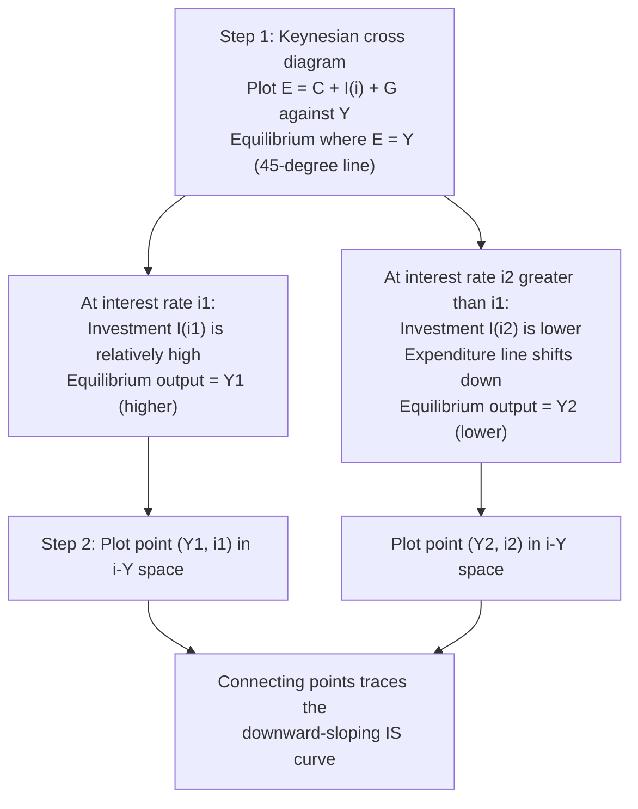

## Deriving the IS Curve from the Goods Market

### Definition and Conceptual Foundation

The IS curve represents the set of combinations of the interest rate and the level of output (income) for which the **goods market is in equilibrium**—that is, planned aggregate expenditure equals actual output (and, equivalently, planned investment equals planned saving, from which the curve derives its name: "I" for investment, "S" for saving). The IS curve is downward-sloping in interest rate–output space, reflecting the inverse relationship between the interest rate and investment (and, in open-economy extensions, net exports), which in turn drives output through the expenditure multiplier.

**Key Points**

- The IS curve is not a behavioral relationship in itself but an **equilibrium locus**—it traces out combinations of $i$ and $Y$ consistent with equilibrium in the market for goods and services, holding other factors (fiscal policy, autonomous expenditure, expectations) constant.
- Deriving the IS curve requires combining the four components of planned aggregate expenditure—consumption, investment, government spending, and net exports—into a single expenditure function, then solving for the output level consistent with the equilibrium condition.

### Step 1: The Components of Planned Aggregate Expenditure

Planned aggregate expenditure, denoted $E$, is the sum of four components:

$$E = C + I + G + NX$$

**Consumption function**: Consumption $C$ is modeled as a function of disposable income $Y_D = Y - T$ (income net of taxes), following the basic Keynesian consumption function:

$$C = C_0 + c(Y - T)$$

where $C_0 > 0$ is autonomous consumption (consumption independent of current income) and $c$ is the **marginal propensity to consume (MPC)**, with $0 < c < 1$, representing the fraction of an additional unit of disposable income that is spent on consumption rather than saved.

**Investment function**: Planned investment $I$ is modeled as a function of the interest rate $i$:

$$I = I_0 - b i$$

where $I_0 > 0$ is autonomous investment and $b > 0$ measures the sensitivity of investment to the interest rate. This inverse relationship reflects that a higher cost of borrowing (or higher opportunity cost of using retained earnings) reduces the profitability of investment projects, so firms undertake less investment spending as $i$ rises.

**Government spending**: $G$ is treated as an exogenous policy variable, set by fiscal authorities and taken as given for purposes of deriving the IS curve (i.e., $G = \bar{G}$).

**Net exports**: In an open-economy extension, $NX = NX_0 - m Y - n i$, where $m > 0$ is the marginal propensity to import (net exports fall as domestic income rises, since imports rise with income) and $n \geq 0$ captures any effect of the interest rate on net exports operating through the exchange rate (higher domestic interest rates attract capital inflows, appreciating the currency and reducing net exports). In the basic closed-economy IS-LM model, $NX = 0$ and this term is omitted.

### Step 2: The Equilibrium Condition

The goods market is in equilibrium when planned aggregate expenditure equals actual output:

$$Y = E = C + I + G + NX$$

This is the defining condition of the IS curve: it specifies that firms are producing exactly the amount that households, firms, the government, and foreign purchasers plan to buy, so there is no unplanned accumulation or depletion of inventories.

### Step 3: Substituting the Behavioral Equations

Substituting the consumption and investment functions (closed-economy case, $NX = 0$) into the equilibrium condition:

$$Y = \left[C_0 + c(Y - T)\right] + \left[I_0 - bi\right] + \bar{G}$$

Expanding:

$$Y = C_0 + cY - cT + I_0 - bi + \bar{G}$$

### Step 4: Solving for Equilibrium Output

Collecting the $Y$ terms on the left-hand side:

$$Y - cY = C_0 - cT + I_0 - bi + \bar{G}$$

$$Y(1 - c) = C_0 + I_0 + \bar{G} - cT - bi$$

Solving for $Y$:

$$Y = \frac{1}{1-c}\left(C_0 + I_0 + \bar{G} - cT\right) - \frac{b}{1-c}\,i$$

This is the **IS equation**, expressing equilibrium output $Y$ as a function of the interest rate $i$ and the exogenous/autonomous components of expenditure ($C_0$, $I_0$, $\bar{G}$, $T$).

### Step 5: Identifying the Multiplier and the Slope

The IS equation can be written compactly as:

$$Y = \bar{\alpha}\left(C_0 + I_0 + \bar{G} - cT\right) - \bar{\alpha}\, b\, i$$

where:

$$\bar{\alpha} = \frac{1}{1-c}$$

is the **simple (goods-market) multiplier**, representing the factor by which a one-unit change in autonomous expenditure changes equilibrium output, holding the interest rate constant. Because $0 < c < 1$, the multiplier $\bar{\alpha} > 1$: an initial increase in spending generates additional rounds of induced consumption spending as the recipients of that initial spending in turn spend a fraction $c$ of it, and so on, in the familiar geometric-series logic:

$$1 + c + c^2 + c^3 + \cdots = \frac{1}{1-c}$$

**Key Points**

- The **slope of the IS curve** in $(Y, i)$ space is governed by the term $-\bar{\alpha} b$, or equivalently, solving for $i$ as a function of $Y$: the IS curve has slope $-\frac{1-c}{b}$ in $(i,Y)$ space when $i$ is plotted on the vertical axis and $Y$ on the horizontal axis. The curve is downward-sloping because a higher interest rate $i$ reduces investment $I$, which reduces equilibrium output $Y$ through the multiplier.
- The IS curve is **steeper** (less interest-sensitive) the smaller is $b$ (investment less responsive to the interest rate) and the smaller is the multiplier $\bar{\alpha}$ (i.e., the smaller is $c$).
- The IS curve is **flatter** (more interest-sensitive) the larger is $b$ and the larger is the multiplier.

### Diagrammatic Derivation: The Keynesian Cross to the IS Curve

The IS curve is frequently derived graphically in two steps: first using the "Keynesian cross" (planned expenditure vs. output) to find equilibrium output for a given interest rate, then tracing how that equilibrium output shifts as the interest rate changes.

**Key Points**

- In the Keynesian cross diagram, the vertical axis measures planned expenditure $E$ and the horizontal axis measures output $Y$; equilibrium occurs where the expenditure line $E(Y)$ intersects the 45-degree line ($E = Y$).
- A rise in the interest rate reduces planned investment, shifting the entire expenditure line downward in the Keynesian cross diagram (a decrease in the vertical intercept, since investment is part of autonomous expenditure at any given income level), which lowers the equilibrium level of output where the expenditure line crosses the 45-degree line.
- Repeating this exercise for successively higher interest rates and plotting the resulting equilibrium output levels against those interest rates generates the downward-sloping IS curve.

### Diagram: The IS Curve (svg_diagram)

<svg xmlns="http://www.w3.org/2000/svg" viewBox="0 0 700 420">
<text x="350" y="30" text-anchor="middle" font-size="18" font-weight="bold" fill="#1a1a2e">The IS Curve: Goods Market Equilibrium (svg_diagram)</text>
<line x1="100" y1="360" x2="620" y2="360" stroke="#333" stroke-width="2" />
<line x1="100" y1="360" x2="100" y2="60" stroke="#333" stroke-width="2" />
<text x="360" y="395" text-anchor="middle" font-size="14" fill="#333">Output, Y</text>
<text x="50" y="210" text-anchor="middle" font-size="14" fill="#333" transform="rotate(-90 50 210)">Interest rate, i</text>
<line x1="200" y1="120" x2="520" y2="320" stroke="#c0392b" stroke-width="3" />
<text x="530" y="315" font-size="14" fill="#c0392b" font-weight="bold">IS</text>
<line x1="200" y1="120" x2="200" y2="360" stroke="#888" stroke-width="1" stroke-dasharray="4,4" />
<line x1="100" y1="120" x2="200" y2="120" stroke="#888" stroke-width="1" stroke-dasharray="4,4" />
<circle cx="200" cy="120" r="5" fill="#2980b9" />
<text x="85" y="115" text-anchor="end" font-size="12" fill="#2980b9">i₁</text>
<text x="200" y="380" text-anchor="middle" font-size="12" fill="#2980b9">Y₁</text>
<line x1="440" y1="230" x2="440" y2="360" stroke="#888" stroke-width="1" stroke-dasharray="4,4" />
<line x1="100" y1="230" x2="440" y2="230" stroke="#888" stroke-width="1" stroke-dasharray="4,4" />
<circle cx="440" cy="230" r="5" fill="#27ae60" />
<text x="85" y="235" text-anchor="end" font-size="12" fill="#27ae60">i₂</text>
<text x="440" y="380" text-anchor="middle" font-size="12" fill="#27ae60">Y₂</text>

<text x="270" y="90" font-size="12" fill="#555">Higher i reduces I,</text>

<text x="270" y="105" font-size="12" fill="#555">lowering equilibrium Y</text>

</svg>

### Interpretation: Investment-Saving Equality

The IS curve derives its name from an equivalent way of expressing the same equilibrium condition. Starting from $Y = C + I + G$ and defining private saving as $S_p = Y - T - C$ (disposable income minus consumption) and public saving as $S_g = T - G$, the goods-market equilibrium condition $Y = C + I + G$ can be rearranged to:

$$I = (Y - T - C) + (T - G) = S_p + S_g = S$$

That is, in equilibrium, **planned investment equals total (private plus public) saving**, $I = S$. Since investment depends inversely on the interest rate ($I = I_0 - bi$) while saving depends positively on income (as higher income raises disposable income, part of which is saved), the interest rate that equates investment and saving at a given income level falls as income rises—generating the same downward-sloping relationship between $i$ and $Y$ derived above via aggregate expenditure.

### Illustrative Numerical Example

**Example**

Suppose: $C_0 = 200$, $c = 0.75$, $I_0 = 150$, $b = 500$, $\bar{G} = 100$, $T = 100$.

The multiplier is:

$$\bar{\alpha} = \frac{1}{1-c} = \frac{1}{1-0.75} = 4$$

The IS equation is:

$$Y = 4\left(200 + 150 + 100 - 0.75 \times 100\right) - 4 \times 500 \times i$$

$$Y = 4(375) - 2000i = 1500 - 2000i$$

At $i = 0.05$ (5%): $Y = 1500 - 2000(0.05) = 1500 - 100 = 1400$.

At $i = 0.10$ (10%): $Y = 1500 - 2000(0.10) = 1500 - 200 = 1300$.

This confirms the downward-sloping relationship: a 5-percentage-point increase in the interest rate reduces equilibrium output by 100 units in this example, operating through the reduction in investment ($\Delta I = -b\Delta i = -500 \times 0.05 = -25$) amplified by the multiplier ($\Delta Y = \bar{\alpha} \times \Delta I = 4 \times (-25) = -100$).

### Factors That Shift the IS Curve

It is essential to distinguish **movements along** the IS curve (caused by changes in the interest rate itself, already captured in the derivation) from **shifts of** the entire IS curve (caused by changes in any of the autonomous/exogenous components).

**Key Points**

- **Fiscal policy**: An increase in government spending $\bar{G}$ or a decrease in taxes $T$ shifts the IS curve to the right (raises equilibrium output at every interest rate), with the magnitude of the shift governed by the multiplier ($\bar{\alpha}$ for a change in $G$; $-\bar{\alpha}c$ for a change in $T$, smaller in absolute value because a tax change affects consumption only indirectly through disposable income).
- **Autonomous consumption or investment**: An increase in $C_0$ or $I_0$ (e.g., due to a rise in consumer or business confidence) shifts the IS curve rightward, again scaled by the multiplier.
- **Net export shocks** (open-economy extension): An increase in foreign demand for domestic goods ($NX_0$) shifts the IS curve rightward; a rise in the marginal propensity to import $m$ makes the curve steeper by reducing the effective multiplier (since some of each round of induced spending leaks abroad rather than being spent domestically).

### Common Pitfalls and Clarifications

**Key Points**

- The IS curve assumes the interest rate is the *only* channel through which financial conditions affect goods-market equilibrium (via investment, and net exports in the open-economy version); it does not itself specify what determines the interest rate—that is the role of the LM curve (or, in more modern treatments, a monetary policy reaction function), with which the IS curve must be combined to determine the joint equilibrium in $(i, Y)$ space.
- The basic IS curve derived here assumes a fixed price level (a short-run Keynesian assumption); extending the framework to a variable price level requires embedding the IS-LM apparatus within an aggregate demand–aggregate supply (AD-AS) framework, where the IS curve remains a building block of the aggregate demand curve.
- Students frequently conflate the *multiplier* (which governs the size of the *horizontal shift* of the IS curve in response to a change in autonomous spending) with the *slope* of the IS curve itself (which governs how much output changes for a given change in the interest rate, *along* a fixed IS curve); both involve the same multiplier term $\bar{\alpha}$ algebraically, but they answer conceptually distinct questions (a shift versus a movement along the curve).

### Related Topics

- Deriving the LM curve from the money market
- The Keynesian cross and the expenditure multiplier
- Fiscal policy shifts and IS curve movements
- The IS-LM model in open economies: the Mundell-Fleming framework
- From IS-LM to aggregate demand: deriving the AD curve
- Crowding out and the interest-rate sensitivity of investment
- Liquidity trap dynamics within the IS-LM framework
- Marginal propensity to consume, save, and import
- Fiscal multipliers at the zero lower bound