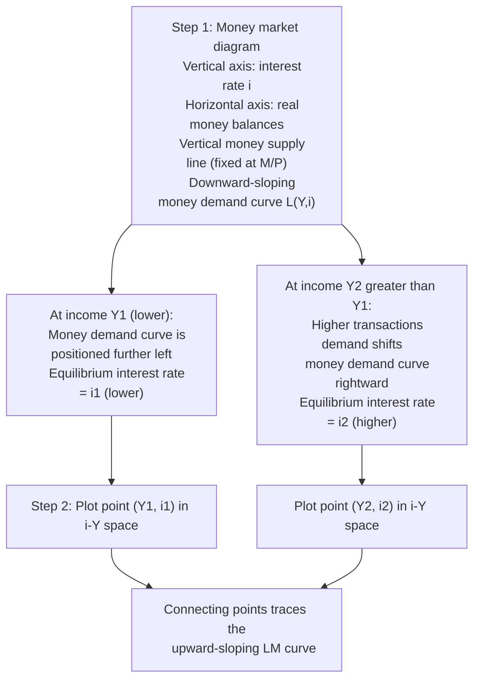

## Deriving the LM Curve from the Money Market

### Definition and Conceptual Foundation

The LM curve represents the set of combinations of the interest rate and the level of output (income) for which the **money market is in equilibrium**—that is, the quantity of real money balances demanded equals the quantity of real money balances supplied. The name derives from this equilibrium condition: "L" for liquidity preference (money demand) and "M" for money supply. The LM curve is upward-sloping in interest rate–output space, reflecting that higher income raises money demand, which requires a higher interest rate to restore equilibrium given a fixed money supply.

**Key Points**

- Like the IS curve, the LM curve is an **equilibrium locus** rather than a single behavioral relationship—it traces combinations of $i$ and $Y$ consistent with equilibrium in the market for real money balances, holding the money supply and price level constant.
- Deriving the LM curve requires specifying a money demand function and a money supply (assumed exogenously set by the central bank), then solving for the interest rate that equates the two at each level of income.

### Step 1: The Demand for Real Money Balances

Money demand, denoted $L$ (for liquidity preference, following Keynesian terminology), is modeled as depending positively on income $Y$ and negatively on the interest rate $i$:

$$\frac{M^d}{P} = L(Y, i) = kY - hi$$

where $k > 0$ measures the sensitivity of money demand to income (the **transactions/precautionary demand for money**) and $h > 0$ measures the sensitivity of money demand to the interest rate (the **speculative/asset demand for money**).

**Key Points**

- **Transactions demand**: Higher income raises the volume of planned transactions, increasing the need to hold money as a medium of exchange to bridge the timing gap between receipts and expenditures. This motivates the positive relationship between $Y$ and money demand, captured by the coefficient $k$.
- **Speculative (asset) demand**: Money is one among several assets an agent may hold; the interest rate represents the opportunity cost of holding money rather than an interest-bearing asset (e.g., bonds). A higher interest rate raises this opportunity cost, reducing the quantity of money agents choose to hold and increasing their preference for interest-bearing assets instead, captured by the negative coefficient on $i$ (with sensitivity $h$).
- This formulation synthesizes the classical **quantity-theory-style transactions motive** (captured by the $kY$ term) with the **Keynesian liquidity-preference motive** (captured by the $-hi$ term), reflecting the traditional Keynesian view that money demand depends on both income and the interest rate, in contrast to a strict quantity-theory view in which money demand depends only on income (or nominal transactions volume).

### Step 2: The Supply of Real Money Balances

The nominal money supply $M^s$ is treated as exogenously set by the central bank (through open market operations, reserve requirements, or other monetary policy instruments), and the price level $P$ is taken as fixed in the short-run IS-LM framework. Real money supply is therefore:

$$\frac{M^s}{P} = \frac{\bar{M}}{\bar{P}}$$

a fixed, exogenous quantity, denoted simply $\frac{\bar{M}}{P}$ for brevity.

### Step 3: The Money Market Equilibrium Condition

The money market clears when the quantity of real money balances demanded equals the quantity supplied:

$$\frac{M^s}{P} = \frac{M^d}{P}$$

$$\frac{\bar{M}}{P} = kY - hi$$

This is the defining equilibrium condition of the LM curve.

### Step 4: Solving for the Interest Rate (or Output)

Solving the equilibrium condition for the interest rate $i$ as a function of income $Y$:

$$hi = kY - \frac{\bar{M}}{P}$$

$$i = \frac{k}{h}Y - \frac{1}{h}\cdot\frac{\bar{M}}{P}$$

This is the **LM equation**, expressing the interest rate consistent with money-market equilibrium as an increasing function of income $Y$, given the fixed real money supply $\bar{M}/P$.

Equivalently, solving for $Y$ as a function of $i$:

$$Y = \frac{h}{k}i + \frac{1}{k}\cdot\frac{\bar{M}}{P}$$

### Step 5: Identifying the Slope of the LM Curve

**Key Points**

- The **slope of the LM curve** in $(Y, i)$ space, with $i$ on the vertical axis, is $\frac{k}{h}$ — positive, confirming the upward-sloping relationship: as income rises, transactions demand for money increases; since the money supply is fixed, the interest rate must rise to reduce speculative money demand by an offsetting amount, restoring equilibrium.
- The LM curve is **steeper** the larger is $k$ (money demand highly sensitive to income, requiring a larger interest rate adjustment to offset a given income change) and the smaller is $h$ (money demand relatively insensitive to the interest rate, so a large interest rate movement is needed to induce agents to adjust their money holdings by the required amount).
- The LM curve is **flatter** the smaller is $k$ and the larger is $h$ (money demand highly sensitive to the interest rate, so only a small interest rate change is needed to restore equilibrium after an income change).

### Diagrammatic Derivation: From the Money Market to the LM Curve

The LM curve is typically derived graphically in two steps: first plotting money supply and money demand against the interest rate (for a given level of income) to find the equilibrium interest rate, then tracing how that equilibrium interest rate shifts as income changes.

**Key Points**

- In the money-market diagram, the vertical axis measures the interest rate $i$ and the horizontal axis measures real money balances; the money supply curve is vertical (perfectly inelastic with respect to the interest rate, since it is set exogenously by the central bank), while the money demand curve is downward-sloping in $i$ for a given level of income $Y$.
- A rise in income shifts the entire money demand curve rightward (since transactions demand for money rises at every interest rate), raising the equilibrium interest rate at which the now-larger money demand curve intersects the fixed vertical money supply curve.
- Repeating this exercise for successively higher income levels and plotting the resulting equilibrium interest rates against those income levels generates the upward-sloping LM curve.

### Diagram: The LM Curve (svg_diagram)

<svg xmlns="http://www.w3.org/2000/svg" viewBox="0 0 700 420">
<text x="350" y="30" text-anchor="middle" font-size="18" font-weight="bold" fill="#1a1a2e">The LM Curve: Money Market Equilibrium (svg_diagram)</text>
<line x1="100" y1="360" x2="620" y2="360" stroke="#333" stroke-width="2" />
<line x1="100" y1="360" x2="100" y2="60" stroke="#333" stroke-width="2" />
<text x="360" y="395" text-anchor="middle" font-size="14" fill="#333">Output, Y</text>
<text x="50" y="210" text-anchor="middle" font-size="14" fill="#333" transform="rotate(-90 50 210)">Interest rate, i</text>
<line x1="150" y1="320" x2="520" y2="100" stroke="#2980b9" stroke-width="3" />
<text x="530" y="95" font-size="14" fill="#2980b9" font-weight="bold">LM</text>
<line x1="230" y1="280" x2="230" y2="360" stroke="#888" stroke-width="1" stroke-dasharray="4,4" />
<line x1="100" y1="280" x2="230" y2="280" stroke="#888" stroke-width="1" stroke-dasharray="4,4" />
<circle cx="230" cy="280" r="5" fill="#27ae60" />
<text x="85" y="285" text-anchor="end" font-size="12" fill="#27ae60">i₁</text>
<text x="230" y="380" text-anchor="middle" font-size="12" fill="#27ae60">Y₁</text>
<line x1="440" y1="160" x2="440" y2="360" stroke="#888" stroke-width="1" stroke-dasharray="4,4" />
<line x1="100" y1="160" x2="440" y2="160" stroke="#888" stroke-width="1" stroke-dasharray="4,4" />
<circle cx="440" cy="160" r="5" fill="#c0392b" />
<text x="85" y="165" text-anchor="end" font-size="12" fill="#c0392b">i₂</text>
<text x="440" y="380" text-anchor="middle" font-size="12" fill="#c0392b">Y₂</text>

<text x="270" y="240" font-size="12" fill="#555">Higher Y raises money demand,</text>

<text x="270" y="255" font-size="12" fill="#555">requiring higher i to clear market</text>

</svg>

### Illustrative Numerical Example

**Example**

Suppose: $k = 0.5$, $h = 1000$, real money supply $\bar{M}/P = 500$.

The LM equation is:

$$i = \frac{k}{h}Y - \frac{1}{h}\cdot\frac{\bar{M}}{P} = \frac{0.5}{1000}Y - \frac{1}{1000}(500) = 0.0005Y - 0.5$$

At $Y = 1300$: $i = 0.0005(1300) - 0.5 = 0.65 - 0.5 = 0.15$ (15%).

At $Y = 1400$: $i = 0.0005(1400) - 0.5 = 0.70 - 0.5 = 0.20$ (20%).

This confirms the upward-sloping relationship: a 100-unit increase in income raises the equilibrium interest rate by 5 percentage points in this example, as the resulting rise in transactions demand for money ($k \times \Delta Y = 0.5 \times 100 = 50$) must be offset by a fall in speculative money demand of equal magnitude, requiring the interest rate to rise by $\Delta i = 50/h = 50/1000 = 0.05$.

### The Two Limiting Cases of the LM Curve

The LM curve's slope, $k/h$, depends critically on the interest-sensitivity of money demand ($h$), giving rise to two important limiting cases discussed extensively in the IS-LM literature.

**Key Points**

- **Classical case ($h \to 0$)**: If money demand is completely interest-inelastic (depends only on income, as in a strict quantity-theory formulation), the LM curve becomes **vertical**. In this case, monetary policy is maximally effective and fiscal policy is minimally effective at influencing output: any rightward shift of the IS curve (e.g., from fiscal expansion) is met by a rise in the interest rate sufficient to leave output entirely unchanged (full crowding out), since with $h=0$ the interest rate must do all the adjusting to keep money demand equal to a fixed money supply at unchanged income.
- **Liquidity trap case ($h \to \infty$)**: If money demand becomes infinitely interest-elastic at some interest rate (the classic Keynesian liquidity trap, discussed as a related topic in this chapter), the LM curve becomes **horizontal** at that interest rate. In this case, monetary policy is completely ineffective (shifts in the money supply have no effect on the interest rate or output, since the LM curve does not move), while fiscal policy is maximally effective (a rightward IS shift raises output with no offsetting rise in the interest rate, so there is no crowding out).
- These two polar cases illustrate why the *relative effectiveness* of monetary versus fiscal policy in the IS-LM framework depends critically on the empirically observed interest-sensitivity of money demand, a central point of historical debate between Keynesian and monetarist economists.

### Factors That Shift the LM Curve

It is essential to distinguish **movements along** the LM curve (caused by changes in income, already captured in the derivation) from **shifts of** the entire LM curve (caused by changes in the money supply, the price level, or money demand behavior itself).

**Key Points**

- **Change in the nominal money supply**: An increase in $\bar{M}$ (e.g., via expansionary open market operations) raises real money balances $\bar{M}/P$, shifting the LM curve **rightward/downward** (a lower interest rate is required to induce agents to hold the now-larger quantity of real money balances at each level of income).
- **Change in the price level**: For a given nominal money supply, a rise in the price level $P$ reduces real money balances $\bar{M}/P$, shifting the LM curve **leftward/upward** — this is the key mechanism linking the IS-LM model to the aggregate demand curve, since a higher price level (movement along the AD curve) is associated with a leftward LM shift and lower equilibrium output.
- **Shifts in money demand behavior**: An autonomous increase in money demand (e.g., due to increased financial uncertainty raising precautionary money holdings at given $Y$ and $i$) shifts the LM curve leftward/upward, since a higher interest rate (or lower income) is now required to reconcile the now-higher demand for money with the unchanged money supply.

### Common Pitfalls and Clarifications

**Key Points**

- The LM curve assumes the *nominal* money supply and the price level are both fixed in deriving a single LM curve; changes in the price level shift the entire curve rather than representing movement along it, which is the essential link exploited when deriving the aggregate demand (AD) curve from the IS-LM model (as a price-level change shifts LM, tracing out the AD relationship between $P$ and $Y$).
- Students frequently conflate the **real** money supply ($\bar{M}/P$, which determines the position of the LM curve) with the **nominal** money supply ($\bar{M}$, the object directly controlled by the central bank); a change in $\bar{M}$ shifts the LM curve only insofar as it changes $\bar{M}/P$, which requires holding $P$ fixed—an assumption appropriate to the short-run IS-LM framework but not to longer-run analysis where prices adjust.
- The LM curve, like the IS curve, is a **partial equilibrium construct** for the money market alone; it must be combined with the IS curve (goods-market equilibrium) to determine the **joint** equilibrium level of both income and the interest rate in the full IS-LM model.

### Related Topics

- Deriving the IS curve from the goods market
- The joint IS-LM equilibrium and comparative statics
- Zero lower bound and liquidity trap (the horizontal LM curve case)
- Monetary policy transmission through the IS-LM framework
- From IS-LM to aggregate demand: deriving the AD curve
- The quantity theory of money and the classical dichotomy
- Crowding out and the relative slopes of the IS and LM curves
- Open market operations and central bank control of the money supply
- Keynesian versus monetarist debates on the interest-elasticity of money demand
- The liquidity preference theory of interest rate determination