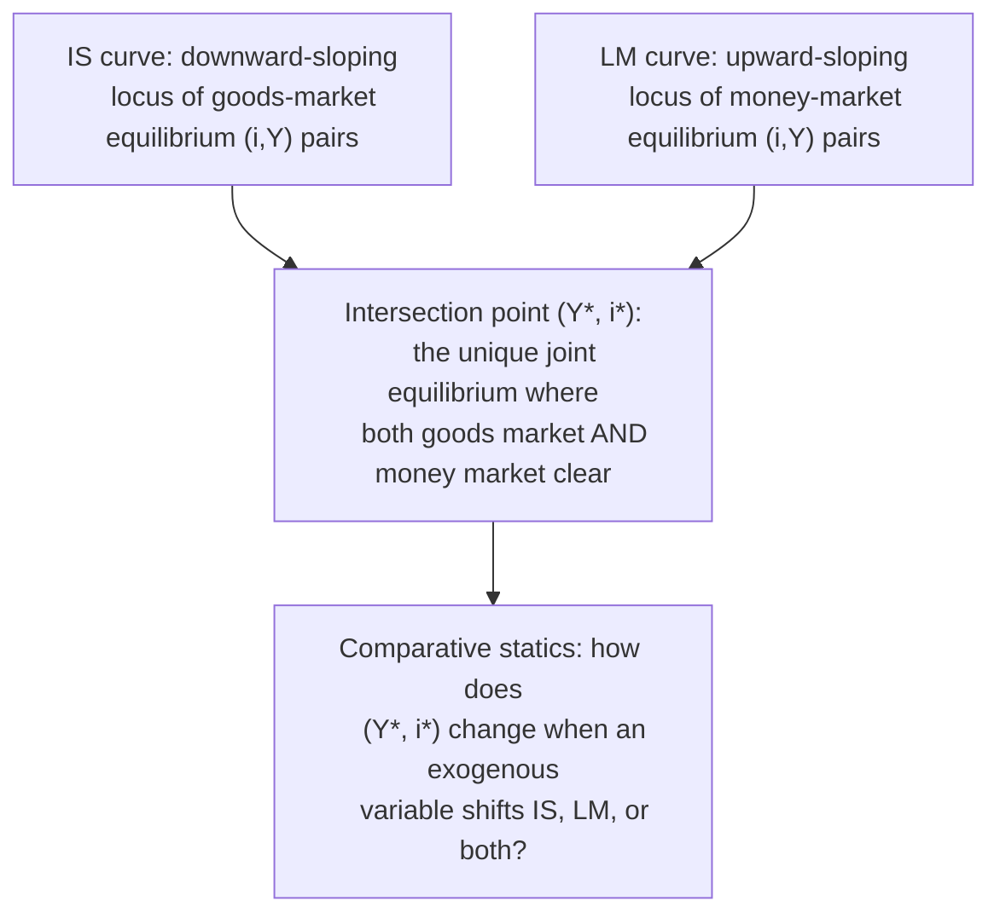
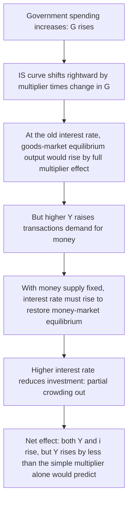
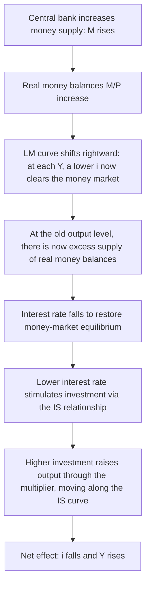

## IS-LM Equilibrium and Comparative Statics

### Definition and Conceptual Foundation

The IS-LM model determines the **simultaneous equilibrium** of the interest rate $i$ and output $Y$ by finding the unique point at which both the goods market (the IS curve) and the money market (the LM curve) clear at the same time. Comparative statics refers to the analytical exercise of examining how this joint equilibrium changes in response to shifts in exogenous variables—fiscal policy, monetary policy, or autonomous spending/money demand shocks—comparing the initial equilibrium to the new equilibrium without tracing the dynamic adjustment path between them.

**Key Points**

- The IS curve alone (goods-market equilibrium) and the LM curve alone (money-market equilibrium) each represent a *locus* of $(i, Y)$ combinations, not a single determinate outcome; only their **intersection** pins down unique equilibrium values of both $i$ and $Y$.
- Comparative statics in the IS-LM model is inherently a two-market exercise: a shock that shifts one curve generally has effects that operate through *both* markets simultaneously, since a change in $Y$ affects money demand (feeding back into the money market) and a change in $i$ affects investment (feeding back into the goods market).

### The Joint Equilibrium Condition

Combining the IS equation and the LM equation derived from their respective markets:

**IS equation** (closed economy, from the goods market):

$$Y = \bar{\alpha}\left(C_0 + I_0 + \bar{G} - cT\right) - \bar{\alpha} b\, i, \quad \text{where } \bar{\alpha} = \frac{1}{1-c}$$

**LM equation** (from the money market):

$$i = \frac{k}{h}Y - \frac{1}{h}\cdot\frac{\bar{M}}{P}$$

Substituting the LM equation into the IS equation solves for equilibrium output $Y^*$:

$$Y = \bar{\alpha}\left(C_0 + I_0 + \bar{G} - cT\right) - \bar{\alpha} b\left(\frac{k}{h}Y - \frac{1}{h}\cdot\frac{\bar{M}}{P}\right)$$

$$Y + \frac{\bar{\alpha} b k}{h}Y = \bar{\alpha}\left(C_0 + I_0 + \bar{G} - cT\right) + \frac{\bar{\alpha} b}{h}\cdot\frac{\bar{M}}{P}$$

$$Y^* = \frac{\bar{\alpha}}{1 + \dfrac{\bar{\alpha} b k}{h}}\left[\left(C_0 + I_0 + \bar{G} - cT\right) + \frac{b}{h}\cdot\frac{\bar{M}}{P}\right]$$

Once $Y^*$ is obtained, substituting back into either the IS or LM equation yields the equilibrium interest rate $i^*$. This joint solution is the foundation for all comparative statics exercises: any comparative-statics result can, in principle, be derived by differentiating this reduced-form expression with respect to the relevant exogenous variable, though the graphical shift-based approach described below is more commonly used pedagogically.

### Graphical Representation of Joint Equilibrium

### Diagram: IS-LM Joint Equilibrium (svg_diagram)

<svg xmlns="http://www.w3.org/2000/svg" viewBox="0 0 700 420">
<text x="350" y="30" text-anchor="middle" font-size="18" font-weight="bold" fill="#1a1a2e">IS-LM Joint Equilibrium (svg_diagram)</text>
<line x1="100" y1="360" x2="620" y2="360" stroke="#333" stroke-width="2" />
<line x1="100" y1="360" x2="100" y2="60" stroke="#333" stroke-width="2" />
<text x="360" y="395" text-anchor="middle" font-size="14" fill="#333">Output, Y</text>
<text x="50" y="210" text-anchor="middle" font-size="14" fill="#333" transform="rotate(-90 50 210)">Interest rate, i</text>
<line x1="180" y1="120" x2="500" y2="320" stroke="#c0392b" stroke-width="3" />
<text x="510" y="315" font-size="14" fill="#c0392b" font-weight="bold">IS</text>
<line x1="180" y1="320" x2="500" y2="120" stroke="#2980b9" stroke-width="3" />
<text x="510" y="115" font-size="14" fill="#2980b9" font-weight="bold">LM</text>
<circle cx="340" cy="220" r="6" fill="#1a1a2e" />
<text x="350" y="210" font-size="13" fill="#1a1a2e" font-weight="bold">E* (Y*, i*)</text>
<line x1="340" y1="220" x2="340" y2="360" stroke="#888" stroke-width="1" stroke-dasharray="4,4" />
<line x1="100" y1="220" x2="340" y2="220" stroke="#888" stroke-width="1" stroke-dasharray="4,4" />
<text x="340" y="380" text-anchor="middle" font-size="12" fill="#333">Y*</text>
<text x="85" y="225" text-anchor="end" font-size="12" fill="#333">i*</text>
</svg>

### Comparative Statics: Expansionary Fiscal Policy

An increase in government spending ($\bar{G}$) or a decrease in taxes ($T$) shifts the **IS curve rightward**, with the LM curve unchanged.

**Key Points**

- **Crowding out**: The rise in the interest rate induced by fiscal expansion reduces private investment, partially offsetting the expansionary effect on output. The economy moves along the (unchanged) LM curve to a new intersection with the shifted IS curve, so the final increase in output is smaller than the simple Keynesian-cross multiplier effect (which implicitly assumes a constant interest rate).
- **Magnitude of crowding out depends on relative slopes**:
  - If the LM curve is relatively **flat** (money demand highly interest-elastic, $h$ large), a given rightward IS shift produces a large increase in $Y$ and only a small increase in $i$, since a small rise in the interest rate induces the reduction in money demand needed to accommodate higher transactions demand — crowding out is **limited**.
  - If the LM curve is relatively **steep** (money demand interest-inelastic, $h$ small, approaching the classical vertical-LM case), the same IS shift produces a large increase in $i$ and only a small increase in $Y$ — crowding out is **substantial**, approaching **complete crowding out** in the classical limiting case ($h \to 0$), where fiscal expansion raises the interest rate enough to leave output entirely unchanged.
- **Liquidity trap case**: If the LM curve is horizontal (the liquidity trap case, $h \to \infty$), fiscal expansion shifts the IS curve rightward with **no offsetting rise in the interest rate at all**, so there is **no crowding out** and output rises by the full simple multiplier effect—a central result motivating the traditional Keynesian preference for fiscal policy during liquidity-trap/ZLB episodes, discussed further in relation to the zero lower bound.

### Comparative Statics: Expansionary Monetary Policy

An increase in the nominal money supply ($\bar{M}$, holding $P$ fixed) shifts the **LM curve rightward/downward**, with the IS curve unchanged.

**Key Points**

- The effectiveness of monetary policy in raising output depends on the **interest-sensitivity of investment ($b$)** and the **slope of the LM curve**:
  - If investment is highly interest-sensitive (**large $b$**) and the LM curve is steep (**small $h$**, approaching the classical case), a given fall in the interest rate produces a large increase in investment and output — monetary policy is **highly effective**.
  - If investment is relatively interest-insensitive (**small $b$**) or the LM curve is flat (**large $h$**), the same monetary expansion produces only a small effect on output — monetary policy is **less effective**.
- **Liquidity trap case**: If the economy is in a liquidity trap (horizontal LM curve), an increase in the money supply produces **no change in the interest rate** (since the LM curve does not shift in the trap region — money demand simply absorbs the additional money balances at the prevailing floor interest rate) and consequently **no effect on output** — monetary policy is **completely ineffective**, the polar opposite of the fiscal-policy result in the same scenario.
- This asymmetry between the liquidity-trap and classical limiting cases is the central analytical basis for debates over the relative effectiveness of monetary versus fiscal policy discussed in Keynesian versus monetarist traditions, and it directly motivates the unconventional monetary tools (forward guidance, quantitative easing, negative interest rates) covered elsewhere in this chapter as attempts to restore monetary policy traction when the conventional interest-rate channel is impaired.

### Comparative Statics: Combined Fiscal and Monetary Actions

**Example**

A "monetary accommodation" of fiscal expansion: suppose a government increases spending ($\bar{G}$ rises, IS shifts right) while the central bank simultaneously expands the money supply ($\bar{M}$ rises, LM shifts right) to prevent the interest rate from rising.

- If the LM shift is calibrated so that the new LM curve intersects the new IS curve at the **original interest rate**, output rises by the **full simple multiplier effect** with **no crowding out at all**, since the interest rate never rises to choke off investment.
- This illustrates that comparative statics outcomes are **not limited to single-curve shifts**: policymakers can combine fiscal and monetary actions to achieve a desired combination of effects on $Y$ and $i$ (e.g., raising output while holding the interest rate constant, or changing the composition of output between investment and government spending while holding output constant), a concept sometimes referred to as the **policy mix**.

### Comparative Statics: Autonomous Demand and Money Demand Shocks

**Key Points**

- **A negative shock to autonomous investment or consumption** (a fall in $I_0$ or $C_0$, e.g., a collapse in business or consumer confidence) shifts the IS curve **leftward**, reducing both equilibrium output and the equilibrium interest rate (the mirror image of expansionary fiscal policy). This is the type of shock frequently invoked to explain how a natural rate of interest $r^*$ can become deeply negative, potentially pushing the economy toward a binding zero lower bound as discussed in that topic.
- **An autonomous increase in money demand** (e.g., a rise in $k$ or a shift reflecting increased precautionary demand for liquidity during a financial crisis, holding $Y$ and $i$ constant) shifts the LM curve **leftward/upward**, raising the equilibrium interest rate and reducing equilibrium output — a mechanism sometimes invoked to explain contractionary effects of financial crises operating through a "flight to liquidity" that is not fully accommodated by the central bank.
- **A price-level change** shifts the LM curve (a rise in $P$ shifts LM leftward by reducing real money balances $\bar{M}/P$) without shifting the IS curve; tracing the resulting equilibria as $P$ varies is precisely the method by which the aggregate demand (AD) curve is derived from the IS-LM model — a link explored as a related topic in this chapter.

### Summary Table of Comparative Statics Results

| Shock | IS shift | LM shift | Effect on $Y^*$ | Effect on $i^*$ |
| --- | --- | --- | --- | --- |
| Increase in $\bar{G}$ | Rightward | None | Increases (less than simple multiplier, due to crowding out) | Increases |
| Decrease in $T$ | Rightward | None | Increases (less than simple multiplier) | Increases |
| Increase in $\bar{M}$ | None | Rightward | Increases | Decreases |
| Fall in $I_0$ or $C_0$ | Leftward | None | Decreases | Decreases |
| Increase in money demand ($k$ up) | None | Leftward | Decreases | Increases |
| Rise in price level $P$ | None | Leftward | Decreases | Increases |

### Illustrative Numerical Example

**Example**

Using the IS and LM equations from earlier derivations: $Y = 1500 - 2000i$ (IS) and $i = 0.0005Y - 0.5$ (LM).

**Finding the initial equilibrium**: Substitute the LM equation into the IS equation:

$$Y = 1500 - 2000(0.0005Y - 0.5) = 1500 - Y + 1000$$

$$2Y = 2500 \implies Y^* = 1250$$

Then $i^* = 0.0005(1250) - 0.5 = 0.625 - 0.5 = 0.125$ (12.5%).

**Fiscal expansion**: Suppose $\bar{G}$ rises such that the IS curve becomes $Y = 1700 - 2000i$ (a rightward shift of 200 at every interest rate, consistent with a multiplier of 4 applied to a $50 increase in $\bar{G}$). The LM curve is unchanged. Solving:

$$Y = 1700 - 2000(0.0005Y - 0.5) = 1700 - Y + 1000$$

$$2Y = 2700 \implies Y^* = 1350$$

$$i^* = 0.0005(1350) - 0.5 = 0.675 - 0.5 = 0.175 \, (17.5\%)$$

Output rose from 1250 to 1350 (an increase of 100), which is **less than** the 200-unit horizontal shift of the IS curve, confirming partial crowding out: the interest rate rose from 12.5% to 17.5%, reducing investment and offsetting half of the potential output gain.

### Common Pitfalls and Clarifications

**Key Points**

- A frequent student error is to read the effect of a policy shock directly off the horizontal shift of a single curve without accounting for the feedback through the other market—e.g., assuming fiscal expansion raises output by the full simple multiplier, which is only correct if the LM curve is horizontal (liquidity trap) or if monetary policy simultaneously accommodates the interest rate increase.
- The comparative statics results summarized above are **static** comparisons of two equilibria (before and after the shock); the IS-LM framework as presented does not itself model the *dynamic adjustment path* by which the economy moves from the old equilibrium to the new one, nor the *time it takes* for that adjustment to occur — these dynamic questions require supplementing the basic model with explicit adjustment-speed assumptions (as in some extended treatments) or with dynamic stochastic general equilibrium (DSGE) modeling approaches used in modern macroeconomics.
- The IS-LM model as presented is a **fixed-price, short-run** framework; extending the comparative statics results to a setting with a variable price level and supply-side considerations requires combining IS-LM with an aggregate demand–aggregate supply (AD-AS) apparatus, since the IS-LM equilibrium determines only the point on the aggregate demand curve corresponding to the current price level, not the ultimate price and output outcome once supply-side adjustment is taken into account.

### Related Topics

- Deriving the IS curve from the goods market
- Deriving the LM curve from the money market
- Crowding out and the interest-rate sensitivity of investment
- Zero lower bound and liquidity trap
- From IS-LM to aggregate demand: deriving the AD curve
- The Mundell-Fleming model: IS-LM in an open economy
- Fiscal multipliers and the policy mix
- Keynesian versus monetarist debates on monetary policy effectiveness
- Forward guidance as a policy tool (interaction with the LM curve at the zero lower bound)
- Quantitative easing and the portfolio-balance channel