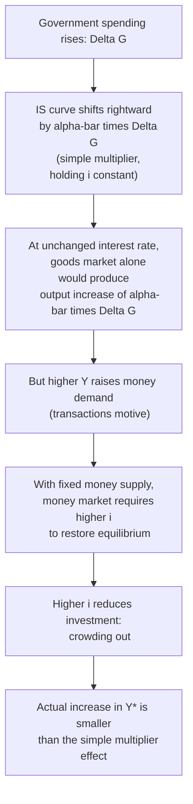

## Fiscal Policy Effects

### Definition and Conceptual Foundation

Fiscal policy effects in the IS-LM framework refer to the changes in equilibrium output and the interest rate that result from a change in government spending or taxation, analyzed through the shift such changes induce in the IS curve while the LM curve remains fixed. Because fiscal policy operates directly on aggregate expenditure, it shifts the IS curve; the resulting joint equilibrium with the (unchanged) LM curve determines the ultimate effect on both output and the interest rate, incorporating the crowding-out feedback central to IS-LM analysis of fiscal policy.

**Key Points**

- Fiscal policy instruments in the IS-LM model are the two exogenous fiscal variables in the IS equation: government spending $\bar{G}$ and net taxes $T$.
- Because the LM curve does not shift in response to fiscal policy alone (fiscal actions do not directly alter the money supply or money demand), all fiscal policy effects in the basic closed-economy IS-LM model are captured by movement along a fixed LM curve to a new intersection point with the shifted IS curve.

### The Government Spending Multiplier Within IS-LM

Recall the IS equation:

$$Y = \bar{\alpha}\left(C_0 + I_0 + \bar{G} - cT\right) - \bar{\alpha} b\, i, \qquad \bar{\alpha} = \frac{1}{1-c}$$

An increase in government spending, $\Delta \bar{G}$, shifts the IS curve horizontally rightward by exactly $\bar{\alpha}\,\Delta \bar{G}$ at every interest rate—this horizontal shift is the **simple (constant-interest-rate) multiplier effect**, identical to the multiplier obtained from the Keynesian cross in isolation, before accounting for any feedback through the money market.

### Deriving the Fiscal Multiplier Net of Crowding Out

Using the joint-equilibrium reduced form derived from combining IS and LM:

$$Y^* = \frac{\bar{\alpha}}{1 + \dfrac{\bar{\alpha} b k}{h}}\left[\left(C_0 + I_0 + \bar{G} - cT\right) + \frac{b}{h}\cdot\frac{\bar{M}}{P}\right]$$

Differentiating with respect to $\bar{G}$ (holding all other exogenous variables fixed) gives the **IS-LM government spending multiplier**:

$$\frac{\partial Y^*}{\partial \bar{G}} = \frac{\bar{\alpha}}{1 + \dfrac{\bar{\alpha} b k}{h}}$$

**Key Points**

- This expression is unambiguously **smaller** than the simple Keynesian-cross multiplier $\bar{\alpha}$ alone, since the denominator $1 + \frac{\bar{\alpha} b k}{h} > 1$ whenever $b, k > 0$ and $h < \infty$—formally confirming that money-market feedback (crowding out) always weakens the fiscal multiplier relative to the constant-interest-rate benchmark, except in the special limiting cases discussed below.
- The **degree of crowding out** is governed by the ratio $\frac{bk}{h}$: crowding out is more severe when investment is highly interest-sensitive ($b$ large), money demand is highly income-sensitive ($k$ large), and money demand is interest-insensitive ($h$ small).

### The Tax Multiplier Within IS-LM

A decrease in net taxes $T$ operates similarly but with a smaller simple multiplier, since a tax cut affects expenditure only indirectly through disposable income and induced consumption, rather than adding directly to expenditure as government spending does. The simple (constant-interest-rate) tax multiplier is $-\bar{\alpha}c$ (in absolute value, $\bar{\alpha}c < \bar{\alpha}$ since $c < 1$), and the full IS-LM tax multiplier, incorporating crowding out, is:

$$\frac{\partial Y^*}{\partial T} = -\frac{\bar{\alpha}c}{1 + \dfrac{\bar{\alpha} b k}{h}}$$

**Key Points**

- A one-unit tax cut raises output by less than a one-unit increase in government spending, both in the simple multiplier sense ($\bar{\alpha}c < \bar{\alpha}$) and in the full IS-LM sense incorporating crowding out, because part of the tax cut is saved rather than spent (governed by the marginal propensity to consume $c$), whereas government spending enters aggregate expenditure directly and in full.
- This differential multiplier size is often summarized as the **balanced-budget multiplier** result: if $\bar{G}$ and $T$ rise by the same amount (a balanced-budget fiscal expansion), the simple multiplier effect on output is exactly $\bar{\alpha}(1-c) \cdot \Delta G = \Delta G$ (equal to the change in spending itself)—a classic result from the Keynesian-cross model that continues to hold as the constant-interest-rate benchmark within IS-LM, before accounting for any crowding out from the resulting interest rate change.

### Illustrative Numerical Example

**Example**

Using parameters from the goods-market and money-market derivations: $c = 0.75$ ($\bar{\alpha} = 4$), $b = 500$, $k = 0.5$, $h = 1000$.

The crowding-out denominator term is:

$$\frac{\bar{\alpha} bk}{h} = \frac{4 \times 500 \times 0.5}{1000} = \frac{1000}{1000} = 1$$

The full IS-LM government spending multiplier is:

$$\frac{\partial Y^*}{\partial \bar{G}} = \frac{4}{1+1} = 2$$

Compare this to the simple Keynesian-cross multiplier of $\bar{\alpha} = 4$: incorporating money-market feedback and crowding out **halves** the effective fiscal multiplier in this example. A $50 increase in government spending, which would raise output by $200$ under the simple multiplier (holding the interest rate fixed), raises output by only $100$ once the induced rise in the interest rate and the resulting fall in investment are accounted for—matching the result obtained by explicit curve-shifting in the equilibrium comparative-statics example for fiscal expansion.

### Diagram: Fiscal Expansion in IS-LM Space (svg_diagram)

<svg xmlns="http://www.w3.org/2000/svg" viewBox="0 0 700 420">
<text x="350" y="30" text-anchor="middle" font-size="18" font-weight="bold" fill="#1a1a2e">Fiscal Expansion and Crowding Out (svg_diagram)</text>
<line x1="100" y1="360" x2="620" y2="360" stroke="#333" stroke-width="2" />
<line x1="100" y1="360" x2="100" y2="60" stroke="#333" stroke-width="2" />
<text x="360" y="395" text-anchor="middle" font-size="14" fill="#333">Output, Y</text>
<text x="50" y="210" text-anchor="middle" font-size="14" fill="#333" transform="rotate(-90 50 210)">Interest rate, i</text>
<line x1="180" y1="320" x2="500" y2="120" stroke="#2980b9" stroke-width="3" />
<text x="510" y="115" font-size="14" fill="#2980b9" font-weight="bold">LM</text>
<line x1="150" y1="100" x2="470" y2="300" stroke="#c0392b" stroke-width="3" />
<text x="475" y="295" font-size="13" fill="#c0392b" font-weight="bold">IS₀</text>
<line x1="250" y1="100" x2="570" y2="300" stroke="#e67e22" stroke-width="3" stroke-dasharray="6,3" />
<text x="575" y="295" font-size="13" fill="#e67e22" font-weight="bold">IS₁ (after ΔG)</text>
<circle cx="300" cy="220" r="5" fill="#1a1a2e" />
<text x="270" y="240" font-size="12" fill="#1a1a2e">E₀</text>
<circle cx="378" cy="180" r="5" fill="#1a1a2e" />
<text x="385" y="175" font-size="12" fill="#1a1a2e">E₁</text>
<line x1="360" y1="220" x2="440" y2="220" stroke="#888" stroke-width="1" stroke-dasharray="3,3" />
<text x="365" y="215" font-size="10" fill="#888">simple multiplier shift</text>
<line x1="300" y1="220" x2="378" y2="220" stroke="#27ae60" stroke-width="2" />
<line x1="378" y1="220" x2="378" y2="180" stroke="#27ae60" stroke-width="2" />
<text x="330" y="238" font-size="10" fill="#27ae60">actual ΔY (less than shift)</text>
</svg>

### Fiscal Policy Effectiveness Under Different LM Slopes

**Key Points**

- **Flat LM curve (money demand highly interest-elastic, $h$ large)**: Crowding out is minimal, since $\frac{bk}{h} \to 0$ as $h$ grows large, so the full multiplier $\frac{\bar{\alpha}}{1+\bar{\alpha}bk/h}$ approaches the simple multiplier $\bar{\alpha}$—fiscal policy is **highly effective**.
- **Steep LM curve (money demand interest-inelastic, $h$ small, approaching the classical case)**: Crowding out is severe; in the limiting classical case $h \to 0$, the term $\frac{\bar{\alpha}bk}{h} \to \infty$, driving the full multiplier toward zero — **complete crowding out**, meaning fiscal expansion raises the interest rate enough to leave equilibrium output entirely unchanged.
- **Horizontal LM curve (liquidity trap, $h \to \infty$)**: As shown above, crowding out vanishes entirely and the full multiplier equals the simple multiplier $\bar{\alpha}$ — fiscal policy is **maximally effective**, the standard Keynesian rationale for relying on fiscal stimulus when the economy is at the zero lower bound.

### Open-Economy Extension: Fiscal Policy Under Different Exchange Rate Regimes

In an open economy (the Mundell-Fleming extension of IS-LM), the effectiveness of fiscal policy depends critically on the exchange rate regime and the degree of capital mobility.

**Key Points**

- **Floating exchange rate, high capital mobility**: Fiscal expansion raises the domestic interest rate (as in the closed-economy case), attracting capital inflows that appreciate the domestic currency; the resulting decline in net exports (via reduced export competitiveness) offsets some or all of the expansionary effect on output, an additional open-economy crowding-out channel beyond the closed-economy investment-crowding-out channel discussed above. [Inference: In the polar case of perfect capital mobility under a floating exchange rate, standard Mundell-Fleming analysis implies fiscal policy becomes completely ineffective at raising output, as currency appreciation fully offsets the initial expenditure increase—though the empirical realism of the perfect-capital-mobility assumption is debated.]
- **Fixed exchange rate, high capital mobility**: Fiscal policy becomes highly effective, since the central bank must expand the money supply to defend the fixed exchange rate against the appreciation pressure from higher interest rates (effectively an endogenous LM shift accommodating the fiscal expansion), reinforcing rather than offsetting the output increase.
- This open-economy analysis is developed more fully as a distinct extension of the basic closed-economy IS-LM framework covered in this section.

### Fiscal Policy and the Composition of Output

**Key Points**

- Because fiscal expansion raises the equilibrium interest rate (except in the liquidity-trap case), it changes not only the *level* but also the *composition* of aggregate output: the increase in government spending is partially offset by a decline in private investment, meaning that equilibrium output growth understates the increase in government spending itself, with the gap made up by reduced private investment.
- This compositional shift—more government spending, less private investment—is a standard concern raised in policy debates about deficit-financed fiscal expansion, particularly regarding potential long-run effects on the capital stock and productive capacity if crowding out persistently displaces private investment. [Inference: The long-run growth implications of investment crowding out depend on assumptions about the productivity of displaced private investment relative to the government spending that replaced it, a normative and empirical question outside the scope of the basic short-run IS-LM framework itself.]

### Discretionary Fiscal Policy Versus Automatic Stabilizers

**Key Points**

- The fiscal policy effects analyzed above generally refer to **discretionary** fiscal policy—deliberate changes in $\bar{G}$ or $T$ enacted by fiscal authorities in response to economic conditions.
- **Automatic stabilizers**—features of the tax and transfer system that automatically adjust with the state of the economy without new legislation (e.g., progressive income taxes that automatically reduce net tax revenue during downturns, or unemployment insurance that automatically raises transfer payments during downturns)—can be represented within the IS-LM framework by making $T$ an increasing function of $Y$ rather than a fixed exogenous constant, which **reduces the slope of the IS curve** (makes it steeper) and thereby dampens the response of output to any given shock, providing automatic (as opposed to discretionary) cyclical stabilization.

### Common Pitfalls and Clarifications

**Key Points**

- A frequent misconception is that fiscal multipliers are fixed structural constants; within the IS-LM framework, the *effective* multiplier (net of crowding out) depends explicitly on the slope of the LM curve and the interest-sensitivity of investment, meaning the same fiscal action can have very different output effects depending on prevailing monetary conditions (e.g., whether the economy is at the zero lower bound) — a point with direct relevance to debates over fiscal multipliers discussed in relation to that topic.
- Fiscal policy effects derived here assume a fixed price level; incorporating price-level adjustment via the aggregate demand–aggregate supply framework generally implies that some of the nominal effect of fiscal expansion shows up as higher prices rather than higher real output in the longer run, particularly as the economy approaches full employment/potential output—an extension beyond the basic fixed-price IS-LM model.
- Government budget constraints and debt-sustainability considerations (how a given $\bar{G}$ or $T$ change is financed—via debt issuance, money creation, or offsetting future tax changes) are generally **abstracted from** in the basic IS-LM treatment of fiscal policy, which treats $\bar{G}$ and $T$ as independent exogenous variables without modeling the intertemporal government budget constraint explicitly.

### Related Topics

- Deriving the IS curve from the goods market
- IS-LM equilibrium and comparative statics
- Crowding out and the interest-rate sensitivity of investment
- Zero lower bound and liquidity trap
- The Mundell-Fleming model: IS-LM in an open economy
- Automatic stabilizers and the cyclically adjusted budget balance
- Fiscal multipliers at the zero lower bound
- The balanced-budget multiplier
- Ricardian equivalence and the debt-financing of fiscal deficits
- From IS-LM to aggregate demand: deriving the AD curve