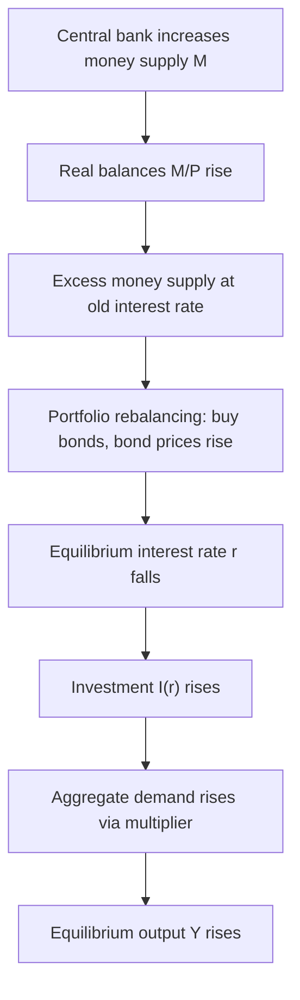

## Monetary Policy Effects in the IS-LM Framework

### Overview

Monetary policy refers to central bank actions that alter the money supply, thereby shifting the LM curve and changing the equilibrium interest rate and output level. In the IS-LM framework, monetary policy operates through a transmission mechanism: changes in the money supply affect interest rates, which affect interest-sensitive spending (primarily investment), which affects aggregate output.

This analysis assumes the standard closed-economy IS-LM setup with price level held fixed in the short run, so that changes in the nominal money supply are equivalent to changes in the real money supply.

### The LM Curve and Money Market Equilibrium

The LM curve represents combinations of income $Y$ and interest rate $r$ for which money demand equals money supply:

$$\frac{M}{P} = L(r, Y)$$

where $M$ is nominal money supply, $P$ is the price level, and $L(r, Y)$ is real money demand, decreasing in $r$ and increasing in $Y$.

A simple linear specification:

$$\frac{M}{P} = kY - hr$$

Solving for $r$ gives the LM curve:

$$r = \frac{kY}{h} - \frac{1}{h}\cdot\frac{M}{P}$$

Here $k$ is the sensitivity of money demand to income, and $h$ is the sensitivity of money demand to the interest rate.

**Key Points**

- An increase in $M/P$ shifts the LM curve rightward (down): at any given $Y$, the equilibrium interest rate falls.
- A decrease in $M/P$ shifts the LM curve leftward (up): at any given $Y$, the equilibrium interest rate rises.
- The slope of LM, $k/h$, determines how much a given monetary shift changes $r$ versus $Y$.

### Expansionary Monetary Policy: Mechanism

An expansionary policy (e.g., open market purchase of bonds, reduction in reserve requirements, or a cut in the policy rate that increases bank reserves) raises the money supply $M$. With $P$ fixed in the short run, real balances $M/P$ rise.

**Transmission chain:**

1. Central bank increases $M$ → real money supply $M/P$ rises.
2. At the initial interest rate, money supply now exceeds money demand.
3. Households and firms rebalance portfolios, buying bonds, which pushes bond prices up and interest rates down.
4. Lower $r$ reduces the cost of borrowing, stimulating interest-sensitive investment $I(r)$.
5. Higher investment raises aggregate demand and, via the multiplier, raises equilibrium output $Y$.

Formally, the LM curve shifts right (from $LM_0$ to $LM_1$). The new intersection with the unchanged IS curve occurs at a lower $r$ and higher $Y$.

### Contractionary Monetary Policy: Mechanism

A contractionary policy (open market sale of bonds, higher reserve requirements, higher policy rate) reduces $M$, so $M/P$ falls. The LM curve shifts left. At the new intersection with IS, $r$ rises and $Y$ falls.

**Transmission chain:**

1. Money supply falls → real balances fall.
2. Money demand exceeds supply at the old $r$.
3. Agents sell bonds to hold more money, bond prices fall, interest rates rise.
4. Higher $r$ discourages investment.
5. Lower investment reduces aggregate demand and output through the multiplier.

### Graphical Representation

**Example**

(svg_diagram) Expansionary Monetary Policy Shift in the IS-LM Model

<svg xmlns="http://www.w3.org/2000/svg" viewBox="0 0 640 460" font-family="Helvetica, Arial, sans-serif">
<rect x="0" y="0" width="640" height="460" fill="#ffffff" />
<text x="320" y="24" text-anchor="middle" font-size="16" font-weight="bold" fill="#111827">Expansionary Monetary Policy in the IS-LM Model (svg_diagram)</text>

<line x1="80" y1="400" x2="580" y2="400" stroke="#111827" stroke-width="2" />
<line x1="80" y1="400" x2="80" y2="60" stroke="#111827" stroke-width="2" />
<text x="580" y="420" text-anchor="middle" font-size="13" fill="#111827">Output (Y)</text>
<text x="55" y="60" text-anchor="middle" font-size="13" fill="#111827" transform="rotate(-90 55 60)">Interest Rate (r)</text>

<path d="M 120 100 Q 300 250 520 380" fill="none" stroke="#2563eb" stroke-width="2.5" />
<text x="500" y="365" font-size="13" fill="#2563eb" font-weight="bold">IS</text>

<path d="M 180 380 Q 320 200 400 90" fill="none" stroke="#dc2626" stroke-width="2.5" />
<text x="395" y="80" font-size="13" fill="#dc2626" font-weight="bold">LM₀</text>

<path d="M 260 380 Q 400 200 480 90" fill="none" stroke="#16a34a" stroke-width="2.5" stroke-dasharray="6,4" />
<text x="475" y="80" font-size="13" fill="#16a34a" font-weight="bold">LM₁</text>

<circle cx="257" cy="234" r="4.5" fill="#111827" />
<text x="240" y="222" font-size="12" fill="#111827">E₀</text>
<line x1="257" y1="234" x2="257" y2="400" stroke="#6b7280" stroke-width="1" stroke-dasharray="3,3" />
<line x1="80" y1="234" x2="257" y2="234" stroke="#6b7280" stroke-width="1" stroke-dasharray="3,3" />
<circle cx="330" cy="195" r="4.5" fill="#111827" />
<text x="336" y="188" font-size="12" fill="#111827">E₁</text>
<line x1="330" y1="195" x2="330" y2="400" stroke="#6b7280" stroke-width="1" stroke-dasharray="3,3" />
<line x1="80" y1="195" x2="330" y2="195" stroke="#6b7280" stroke-width="1" stroke-dasharray="3,3" />

<text x="257" y="415" text-anchor="middle" font-size="11" fill="`#111827`">Y₀</text>

<text x="330" y="415" text-anchor="middle" font-size="11" fill="`#111827`">Y₁</text>

<text x="65" y="238" text-anchor="end" font-size="11" fill="`#111827`">r₀</text>

<text x="65" y="199" text-anchor="end" font-size="11" fill="`#111827`">r₁</text>

<path d="M 400 150 L 460 130" stroke="#16a34a" stroke-width="1.5" marker-end="url(#arrow)" />
<text x="465" y="122" font-size="11" fill="#16a34a">M/P ↑</text>
</svg>

The equilibrium moves from $E_0$ (at $r_0$, $Y_0$) to $E_1$ (at $r_1 < r_0$, $Y_1 > Y_0$): interest rates fall and output rises.

### Effectiveness Determinants: Slope of IS and LM

The magnitude of monetary policy's effect on output depends critically on the slopes of both curves, which reflect underlying behavioral parameters.

**Steep IS curve (investment insensitive to interest rate, low interest-elasticity of $I$):**

- A given fall in $r$ produces only a small increase in $I$ and thus $Y$.
- Monetary policy is relatively ineffective; most of the adjustment shows up as a change in $r$ rather than $Y$.

**Flat IS curve (investment highly sensitive to interest rate):**

- The same fall in $r$ produces a large increase in $Y$.
- Monetary policy is more effective.

**Flat LM curve (money demand highly sensitive to interest rate, near-liquidity trap):**

- An increase in $M$ produces only a small fall in $r$ (money demand absorbs the new balances easily).
- Monetary policy is weak in this region because the interest rate barely moves.

**Steep LM curve (money demand relatively insensitive to interest rate, more sensitive to income):**

- A given increase in $M$ produces a larger fall in $r$ for any $Y$, and hence a larger rightward movement along IS.
- Monetary policy is more effective.

**Vertical LM curve (money demand independent of interest rate, classical case):**

- Monetary policy has the maximum possible effect on $Y$ for a given change in $M$, because the entire adjustment happens through $Y$ at a given $r$ movement, and crowding out is absent.

### The Liquidity Trap

**Key Points**

- At very low interest rates, money demand can become nearly infinitely elastic: the LM curve becomes horizontal (flat) over some range.
- In this region, agents are indifferent between holding money and bonds because bond prices are seen as unable to rise further (yields cannot meaningfully fall further), so any new money is simply held rather than spent on bonds.
- An increase in $M$ in this flat region produces no change in $r$ and therefore no change in $Y$: monetary policy is completely ineffective at the margin.
- This is the theoretical extreme case cited in Keynesian analysis, historically associated with discussions of the Great Depression and, more recently, with economies experiencing prolonged near-zero interest rates.
- [Inference] Whether real-world economies ever reach a literal liquidity trap versus merely a region of very low LM sensitivity is a matter of ongoing empirical and theoretical debate; some economists interpret zero-lower-bound episodes as evidence of the phenomenon, while others attribute weak monetary transmission during such episodes to other frictions (e.g., impaired bank lending, balance-sheet constraints).

### Monetary Policy and the Composition of Output

Unlike expansionary fiscal policy, which raises $r$ and crowds out investment, expansionary monetary policy lowers $r$ and **crowds in** investment. This has a distinct compositional effect on GDP:

| Policy | Effect on $Y$ | Effect on $r$ | Effect on $I$ | Effect on $C$ |
| --- | --- | --- | --- | --- |
| Expansionary monetary policy | Increases | Decreases | Increases | Increases (via income) |
| Contractionary monetary policy | Decreases | Increases | Decreases | Decreases (via income) |
| Expansionary fiscal policy | Increases | Increases | Decreases (crowding out) | Increases (via income) |

**Key Points**

- Monetary expansion raises the investment share of GDP, since lower interest rates directly stimulate interest-sensitive spending.
- This contrasts with fiscal expansion, where higher interest rates from increased government borrowing crowd out private investment, shifting the composition of output toward government spending and away from investment.

### Algebraic Derivation of the Monetary Policy Multiplier

Given a linear IS curve:

$$Y = A - br$$

(where $A$ is autonomous spending scaled by the multiplier, $b > 0$ measures investment's interest sensitivity) and the linear LM curve:

$$\frac{M}{P} = kY - hr$$

Solve LM for $r$:

$$r = \frac{kY - M/P}{h}$$

Substitute into IS:

$$Y = A - b\left(\frac{kY - M/P}{h}\right)$$

$$Y = A - \frac{bk}{h}Y + \frac{b}{h}\cdot\frac{M}{P}$$

$$Y\left(1 + \frac{bk}{h}\right) = A + \frac{b}{h}\cdot\frac{M}{P}$$

$$Y = \frac{h}{h + bk}A + \frac{b}{h + bk}\cdot\frac{M}{P}$$

The **monetary policy multiplier** is:

$$\frac{\partial Y}{\partial (M/P)} = \frac{b}{h + bk}$$

**Key Points**

- The multiplier increases with $b$ (investment sensitivity to interest rate) — a flatter IS curve.
- The multiplier increases as $h$ increases relative to $k$ — a steeper LM curve (in $r$–$Y$ space, LM slope is $k/h$; larger $h$ means flatter money demand response to $r$, which paradoxically here means a *smaller* LM slope $k/h$, hence a more horizontal-leaning LM and larger monetary multiplier since $b/(h+bk)$ rises with $h$). [Inference] Some textbooks present this comparative static differently depending on whether $h$ or $1/h$ is used to parameterize money demand's interest sensitivity; readers should check the specific convention of their source before comparing multiplier formulas directly.
- If $h \to 0$ (money demand completely interest-inelastic, vertical LM), the multiplier approaches $1/k$, its maximum value; monetary policy has the largest possible impact on $Y$.
- If $h \to \infty$ (liquidity trap, horizontal LM), the multiplier approaches $0$; monetary policy has no effect on $Y$.

### Worked Numerical Example

**Example**

Suppose:

- IS curve: $Y = 1000 - 50r$
- LM curve: $M/P = 0.25Y - 25r$
- Initial $M/P = 200$

**Step 1 — Find initial equilibrium.**

From LM: $r = \dfrac{0.25Y - 200}{25} = 0.01Y - 8$

Substitute into IS:

$$Y = 1000 - 50(0.01Y - 8)$$

$$Y = 1000 - 0.5Y + 400$$

$$1.5Y = 1400$$

$$Y_0 = 933.33$$

Then $r_0 = 0.01(933.33) - 8 = 1.33$.

**Step 2 — Central bank increases $M/P$ to 250 (expansionary policy).**

New LM: $r = 0.01Y - 10$

$$Y = 1000 - 50(0.01Y - 10)$$

$$Y = 1000 - 0.5Y + 500$$

$$1.5Y = 1500$$

$$Y_1 = 1000$$

Then $r_1 = 0.01(1000) - 10 = 0$.

**Result:** A 25% increase in real money supply (from 200 to 250) raises output from 933.33 to 1000 (a 7.1% increase) and lowers the interest rate from 1.33 to 0.

[Inference] This numerical example uses illustrative, simplified linear parameters chosen for tractability; real-world money demand and IS relationships are typically estimated empirically and are rarely exactly linear over the full relevant range.

### Comparing Monetary and Fiscal Policy Combinations

Policy mix matters for macroeconomic outcomes. The IS-LM framework can analyze combined policy actions:

**Monetary expansion + fiscal expansion:**

- IS shifts right, LM shifts right.
- Output rises unambiguously.
- Effect on $r$ is ambiguous — depends on the relative magnitude of the shifts; could rise, fall, or stay constant.

**Monetary expansion + fiscal contraction:**

- IS shifts left, LM shifts right.
- Interest rate falls unambiguously.
- Effect on $Y$ is ambiguous.

This type of combined analysis is used to explain historical episodes such as "twin" policy responses during recessions or the mix of tight fiscal and loose monetary policy pursued in various stabilization episodes. [Unverified] Specific historical attributions of policy mixes to particular administrations or central banks are outside the scope of this general framework and should be verified against economic history sources for any specific claim.

### Monetary Policy Transmission Channels (Extensions Beyond Basic IS-LM)

While the basic IS-LM model channels monetary policy solely through the interest-rate effect on investment, extended treatments recognize additional channels:

- **Interest rate channel** — the core IS-LM mechanism described above.
- **Exchange rate channel** (relevant in the Mundell-Fleming open-economy extension) — lower domestic interest rates cause capital outflows, currency depreciation, and increased net exports.
- **Credit channel** — changes in bank lending standards and balance-sheet conditions that amplify or dampen the interest-rate effect. [Inference] The credit channel is a New Keynesian extension not captured in the baseline closed-economy IS-LM model and requires additional assumptions about financial frictions to formalize.
- **Wealth/asset price channel** — changes in interest rates affect asset (stock, bond, real estate) valuations, which affect consumption through wealth effects, an extension of the basic consumption function $C(Y)$ used in standard IS-LM.

### Common Misconceptions

**Key Points**

- Monetary policy is often incorrectly described as directly targeting output; in the IS-LM model it operates *indirectly*, targeting the interest rate first, which then affects investment and output.
- An increase in the money supply does not "print" real output directly — in this fixed-price short-run model, output rises only because *lower interest rates* stimulate *real* spending.
- The strength of monetary policy is not fixed; it depends on the estimated slopes of IS and LM in the specific economy and time period being modeled, which are empirical questions, not universal constants.

### Related Topics

- Fiscal policy effects in the IS-LM framework (crowding out)
- Derivation of the LM curve from money market equilibrium
- The liquidity trap and zero lower bound
- Mundell-Fleming model (open-economy IS-LM with exchange rates)
- Aggregate demand (AD) curve derivation from IS-LM
- Monetary policy multiplier and comparative statics
- Classical versus Keynesian views of monetary policy effectiveness
- Money demand function and its determinants ($k$, $h$ parameters)