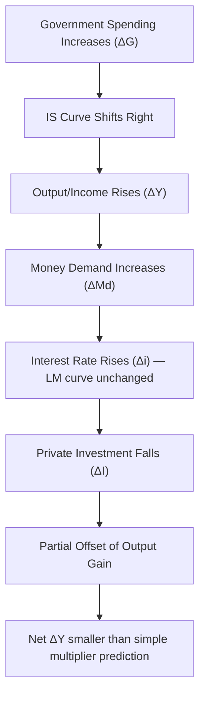

## Crowding Out Effect

### Definition

The crowding out effect refers to the reduction in private sector spending (particularly investment) that occurs as a result of increased government spending or government borrowing. In the context of the IS-LM model, it specifically describes the mechanism by which expansionary fiscal policy — increased government expenditure or reduced taxation — raises interest rates, which in turn discourages private investment, partially offsetting the initial stimulative effect on aggregate output.

### Conceptual Foundation

Crowding out arises because government spending and private investment often compete for the same pool of loanable funds. When government spending increases without a corresponding increase in the money supply, the government must finance this spending through borrowing. This increased demand for loanable funds pushes up interest rates. Since private investment is inversely related to the interest rate, higher rates reduce the quantity of investment demanded by firms and households.

The core relationship can be summarized as:

$$\Delta G \uparrow \Rightarrow \Delta Y \uparrow \Rightarrow \Delta M_D \uparrow \Rightarrow \Delta i \uparrow \Rightarrow \Delta I \downarrow$$

where $G$ is government spending, $Y$ is output/income, $M_D$ is money demand, $i$ is the interest rate, and $I$ is private investment.

### Mechanism Within the IS-LM Framework

**Step-by-step transmission:**

1. **Initial fiscal expansion:** Government increases spending ($G$) or cuts taxes ($T$), shifting the IS curve rightward.
2. **Output rises, increasing money demand:** As income $Y$ rises (via the multiplier effect), the transactions demand for money increases, since people need more money to facilitate a higher volume of transactions.
3. **Interest rate adjustment:** With the money supply held fixed by the central bank (LM curve unchanged), increased money demand at the original interest rate creates excess demand in the money market. This pushes the equilibrium interest rate upward.
4. **Investment response:** Higher interest rates raise the cost of borrowing, reducing interest-sensitive private investment (and potentially consumption of durable goods).
5. **Net effect on output:** The economy moves along the LM curve to a new equilibrium at a higher interest rate and higher output than initially, but the increase in output is smaller than what the simple Keynesian multiplier (without interest rate effects) would predict.

### Graphical Representation (IS-LM Diagram)

The following SVG illustrates the shift in the IS curve and the resulting movement along the LM curve, showing the gap between the naive (no crowding out) output level and the actual equilibrium output.

<svg xmlns="http://www.w3.org/2000/svg" viewBox="0 0 700 480" font-family="Arial, sans-serif">
<text x="350" y="28" text-anchor="middle" font-size="18" font-weight="bold" fill="#1a1a1a">Crowding Out in the IS-LM Model (svg_diagram)</text>

<line x1="90" y1="420" x2="650" y2="420" stroke="#333" stroke-width="2" />
<line x1="90" y1="420" x2="90" y2="60" stroke="#333" stroke-width="2" />
<text x="660" y="425" font-size="14" fill="#333">Y (Output)</text>
<text x="60" y="55" font-size="14" fill="#333">i (Interest Rate)</text>

<path d="M 150 400 Q 350 300 550 100" stroke="#2563eb" stroke-width="2.5" fill="none" />
<text x="555" y="95" font-size="13" fill="#2563eb" font-weight="bold">LM</text>

<path d="M 200 120 Q 350 250 500 380" stroke="#16a34a" stroke-width="2.5" fill="none" />
<text x="505" y="385" font-size="13" fill="#16a34a" font-weight="bold">IS1</text>

<path d="M 280 120 Q 430 250 580 380" stroke="#dc2626" stroke-width="2.5" fill="none" stroke-dasharray="6,3" />
<text x="585" y="385" font-size="13" fill="#dc2626" font-weight="bold">IS2</text>

<circle cx="330" cy="248" r="5" fill="#000" />
<text x="315" y="238" font-size="12" fill="#000">E0</text>
<circle cx="405" cy="205" r="5" fill="#000" />
<text x="412" y="200" font-size="12" fill="#000">E1</text>

<circle cx="480" cy="248" r="5" fill="#888" />
<text x="465" y="238" font-size="12" fill="#555">E1'</text>
<line x1="330" y1="248" x2="330" y2="420" stroke="#999" stroke-width="1" stroke-dasharray="3,2" />
<line x1="405" y1="205" x2="405" y2="420" stroke="#999" stroke-width="1" stroke-dasharray="3,2" />
<line x1="480" y1="248" x2="480" y2="420" stroke="#999" stroke-width="1" stroke-dasharray="3,2" />
<line x1="90" y1="248" x2="330" y2="248" stroke="#999" stroke-width="1" stroke-dasharray="3,2" />
<line x1="90" y1="205" x2="405" y2="205" stroke="#999" stroke-width="1" stroke-dasharray="3,2" />

<text x="320" y="440" font-size="12" fill="#333">Y0</text>

<text x="395" y="440" font-size="12" fill="#333">Y1 (actual)</text>

<text x="470" y="440" font-size="12" fill="#333">Y1' (naive)</text>

<path d="M 405 260 L 480 260" stroke="#dc2626" stroke-width="2" marker-end="url(#arrow)" />
<path d="M 480 260 L 405 260" stroke="#dc2626" stroke-width="2" marker-start="url(#arrow)" />
<text x="400" y="278" font-size="12" fill="#dc2626" font-weight="bold">Crowding Out Gap</text>
<text x="150" y="460" font-size="12" fill="#555">Y0 → Y1: actual output rise (with crowding out via rising i)</text>

<text x="150" y="475" font-size="12" fill="#555">Y0 → Y1': hypothetical rise if interest rate were fixed (no crowding out)</text>

</svg>

### Determinants of the Magnitude of Crowding Out

**Key Points**

- **Slope of the LM curve:** The steeper the LM curve (i.e., the less interest-sensitive money demand is, or the smaller the money supply's responsiveness), the greater the rise in interest rates for a given increase in output, and thus the greater the crowding out. If the LM curve is vertical (money demand entirely insensitive to interest rates, a classical case), crowding out is complete — output does not increase at all, only the interest rate rises.
- **Slope of the IS curve:** The steeper the IS curve (i.e., the less interest-sensitive investment is), the smaller the crowding out effect, because even a large increase in interest rates produces only a small reduction in investment.
- **Monetary policy accommodation:** If the central bank simultaneously increases the money supply to accommodate the fiscal expansion (shifting LM rightward as well), the rise in interest rates is mitigated or eliminated, reducing or eliminating crowding out.
- **State of the economy (liquidity trap):** In a liquidity trap, where the LM curve is horizontal (money demand is perfectly elastic at very low interest rates), fiscal expansion causes no increase in interest rates, and therefore no crowding out occurs. The full multiplier effect is realized.
- **Openness of the economy:** In an open economy with flexible exchange rates (Mundell-Fleming extension), crowding out can be reinforced by currency appreciation, which reduces net exports — sometimes termed "external crowding out."

### Special Cases

**Complete Crowding Out**

Complete crowding out occurs when the entire increase in government spending is offset by an equivalent decrease in private investment, leaving aggregate output unchanged. This occurs in two theoretical extremes:

1. **Vertical LM curve (classical/monetarist case):** Money demand is completely interest-inelastic. Any increase in income creates a proportional increase in money demand that cannot be met at the existing interest rate without a change in money supply, so the interest rate rises sufficiently to keep money demand equal to the fixed money supply, fully choking off the output gain.

$$\text{If } M_D = kY \text{ (no interest sensitivity)}, \quad \Delta Y = 0 \text{ when } \Delta M_S = 0$$

2. **Interest-inelastic investment combined with a steep LM curve:** Even with some LM slope, if investment does not respond to interest rate changes at all, output would not fall — but this describes zero crowding out, not complete crowding out. The two conditions produce opposite results and should not be conflated.

**Zero Crowding Out (Liquidity Trap)**

When the LM curve is horizontal, the money market can absorb any increase in money demand without any change in the interest rate. Fiscal policy is maximally effective, and the entire Keynesian multiplier effect is realized without offset.

### Mathematical Formalization

Consider the standard IS-LM system:

**IS curve:** $Y = C(Y-T) + I(i) + G$

**LM curve:** $\frac{M}{P} = L(Y, i)$

Differentiating totally and solving for $\frac{dY}{dG}$ (the fiscal multiplier accounting for crowding out):

$$\frac{dY}{dG} = \frac{1}{1 - C_Y - I_i \cdot \dfrac{L_Y}{-L_i}}$$

where $C_Y$ is the marginal propensity to consume, $I_i$ is the sensitivity of investment to the interest rate (negative), and $L_Y$, $L_i$ are the sensitivities of money demand to income and the interest rate, respectively.

**Interpretation:**

- If $L_i \to -\infty$ (liquidity trap, LM horizontal), the term $\dfrac{L_Y}{-L_i} \to 0$, and the multiplier reduces to the simple Keynesian multiplier $\dfrac{1}{1 - C_Y}$ — no crowding out.
- If $L_i \to 0$ (LM vertical, money demand interest-inelastic), the term $\dfrac{L_Y}{-L_i} \to \infty$, driving the entire multiplier toward zero — complete crowding out.

### Numerical Example

Assume:

- Marginal propensity to consume: $C_Y = 0.6$
- Investment sensitivity to interest rate: $I_i = -50$
- Money demand sensitivity to income: $L_Y = 0.25$
- Money demand sensitivity to interest rate: $L_i = -25$

**Simple multiplier (ignoring crowding out):**

$$\frac{1}{1 - 0.6} = 2.5$$

**Full IS-LM multiplier (incorporating crowding out):**

$$\frac{dY}{dG} = \frac{1}{1 - 0.6 - (-50)\left(\dfrac{0.25}{25}\right)} = \frac{1}{0.4 + 0.5} = \frac{1}{0.9} \approx 1.11$$

**Example**

A government spending increase of $100 billion, under the simple multiplier, would predict an output increase of $250 billion ($100 \times 2.5$). Accounting for crowding out via rising interest rates and reduced investment, the actual predicted increase in output falls to approximately $111 billion ($100 \times 1.11$). The difference — $139 billion — represents the portion of the fiscal stimulus "crowded out" through reduced private investment.

### Crowding Out vs. Crowding In

| Concept | Mechanism | Effect on Output |
| --- | --- | --- |
| Crowding out | Government borrowing raises interest rates, reducing private investment | Dampens the output-expanding effect of fiscal policy |
| Crowding in | Government spending raises expected future income/profitability (accelerator effects) or public investment complements private capital (e.g., infrastructure) | Can enhance private investment and amplify output effects |
| Financial crowding out | Direct competition for loanable funds between public and private borrowers | Raises borrowing costs broadly |
| Ricardian crowding out | Rational agents anticipate future tax increases to finance current deficits and increase saving | Reduces the effectiveness of fiscal expansion via consumption behavior, independent of interest rate changes |

[Inference] The relative empirical importance of crowding out versus crowding in is a subject of ongoing debate among macroeconomists and tends to vary with the state of the business cycle, particularly whether the economy is operating near full employment (where crowding out is generally considered more severe) or in a recession with substantial slack (where crowding out effects are often estimated to be smaller).

### Policy Implications

- **Monetary-fiscal policy coordination:** Central banks can offset crowding out by expanding the money supply alongside fiscal expansion (accommodative monetary policy), effectively shifting the LM curve to keep interest rates stable.
- **Business cycle dependence:** Fiscal policy is generally considered most effective (least subject to crowding out) during recessions or liquidity trap conditions, when interest rates are already near zero and money demand is highly elastic. This is a common justification offered for fiscal stimulus during severe downturns.
- **Debt-financed vs. money-financed spending:** Government spending financed by issuing bonds (borrowing) is more prone to crowding out than spending financed by money creation, though the latter carries inflationary risk.
- **Long-run capital stock effects:** Sustained crowding out of investment can reduce the economy's long-run capital stock and productive capacity, a concern distinct from the short-run output effects captured in the static IS-LM framework.

### Common Misconceptions

**Key Points**

- Crowding out does not mean government spending has *no* effect on output in the general case — only in the extreme classical case (vertical LM) is crowding out complete.
- Crowding out is not the same as the government "running out of money" — it operates through interest rate and credit market channels, not fiscal insolvency.
- Crowding out applies most directly to *interest-sensitive* private spending (primarily investment, and to a lesser extent durable goods consumption); it does not imply that all forms of private economic activity decline.

### Related Topics

- **IS Curve derivation and slope determinants**
- **LM Curve derivation and the role of money demand elasticity**
- **Liquidity trap and the effectiveness of monetary policy**
- **Fiscal multiplier and the balanced budget multiplier**
- **Ricardian Equivalence**
- **Mundell-Fleming Model (open economy IS-LM with crowding out via exchange rates)**
- **Monetary policy transmission mechanism**
- **Classical vs. Keynesian views on fiscal policy effectiveness**
- **Government budget deficits and public debt dynamics**
- **Accelerator theory of investment (crowding in mechanism)**