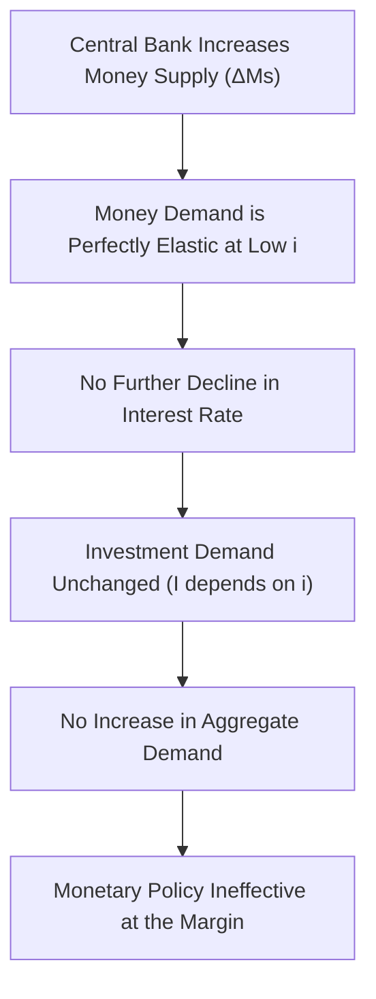

## Liquidity Trap

### Definition

A liquidity trap is a situation in which nominal interest rates are at or near their lower bound (historically treated as zero, hence "zero lower bound" or ZLB), and money demand becomes perfectly (or near-perfectly) elastic with respect to the interest rate. In this state, the public is willing to hold any additional quantity of money supplied by the central bank without requiring a further reduction in the interest rate, because bonds and money are viewed as near-perfect substitutes at such low yields. As a result, conventional monetary policy — expanding the money supply — loses its ability to lower interest rates further and thus loses its power to stimulate aggregate demand.

### Conceptual Foundation

The liquidity trap concept originates from John Maynard Keynes's analysis of money demand (liquidity preference) in *The General Theory of Employment, Interest and Money* (1936). Keynes identified three motives for holding money: the transactions motive, the precautionary motive, and the speculative motive. The speculative motive is central to the liquidity trap: when interest rates are very low, the price of bonds is very high, and investors expect that rates can only rise (and bond prices fall) in the future. Consequently, at very low interest rates, the speculative demand for money becomes infinitely elastic — everyone prefers to hold cash rather than bonds, since the expected capital loss from bond price declines outweighs the meager interest income.

### Representation in the IS-LM Framework

In the standard IS-LM model, the LM curve is typically upward sloping, reflecting the assumption that money demand is inversely related to the interest rate, and that higher income raises transactions demand for money, requiring a higher interest rate to maintain money market equilibrium given a fixed money supply. In a liquidity trap, the LM curve becomes **horizontal** (perfectly flat) at the prevailing low interest rate, over some range of output levels.

**LM curve equation:**

$$\frac{M}{P} = L(Y, i)$$

In the liquidity trap region, $\dfrac{\partial L}{\partial i} \to -\infty$, meaning money demand is infinitely sensitive to the interest rate at that specific rate level. This flattens the LM curve because any increase in the money supply $M$ is simply absorbed into idle balances without requiring any change in $i$ to restore equilibrium.

### Graphical Representation

The following diagram shows the LM curve flattening at low interest rates (the liquidity trap region) and the consequence for monetary policy effectiveness: a rightward shift of the LM curve (from monetary expansion) produces no change in equilibrium output or the interest rate within the trap region.

<svg xmlns="http://www.w3.org/2000/svg" viewBox="0 0 700 480" font-family="Arial, sans-serif">
<text x="350" y="28" text-anchor="middle" font-size="18" font-weight="bold" fill="#1a1a1a">The Liquidity Trap in the IS-LM Model (svg_diagram)</text>

<line x1="90" y1="420" x2="650" y2="420" stroke="#333" stroke-width="2" />
<line x1="90" y1="420" x2="90" y2="60" stroke="#333" stroke-width="2" />
<text x="660" y="425" font-size="14" fill="#333">Y (Output)</text>
<text x="55" y="55" font-size="14" fill="#333">i (Interest Rate)</text>

<path d="M 150 390 L 320 390 Q 450 300 560 100" stroke="#2563eb" stroke-width="2.5" fill="none" />
<text x="565" y="95" font-size="13" fill="#2563eb" font-weight="bold">LM1</text>

<path d="M 150 390 L 400 390 Q 480 300 570 150" stroke="#7c3aed" stroke-width="2.5" fill="none" stroke-dasharray="6,3" />
<text x="575" y="145" font-size="13" fill="#7c3aed" font-weight="bold">LM2 (after ΔMs)</text>

<path d="M 220 130 Q 330 260 420 390" stroke="#16a34a" stroke-width="2.5" fill="none" />
<text x="425" y="395" font-size="13" fill="#16a34a" font-weight="bold">IS</text>

<rect x="90" y="385" width="260" height="10" fill="#fecaca" opacity="0.6" />
<text x="130" y="410" font-size="12" fill="#b91c1c" font-weight="bold">Liquidity Trap Zone (i near zero lower bound)</text>

<circle cx="305" cy="390" r="6" fill="#000" />
<text x="290" y="378" font-size="12" fill="#000">E0 = E1</text>
<line x1="305" y1="390" x2="305" y2="420" stroke="#999" stroke-width="1" stroke-dasharray="3,2" />
<text x="295" y="440" font-size="12" fill="#333">Y0 = Y1</text>

<text x="150" y="460" font-size="12" fill="#555">Shifting LM1 → LM2 (expanding Ms) leaves equilibrium unchanged in the flat region:</text>

<text x="150" y="475" font-size="12" fill="#555">monetary policy has no effect on Y or i within the trap.</text>

</svg>

### Effectiveness of Policy Instruments

**Key Points**

- **Monetary policy is ineffective:** Since the LM curve is horizontal, shifting it via open market operations (increasing $M$) does not change the equilibrium interest rate or output. Money and near-money assets become perfect substitutes, so injecting more money has no additional stimulative effect — this is sometimes summarized as monetary policy "pushing on a string."
- **Fiscal policy is maximally effective:** Because the interest rate does not rise in response to increased government spending (the horizontal LM curve absorbs any change in money demand without requiring $i$ to adjust), there is **zero crowding out** of private investment. The full simple Keynesian multiplier applies:

$$\frac{dY}{dG} = \frac{1}{1 - C_Y}$$

with no offsetting reduction via $\dfrac{L_Y}{-L_i}$, since $L_i \to -\infty$ drives that term to zero.

- **Interest rate as a policy tool becomes unavailable:** With nominal rates already at (or effectively at) the zero lower bound, the central bank cannot lower rates further through conventional tools to stimulate borrowing and investment.

### Why the Liquidity Trap Undermines Monetary Policy: Step by Step

1. Interest rates fall to very low levels (near zero) due to weak aggregate demand or aggressive prior monetary easing.
2. At this low rate, bond prices are very high, and market participants widely expect rates to rise in the future (bond prices to fall).
3. Holding bonds at this point offers little interest income and carries a significant risk of capital loss; holding cash offers zero return but avoids this risk.
4. Consequently, any additional money the central bank injects into the economy (through open market purchases) is simply held as idle cash balances rather than being used to purchase bonds or spent, since agents are indifferent between money and bonds at the margin.
5. Because no one is induced to shift out of money into bonds, the interest rate does not fall further, and there is no stimulus to interest-sensitive spending components (particularly investment).

### Historical and Applied Context

[Unverified] The Great Depression of the 1930s is the historical episode most closely associated with Keynes's original liquidity trap concept, and is widely cited in textbooks as a real-world example, though the extent to which observed conditions matched the theoretical liquidity trap precisely remains a subject of historical and econometric debate among economists.

Japan's prolonged period of near-zero interest rates and deflationary pressure beginning in the 1990s ("the Lost Decade" and beyond) is commonly cited in modern macroeconomics as an example of liquidity trap conditions, prompting extensive research into unconventional policy responses. Similarly, the 2008 global financial crisis and its aftermath saw major central banks (the U.S. Federal Reserve, the Bank of Japan, the European Central Bank) reduce policy rates to near zero, reviving academic and policy interest in liquidity trap dynamics.

### Escaping the Liquidity Trap: Policy Responses

Because conventional monetary policy loses traction, several alternative approaches have been proposed and implemented:

- **Fiscal expansion:** As shown above, government spending increases are not crowded out in a liquidity trap, making fiscal policy the primary recommended tool in the basic IS-LM framework.
- **Quantitative easing (QE):** Central banks purchase longer-term or riskier assets (rather than only short-term government securities) to influence longer-term interest rates and credit conditions directly, attempting to affect variables beyond the short-term policy rate.
- **Forward guidance:** Central banks commit to keeping interest rates low for an extended future period, attempting to influence expectations and thereby lower longer-term real interest rates even when the current nominal short-term rate cannot fall further.
- **Raising inflation expectations:** Since the real interest rate is $r = i - \pi^e$, and the nominal rate $i$ is stuck near zero, increasing expected inflation $\pi^e$ can lower the real interest rate and stimulate interest-sensitive spending, even without any change in the nominal rate.
- **Negative nominal interest rates:** Some central banks (e.g., the European Central Bank, the Bank of Japan) have experimented with negative policy rates on reserves, testing the practical boundaries of the "zero" lower bound, which some economists now more precisely refer to as the "effective lower bound."

### The Liquidity Trap and Aggregate Demand/Aggregate Supply Extension

When the IS-LM model is extended into the AD-AS framework, a liquidity trap implies that the aggregate demand curve becomes relatively insensitive to price level changes through the conventional monetary transmission channel, because falling prices (which would normally increase real money balances $M/P$ and lower interest rates) cannot lower interest rates any further once the zero lower bound binds. This can contribute to a **debt-deflation spiral**, a concept associated with Irving Fisher, in which falling prices raise the real burden of debt, further depressing spending, output, and prices.

### Common Misconceptions

**Key Points**

- A liquidity trap does not mean money has become worthless or that money supply is irrelevant to the economy in all respects — it specifically means that *additional* money creation fails to lower interest rates further or stimulate demand through the standard interest rate channel.
- A liquidity trap is not simply "low interest rates" — it specifically requires that money demand be (near) perfectly elastic, such that further increases in money supply have no effect on rates.
- The liquidity trap does not imply fiscal policy is costless; government borrowing still increases public debt, even though the interest-rate crowding-out channel is absent in this specific scenario.

### Comparison Table: Normal Conditions vs. Liquidity Trap

| Feature | Normal LM Curve (Upward Sloping) | Liquidity Trap (Horizontal LM) |
| --- | --- | --- |
| Money demand elasticity w.r.t. $i$ | Finite | Infinite (perfectly elastic) |
| Effect of ΔMs on interest rate | Decreases $i$ | No change in $i$ |
| Monetary policy effectiveness | Effective | Ineffective (conventional tools) |
| Fiscal policy effectiveness | Reduced by crowding out | Maximally effective (no crowding out) |
| Investment response to ΔG | Partially offset by rising $i$ | Fully realized (no offset) |

### Related Topics

- **The IS Curve and investment sensitivity to interest rates**
- **Crowding out effect**
- **Speculative demand for money and liquidity preference theory**
- **Zero lower bound (ZLB) and effective lower bound on interest rates**
- **Quantitative easing and unconventional monetary policy**
- **Debt-deflation theory (Irving Fisher)**
- **AD-AS model extension of IS-LM**
- **Fiscal multiplier under alternative LM curve slopes**
- **Japan's Lost Decade and post-2008 monetary policy responses**
- **Real vs. nominal interest rates and the Fisher equation**