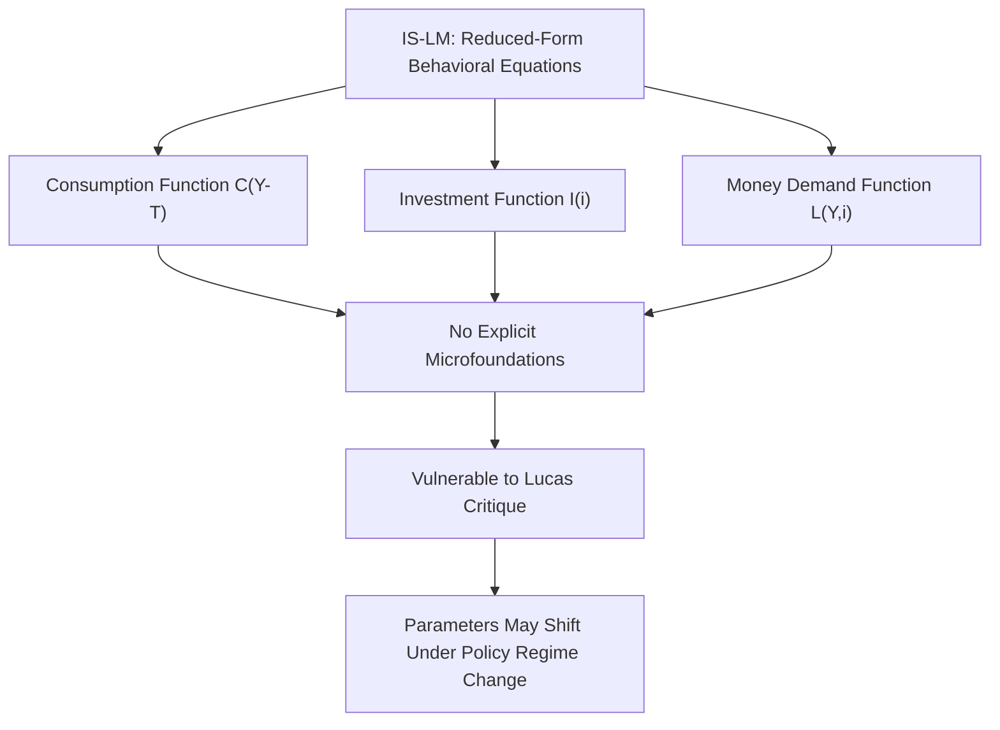
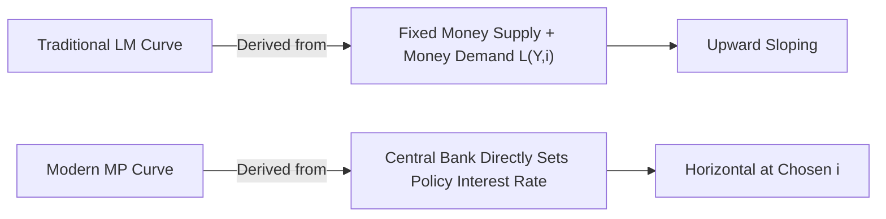

## Limitations and Critiques of the IS-LM Framework

### Overview

The IS-LM model, developed by John Hicks (1937) as a formalization of Keynes's *General Theory*, has served as a foundational pedagogical tool in macroeconomics for representing the interaction between goods markets (IS) and money markets (LM) to determine equilibrium output and interest rates. Despite its enduring use in introductory and intermediate macroeconomics, the model has been the subject of extensive theoretical and empirical criticism since at least the 1970s. These critiques span methodological, theoretical, and practical dimensions, and understanding them is essential to correctly contextualizing what the model can and cannot explain.

### Static Nature and Absence of Dynamics

**Key Points**

- The IS-LM model is fundamentally a **comparative statics** framework: it compares two equilibrium states (before and after a shock or policy change) without describing the *path* or *speed* by which the economy moves from one equilibrium to the other.
- It provides no explicit treatment of adjustment lags, expectations formation over time, or the possibility of overshooting/undershooting during transition.
- Real-world economies are dynamic systems where variables evolve continuously and where past decisions (e.g., existing capital stock, outstanding debt) constrain current behavior — none of this is captured in a single-period snapshot model.

[Inference] Because the model omits explicit time dynamics, it is generally considered less suited to answering questions about the timing or speed of policy transmission than more modern dynamic stochastic frameworks, though it remains useful for characterizing directional and qualitative comparative-static effects.

### Fixed Price Level Assumption

The standard IS-LM model treats the price level $P$ as fixed in the short run, which is a deliberate simplification appropriate for analyzing short-run output fluctuations under the Keynesian assumption of sticky prices and wages. However, this generates significant limitations:

- It cannot, by itself, explain inflation or the interaction between output and the price level; this requires the extension to the AD-AS (Aggregate Demand-Aggregate Supply) framework.
- It obscures the distinction between **nominal** and **real** interest rates, which becomes critical when inflation expectations are volatile (see the Fisher effect and its role in the liquidity trap analysis).
- The assumption of price rigidity, while defensible for short horizons, becomes increasingly unrealistic as the time horizon lengthens, limiting the model's applicability to medium- and long-run analysis.

### Absence of Explicit Microfoundations

**Key Points**

- The consumption, investment, and money demand functions in the IS-LM model ($C(Y-T)$, $I(i)$, $L(Y,i)$) are specified as reduced-form behavioral relationships rather than derived from explicit optimization problems of individual households and firms.
- This makes the model vulnerable to the **Lucas Critique** (Robert Lucas, 1976), which argues that reduced-form behavioral parameters are not structural — they may shift when policy regimes change, because rational agents adjust their behavior in anticipation of or in response to policy. A model without microfoundations cannot reliably predict the effects of policy changes that alter the environment agents are optimizing within.
- Modern macroeconomic modeling (DSGE — Dynamic Stochastic General Equilibrium models) responded to this critique by deriving aggregate relationships from explicit intertemporal utility and profit maximization problems, at the cost of significantly greater mathematical and computational complexity.

### Treatment of Expectations

- The basic IS-LM model largely ignores or treats as exogenous the role of **expectations** about future income, inflation, and policy — despite these being central to investment decisions, consumption smoothing, and financial market behavior in more modern theory.
- **Rational expectations** critiques, associated with economists such as Robert Lucas and Thomas Sargent, argue that if agents form expectations rationally (using all available information, including about policy rules themselves), the effects of anticipated policy changes can differ substantially from those of unanticipated changes — a distinction the IS-LM model does not naturally accommodate.
- Investment in particular is highly sensitive to expected future profitability and business confidence (as emphasized by Keynes's own concept of "animal spirits"), which the model's simple $I(i)$ function does not capture.

### Neglect of the Supply Side

- The IS-LM model is a **demand-side** framework; it says little about aggregate supply, productive capacity, potential output, or supply shocks.
- It cannot, on its own, explain phenomena such as **stagflation** (simultaneous high inflation and high unemployment), which became prominent during the 1970s oil price shocks — an episode often cited as a major empirical embarrassment for simple Keynesian demand-management models of that era.
- The model's silence on the labor market beyond its implicit link through the AD-AS extension limits its ability to address unemployment dynamics directly (this gap motivated further extensions, such as the incorporation of a Phillips Curve into related simple Keynesian frameworks).

### Closed Economy Bias

- The basic IS-LM model, as typically presented, assumes a **closed economy** with no international trade or capital flows.
- This omits exchange rate effects, net export responses to income and interest rate changes, and international capital mobility — all of which are significant, particularly for smaller open economies.
- The **Mundell-Fleming model** was developed specifically to extend the IS-LM framework to open economies, incorporating a balance-of-payments (BP) curve and distinguishing between fixed and flexible exchange rate regimes. The necessity of this extension itself underscores a core limitation of the base model.

### Treatment of Financial Markets and the Banking Sector

**Key Points**

- The LM curve represents money market equilibrium using a highly simplified conception of the financial sector — typically a single interest rate and a single, exogenously fixed money supply controlled directly by the central bank.
- The model does not distinguish between different types of financial assets, credit risk, liquidity risk, or the balance sheet condition of banks and other financial intermediaries.
- [Inference] This simplification is widely regarded as a significant weakness in explaining financial crises, since events such as the 2008 global financial crisis involved credit market disruptions, bank balance sheet stress, and risk premia shifts that a single-interest-rate money market framework cannot represent.
- Modern central banks typically operate through setting a short-term policy interest rate directly (e.g., via an interest rate corridor or similar operational framework) rather than by directly targeting the money supply, which stands in some tension with the LM curve's traditional formulation of money supply as the exogenous policy instrument. Many contemporary textbook treatments substitute a horizontal "MP curve" (monetary policy curve, representing a directly-set interest rate) for the LM curve to better reflect actual central bank operating procedures.

### The IS-LM-MP Alternative Formulation

In response to the above critique regarding monetary policy operating procedures, an alternative formulation replaces the LM curve with an **MP (Monetary Policy) curve**, which is horizontal at the interest rate level chosen directly by the central bank (rather than being derived from a fixed money supply and an upward-sloping money demand function). This reformulation, associated with economists such as David Romer, is intended to better match how modern central banks actually implement policy — through direct interest rate setting rather than money supply targeting — while preserving the IS curve and the overall equilibrium logic of the original model.

### Empirical and Predictive Limitations

- **Parameter instability:** Empirical estimates of the slopes of the IS and LM curves (i.e., the interest sensitivity of investment and money demand) have historically proven unstable across different time periods and economic regimes, undermining the model's usefulness for precise quantitative forecasting.
- **Velocity of money instability:** The LM curve implicitly relies on a relatively stable relationship between money, income, and interest rates (related to the velocity of money). Periods of financial innovation, deregulation, and changing payment technologies have historically disrupted this relationship, weakening the empirical link between money supply changes and macroeconomic outcomes.
- **Simultaneity and identification problems:** Because output, interest rates, and the price level are jointly and simultaneously determined, isolating the "true" structural IS or LM relationships from observed data involves significant econometric identification challenges.

### Comparison: IS-LM vs. Modern Macroeconomic Modeling Approaches

| Dimension | IS-LM Model | DSGE / New Keynesian Models |
| --- | --- | --- |
| Microfoundations | Absent (reduced-form) | Explicit (utility/profit maximization) |
| Time dimension | Static (comparative statics) | Dynamic (intertemporal optimization) |
| Expectations | Largely exogenous/absent | Explicit, often rational expectations |
| Price level | Fixed (short run) | Endogenous, often with sticky-price microfoundations (Calvo pricing, etc.) |
| Policy analysis | Vulnerable to Lucas Critique | Designed to be robust to Lucas Critique |
| Complexity | Low; pedagogically tractable | High; requires computational solution methods |
| Primary use | Teaching, intuition-building, qualitative policy analysis | Research, quantitative policy simulation, forecasting |

### Defense and Continued Relevance

Despite these critiques, the IS-LM model retains substantial pedagogical and heuristic value for several reasons:

- **Analytical tractability:** Its simplicity allows for clear, intuitive graphical analysis of the directional effects of fiscal and monetary policy shocks, which remains valuable for building foundational intuition before progressing to more complex models.
- **Qualitative robustness:** Many of the model's qualitative predictions (e.g., that expansionary fiscal policy raises both output and interest rates in normal conditions, or that liquidity trap conditions blunt monetary policy effectiveness) have proven broadly consistent with observed macroeconomic patterns, even if precise magnitudes are not reliably estimated by the model.
- **Bridge to more advanced models:** IS-LM serves as a conceptual stepping stone toward understanding more sophisticated frameworks (AD-AS, Mundell-Fleming, New Keynesian DSGE models), which retain some of its core logic while addressing its specific shortcomings.
- [Speculation] Some economists have argued informally that the model experienced a resurgence in practical relevance and public discussion during the 2008 financial crisis and its aftermath, as its treatment of liquidity trap conditions and the limits of monetary policy proved intuitively useful for explaining policy debates to broader audiences, though this remains a matter of professional and pedagogical opinion rather than settled empirical consensus.

### Common Misconceptions

**Key Points**

- Critiquing the IS-LM model as a *simplification* is not the same as saying it is *wrong* in all applications — it is best understood as a deliberately simplified short-run, closed-economy, fixed-price teaching model, not a comprehensive theory of the macroeconomy.
- The Lucas Critique applies to the use of reduced-form models for *policy evaluation under regime change*, not necessarily to their use for basic comparative-static intuition-building or historical description.
- The existence of extensions (Mundell-Fleming, AD-AS, IS-LM-MP) does not invalidate the base model; rather, these extensions are typically taught as direct responses to specific, well-identified limitations of the base framework.

### Related Topics

- **The Lucas Critique and rational expectations**
- **Mundell-Fleming model (open economy IS-LM)**
- **AD-AS model and the derivation of aggregate demand from IS-LM**
- **New Keynesian DSGE models**
- **The Phillips Curve and the supply-side gap in IS-LM**
- **Monetary policy operating procedures and the IS-LM-MP framework**
- **Liquidity trap in the IS-LM model**
- **Crowding out effect**
- **The 1970s stagflation episode and its implications for Keynesian economics**
- **Financial intermediation and balance sheet channels in macroeconomic models**