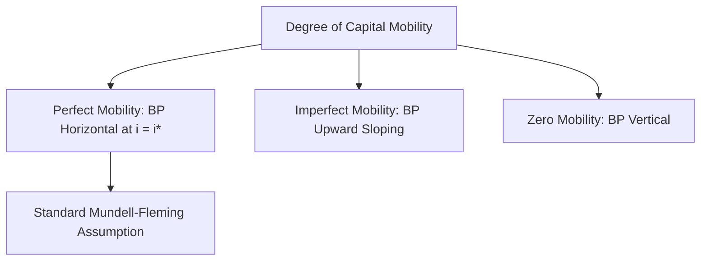
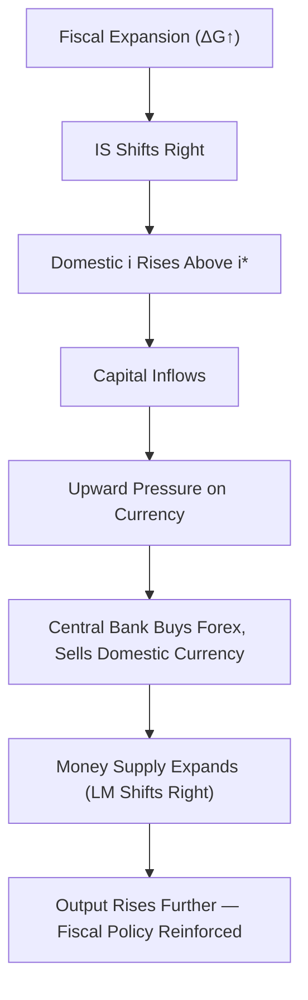
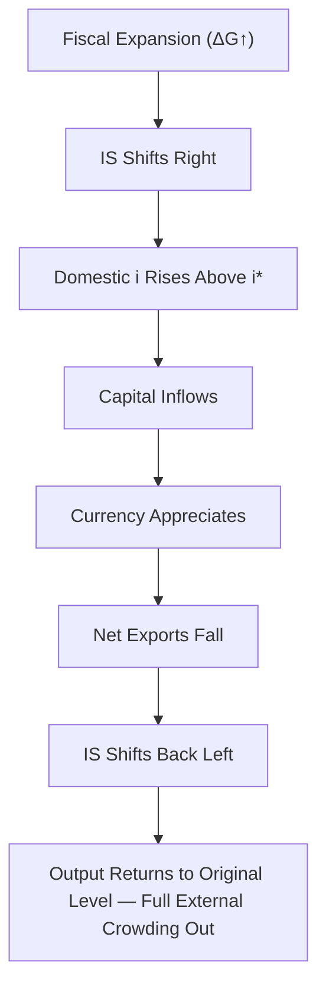
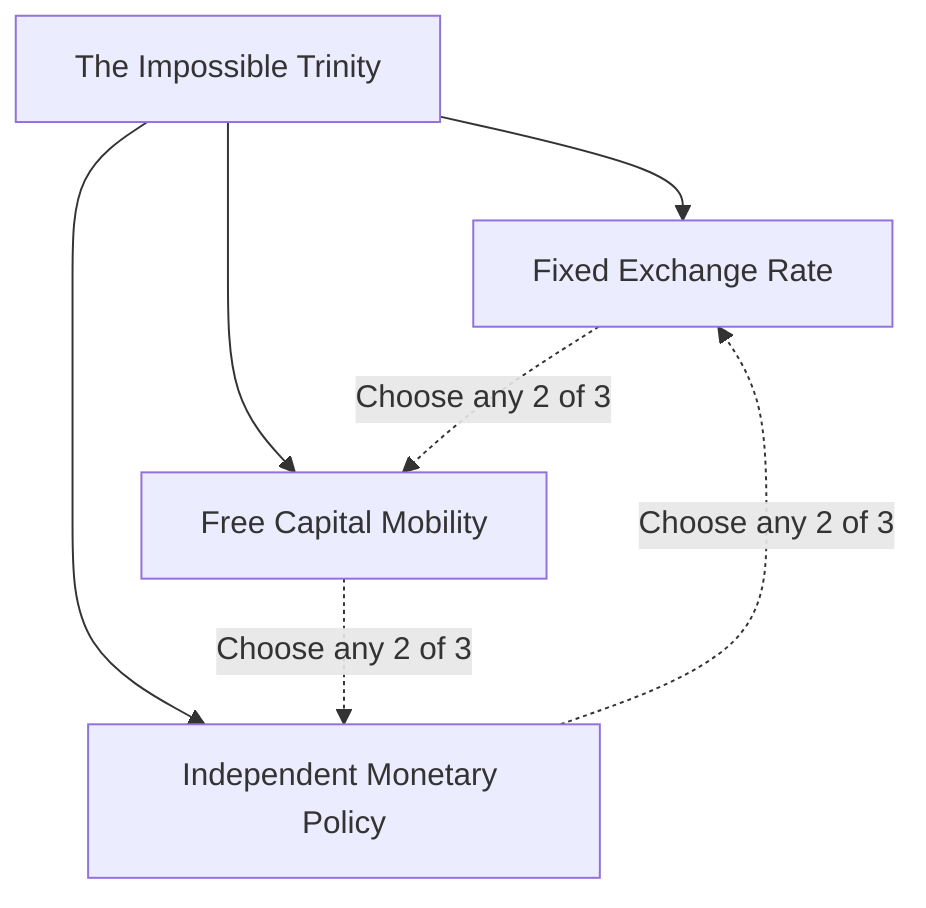

## IS-LM in an Open Economy Setting

### Overview

Extending the IS-LM model to an open economy requires incorporating international trade (net exports) and international capital flows into the framework. This extension is most formally developed as the **Mundell-Fleming model**, independently developed by Robert Mundell and Marcus Fleming in the early 1960s. It introduces a third equilibrium relationship — the **BP (Balance of Payments) curve** — representing combinations of income and the interest rate consistent with external balance, alongside the modified IS and LM curves. The resulting framework is central to analyzing how fiscal and monetary policy effectiveness depends critically on the exchange rate regime (fixed vs. flexible) and the degree of capital mobility.

### Modifications to the IS Curve

In an open economy, the goods market equilibrium condition incorporates net exports ($NX$) as an additional component of aggregate demand:

$$Y = C(Y - T) + I(i) + G + NX(Y, Y^*, \epsilon)$$

where:

- $NX$ = net exports (exports minus imports)
- $Y^*$ = foreign income (rest-of-world output)
- $\epsilon$ = the real exchange rate

**Key relationships:**

- **Domestic income and imports:** Higher domestic income $Y$ increases import demand, which reduces $NX$. This makes the IS curve **steeper** (or flatter, depending on convention) than in the closed-economy case, because part of any income-induced spending increase now "leaks" abroad rather than recirculating domestically — reducing the effective domestic multiplier.
- **Foreign income and exports:** Higher foreign income $Y^*$ increases foreign demand for domestic exports, shifting the IS curve rightward.
- **Real exchange rate and net exports:** A real depreciation (a fall in $\epsilon$, making domestic goods cheaper relative to foreign goods) increases net exports, shifting the IS curve rightward; a real appreciation shifts it leftward.

**Open-economy multiplier:**

$$\frac{dY}{dG} = \frac{1}{1 - C_Y + M_Y}$$

where $M_Y$ is the marginal propensity to import. Since $M_Y > 0$, the open-economy multiplier is smaller than the closed-economy multiplier $\dfrac{1}{1-C_Y}$, reflecting the "leakage" of demand into imports.

### The LM Curve in an Open Economy

The LM curve retains its closed-economy formulation:

$$\frac{M}{P} = L(Y, i)$$

The domestic money market equilibrium condition is structurally unchanged; what differs in the open-economy setting is how the domestic interest rate $i$ relates to international capital flows via the new BP curve, and — under a fixed exchange rate regime — how the money supply itself may need to adjust in response to balance-of-payments pressures (discussed below).

### The BP Curve (Balance of Payments Equilibrium)

The BP curve represents combinations of income $Y$ and interest rate $i$ for which the balance of payments (current account plus capital account) is zero — i.e., external equilibrium.

$$BP: \quad NX(Y, Y^*, \epsilon) + CF(i - i^*) = 0$$

where $CF$ is net capital inflow, a function of the interest rate differential between the domestic rate $i$ and the world rate $i^*$.

**Slope of the BP curve** depends on the degree of capital mobility:

- **Perfect capital mobility:** Capital flows are infinitely responsive to any interest rate differential; the BP curve is **horizontal** at $i = i^*$, since even a small deviation from the world interest rate triggers massive capital flows that restore equality.
- **Imperfect (limited) capital mobility:** The BP curve is **upward sloping** — higher income raises imports (worsening the current account), requiring a higher interest rate to attract offsetting capital inflows and maintain external balance.
- **Zero capital mobility (capital controls):** The BP curve is **vertical**, since only the current account (a function of income alone) determines external balance, independent of the interest rate.

### Graphical Representation: IS-LM-BP Equilibrium

<svg xmlns="http://www.w3.org/2000/svg" viewBox="0 0 700 480" font-family="Arial, sans-serif">
<text x="350" y="28" text-anchor="middle" font-size="18" font-weight="bold" fill="#1a1a1a">IS-LM-BP Equilibrium (Perfect Capital Mobility) (svg_diagram)</text>
<line x1="90" y1="420" x2="650" y2="420" stroke="#333" stroke-width="2" />
<line x1="90" y1="420" x2="90" y2="60" stroke="#333" stroke-width="2" />
<text x="660" y="425" font-size="14" fill="#333">Y (Output)</text>
<text x="55" y="55" font-size="14" fill="#333">i (Interest Rate)</text>

<path d="M 150 400 Q 350 280 550 100" stroke="#2563eb" stroke-width="2.5" fill="none" />
<text x="555" y="95" font-size="13" fill="#2563eb" font-weight="bold">LM</text>

<path d="M 220 120 Q 360 260 500 380" stroke="#16a34a" stroke-width="2.5" fill="none" />
<text x="505" y="385" font-size="13" fill="#16a34a" font-weight="bold">IS</text>

<line x1="120" y1="230" x2="600" y2="230" stroke="#dc2626" stroke-width="2.5" stroke-dasharray="8,4" />
<text x="605" y="235" font-size="13" fill="#dc2626" font-weight="bold">BP (i = i*)</text>

<circle cx="365" cy="230" r="6" fill="#000" />
<text x="375" y="220" font-size="12" fill="#000">E (Internal + External Balance)</text>
<line x1="365" y1="230" x2="365" y2="420" stroke="#999" stroke-width="1" stroke-dasharray="3,2" />
<text x="355" y="440" font-size="12" fill="#333">Y*</text>

<text x="150" y="460" font-size="12" fill="#555">Equilibrium requires simultaneous IS, LM, and BP intersection.</text>

<text x="150" y="475" font-size="12" fill="#555">Under perfect capital mobility, domestic i is pinned to the world rate i*.</text>

</svg>

### Policy Effectiveness Under Fixed Exchange Rates

Under a fixed exchange rate regime, the central bank commits to maintaining the exchange rate at a specified level, which requires it to buy or sell foreign currency reserves in response to balance-of-payments pressures. This has direct implications for the money supply and policy effectiveness.

**Monetary Policy (Fixed Rates, Perfect Capital Mobility): Ineffective**

1. Central bank increases the money supply, shifting LM rightward.
2. The domestic interest rate falls below the world rate $i^*$.
3. This triggers capital outflow, as investors seek higher returns abroad, creating downward pressure on the domestic currency.
4. To defend the fixed exchange rate, the central bank must sell foreign reserves and buy domestic currency, which contracts the money supply.
5. This process continues until the money supply returns to its original level and the interest rate returns to $i^*$ — **fully reversing the initial monetary expansion**. Output returns to its original level.

**Fiscal Policy (Fixed Rates, Perfect Capital Mobility): Highly Effective**

1. Government increases spending, shifting IS rightward.
2. This raises income and pushes the domestic interest rate above $i^*$.
3. Capital inflows result, creating upward pressure on the domestic currency.
4. To prevent appreciation and defend the fixed exchange rate, the central bank must buy foreign reserves and sell domestic currency, which **expands** the money supply, shifting LM rightward.
5. This validates the fiscal expansion and pushes output higher still — fiscal policy is reinforced rather than crowded out, since there is no interest-rate-driven crowding out under a fixed exchange rate with perfect capital mobility.

### Policy Effectiveness Under Flexible Exchange Rates

Under a flexible (floating) exchange rate regime, the exchange rate adjusts freely to clear the foreign exchange market, and the central bank does not intervene to maintain any particular exchange rate level.

**Monetary Policy (Flexible Rates, Perfect Capital Mobility): Highly Effective**

1. Central bank increases the money supply, shifting LM rightward.
2. Domestic interest rate falls below $i^*$.
3. Capital outflow occurs, and since the exchange rate is free to adjust, the domestic currency **depreciates**.
4. Currency depreciation makes domestic goods cheaper relative to foreign goods, increasing net exports $NX$.
5. This shifts the IS curve rightward, reinforcing the initial monetary expansion — output rises substantially, and monetary policy is highly effective.

**Fiscal Policy (Flexible Rates, Perfect Capital Mobility): Ineffective**

1. Government increases spending, shifting IS rightward.
2. Domestic interest rate rises above $i^*$, attracting capital inflows.
3. The domestic currency **appreciates**, making domestic goods more expensive relative to foreign goods.
4. This reduces net exports, shifting the IS curve back leftward.
5. In the limiting case of perfect capital mobility, the IS curve shifts back to its original position, **fully crowding out** the fiscal expansion through the "external crowding out" channel (reduced net exports replacing the initial increase in government spending) — output returns to its initial level, though its composition shifts toward government spending and away from net exports.

### Summary Table: Policy Effectiveness by Regime (Perfect Capital Mobility)

| Policy Tool | Fixed Exchange Rate | Flexible Exchange Rate |
| --- | --- | --- |
| Monetary policy | Ineffective (fully reversed by reserve flows) | Highly effective (reinforced by depreciation-driven $NX$ increase) |
| Fiscal policy | Highly effective (reinforced by reserve inflows expanding money supply) | Ineffective (fully offset by appreciation-driven $NX$ decrease) |
| Exchange rate role | Fixed by central bank intervention | Adjusts freely, transmits/absorbs policy shocks |
| Money supply | Endogenous (determined by BOP flows) | Exogenous (controlled independently by central bank) |

### The Case of Imperfect Capital Mobility

When capital mobility is imperfect (the BP curve is upward sloping rather than horizontal), the effectiveness results are less extreme than in the polar perfect-mobility cases:

- **Under fixed exchange rates:** Both monetary and fiscal policy retain some effectiveness, though monetary policy remains weaker than under a fully closed economy or under flexible rates, since some (but not all) of the monetary expansion is offset by reserve outflows.
- **Under flexible exchange rates:** Fiscal policy retains some effectiveness (crowding out via appreciation is only partial), and monetary policy remains effective but somewhat less so than under perfect capital mobility.
- [Inference] The relative slope of the LM curve versus the BP curve determines the precise degree of policy effectiveness in the imperfect mobility case — this is a standard extension covered in many undergraduate treatments, comparing whether LM is steeper or flatter than BP.

### Impossible Trinity (Trilemma)

A central implication of the Mundell-Fleming extension is the **Impossible Trinity** (or Trilemma): a country cannot simultaneously maintain all three of the following:

1. A fixed exchange rate
2. Free capital mobility
3. An independent monetary policy

A country can achieve at most two of the three. For example:

- Fixed exchange rate + free capital mobility → must sacrifice independent monetary policy (as shown above, monetary policy becomes endogenous to defending the peg).
- Free capital mobility + independent monetary policy → must allow the exchange rate to float.
- Fixed exchange rate + independent monetary policy → requires capital controls restricting mobility.

### Real-World Applications and Examples

**Example**

A country operating under a currency peg (fixed exchange rate) with open capital markets — such as Hong Kong's currency board arrangement pegging the Hong Kong dollar to the U.S. dollar — is a commonly cited illustrative case of sacrificing independent monetary policy: the Hong Kong Monetary Authority's interest rate decisions are constrained by the need to defend the peg, largely tracking U.S. Federal Reserve policy rather than responding independently to domestic conditions.

Countries with flexible exchange rates and open capital accounts, such as the United States, the United Kingdom, and most other major advanced economies since the collapse of the Bretton Woods system in the early 1970s, retain independent monetary policy at the cost of exchange rate volatility.

Countries employing capital controls, such as China's managed exchange rate system with restricted capital account convertibility, attempt to retain elements of both exchange rate management and independent monetary policy by sacrificing full capital mobility.

### Limitations of the Mundell-Fleming Extension

**Key Points**

- The model retains the core IS-LM assumptions of price rigidity and static comparative analysis, inheriting all the limitations of the closed-economy framework in addition to its open-economy specific simplifications.
- It typically assumes a **small open economy** where domestic policy has no effect on the world interest rate $i^*$ or foreign income $Y^*$ — an assumption that becomes increasingly inappropriate for large economies (e.g., the United States, the Eurozone, or China) whose policy actions can meaningfully influence global financial conditions.
- The treatment of expectations regarding future exchange rate movements is highly simplified; more advanced models (e.g., the Dornbusch overshooting model) incorporate rational expectations and asset market dynamics to explain phenomena such as exchange rate overshooting following monetary shocks, which the basic Mundell-Fleming framework does not capture.
- The distinction between short-run capital flow responses and long-run current account adjustment dynamics is not fully developed in the basic static version of the model.

### Common Misconceptions

**Key Points**

- The Mundell-Fleming model's stark policy effectiveness results (complete effectiveness/ineffectiveness) are polar cases specific to the assumption of **perfect** capital mobility; real-world outcomes are typically less extreme, corresponding to the imperfect mobility case.
- "Fixed exchange rate" does not mean the exchange rate never changes — it means the central bank actively intervenes to maintain a target rate or band, which is distinct from a purely market-determined flexible rate.
- The Impossible Trinity describes a set of *feasible policy combinations*, not a description of which combination is *optimal* — the appropriate choice depends on a country's specific economic circumstances and policy priorities.

### Related Topics

- **Mundell-Fleming model detailed derivation**
- **The Impossible Trinity (Trilemma) in international macroeconomics**
- **Fixed vs. flexible exchange rate regimes**
- **Purchasing Power Parity (PPP) and real exchange rate determination**
- **Dornbusch overshooting model**
- **Balance of payments accounting (current account, capital account, financial account)**
- **Crowding out effect (closed economy) vs. external crowding out**
- **Interest rate parity conditions (covered and uncovered)**
- **Currency boards and pegged exchange rate arrangements**
- **Capital controls and their macroeconomic implications**