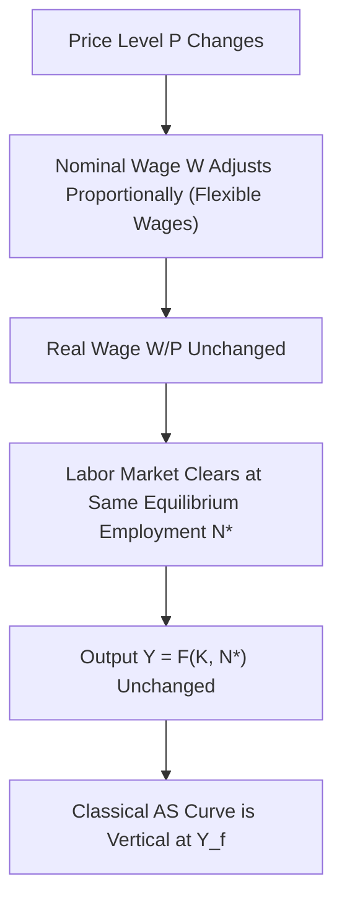
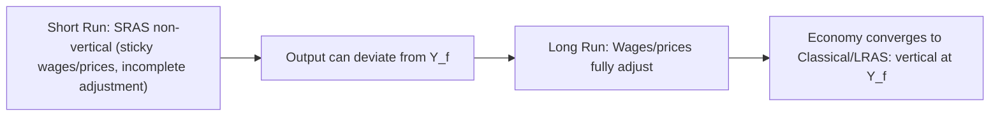

## Classical Aggregate Supply Curve

### Definition

The classical aggregate supply (AS) curve represents the relationship between the price level and the quantity of output supplied in an economy under the classical macroeconomic assumption that all prices — including nominal wages — are fully flexible and adjust instantaneously to clear markets. Under this assumption, output is always at its **full-employment (potential) level**, $Y_f$, regardless of the price level. Graphically, the classical AS curve is a **vertical line** at $Y_f$ in price-level/output space.

### Theoretical Foundation

The classical AS curve rests on several interlocking assumptions rooted in classical and neoclassical economic theory:

- **Perfectly flexible wages and prices:** Nominal wages adjust immediately to clear the labor market, ensuring that labor supply equals labor demand at all times.
- **Continuous market clearing:** All markets (labor, goods, capital) clear continuously; there is no persistent involuntary unemployment in equilibrium.
- **Say's Law (in its classical formulation):** Aggregate supply creates its own aggregate demand, implying that output is determined by supply-side factors (technology, capital stock, labor force, productivity) rather than by aggregate demand.
- **Money neutrality:** Changes in the nominal money supply affect only the price level and other nominal variables in the long run, with no effect on real variables such as output or employment — a property known as the **classical dichotomy**, the separation of the determination of real variables from nominal variables.

### Derivation from the Labor Market

The classical AS curve is derived from the aggregate production function combined with continuous labor market clearing.

**Aggregate production function:**

$$Y = F(K, N)$$

where $K$ is the capital stock (fixed in the short run) and $N$ is labor employed, with $F_N > 0$ and $F_{NN} < 0$ (diminishing marginal product of labor).

**Labor demand:** Firms hire labor up to the point where the marginal product of labor equals the real wage:

$$\frac{W}{P} = MPL = F_N(K, N)$$

**Labor supply:** Under classical assumptions, workers supply labor based on the real wage, and the labor market clears such that:

$$N^d\left(\frac{W}{P}\right) = N^s\left(\frac{W}{P}\right)$$

Because nominal wages $W$ are fully flexible, any change in the price level $P$ is immediately met by a proportional change in $W$, leaving the real wage $\dfrac{W}{P}$ — and therefore equilibrium employment $N^*$ — unchanged. Since employment does not change with the price level, and the capital stock is fixed in the short run, output $Y = F(K, N^*)$ is also independent of the price level.

### Graphical Representation

<svg xmlns="http://www.w3.org/2000/svg" viewBox="0 0 700 460" font-family="Arial, sans-serif">
<text x="350" y="28" text-anchor="middle" font-size="18" font-weight="bold" fill="#1a1a1a">Classical Aggregate Supply Curve (svg_diagram)</text>

<line x1="90" y1="400" x2="600" y2="400" stroke="#333" stroke-width="2" />
<line x1="90" y1="400" x2="90" y2="60" stroke="#333" stroke-width="2" />
<text x="610" y="405" font-size="14" fill="#333">Y (Output)</text>
<text x="55" y="55" font-size="14" fill="#333">P (Price Level)</text>

<line x1="340" y1="80" x2="340" y2="400" stroke="#dc2626" stroke-width="3" />
<text x="350" y="100" font-size="14" fill="#dc2626" font-weight="bold">Classical AS</text>

<line x1="340" y1="400" x2="340" y2="415" stroke="#333" stroke-width="1" />
<text x="325" y="430" font-size="13" fill="#333">Y_f (Full-Employment Output)</text>

<path d="M 150 130 Q 300 250 550 380" stroke="#2563eb" stroke-width="2" fill="none" />
<text x="555" y="385" font-size="12" fill="#2563eb" font-weight="bold">AD1</text>

<path d="M 230 100 Q 380 220 580 300" stroke="#16a34a" stroke-width="2" fill="none" stroke-dasharray="6,3" />
<text x="585" y="305" font-size="12" fill="#16a34a" font-weight="bold">AD2 (ΔM or ΔG↑)</text>

<circle cx="340" cy="228" r="5" fill="#000" />
<text x="290" y="218" font-size="12" fill="#000">P1</text>

<circle cx="340" cy="160" r="5" fill="#000" />
<text x="290" y="150" font-size="12" fill="#000">P2</text>
<line x1="90" y1="228" x2="340" y2="228" stroke="#999" stroke-width="1" stroke-dasharray="3,2" />
<line x1="90" y1="160" x2="340" y2="160" stroke="#999" stroke-width="1" stroke-dasharray="3,2" />

<text x="150" y="450" font-size="12" fill="#555">A rightward AD shift raises the price level (P1 → P2) but leaves output at Y_f unchanged.</text>

</svg>

### Implications for Aggregate Demand Shocks

**Key Points**

- Because the classical AS curve is vertical, any shift in aggregate demand — whether from monetary policy (changes in the money supply), fiscal policy (changes in government spending or taxes), or other demand-side factors — affects **only the price level**, not real output or employment.
- This result is the graphical embodiment of the **classical dichotomy** and **money neutrality**: nominal variables (P, W) adjust to absorb demand shocks, while real variables (Y, N, real wage) remain pinned at their full-employment/market-clearing values.
- Consequently, in the pure classical model, **fiscal and monetary policy have no effect on real output in any time frame** — they are effective only in determining the price level (and, in the case of fiscal policy operating through the loanable funds market, in determining the composition of output, e.g., via crowding out of private investment or consumption).

### Comparison: Classical AS vs. Keynesian AS

| Feature | Classical AS Curve | Keynesian AS Curve |
| --- | --- | --- |
| Shape | Vertical at $Y_f$ | Horizontal (or upward sloping) at low output levels |
| Wage/price flexibility | Fully flexible, instantaneous adjustment | Sticky/rigid, especially downward |
| Output determination | Determined by supply-side factors (K, N, technology) | Can deviate from $Y_f$ due to demand-side shocks |
| Effect of AD shifts | Changes P only; Y unchanged | Changes Y (and possibly P) |
| Underlying market clearing | Continuous | Delayed/incomplete due to rigidities |
| Time horizon typically associated | Long run | Short run |
| Policy implication | Demand management ineffective for output | Demand management can affect output |

### The Classical AS Curve as a Long-Run Concept

**Key Points**

- In modern macroeconomic textbook treatments that synthesize classical and Keynesian perspectives, the vertical AS curve is often reinterpreted specifically as the **long-run aggregate supply (LRAS) curve**, positioned at potential output $Y_f$ (sometimes denoted $Y^*$ or $Y_n$, the "natural level of output").
- This long-run vertical curve coexists with a distinct, non-vertical **short-run aggregate supply (SRAS) curve** that allows for temporary deviations of output from $Y_f$ due to short-run price or wage stickiness, expectational errors, or informational frictions.
- In this synthesis view, the economy is understood to gravitate toward the classical vertical AS curve over time as short-run rigidities resolve, prices fully adjust, and expectations converge — providing a reconciliation between the short-run relevance of Keynesian-style demand management and the long-run classical result of output being supply-determined.

### Role of Potential Output ($Y_f$)

Because the classical AS curve is vertical, the position of $Y_f$ itself — rather than aggregate demand — is the key determinant of the economy's output level. Potential output is determined by supply-side fundamentals:

- **Capital stock ($K$):** Investment in physical capital increases the economy's productive capacity, shifting $Y_f$ (and thus the vertical AS curve) rightward over time.
- **Labor force and labor participation:** Growth in the working-age population or increases in labor force participation expand $N$, raising $Y_f$.
- **Technology and total factor productivity:** Improvements in technology shift the production function $F(K,N)$ upward, raising output for any given levels of capital and labor.
- **Natural rate of unemployment:** The equilibrium (market-clearing) level of employment $N^*$ corresponds to the economy operating at the natural rate of unemployment — the classical model does not admit persistent cyclical unemployment above this rate, since wage flexibility eliminates any labor market disequilibrium.

### Policy Implications Under the Classical Framework

**Key Points**

- **Monetary policy:** Purely neutral with respect to real output; changes in the money supply affect only nominal variables (price level, nominal wages) in direct proportion, consistent with the **quantity theory of money** ($MV = PY$, where with $V$ and $Y$ fixed, changes in $M$ translate one-for-one into changes in $P$).
- **Fiscal policy:** Government spending increases can still affect the composition of output (e.g., through crowding out of private investment via the loanable funds market and rising real interest rates) even though total output remains fixed at $Y_f$ — government spending "crowds out" an equivalent amount of private spending, since aggregate output cannot expand beyond $Y_f$.
- **Supply-side policy:** Because output is determined entirely by supply-side factors under the classical model, policies aimed at increasing $Y_f$ itself — such as those promoting capital investment, labor force participation, education/human capital, and technological innovation — are the primary channels through which policy can raise real output in the classical framework.

### Historical and Theoretical Context

[Unverified] The classical view of aggregate supply is generally associated with pre-Keynesian classical economists (including figures such as Jean-Baptiste Say, whose name is attached to Say's Law) and later with New Classical macroeconomists (including Robert Lucas and others) who revived and formalized related ideas using rational expectations in the latter half of the twentieth century, though the precise historical lineage and terminology have evolved considerably and are treated somewhat differently across textbooks.

The classical vertical AS curve stands in direct theoretical contrast to Keynes's critique in *The General Theory* (1936), which argued that nominal wages are sticky, particularly downward, due to factors such as long-term labor contracts, minimum wage laws, and worker resistance to nominal wage cuts — providing the theoretical basis for a non-vertical short-run AS curve and a role for aggregate demand in determining short-run output.

### Common Misconceptions

**Key Points**

- The classical AS curve does not imply that output never changes — it implies that output changes only due to supply-side (real) factors, not due to shifts in aggregate demand.
- "Vertical AS curve" does not mean prices are fixed — quite the opposite: it is precisely because prices (and wages) are fully flexible that output is insulated from demand shocks, with the entire adjustment burden falling on prices.
- The classical model does not deny the existence of unemployment; it asserts that in equilibrium, any unemployment that exists is voluntary or frictional (at the natural rate), not the result of deficient aggregate demand.

### Related Topics

- **Say's Law and its critiques**
- **Quantity theory of money and the classical dichotomy**
- **Keynesian aggregate supply curve and wage/price stickiness**
- **Short-run vs. long-run aggregate supply (SRAS/LRAS) synthesis**
- **Natural rate of unemployment**
- **Loanable funds market and classical crowding out**
- **New Classical macroeconomics and rational expectations**
- **Aggregate production function and marginal product of labor**
- **Money neutrality and superneutrality**
- **The Phillips Curve and its relationship to the AS curve**