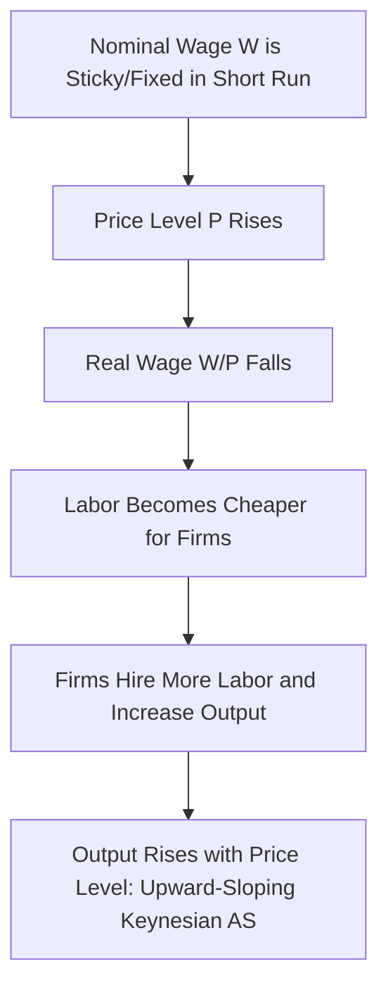
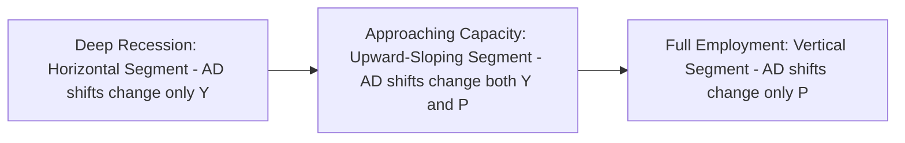

## Keynesian Aggregate Supply Curve

### Definition

The Keynesian aggregate supply (AS) curve represents the relationship between the price level and aggregate output under the assumption that nominal wages and/or prices are **sticky (rigid)** in the short run, particularly in a downward direction. In its most extreme textbook form, the Keynesian AS curve is drawn as **horizontal** at the prevailing (fixed) price level up to the full-employment output level $Y_f$, reflecting the assumption that firms can supply any quantity of output demanded at the existing price level without needing to raise prices, so long as there is unemployed labor and unused capacity available. This stands in direct contrast to the vertical classical AS curve.

### Theoretical Foundation

The Keynesian AS curve rests on the central Keynesian departure from classical theory: the assumption that wages and prices do **not** adjust instantaneously to clear markets.

**Key underlying assumptions:**

- **Sticky nominal wages:** Nominal wages are fixed or slow to adjust in the short run, due to factors such as long-term labor contracts, minimum wage laws, social/institutional norms against nominal wage cuts, and efficiency wage considerations (firms may avoid cutting wages to maintain worker morale and productivity).
- **Sticky prices:** Firms may be slow to adjust prices due to menu costs (the physical or administrative cost of changing posted prices), imperfect competition, and long-term contracts with customers or suppliers.
- **Existence of unemployed resources:** Because output can be below full employment ($Y < Y_f$), there exists slack in the labor market and unused productive capacity, allowing firms to expand output without bidding up input prices or wages.
- **Demand-determined output:** With prices and wages held constant, the level of output is determined primarily by the level of aggregate demand — this is the direct theoretical link back to the Keynesian cross and the IS-LM model, both of which assume a fixed price level in the short run.

### Derivation and the Role of Sticky Wages

Consider the labor market under Keynesian assumptions. If the nominal wage $W$ is fixed (rigid) in the short run at a level $\bar{W}$, then a change in the price level $P$ directly changes the **real wage**:

$$\frac{\bar{W}}{P}$$

If $P$ rises while $W$ remains fixed, the real wage falls, making labor cheaper for firms and inducing them to hire more workers and increase output — this generates the **upward-sloping** version of the short-run Keynesian AS curve (as opposed to the flat, extreme version).

In the most simplified textbook presentation (often associated with the basic Keynesian cross / IS-LM synthesis before AD-AS refinement), prices are assumed entirely fixed in the short run, producing a **perfectly horizontal** AS curve: firms are willing to supply any quantity demanded at the prevailing price, since they have idle capacity and do not face rising marginal costs until capacity constraints bind near $Y_f$.

### Graphical Representation (Horizontal / Extreme Keynesian Case)

<svg xmlns="http://www.w3.org/2000/svg" viewBox="0 0 700 460" font-family="Arial, sans-serif">
<text x="350" y="28" text-anchor="middle" font-size="18" font-weight="bold" fill="#1a1a1a">Keynesian Aggregate Supply Curve (svg_diagram)</text>
<line x1="90" y1="400" x2="600" y2="400" stroke="#333" stroke-width="2" />
<line x1="90" y1="400" x2="90" y2="60" stroke="#333" stroke-width="2" />
<text x="610" y="405" font-size="14" fill="#333">Y (Output)</text>
<text x="55" y="55" font-size="14" fill="#333">P (Price Level)</text>

<path d="M 130 300 L 460 300 Q 500 300 500 260 L 500 80" stroke="#dc2626" stroke-width="3" fill="none" />
<text x="250" y="290" font-size="14" fill="#dc2626" font-weight="bold">Keynesian AS</text>
<text x="510" y="100" font-size="12" fill="#dc2626">(approaches Y_f as capacity binds)</text>
<line x1="500" y1="400" x2="500" y2="415" stroke="#333" stroke-width="1" />
<text x="480" y="432" font-size="12" fill="#333">Y_f</text>

<path d="M 150 130 Q 260 220 350 340" stroke="#2563eb" stroke-width="2" fill="none" />
<text x="150" y="120" font-size="12" fill="#2563eb" font-weight="bold">AD1</text>

<path d="M 220 130 Q 330 220 420 340" stroke="#16a34a" stroke-width="2" fill="none" stroke-dasharray="6,3" />
<text x="380" y="120" font-size="12" fill="#16a34a" font-weight="bold">AD2</text>

<circle cx="270" cy="300" r="5" fill="#000" />
<text x="255" y="320" font-size="12" fill="#000">Y1</text>
<circle cx="360" cy="300" r="5" fill="#000" />
<text x="345" y="320" font-size="12" fill="#000">Y2</text>
<line x1="270" y1="300" x2="270" y2="415" stroke="#999" stroke-width="1" stroke-dasharray="3,2" />
<line x1="360" y1="300" x2="360" y2="415" stroke="#999" stroke-width="1" stroke-dasharray="3,2" />

<text x="150" y="450" font-size="12" fill="#555">In the flat region, AD shifts change output (Y1 → Y2) without changing the price level.</text>

</svg>

### Implications for Aggregate Demand Shocks

**Key Points**

- In the flat portion of the Keynesian AS curve (below $Y_f$), shifts in aggregate demand — from fiscal policy, monetary policy, consumer/business confidence, or foreign demand — translate **entirely into changes in output**, with **no change in the price level**.
- This is the polar opposite of the classical result: rather than absorbing demand shocks via price adjustment, the economy absorbs them entirely via quantity (output) adjustment, since firms are willing to supply more output at the existing price without needing to raise it.
- This provides the theoretical justification for **demand management policy**: because output responds directly to aggregate demand in this region, fiscal and monetary policy are highly effective tools for closing output gaps and raising employment, particularly during recessions when the economy operates well below $Y_f$.

### The Segmented Keynesian AS Curve

In many textbook presentations, the Keynesian AS curve is drawn with three distinct segments to better represent the transition from deep recession to full employment:

1. **Horizontal (Keynesian) segment:** At very low output levels, well below $Y_f$, substantial unemployed resources and slack allow output to expand with no upward pressure on prices.
2. **Upward-sloping (intermediate) segment:** As the economy approaches $Y_f$, some resources and labor skill types become scarcer, requiring modestly higher wages and prices to induce further increases in output — prices begin to rise as output expands.
3. **Vertical (classical) segment:** At or beyond full employment $Y_f$, the economy has exhausted its available productive capacity; further increases in aggregate demand generate purely inflationary pressure with no further increase in real output, converging with the classical result.

### Comparison: Keynesian AS vs. Classical AS

| Feature | Keynesian AS Curve | Classical AS Curve |
| --- | --- | --- |
| Shape (short run, below $Y_f$) | Horizontal or upward sloping | Vertical at $Y_f$ |
| Wage/price flexibility | Sticky, especially downward | Fully flexible |
| Output determination | Determined by aggregate demand (below $Y_f$) | Determined by supply-side factors, independent of demand |
| Effect of AD shifts | Changes Y (and possibly P near capacity) | Changes P only; Y unchanged |
| Time horizon typically associated | Short run | Long run |
| Policy implication | Demand management effective for closing output gaps | Demand management ineffective for real output |
| Unemployment | Can be involuntary and persistent below $Y_f$ | Only voluntary/frictional at natural rate |

### Link to the IS-LM Model and the Keynesian Cross

**Key Points**

- The assumption of a fixed price level underlying the simple horizontal Keynesian AS curve is the same assumption embedded in the basic **IS-LM model** and the earlier **Keynesian cross** (income-expenditure) model — both determine equilibrium output taking the price level as given.
- The Keynesian AS curve effectively provides the missing "supply side" needed to combine with an aggregate demand curve (itself derivable from the IS-LM model by varying the price level, which shifts the LM curve through the real money balance effect $M/P$) to form a complete AD-AS model.
- This linkage explains why, within the horizontal region, results from the IS-LM model regarding fiscal and monetary policy effects on output carry over directly into the AD-AS framework: since $P$ does not change, the output effects predicted by IS-LM analysis are not diluted by any offsetting price adjustment.

### Wage and Price Rigidity: Underlying Microeconomic Explanations

Modern New Keynesian economics has sought to provide rigorous microeconomic foundations for the wage/price stickiness that the simple Keynesian AS curve assumes, including:

- **Menu costs:** Small costs associated with changing posted prices (reprinting menus, catalogs, updating systems) can make firms reluctant to adjust prices frequently, even in response to demand or cost shocks, particularly when the costs of *not* adjusting are relatively small.
- **Long-term contracts:** Wage and price agreements are often set for extended periods (e.g., annual or multi-year labor contracts), preventing immediate adjustment to changing economic conditions.
- **Efficiency wages:** Firms may deliberately pay wages above the market-clearing level to improve worker productivity, reduce turnover, and attract higher-quality workers, and may resist wage cuts even during downturns to preserve these benefits.
- **Staggered price/wage setting (Calvo pricing):** Not all firms or workers adjust prices/wages simultaneously; adjustment is staggered across the economy, producing gradual, sluggish aggregate price level adjustment even when individual agents are rational.
- **Money illusion and coordination failures:** Workers and firms may resist nominal wage cuts due to perceived unfairness or coordination difficulties, even when a real wage adjustment would be economically efficient.

### Policy Implications

**Key Points**

- **Fiscal policy:** In the horizontal (deep recession) region of the Keynesian AS curve, government spending increases or tax cuts translate into output increases with minimal inflationary cost, since firms can expand production without raising prices — this underlies the traditional Keynesian case for countercyclical fiscal stimulus during recessions.
- **Monetary policy:** Similarly, expansionary monetary policy shifts aggregate demand rightward, and in the flat region, this is absorbed by higher output rather than higher prices, though as the economy approaches $Y_f$, an increasing share of any demand stimulus spills over into price increases (inflation) rather than output gains.
- **Output gap targeting:** Policymakers using this framework typically aim to use demand management to close negative output gaps (bring $Y$ up toward $Y_f$) without overshooting into the region where further demand stimulus generates primarily inflation rather than real output growth.

### Common Misconceptions

**Key Points**

- The horizontal Keynesian AS curve does not claim that prices *never* rise — it is a simplifying assumption most applicable to conditions of substantial economic slack (e.g., deep recession), not a universal claim about price behavior at all output levels.
- "Sticky wages" does not mean wages never change — it means they adjust more slowly than would be required for continuous market clearing, particularly resisting downward adjustment.
- The Keynesian AS curve is a **short-run** concept; most modern treatments (including Keynesian economists themselves) accept that the AS curve becomes vertical (classical) in the long run as prices and wages fully adjust — the debate concerns the speed of that adjustment and the appropriate policy response during the transition, not whether the classical result eventually holds.

### Related Topics

- **Classical aggregate supply curve**
- **Short-run vs. long-run aggregate supply (SRAS/LRAS) synthesis**
- **Sticky wage and sticky price theories (menu costs, efficiency wages, Calvo pricing)**
- **The Keynesian cross (income-expenditure model)**
- **Derivation of the aggregate demand curve from IS-LM**
- **Output gap and potential output**
- **New Keynesian economics and microfoundations of price rigidity**
- **The Phillips Curve and short-run inflation-output tradeoffs**
- **Involuntary unemployment and Keynesian labor market theory**
- **Countercyclical fiscal and monetary policy**