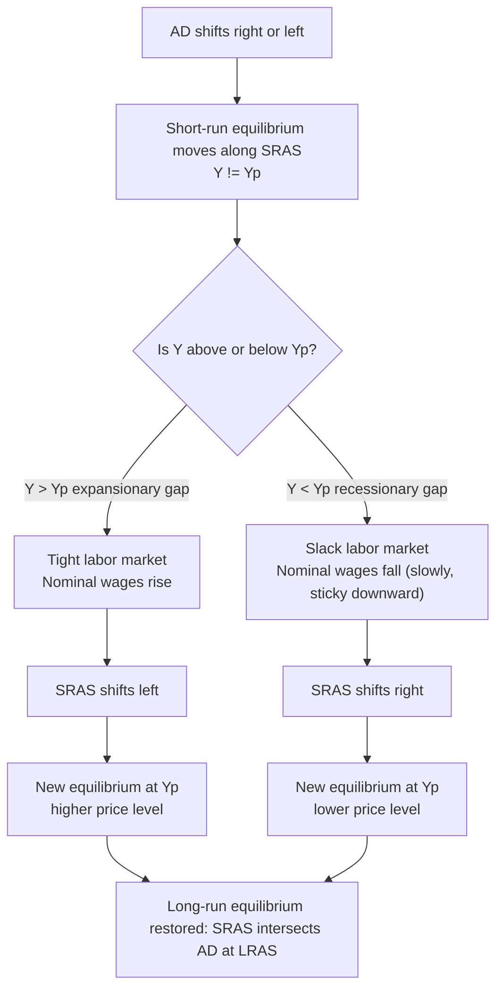

## Short-Run versus Long-Run Aggregate Supply

### Overview

The aggregate supply (AS) side of macroeconomic analysis describes the relationship between the overall price level and the quantity of real output that firms are willing and able to produce. This relationship is fundamentally different depending on the time horizon under consideration, giving rise to two distinct curves: the **Short-Run Aggregate Supply (SRAS)** curve and the **Long-Run Aggregate Supply (LRAS)** curve. The distinction between these two curves is central to understanding business cycle fluctuations, the effects of demand- and supply-side shocks, and the mechanics of macroeconomic adjustment back to full employment.

### Conceptual Foundation

**Key Points**

- SRAS reflects the economy's supply behavior over a period during which some input prices (especially nominal wages) are sticky or slow to adjust.
- LRAS reflects the economy's supply behavior once all prices, including input prices, have fully adjusted to changes in the price level.
- The dividing line between "short run" and "long run" is not a fixed calendar duration but the degree of price/wage flexibility achieved.

The core question each curve answers is: *if the overall price level changes, does real output (real GDP) respond?* SRAS says "yes, to some degree." LRAS says "no, not once adjustment is complete."

### Long-Run Aggregate Supply (LRAS)

#### Definition and Shape

The LRAS curve is **vertical** at the economy's potential output level, denoted $Y_p$ or $Y^*$. This potential output represents the level of real GDP the economy can produce when all resources (labor, capital, land, entrepreneurship) are employed at their normal, sustainable rates — consistent with the **natural rate of unemployment**.

$$Y_{LR} = Y_p \quad \text{for all price levels } P$$

Because LRAS is vertical, it implies that in the long run, the price level has no effect on the quantity of real output supplied. Output is determined solely by the economy's productive capacity: the quantity and quality of labor, capital stock, technology, and institutional factors (property rights, rule of law, market structure).

#### Why LRAS Is Vertical

In the long run, all prices are flexible — not just the price of output, but also the price of inputs (nominal wages, rental rates on capital, prices of raw materials). If the general price level rises, nominal wages and input costs eventually rise proportionally. Since firms' real costs are unchanged, they have no incentive to permanently alter output. The economy's real output is therefore anchored to its supply-side fundamentals, independent of the price level.

**[Inference]** Some textbook traditions (notably New Classical models) treat this vertical LRAS as an application of monetary neutrality: nominal variables (P, W) can change, but real variables ($Y$, real wage) are unaffected in the long run.

#### Determinants of LRAS (Shifters)

Since LRAS position is determined by potential output, it shifts only when the economy's productive capacity changes:

- **Labor force size and quality**: population growth, labor force participation, immigration, education, and human capital accumulation.
- **Physical capital stock**: net investment in machinery, infrastructure, and buildings.
- **Natural resources**: discovery of new resources, depletion, or changes in access.
- **Technology**: innovations that raise productivity (output per unit of input).
- **Institutional quality**: property rights enforcement, regulatory efficiency, market structure, and the rule of law.

A rightward shift in LRAS represents **economic growth** (an outward shift of the production possibilities frontier); a leftward shift represents a contraction in productive capacity (e.g., destruction of capital stock, a large negative supply shock to resources).

### Short-Run Aggregate Supply (SRAS)

#### Definition and Shape

The SRAS curve is **upward sloping** in $(P, Y)$ space: as the price level rises, the quantity of real output supplied increases, holding input prices (especially nominal wages) fixed in the short run.

$$Y_{SR} = f(P \mid W, P_{inputs} \text{ fixed})$$

The positive slope reflects the fact that, in the short run, output prices can adjust more quickly than input prices — particularly nominal wages, which are often fixed by contracts, norms, or menu-cost-like frictions.

#### Why SRAS Slopes Upward: Competing Theoretical Explanations

**Sticky-Wage Theory**

Nominal wages are set in advance (via contracts, implicit agreements, or minimum wage laws) and do not adjust immediately to price-level changes. If the price level rises unexpectedly while nominal wages remain fixed, the **real wage** ($W/P$) falls. A lower real wage makes labor cheaper relative to output prices, so firms find it profitable to hire more workers and expand production. This is the dominant explanation in most intermediate macroeconomics textbooks (Mankiw tradition).

**Sticky-Price (Menu Cost) Theory**

Some firms face costs of changing their posted prices (menu costs, price-list reprinting, customer-relationship considerations) and therefore do not adjust prices immediately when overall demand conditions change. When the price level rises, firms that have *not* yet adjusted their prices find their relative prices lower than optimal, so they sell more and increase output to meet the resulting higher demand at their now-relatively-low price.

**Misperceptions (Imperfect Information) Theory**

Associated with Robert Lucas's "islands" model. Individual producers observe the price of *their own* good rising but cannot immediately distinguish whether this reflects a general rise in the overall price level (which should not affect their real decisions) or a relative increase in demand for their specific good (which should prompt more production). Because producers partially attribute the price rise to a genuine relative demand increase, they expand output — even if, in aggregate, only the price level has risen.

**[Inference]** These three theories are not mutually exclusive; different macroeconomic textbooks emphasize different ones depending on their pedagogical tradition (Keynesian-sticky-wage vs. New Classical-misperception vs. New Keynesian-sticky-price).

#### Determinants of SRAS (Shifters)

SRAS shifts when factors affecting production costs change, other than the general price level itself:

- **Input prices**: wages, cost of raw materials (e.g., oil price shocks), cost of capital.
- **Productivity**: technological improvements shift SRAS rightward (more output at every price level); productivity declines shift it leftward.
- **Business taxes and subsidies**: taxes on production raise costs (leftward shift); subsidies lower costs (rightward shift).
- **Regulation**: changes in compliance costs.
- **Inflationary expectations**: if workers and firms expect higher future inflation, they negotiate higher nominal wages and prices now, shifting SRAS leftward (a "stagflationary" shift).
- **Supply shocks**: sudden, large disturbances such as natural disasters, geopolitical disruptions to commodity supply, or pandemics.

A rightward SRAS shift is often termed a **favorable supply shock**; a leftward shift is an **adverse supply shock** (classically illustrated by the 1970s oil price shocks).

### Diagram: SRAS and LRAS Together

<svg xmlns="http://www.w3.org/2000/svg" viewBox="0 0 700 500" font-family="Arial, sans-serif">
<text x="350" y="30" font-size="18" font-weight="bold" text-anchor="middle">Short-Run vs. Long-Run Aggregate Supply (svg_diagram)</text>

<line x1="80" y1="440" x2="650" y2="440" stroke="black" stroke-width="2" />
<line x1="80" y1="440" x2="80" y2="60" stroke="black" stroke-width="2" />

<text x="660" y="445" font-size="14">Real GDP (Y)</text>

<text x="60" y="55" font-size="14">Price Level (P)</text>

<polygon points="650,440 640,435 640,445" fill="black" />
<polygon points="80,60 75,70 85,70" fill="black" />

<line x1="400" y1="420" x2="400" y2="80" stroke="#c0392b" stroke-width="3" />
<text x="408" y="95" font-size="14" fill="#c0392b" font-weight="bold">LRAS</text>

<path d="M 150 400 Q 300 300 500 150" stroke="#2980b9" stroke-width="3" fill="none" />
<text x="505" y="150" font-size="14" fill="#2980b9" font-weight="bold">SRAS</text>

<line x1="400" y1="440" x2="400" y2="450" stroke="black" stroke-width="1" />
<text x="385" y="465" font-size="13">Yp (Potential Output)</text>

<circle cx="400" cy="260" r="5" fill="black" />
<line x1="80" y1="260" x2="400" y2="260" stroke="black" stroke-width="1" stroke-dasharray="4,3" />
<text x="55" y="264" font-size="12">P*</text>

<line x1="400" y1="260" x2="400" y2="440" stroke="black" stroke-width="1" stroke-dasharray="4,3" />
</svg>

At the point where SRAS intersects LRAS, the economy is at **long-run macroeconomic equilibrium**: current output equals potential output, and there is no tendency for the price level or wages to change further, absent a new shock.

### The Adjustment Process: How SRAS Moves Toward LRAS

A central dynamic in AS analysis is how the economy self-corrects after a demand-side or supply-side disturbance pushes output away from $Y_p$.

#### Case 1: Expansionary Gap (Output above Potential)

1. An increase in aggregate demand (AD) shifts the AD curve rightward.
2. In the short run, the economy moves along SRAS to a higher price level and higher output ($Y_1 > Y_p$), an **inflationary/expansionary gap**.
3. Unemployment falls below the natural rate; labor markets tighten.
4. Workers and input suppliers, recognizing that real wages have fallen (or anticipating future inflation), negotiate higher nominal wages.
5. Rising input costs shift SRAS **leftward**.
6. This process continues until SRAS shifts enough that the economy returns to producing at $Y_p$, now at a permanently higher price level.

#### Case 2: Recessionary Gap (Output below Potential)

1. A decrease in AD shifts the AD curve leftward.
2. In the short run, output falls below potential ($Y_1 < Y_p$), a **recessionary gap**, and unemployment rises above the natural rate.
3. **[Inference/observed asymmetry]** Because nominal wages are often "sticky downward" (due to contracts, minimum wage laws, and worker resistance to nominal pay cuts), this self-correction mechanism tends to work more slowly than in the expansionary case.
4. Eventually, if wages and other input costs do fall, SRAS shifts **rightward**, restoring output to $Y_p$ at a lower price level.
5. In practice, this adjustment can be prolonged, which is a central argument for active stabilization policy (fiscal or monetary) rather than waiting for automatic long-run adjustment.

### Long-Run Adjustment Diagram

### Comparing SRAS and LRAS

| Feature | SRAS | LRAS |
| --- | --- | --- |
| Slope | Upward sloping | Vertical |
| Key assumption | Input prices (esp. wages) fixed/sticky | All prices, including input prices, fully flexible |
| Effect of price level on output | Positive relationship | No relationship |
| Position determined by | Input costs, productivity, expectations | Labor, capital, technology, institutions (potential output) |
| Time horizon | Wage/price contracts still binding | Full adjustment of all contracts and expectations |
| Response to demand shocks | Output and price level both move | Only the price level moves (in the long run) |

### Numerical/Algebraic Illustration

A simplified SRAS relationship often used pedagogically:

$$Y = Y_p + \alpha (P - P^e)$$

Where:

- $Y$ = actual real output
- $Y_p$ = potential output
- $P$ = actual price level
- $P^e$ = expected price level
- $\alpha > 0$ = a parameter capturing the sensitivity of output to price surprises

**Interpretation**: Output deviates from potential only when the actual price level differs from what was *expected*. If $P = P^e$ (expectations are correct, i.e., the "long run" in expectations terms), then $Y = Y_p$ — the economy is on its LRAS curve. This equation nests both SRAS (short run, $P^e$ fixed at some prior expectation) and LRAS (long run, $P^e = P$ by full adjustment) in a single expression, and is a standard building block of the expectations-augmented AS framework (linking directly to the expectations-augmented Phillips Curve).

**Example**

Suppose $Y_p = 1000$, $\alpha = 50$, and $P^e = 100$.

- If $P = 105$ (price level rises above what was expected): $Y = 1000 + 50(105-100) = 1250$. Output rises above potential in the short run.
- If expectations fully adjust so $P^e = 105$ eventually: $Y = 1000 + 50(105-105) = 1000$. Output returns to potential — this is the long-run outcome.

### Policy Implications

**Key Points**

- **Demand-side policy** (fiscal/monetary) is most effective at closing gaps in the *short run*, since SRAS allows output to respond to price-level (and hence AD) changes.
- In the *long run*, demand-side policy cannot raise output beyond $Y_p$; it can only affect the price level (inflation). This is the macroeconomic analogue of the "money is neutral in the long run" proposition.
- **Supply-side policy** (investment incentives, education, deregulation, technological promotion) is required to shift LRAS itself and achieve sustained increases in potential output — i.e., genuine long-run economic growth.
- Adverse supply shocks (e.g., oil price spikes) that shift SRAS leftward create **stagflation**: simultaneous inflation and recession, a combination that demand management alone cannot cleanly resolve since fighting inflation (contracting AD) worsens the recession, and fighting recession (expanding AD) worsens inflation.

### Common Misconceptions

- **Misconception**: LRAS being vertical means the price level never matters. **Correction**: it means price level does not affect the *quantity of real output*, but it still matters for inflation, income distribution, and nominal contracts.
- **Misconception**: SRAS and LRAS are two different "markets." **Correction**: they are the same underlying market for aggregate output, viewed under different assumptions about price/wage flexibility over different time horizons.
- **Misconception**: The "short run" refers to a fixed number of months or years. **Correction**: the short run is defined by the *persistence of price/wage stickiness*, which varies by economy, institutional context (e.g., union contract length), and the nature of the shock — not by a calendar duration.

**Related Topics**

- Expectations-augmented Phillips Curve and the SRAS-Phillips Curve equivalence
- Sticky-wage vs. sticky-price vs. misperception models of SRAS (Keynesian, New Keynesian, New Classical comparison)
- Supply shocks and stagflation (1970s oil crisis case study)
- Okun's Law and the output gap
- Natural rate of unemployment and the NAIRU
- Monetary neutrality and the classical dichotomy
- Rational expectations vs. adaptive expectations in AS models
- Fiscal and monetary policy transmission through the AD-AS framework
- Potential GDP measurement and estimation techniques (e.g., CBO methodology)
- Hysteresis effects: can recessionary gaps permanently reduce potential output?