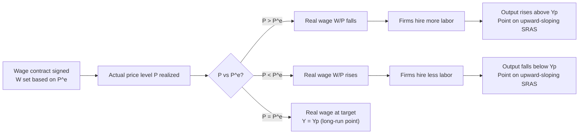

## Sticky Wage Models of Aggregate Supply

### Overview

The sticky wage model is one of the principal theoretical explanations for why the Short-Run Aggregate Supply (SRAS) curve is upward sloping. It explains the positive relationship between the price level and real output by focusing on the labor market: specifically, on the fact that **nominal wages adjust slowly** relative to changes in the price level. This model provides the microeconomic labor-market foundation connecting price-level shocks to short-run fluctuations in employment and output.

### Core Premise

**Key Points**

- Nominal wages ($W$) are set in advance and held fixed for a period of time, due to contracts, implicit agreements, social norms, or legal constraints (e.g., minimum wage laws).
- The **real wage** is $W/P$, where $P$ is the price level.
- Because $W$ is fixed in the short run while $P$ can change, an unexpected change in $P$ causes the real wage to move in the opposite direction.
- Firms respond to changes in the real wage — the actual cost of labor relative to output prices — by adjusting the quantity of labor hired, and hence output.

The model rests on the assumption that wage-setting is a *forward-looking, infrequent* process: wages are negotiated based on the price level firms and workers *expect* to prevail over the contract period, not the price level that ultimately materializes.

### Why Wages Are Sticky: Sources of Nominal Wage Rigidity

- **Long-term labor contracts**: Union agreements and other formal contracts often fix nominal wages for one to three years, making immediate renegotiation impossible.
- **Implicit contracts**: Even without formal agreements, firms and workers often maintain informal expectations of stable wage relationships (efficiency wage and morale considerations).
- **Menu-cost-like frictions in wage-setting**: Renegotiating wages is costly in terms of administrative time, potential labor disputes, and morale effects.
- **Minimum wage laws**: A legal floor on nominal wages prevents downward adjustment regardless of market conditions.
- **Money illusion**: **[Inference]** Some behavioral explanations suggest workers resist nominal wage cuts even when a nominal cut with stable prices would leave real wages unchanged, because they focus on nominal rather than real values.
- **Asymmetric downward rigidity**: Nominal wages are typically far stickier *downward* than upward — firms can raise wages relatively easily but face strong resistance (worker morale, unionized bargaining power, legal minimums) when attempting nominal wage cuts.

### The Mechanism: Deriving the Upward-Sloping SRAS

#### Step-by-Step Logic

1. Firms and workers negotiate a nominal wage $W$ based on the **expected price level** $P^e$, targeting a desired real wage.
2. The nominal wage is fixed for the duration of the contract.
3. The **actual price level** $P$ then turns out to differ from $P^e$ (due to demand shocks, monetary policy surprises, etc.).
4. If $P > P^e$ (prices rise more than expected): the real wage $W/P$ falls below the level workers and firms originally targeted.
5. Labor becomes cheaper in real terms. Firms, facing a lower real cost of labor relative to the price they receive for output, hire more workers.
6. More labor input raises real output above potential ($Y > Y_p$).
7. Conversely, if $P < P^e$ (prices rise less than expected, or fall): the real wage rises above the targeted level, labor becomes relatively expensive, firms cut hiring, and output falls below potential ($Y < Y_p$).

This produces a positive relationship between $P$ and $Y$ — the defining feature of SRAS.

#### Formal Representation

The canonical sticky-wage SRAS equation:

$$Y = Y_p + \alpha (P - P^e)$$

Where:

- $Y$ = actual real output
- $Y_p$ = potential (full-employment) output
- $P$ = actual price level
- $P^e$ = price level expected at the time wages were set
- $\alpha > 0$ = sensitivity parameter reflecting how responsive output is to price surprises (related to the degree of wage flexibility and labor demand elasticity)

**Interpretation of $\alpha$**: A larger $\alpha$ implies wages are relatively more flexible or labor demand is more elastic, producing a flatter (more responsive) SRAS curve. A smaller $\alpha$ implies stickier wages or less elastic labor demand, producing a steeper SRAS curve — closer to the vertical LRAS.

### Underlying Labor Market Diagram

The sticky-wage story can be shown directly in the labor market, alongside the AS-AD diagram.

<svg xmlns="http://www.w3.org/2000/svg" viewBox="0 0 720 480" font-family="Arial, sans-serif">
<text x="360" y="28" font-size="17" font-weight="bold" text-anchor="middle">Sticky Nominal Wage and Labor Market Response (svg_diagram)</text>

<line x1="90" y1="420" x2="640" y2="420" stroke="black" stroke-width="2" />
<line x1="90" y1="420" x2="90" y2="60" stroke="black" stroke-width="2" />
<text x="650" y="425" font-size="13">Labor (L)</text>
<text x="65" y="55" font-size="13">Real Wage (W/P)</text>

<line x1="150" y1="380" x2="500" y2="100" stroke="#27ae60" stroke-width="3" />
<text x="505" y="98" font-size="13" fill="#27ae60" font-weight="bold">Labor Supply</text>

<line x1="150" y1="120" x2="550" y2="360" stroke="#2980b9" stroke-width="3" />
<text x="555" y="362" font-size="13" fill="#2980b9" font-weight="bold">Labor Demand (initial)</text>

<line x1="200" y1="120" x2="600" y2="360" stroke="#8e44ad" stroke-width="3" stroke-dasharray="6,4" />
<text x="605" y="362" font-size="13" fill="#8e44ad" font-weight="bold">Effective demand at fixed W</text>

<line x1="90" y1="220" x2="640" y2="220" stroke="black" stroke-width="1.5" stroke-dasharray="3,3" />
<text x="95" y="215" font-size="12">W/P₀ (contracted real wage target)</text>
<line x1="90" y1="270" x2="640" y2="270" stroke="#c0392b" stroke-width="1.5" stroke-dasharray="3,3" />
<text x="95" y="285" font-size="12" fill="#c0392b">W/P₁ (actual real wage after P rises, W fixed)</text>

<circle cx="350" cy="220" r="4" fill="black" />
<circle cx="430" cy="270" r="4" fill="#c0392b" />
<line x1="350" y1="220" x2="350" y2="420" stroke="black" stroke-dasharray="2,2" />
<line x1="430" y1="270" x2="430" y2="420" stroke="#c0392b" stroke-dasharray="2,2" />
<text x="335" y="435" font-size="12">L₀</text>
<text x="420" y="450" font-size="12" fill="#c0392b">L₁ &gt; L₀</text>
</svg>

When the price level rises unexpectedly, the nominal wage $W$ stays fixed at its contracted level, so the real wage $W/P$ falls from its targeted value. At this lower real wage, firms move along their labor demand curve and hire more workers ($L_1 > L_0$), increasing output.

### AS-AD Integration

### Numerical Example

Suppose a labor contract is signed targeting a real wage of $20/hour, with $P^e = 100$ (index), implying a nominal wage $W = 20 \times 100 = 2000$ (index-adjusted units, illustrative).

- **Scenario A**: Actual $P = 110$ (10% higher than expected). Real wage becomes $W/P = 2000/110 \approx 18.18$. The real wage has fallen from the targeted $20 to about $18.18 — labor is now cheaper in real terms, so firms expand hiring and output rises above $Y_p$.
- **Scenario B**: Actual $P = 90$ (10% lower than expected). Real wage becomes $W/P = 2000/90 \approx 22.22$. Labor is now more expensive in real terms than intended, so firms cut hiring and output falls below $Y_p$.
- **Scenario C**: Actual $P = 100 = P^e$. Real wage equals the targeted $20 exactly. Output equals $Y_p$ — this is the long-run equilibrium point, where SRAS and LRAS intersect.

### Asymmetry: Downward Wage Rigidity

**Key Points**

- The sticky-wage model is often invoked asymmetrically: nominal wages are assumed to be far stickier *downward* than upward.
- This asymmetry means that adverse demand shocks (which call for a nominal wage *cut* to restore full employment) tend to produce more prolonged output and employment gaps than favorable demand shocks of similar magnitude.
- **[Inference]** This asymmetric rigidity is a major reason many economists argue that recessions driven by demand shortfalls can be deep and long-lasting without active countercyclical policy, whereas the economy self-corrects comparatively faster from overheating (expansionary) episodes.

### Relationship to Other SRAS Theories

| Model | Rigid Variable | Mechanism |
| --- | --- | --- |
| Sticky-wage model | Nominal wage $W$ | Real wage moves opposite to unexpected $P$ changes, altering labor demand and hiring |
| Sticky-price (menu cost) model | Output prices of some firms | Firms with fixed prices see relative price changes, altering quantity sold |
| Misperceptions (Lucas) model | Perceived vs. actual price level | Producers confuse general price changes with relative demand changes |

All three theories generate the same qualitative SRAS shape (upward sloping, converging to vertical LRAS as expectations fully adjust), but they emphasize different frictions and have different implications for the *speed* of adjustment and the effectiveness of anticipated versus unanticipated policy.

### Policy and Real-World Implications

- **Anticipated vs. unanticipated policy**: Under the sticky-wage/rational-expectations synthesis, only *unanticipated* changes in aggregate demand move output away from $Y_p$, since anticipated changes get built into $P^e$ and hence into the negotiated nominal wage in advance, leaving the real wage — and therefore output — unaffected.
- **Wage indexation**: Institutional arrangements like Cost-of-Living Adjustments (COLAs) reduce wage stickiness by automatically adjusting $W$ with $P$, which flattens the SRAS curve's responsiveness (reduces $\alpha$'s practical relevance since real wage deviations shrink) and dampens the effectiveness of demand-side policy.
- **Contract length and monetary policy potency**: Economies or sectors with longer wage-contract durations (e.g., heavily unionized labor markets) tend to exhibit more persistent output effects from monetary and fiscal shocks, since it takes longer for $P^e$ to be incorporated into new wage settlements.
- **Disinflation costs**: The asymmetric downward stickiness implies that reducing inflation (which effectively requires firms to eventually accept lower nominal wage growth) tends to be more painful in terms of lost output and higher unemployment than the output gains from unexpected inflation of similar magnitude — a key justification for gradualist disinflation policy over abrupt policy.

### Common Misconceptions

- **Misconception**: Sticky wages mean wages never change. **Correction**: wages do change, but only at discrete renegotiation points, not continuously in response to every price-level fluctuation.
- **Misconception**: The sticky-wage model implies workers are irrational. **Correction**: the standard version assumes rational contract-setting based on *expected* future prices; the "irrationality" only enters in behavioral variants involving money illusion.
- **Misconception**: Sticky wages and sticky prices are the same theory. **Correction**: they locate the rigidity in different markets (labor market vs. goods market) and can be combined but are analytically distinct.

**Related Topics**

- Sticky-price (menu cost) models of SRAS
- Misperceptions (Lucas islands) model of SRAS
- Expectations formation: adaptive vs. rational expectations
- Efficiency wage theory and involuntary unemployment
- Cost-of-living adjustments (COLA) and wage indexation
- Phillips Curve derivation from sticky-wage SRAS
- Disinflation, the sacrifice ratio, and credibility of monetary policy
- Union bargaining models and contract-length effects on macro stabilization
- New Keynesian DSGE models incorporating wage rigidity (Calvo wage-setting)