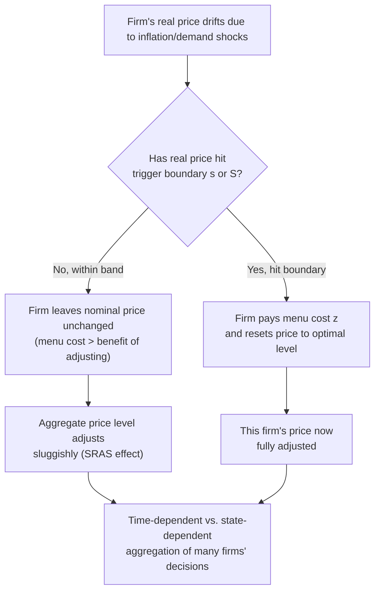

## Sticky Price Models and Menu Cost Theory

### Overview

The sticky price model is a second major microfoundation for the upward-sloping Short-Run Aggregate Supply (SRAS) curve, distinct from the sticky-wage model in that it locates the source of rigidity in the **goods market** rather than the labor market. It argues that firms do not continuously adjust the prices they charge because doing so is costly, and that this friction — commonly called a **menu cost** — causes aggregate output to respond to unanticipated changes in the price level in the short run.

### Core Premise

**Key Points**

- Some firms face costs of changing their posted prices; these costs, however small, can make it optimal for a firm not to adjust price immediately in response to every shock.
- Because not all firms adjust prices simultaneously, the *aggregate* price level adjusts sluggishly even though some individual firms do change prices right away.
- Firms that keep prices fixed while aggregate demand or the money supply changes end up producing more or less output than their long-run optimum, generating a positive relationship between the price level and aggregate output.

This is one of the foundational building blocks of **New Keynesian macroeconomics**, which seeks to provide rigorous microeconomic (optimizing-agent) foundations for nominal rigidities that generate real effects of monetary policy.

### What Is a "Menu Cost"?

The term originates from the literal cost a restaurant incurs when reprinting a menu to reflect new prices, but in economic usage it refers broadly to **any cost associated with changing a posted price**. Categories include:

- **Physical/administrative costs**: reprinting price tags, catalogs, menus, and price lists; updating point-of-sale systems.
- **Information costs**: cost of gathering information needed to compute the new optimal price, and of communicating the new price to sales staff and customers.
- **Customer relationship costs**: the risk of alienating customers or appearing exploitative through frequent price changes ("fairness" and reputational concerns).
- **Managerial/decision costs**: the time and attention required for managers to review and decide on price changes (a "rational inattention"-style cost).
- **Contractual costs**: costs of renegotiating existing supply or purchase contracts that reference a fixed price.

**[Inference]** Even very small per-unit menu costs can generate substantial aggregate price stickiness, because firms compare the (potentially small) cost of changing price against the (also potentially small) profit loss from *not* changing it — the decision is a second-order optimization problem, meaning firms may rationally tolerate a suboptimal price for a period even when adjustment costs are modest. This is the central theoretical insight of the Akerlof-Yellen "near-rationality" argument and the Mankiw menu-cost model.

### The Formal Menu Cost Mechanism

#### Firm's Decision Problem

A monopolistically competitive firm sets a price $P_i$ to maximize profit. Absent adjustment costs, it would continuously reset $P_i$ to track its frictionless optimal price $P_i^*$, which depends on aggregate demand conditions, the money supply, and its marginal cost.

When a menu cost $z$ exists, the firm adjusts its price only if the benefit of adjusting exceeds $z$:

$$\pi(P_i^*) - \pi(P_i^{old}) > z$$

Where $\pi(\cdot)$ is the firm's profit function. If the loss from leaving price unchanged, $\pi(P_i^*) - \pi(P_i^{old})$, is smaller than the menu cost $z$, the firm rationally leaves its price unchanged.

#### Why Individually Small Losses Produce Large Aggregate Effects

**[Inference]** A key theoretical result (from Akerlof and Yellen, and Mankiw's original menu cost paper) is that the *private* cost to an individual firm of not adjusting its price (a second-order loss, since the firm is already near its profit-maximizing point) can be much smaller than the *social* cost of aggregate price stickiness (a first-order effect on aggregate output and welfare). This asymmetry between private and social costs is what allows small menu costs to generate economically significant aggregate nominal rigidity and real effects from monetary shocks.

### Deriving the Upward-Sloping SRAS from Sticky Prices

1. Suppose the money supply (or aggregate demand generally) increases unexpectedly.
2. Some fraction of firms — those with low or no menu costs, or those for whom the shock is large relative to their menu cost — adjust prices upward immediately.
3. Other firms — those with menu costs exceeding the benefit of adjusting — leave their prices unchanged, at least temporarily.
4. Firms with "sticky" (unchanged) prices experience an *increase* in demand for their goods, since their relative price is now lower than that of firms who did raise prices.
5. To meet this higher demand at their fixed price, sticky-price firms increase output (assuming they have some ability to expand production, e.g., excess capacity, overtime).
6. Aggregating across firms, total output rises above potential following the unanticipated increase in aggregate demand, and the price level rises less than proportionally — producing the observed upward-sloping SRAS relationship.

### Diagram: Individual Firm Price-Setting under Menu Costs

<svg xmlns="http://www.w3.org/2000/svg" viewBox="0 0 720 480" font-family="Arial, sans-serif">
<text x="360" y="28" font-size="17" font-weight="bold" text-anchor="middle">Menu Cost Threshold and Price Adjustment (svg_diagram)</text>

<line x1="90" y1="420" x2="640" y2="420" stroke="black" stroke-width="2" />
<line x1="90" y1="420" x2="90" y2="60" stroke="black" stroke-width="2" />
<text x="650" y="425" font-size="13">Time / Shock Size</text>
<text x="45" y="55" font-size="13">Profit Loss from Not Adjusting</text>

<line x1="90" y1="260" x2="640" y2="260" stroke="#c0392b" stroke-width="2" stroke-dasharray="6,4" />
<text x="500" y="252" font-size="13" fill="#c0392b" font-weight="bold">Menu cost z (adjustment threshold)</text>

<path d="M 100 400 Q 300 380 400 260 Q 500 150 600 90" stroke="#2980b9" stroke-width="3" fill="none" />
<text x="440" y="140" font-size="13" fill="#2980b9" font-weight="bold">Profit loss from unadjusted price</text>

<rect x="90" y="260" width="310" height="160" fill="#d6eaf8" opacity="0.4" />
<text x="140" y="390" font-size="13" fill="#1a5276">Price stays fixed (loss &lt; menu cost)</text>

<rect x="400" y="60" width="240" height="200" fill="#fdebd0" opacity="0.4" />
<text x="460" y="100" font-size="13" fill="#935116">Price adjusts (loss &gt; menu cost)</text>

<circle cx="400" cy="260" r="5" fill="black" />
<line x1="400" y1="260" x2="400" y2="420" stroke="black" stroke-dasharray="2,2" />
<text x="380" y="435" font-size="12">Adjustment trigger point</text>
</svg>

### Aggregation: (s,S) Pricing and State-Dependent Adjustment

A related and more formal treatment models each firm's price as following an **(s,S) pricing rule**: the firm allows its real price to drift within a band and only resets it once the price hits a trigger boundary (analogous to inventory (s,S) rules in operations research).

**Two broad modeling traditions** exist for aggregating individual sticky-price decisions:

- **Time-dependent models** (e.g., **Calvo pricing**): each period, a fixed random fraction of firms gets to adjust its price, regardless of how large the shock has been. This is mathematically convenient and widely used in New Keynesian DSGE models.
- **State-dependent models** (e.g., **(s,S) / menu cost models proper**): firms adjust when the *benefit* of adjusting crosses the menu cost threshold, so the probability and timing of adjustment depends on the size of the shock, not just the passage of time.

**[Inference]** State-dependent models are generally regarded as more theoretically grounded in optimizing behavior, but time-dependent (Calvo) models are far more common in applied macroeconomic modeling due to their analytical tractability, despite lacking an explicit menu cost microfoundation for *why* the reset probability is exogenous and constant.

### Numerical Illustration

Suppose a firm's frictionless optimal price is $P^* = 10.50$ after a demand shock, while its currently posted price remains $P_{old} = 10.00$. The firm's profit function is approximately quadratic near the optimum, so the loss from not adjusting is:

$$\text{Loss} \approx \frac{1}{2} \cdot k \cdot (P^* - P_{old})^2$$

where $k$ is a curvature parameter. If $k = 0.08$ and $(P^* - P_{old}) = 0.50$:

$$\text{Loss} \approx \frac{1}{2}(0.08)(0.50)^2 = 0.01$$

If the firm's menu cost $z = 0.05$ (e.g., cost of updating price displays), then since the loss ($0.01) is less than the menu cost ($0.05), the firm optimally leaves its price unchanged. If instead the shock were larger, say $(P^* - P_{old}) = 2.00$:

$$\text{Loss} \approx \frac{1}{2}(0.08)(2.00)^2 = 0.16$$

Now the loss ($0.16) exceeds the menu cost ($0.05), so the firm adjusts its price. This illustrates why *larger* shocks (e.g., high-inflation episodes) induce faster and more widespread price adjustment, flattening the effective SRAS curve and diminishing the real effects of nominal shocks — a pattern consistent with empirical observations that price stickiness diminishes sharply during high-inflation periods.

### Comparison with Sticky-Wage and Misperceptions Models

| Model | Locus of Rigidity | Adjustment Trigger | Typical Modeling Tradition |
| --- | --- | --- | --- |
| Sticky-wage | Nominal wages | Contract renewal dates | Traditional Keynesian / New Keynesian |
| Sticky-price (menu cost) | Individual firms' output prices | Menu cost threshold crossed, or random draw (Calvo) | New Keynesian DSGE |
| Misperceptions (Lucas) | Perceived price signals | Imperfect information about aggregate vs. relative prices | New Classical |

All three yield an upward-sloping SRAS and a vertical LRAS once full adjustment occurs, but they generate different predictions about **which** prices should be sticky (all firms equally, or only certain sectors), how strongly output responds to *anticipated* versus *unanticipated* policy, and how the degree of stickiness itself should vary with the inflationary environment.

### Empirical Considerations

- **[Unverified]** Empirical studies using retail scanner data (e.g., the Billion Prices Project and related work) generally find that individual retail prices change relatively infrequently — often once every several months on average — which is broadly consistent with menu cost theory, although the specific frequency varies substantially by sector (e.g., gasoline prices change far more often than services prices).
- Price stickiness tends to be lower for goods with volatile costs (e.g., commodities, energy) and higher for goods and services with stable input costs and high customer-relationship sensitivity (e.g., restaurant menus, magazine cover prices, some services).
- **[Inference]** The apparent prevalence of "round number" pricing and infrequent price changes in many retail categories is often cited as informal supporting evidence for menu cost theory, though alternative explanations (e.g., implicit contracts, customer search costs) can also account for similar patterns.

### Policy Implications

- Because sticky prices generate real effects from nominal (monetary) shocks, sticky-price models provide a theoretical justification for **active monetary policy** to stabilize output around potential in the short run.
- The **degree** of price stickiness (how large $z$ is relative to typical shocks) determines how potent monetary policy is: economies or sectors with high stickiness experience larger and more persistent real effects from a given monetary shock; economies with low stickiness see mostly nominal (price) effects with limited real impact.
- **State dependence** implies that policy effectiveness is *nonlinear*: small, gradual changes in the money supply may have large real effects if they stay within firms' inaction bands, whereas large or rapid changes may induce fast price adjustment across many firms simultaneously, *reducing* the real effects (this is part of the classic critique of using historical, low-inflation-era policy relationships to predict outcomes during a high-inflation regime — a version of the **Lucas Critique**).

### Common Misconceptions

- **Misconception**: Menu costs must be literal, physical costs (like printing menus) to matter. **Correction**: the theory encompasses any cost of price adjustment, including informational, managerial, and reputational costs — the "menu" is a metaphor.
- **Misconception**: Sticky-price models imply firms never change prices. **Correction**: firms do change prices, just not continuously — adjustment occurs when the benefit exceeds the (possibly small) cost, producing lumpy, infrequent adjustment rather than either perfect flexibility or permanent rigidity.
- **Misconception**: Menu cost theory and sticky-wage theory are competing, mutually exclusive explanations of SRAS. **Correction**: many modern New Keynesian models incorporate *both* sticky wages and sticky prices simultaneously, as complementary sources of nominal rigidity.

**Related Topics**

- Sticky-wage models of aggregate supply
- Calvo pricing and time-dependent price-setting models
- (s,S) inventory-style pricing rules and state-dependent adjustment
- New Keynesian Phillips Curve derivation
- Lucas Critique and policy regime dependence
- Rational inattention theory of price/information frictions
- Empirical price-stickiness studies (e.g., Bils and Klenow; Billion Prices Project)
- Monetary non-neutrality and the transmission mechanism of monetary policy
- Inflation dynamics under high vs. low inflation regimes