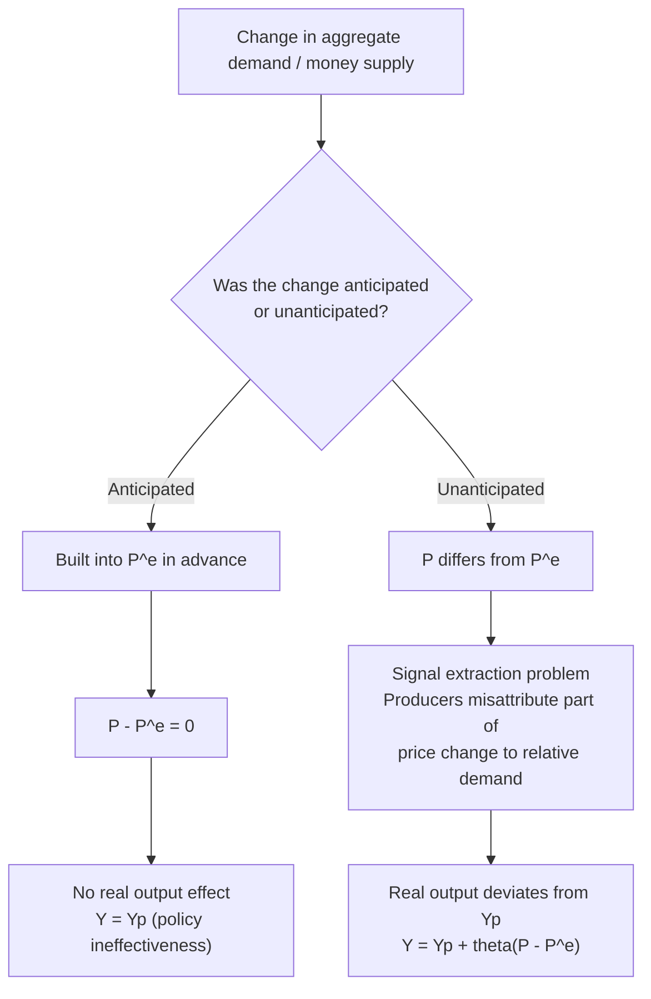

## Imperfect Information Models of Aggregate Supply

### Overview

The imperfect information model — most closely associated with **Robert Lucas's "islands" model** — is the third principal microfoundation for the upward-sloping Short-Run Aggregate Supply (SRAS) curve, alongside sticky-wage and sticky-price models. Unlike those models, which rely on explicit nominal rigidities (contracts, menu costs), the imperfect information model derives SRAS entirely from **rational, fully flexible price-setting** combined with **incomplete information** about whether an observed price change is a general (aggregate) phenomenon or a good-specific (relative) phenomenon. It is the signature contribution of the **New Classical school** of macroeconomics.

### Core Premise

**Key Points**

- All prices and wages are assumed to be perfectly flexible — there is no contractual or menu-cost-based stickiness.
- Producers have imperfect, incomplete information about the *aggregate* price level at the moment they must decide how much to produce; they observe only the price of the good(s) they personally sell.
- Because a rise in an individual producer's own price could reflect either (a) a genuine increase in relative demand for their specific good, warranting more production, or (b) a general, economy-wide inflationary rise in the price level, warranting no change in real production, producers face a **signal extraction problem**.
- Rational producers, unable to perfectly distinguish the two cases, partially attribute the observed price increase to a relative demand increase and therefore increase output somewhat — even when, in aggregate, the shock was purely nominal.

### The "Islands" Metaphor

Lucas's model imagines the economy as composed of many geographically or informationally isolated "islands," each populated by a producer of a particular good who can observe local market conditions (the price they receive for their own good) but cannot instantaneously observe prices prevailing on other islands or the aggregate price index. Information about the general price level arrives only with a lag (e.g., through published statistics, trade, or communication), while the producer must make a real-time production decision based on the local price signal alone.

### The Signal Extraction Problem — Formal Structure

Each producer observes their own nominal price $P_i$ but does not directly observe:

- $P$ — the aggregate (economy-wide) price level
- $P_i / P$ — their true relative price, which is the variable that *should* rationally guide their production decision

The observed price can be decomposed as:

$$P_i = P + p_i$$

Where $p_i$ represents a purely idiosyncratic (relative) demand or supply disturbance specific to good $i$, and $P$ represents the common, economy-wide component.

Because the producer cannot separately observe $P$ and $p_i$, they form a rational (Bayesian) estimate of the relative-price component based on the observed total price change, using knowledge of the historical relative variances of aggregate versus idiosyncratic shocks:

$$E[p_i \mid P_i] = \theta \cdot (P_i - E[P])$$

Where $\theta$ (between 0 and 1) is the fraction of the observed price surprise that the producer rationally attributes to a genuine relative-price (idiosyncratic) change, determined by the relative variances of aggregate and idiosyncratic shocks:

$$\theta = \frac{\sigma_p^2}{\sigma_p^2 + \sigma_P^2}$$

Where $\sigma_p^2$ is the variance of idiosyncratic/relative shocks and $\sigma_P^2$ is the variance of aggregate price-level shocks.

**Interpretation**: If aggregate price-level volatility ($\sigma_P^2$) is historically large relative to idiosyncratic volatility ($\sigma_p^2$), rational producers will (correctly, on average) attribute *most* of any observed price change to general inflation rather than genuine relative demand shifts — meaning $\theta$ is small, and they will barely adjust output. Conversely, in an environment where aggregate price-level shocks are historically rare or small and idiosyncratic shocks dominate, $\theta$ is larger, and producers respond more strongly to price surprises with real output changes.

### Deriving the Upward-Sloping SRAS

1. Aggregate demand rises unexpectedly (e.g., due to a monetary expansion or a fiscal stimulus).
2. This raises the price that each individual producer receives for their good, i.e., $P_i$ rises for essentially all producers simultaneously.
3. Each producer, unable to observe that this price rise is happening to *everyone* simultaneously (i.e., unable to directly observe that it is a rise in $P$ rather than in $p_i$), rationally attributes some fraction $\theta$ of the observed increase to a rise in relative demand for their specific good.
4. Believing relative demand for their good has risen, each producer increases output.
5. In aggregate, since all producers behave this way simultaneously, total real output for the economy rises above potential, even though — in truth — only the aggregate price level increased, and no genuine change in aggregate relative demand or supply occurred.
6. This produces the same qualitative result as sticky-wage/sticky-price models: a positive short-run relationship between $P$ and $Y$.

### Formal SRAS Equation (Lucas Supply Curve)

The imperfect information model yields what is often called the **Lucas Supply Curve**:

$$Y = Y_p + \theta (P - P^e)$$

Where:

- $Y$ = actual real output
- $Y_p$ = potential (natural-rate) output
- $P$ = actual price level
- $P^e$ = the price level that producers *rationally expect*, based on all available information at the time of their decision
- $\theta$ = the signal-extraction sensitivity parameter described above

This equation is algebraically identical in form to the sticky-wage SRAS equation, but the *interpretation* of the coefficient and the underlying economic mechanism are entirely different: here, $\theta$ reflects an information/signal-extraction problem, not contractual wage or price rigidity.

### Diagram: Signal Extraction and Output Response

<svg xmlns="http://www.w3.org/2000/svg" viewBox="0 0 720 480" font-family="Arial, sans-serif">
<text x="360" y="28" font-size="16" font-weight="bold" text-anchor="middle">Signal Extraction: Aggregate vs. Relative Price Change (svg_diagram)</text>

<rect x="90" y="70" width="220" height="140" rx="10" fill="#eaf2f8" stroke="#2980b9" stroke-width="2" />
<text x="200" y="95" font-size="13" text-anchor="middle" font-weight="bold">Producer on Island i</text>
<text x="105" y="125" font-size="12">Observes: Own price P_i rises</text>
<text x="105" y="150" font-size="12">Cannot directly observe:</text>
<text x="105" y="170" font-size="12">Aggregate price level P</text>
<text x="105" y="195" font-size="12">True relative price P_i / P</text>

<rect x="400" y="70" width="230" height="140" rx="10" fill="#fdf2e9" stroke="#e67e22" stroke-width="2" />
<text x="515" y="95" font-size="13" text-anchor="middle" font-weight="bold">Rational Inference</text>
<text x="415" y="125" font-size="12">Attributes fraction theta of</text>
<text x="415" y="145" font-size="12">price rise to relative demand</text>
<text x="415" y="165" font-size="12">Attributes (1-theta) to</text>
<text x="415" y="185" font-size="12">general inflation</text>

<line x1="310" y1="140" x2="400" y2="140" stroke="black" stroke-width="2" />
<polygon points="400,140 390,135 390,145" fill="black" />

<rect x="245" y="280" width="230" height="120" rx="10" fill="#eafaf1" stroke="#27ae60" stroke-width="2" />
<text x="360" y="305" font-size="13" text-anchor="middle" font-weight="bold">Production Decision</text>
<text x="260" y="335" font-size="12">Increases output in proportion</text>
<text x="260" y="355" font-size="12">to perceived relative demand</text>
<text x="260" y="375" font-size="12">rise (theta component only)</text>

<line x1="515" y1="210" x2="400" y2="280" stroke="black" stroke-width="2" />
<polygon points="400,280 410,272 405,283" fill="black" />
</svg>

### The Central Policy Implication: Only Unanticipated Shocks Matter

This is the celebrated **Policy Ineffectiveness Proposition (PIP)**, developed by Lucas, Sargent, and Wallace: under rational expectations and the imperfect information framework, only *surprise* (unanticipated) monetary or fiscal policy actions can affect real output and employment in the short run. Any systematic, predictable policy rule is anticipated by rational agents and incorporated into $P^e$, leaving $(P - P^e) = 0$ and real output unaffected — the economy remains at $Y_p$ regardless of the systematic policy stance.

**[Inference]** This proposition was highly influential in the 1970s-1980s debate over the effectiveness of activist stabilization policy, and it directly motivated the shift in central banking practice toward transparent, rule-based, and credible policy frameworks — since only surprises "work" under this model, a central bank that wants stable output (rather than engineering unpredictable surprises) has strong theoretical grounds to minimize policy surprises rather than exploit them.

### Numerical Illustration

Suppose historical data suggest that idiosyncratic (relative) price shock variance is $\sigma_p^2 = 4$ and aggregate price-level shock variance is $\sigma_P^2 = 1$ (i.e., aggregate inflation has historically been quite stable and predictable relative to sector-specific demand fluctuations).

$$\theta = \frac{4}{4+1} = 0.8$$

If a producer observes their own price rise by 10 index points relative to expectations, they will rationally attribute $0.8 \times 10 = 8$ points of that rise to a genuine increase in relative demand for their good, and increase output accordingly — even if, in this particular instance, the entire 10-point rise was actually due to an aggregate demand shock.

Now suppose the macroeconomic environment shifts to one with much more volatile and unpredictable aggregate inflation, so that $\sigma_P^2 = 9$ while $\sigma_p^2$ remains at 4:

$$\theta = \frac{4}{4+9} \approx 0.31$$

In this higher-aggregate-volatility environment, rational producers correctly become more skeptical that any given price change reflects genuine relative demand, and they adjust output far less in response to the same nominal price surprise. **[Inference]** This illustrates a key testable implication of the model: countries or periods with more volatile and unpredictable aggregate inflation should exhibit a flatter (less output-responsive) relationship between unanticipated money growth and real output — a prediction empirically explored by Lucas (1973) using cross-country inflation-variance data.

### Comparison with Sticky-Wage and Sticky-Price Models

| Feature | Imperfect Information (Lucas) | Sticky-Wage | Sticky-Price (Menu Cost) |
| --- | --- | --- | --- |
| Price/wage flexibility | Fully flexible | Wages rigid (contracts) | Prices rigid (menu costs) |
| Source of SRAS slope | Signal extraction / incomplete information | Contractual nominal wage fixity | Costly price adjustment |
| Key parameter | $\theta$ (variance ratio) | $\alpha$ (wage/labor demand sensitivity) | Menu cost $z$ relative to shock size |
| Anticipated policy effect | None (Policy Ineffectiveness Proposition) | Can still have real effects even if anticipated (since contracts are pre-set for a fixed period regardless of what is "anticipated" mid-contract) | Can still have real effects if anticipated shock is small relative to $z$ |
| School of thought | New Classical | Traditional/New Keynesian | New Keynesian |

**[Inference]** A key distinguishing empirical prediction: the Lucas model implies *anticipated* policy changes have no real effects, while sticky-wage and sticky-price models generally allow anticipated policy to have real effects during the period before existing wage/price contracts can be renegotiated. This distinction became a major point of contention in 1970s-1980s macroeconomic debates and empirical testing (e.g., studies of whether announced, credible disinflations produced real output costs, as sticky-wage/price theory would predict, versus painless disinflation, as pure rational-expectations/imperfect-information theory would predict).

### Empirical and Theoretical Critiques

- **[Unverified]** Critics have argued that the imperfect information channel requires implausibly large and persistent informational gaps to generate the magnitude and *persistence* of real business cycle fluctuations actually observed, since modern information technology, financial markets, and statistical reporting make aggregate price-level information available with only very short lags.
- The model has more successfully explained short-lived, high-frequency confusion effects than the multi-year persistence of typical recessions, which many economists argue is better explained by wage/price stickiness models or real business cycle theory (a fourth family of explanations not based on nominal rigidity or informational frictions at all).
- **[Inference]** Despite these critiques, the imperfect information / signal extraction framework remains historically significant as the first rigorous, microfounded, rational-expectations explanation for short-run monetary non-neutrality, and it laid essential groundwork (particularly the use of rational expectations and Bayesian signal extraction) for subsequent New Keynesian and DSGE modeling traditions, even those that ultimately favored sticky-price/wage frictions over pure informational frictions.

### Common Misconceptions

- **Misconception**: The imperfect information model assumes producers are irrational or poorly informed in general. **Correction**: producers are assumed to behave *fully rationally* given their limited information set; the friction is the information structure of the economy, not any failure of rationality.
- **Misconception**: This model and sticky-wage/sticky-price models are contradictory. **Correction**: they are alternative, historically competing explanations for the *same* observed empirical regularity (a positively sloped SRAS), each emphasizing a different friction, and are not logically incompatible — some模型 combine informational frictions with nominal rigidities.
- **Misconception**: The Policy Ineffectiveness Proposition means monetary policy never matters. **Correction**: it means only *systematic, anticipated* monetary policy fails to affect real output in this framework — policy can still influence the price level, inflation expectations, and can matter in the short run through genuine surprises.

**Related Topics**

- Sticky-wage models of aggregate supply
- Sticky price models and menu cost theory
- Rational expectations hypothesis and its macroeconomic implications
- Policy Ineffectiveness Proposition (Lucas, Sargent, Wallace)
- Lucas Critique of econometric policy evaluation
- Real Business Cycle (RBC) theory as an alternative non-monetary explanation of fluctuations
- Signal extraction and Bayesian updating in economics
- New Classical vs. New Keynesian schools of macroeconomic thought
- Central bank credibility and transparent policy rules