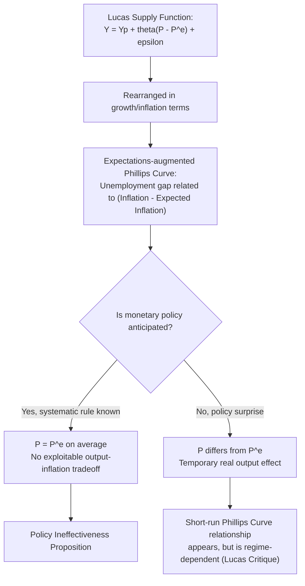

## Lucas Supply Function

### Overview

The Lucas supply function is a formal econometric and theoretical representation of aggregate supply developed by Robert Lucas in the early 1970s, most notably in his 1973 paper "Some International Evidence on Output-Inflation Tradeoffs." It provides the precise mathematical expression of the imperfect information (islands) model of aggregate supply, linking real output deviations from potential directly to the *unanticipated* component of price-level changes. It is one of the most influential single equations in the development of modern macroeconomics, serving as the analytical bridge between rational expectations theory and short-run output-inflation dynamics.

### The Core Equation

$$y_t = y_p + \theta (p_t - p_t^e) + \varepsilon_t$$

Where (commonly expressed in logs, following Lucas's original notation):

- $y_t$ = actual real output (log) at time $t$
- $y_p$ = potential/natural-rate output (log)
- $p_t$ = actual price level (log) at time $t$
- $p_t^e$ = the price level expected at time $t$, conditional on information available *before* $p_t$ is observed
- $\theta$ = the response coefficient (analogous to the signal-extraction parameter from the imperfect information model)
- $\varepsilon_t$ = a random real (supply-side) disturbance term, capturing productivity shocks or other real shocks unrelated to price surprises

**Key Points**

- The equation states that output deviates from its potential level ($y_p$) *only* in response to the gap between the actual and expected price level, plus any exogenous real disturbances.
- If price expectations are correct on average ($p_t = p_t^e$), the systematic component of output equals potential output — the economy sits on its long-run aggregate supply curve.
- The coefficient $\theta$ is not a fixed structural constant assumed a priori; it is *derived* from the underlying signal-extraction problem and depends on the relative variances of aggregate versus idiosyncratic (relative) price shocks.

### Derivation from the Signal Extraction Problem

The Lucas supply function formalizes the imperfect information mechanism (see: Imperfect information models of aggregate supply) into a single reduced-form equation suitable for empirical estimation. Each individual producer's output decision, aggregated across the economy, yields:

$$\theta = \frac{\sigma_\epsilon^2}{\sigma_\epsilon^2 + \sigma_\eta^2}$$

Where $\sigma_\epsilon^2$ is the variance of *relative* (idiosyncratic) demand or supply shocks facing individual producers, and $\sigma_\eta^2$ is the variance of *aggregate* (economy-wide, typically monetary) shocks to the price level.

This derivation is the theoretical core of Lucas's famous empirical prediction, discussed below.

### The Lucas Hypothesis: Cross-Country Prediction

**Key Points**

- Lucas's 1973 paper used this equation to derive a striking, testable cross-country prediction: countries with historically **more volatile and unpredictable aggregate demand/inflation** (high $\sigma_\eta^2$) should exhibit a **flatter** Lucas supply curve (smaller $\theta$) — meaning nominal demand shocks have *smaller* real output effects and are reflected mostly in prices.
- Conversely, countries with historically **stable, low-variance inflation** (low $\sigma_\eta^2$, relatively higher $\sigma_\epsilon^2$) should exhibit a **steeper** slope in output-inflation space (larger $\theta$) — meaning nominal demand shocks have *larger* real output effects, because producers rationally attribute more of any given price surprise to genuine relative demand changes.
- **[Unverified]** Lucas's original empirical test, using cross-country data comparing high-inflation-variance economies to low-inflation-variance economies, reported findings broadly consistent with this prediction, and the paper became one of the most cited pieces of evidence for the rational expectations, signal-extraction approach to macroeconomics at the time.

This prediction is often summarized as the **Lucas hypothesis**: the short-run output-inflation tradeoff (a Phillips-Curve-like relationship) is not a stable structural feature of an economy, but depends on the *monetary and inflationary regime* itself — a direct anticipation of the broader **Lucas Critique**.

### Diagram: Slope of the Output-Inflation Relationship Across Regimes

<svg xmlns="http://www.w3.org/2000/svg" viewBox="0 0 720 480" font-family="Arial, sans-serif">
<text x="360" y="28" font-size="16" font-weight="bold" text-anchor="middle">Lucas Supply Curve Slope Under Different Inflation Volatility Regimes (svg_diagram)</text>

<line x1="90" y1="420" x2="640" y2="420" stroke="black" stroke-width="2" />
<line x1="90" y1="420" x2="90" y2="60" stroke="black" stroke-width="2" />
<text x="650" y="425" font-size="13">Price Surprise (P - P^e)</text>
<text x="40" y="55" font-size="13">Output Deviation (Y - Yp)</text>

<line x1="90" y1="420" x2="350" y2="90" stroke="#2980b9" stroke-width="3" />
<text x="355" y="90" font-size="12" fill="#2980b9" font-weight="bold">Steep: Low-inflation-volatility regime (high theta)</text>

<line x1="90" y1="420" x2="620" y2="350" stroke="#c0392b" stroke-width="3" />
<text x="450" y="335" font-size="12" fill="#c0392b" font-weight="bold">Flat: High-inflation-volatility regime (low theta)</text>

<circle cx="90" cy="420" r="4" fill="black" />
</svg>

### Connection to the Phillips Curve

The Lucas supply function is the direct theoretical ancestor of the **expectations-augmented Phillips Curve** used in modern monetary policy analysis: rearranged in terms of inflation and unemployment (via Okun's Law), it implies that only inflation *surprises* — not the level of inflation itself — generate short-run reductions in unemployment below its natural rate.

### Numerical Illustration

Suppose an economy has $\sigma_\epsilon^2 = 3$ (relative shock variance) and is currently operating under a monetary regime with $\sigma_\eta^2 = 1$ (low aggregate demand volatility):

$$\theta = \frac{3}{3+1} = 0.75$$

If the central bank engineers a monetary surprise producing $(p_t - p_t^e) = 2$ (a 2% unanticipated price-level increase), predicted output effect:

$$y_t - y_p = 0.75 \times 2 = 1.5\%\text{ above potential}$$

Now suppose the same economy transitions to a high-inflation, high-volatility regime where $\sigma_\eta^2$ rises to 9 (aggregate demand shocks become much more frequent and larger, e.g., due to erratic monetary policy):

$$\theta = \frac{3}{3+9} = 0.25$$

For the *same* 2% price surprise:

$$y_t - y_p = 0.25 \times 2 = 0.5\%\text{ above potential}$$

**Interpretation**: the identical nominal demand shock produces a much smaller real output effect once the economy has entered a more volatile, less predictable inflationary regime — since rational producers now correctly attribute more of any observed price change to general inflation rather than genuine relative demand shifts. **[Inference]** This is precisely the mechanism Lucas argued explains why attempts to "exploit" a historically observed output-inflation tradeoff (e.g., a central bank deliberately engineering surprise inflation to reduce unemployment) tend to break down once policy becomes more inflationary and volatile: the very act of running a high-inflation policy changes $\theta$ itself, undermining the tradeoff the policy was designed to exploit.

### Relationship to the Lucas Critique

**Key Points**

- The Lucas supply function is historically significant not only as a model of aggregate supply but as the specific analytical example Lucas used to develop his broader methodological argument, the **Lucas Critique** (1976): econometrically estimated relationships between policy variables and macroeconomic outcomes (such as a historically estimated Phillips Curve slope) are not structurally stable "deep parameters," because they depend on private agents' expectations formation, which itself changes when the policy regime changes.
- In the specific case of the Lucas supply function, the "structural" parameter $\theta$ is shown to be a function of the *policy regime's* volatility ($\sigma_\eta^2$) — so a change in monetary policy regime mechanically changes the estimated output-inflation relationship, even though the underlying microeconomic behavior (rational signal extraction) has not changed at all.
- **[Inference]** This became a foundational argument for why traditional (pre-rational-expectations) large-scale macroeconometric models, which typically estimated fixed reduced-form relationships from historical data, could give systematically misleading policy advice when used to simulate the effects of *new* policy regimes not represented in the historical estimation sample.

### Empirical Testing and Controversies

- **[Unverified]** Subsequent researchers (notably Alberto Alesina and others in later decades, as well as earlier critiques in the late 1970s and 1980s) questioned whether Lucas's original cross-country empirical results were robust to alternative country samples, alternative measures of inflation volatility, and alternative time periods; some follow-up studies reported weaker or more ambiguous support for the predicted negative relationship between inflation volatility and the output-inflation slope.
- Competing sticky-wage and sticky-price (menu cost) models can generate qualitatively similar cross-regime predictions (e.g., prices become more flexible, and the output effects of nominal shocks shrink, as inflation volatility rises and menu-cost inaction bands become relatively less binding), which complicates using the empirical cross-country pattern alone to definitively distinguish the imperfect-information mechanism from nominal-rigidity mechanisms.
- **[Inference]** Despite these empirical controversies, the Lucas supply function remains a canonical teaching model because of its clean derivation from optimizing, rational behavior and its central role in motivating the broader shift toward rational-expectations macroeconomics and the Lucas Critique, independent of the ultimate empirical verdict on the specific cross-country hypothesis.

### Comparison Table: Lucas Supply Function vs. Other SRAS Formalizations

| Feature | Lucas Supply Function | Sticky-Wage SRAS | Sticky-Price/Menu Cost SRAS |
| --- | --- | --- | --- |
| Underlying friction | Imperfect information (signal extraction) | Nominal wage contracts | Costly price adjustment |
| Key coefficient | $\theta$ = f(shock variances) | $\alpha$ = f(wage/labor demand elasticity) | Depends on menu cost $z$ relative to shock size |
| Regime dependence | Explicit: $\theta$ changes with policy volatility | Less directly regime-dependent (contract-length driven) | Regime-dependent (adjustment frequency rises with inflation) |
| Anticipated policy | No real effect (Policy Ineffectiveness Proposition) | Can have real effects within contract period | Can have real effects if shock is small relative to $z$ |
| Primary use | Cross-regime/cross-country comparative analysis | Standard AD-AS textbook exposition | New Keynesian DSGE modeling |

### Common Misconceptions

- **Misconception**: The Lucas supply function says the same $\theta$ applies at all times and places. **Correction**: $\theta$ is explicitly regime-dependent — it is a function of the *variance* of aggregate versus relative shocks, which differs across countries, time periods, and policy regimes.
- **Misconception**: The Lucas supply function proves output-inflation tradeoffs never exist. **Correction**: it implies that tradeoffs exist only for *unanticipated* shocks, and that the *magnitude* of any historically observed tradeoff is not a stable, policy-invariant constant that can be reliably exploited.
- **Misconception**: The Lucas Critique and the Lucas supply function are unrelated concepts. **Correction**: the Lucas supply function is the concrete worked example Lucas used to first illustrate the general methodological point later formalized as the Lucas Critique.

**Related Topics**

- Imperfect information models of aggregate supply
- Policy Ineffectiveness Proposition
- Lucas Critique of econometric policy evaluation
- Expectations-augmented Phillips Curve
- Rational expectations hypothesis
- Sticky-wage and sticky-price models of SRAS (alternative microfoundations)
- Time inconsistency and central bank credibility
- Okun's Law linking output gaps to unemployment
- Cross-country comparative macroeconomic empirics