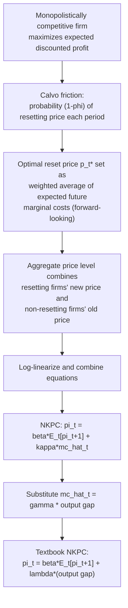

## New Keynesian Phillips Curve Derivation

### Overview

The New Keynesian Phillips Curve (NKPC) is the modern formalization of the short-run relationship between inflation and real economic activity, derived explicitly from optimizing, forward-looking firms operating under sticky-price frictions — most commonly modeled using **Calvo pricing**. Unlike the traditional (backward-looking, adaptive-expectations) Phillips Curve, the NKPC is grounded in microeconomic foundations and features **forward-looking inflation expectations**, making it the standard workhorse inflation equation in contemporary New Keynesian DSGE (Dynamic Stochastic General Equilibrium) models and central bank policy frameworks.

### Foundational Building Blocks

**Key Points**

- The NKPC combines three elements: (1) monopolistically competitive firms that set prices to maximize discounted expected profits, (2) a Calvo-style random price-adjustment friction, and (3) rational expectations of future inflation.
- Unlike the traditional Phillips Curve — which relates inflation to *past* inflation and the unemployment/output gap — the NKPC relates *current* inflation to *expected future* inflation and a measure of current real marginal cost or the output gap.
- The NKPC is derived, not assumed: it follows algebraically from firms' optimal pricing behavior under the Calvo friction, making it a genuine microfounded alternative to earlier, more ad hoc Phillips Curve specifications.

### Step 1: The Firm's Optimal Reset Price (Calvo Pricing Setup)

Under the **Calvo (1983) pricing** assumption, in each period a firm faces a fixed, exogenous probability $(1-\phi)$ of being allowed to reset its price optimally, and a probability $\phi$ that it must keep its previous period's price unchanged. This "constant hazard" assumption is not derived from an explicit menu cost but is used because it produces analytically tractable aggregation.

A firm that gets to reset its price in period $t$ chooses a new price $P_t^*$ to maximize the present discounted value of expected profits over all future periods in which that price might remain in effect (since it does not know in advance how long the price will stay fixed):

$$P_t^* = \max_{P_t^*} \, E_t \sum_{k=0}^{\infty} \phi^k \, Q_{t,t+k} \, \left[ \text{Profit from charging } P_t^* \text{ at date } t+k \right]$$

Where $Q_{t,t+k}$ is the stochastic discount factor between periods $t$ and $t+k$, and $\phi^k$ is the probability that the price set at $t$ is still in effect $k$ periods later.

**[Inference]** The key economic content of this setup is that a firm resetting its price today must forecast not just today's optimal price, but a *weighted average* of the optimal prices it would have wanted to set over the entire (uncertain) future duration that this price will remain fixed — hence the forward-looking nature of the resulting inflation equation.

### Step 2: Log-Linearization Around the Steady State

To make the model tractable, the firm's optimal reset price condition is log-linearized around a zero-inflation steady state. This yields an expression for the (log) optimal reset price $p_t^*$ as a function of current and expected future real marginal costs:

$$p_t^* = p_t + (1 - \beta\phi) \sum_{k=0}^{\infty} (\beta\phi)^k E_t[\widehat{mc}_{t+k}]$$

Where:

- $p_t$ = the current (log) aggregate price level
- $\beta$ = the household/firm discount factor
- $\widehat{mc}_{t+k}$ = the (log) deviation of real marginal cost from its steady-state value at future date $t+k$

**Interpretation**: firms that get to reset their price set it above the current price level in proportion to how much they expect real marginal costs to *rise* over the likely duration the new price will remain in effect — because they cannot adjust again until the next random Calvo draw.

### Step 3: Aggregation Across Resetting and Non-Resetting Firms

Since only a fraction $(1-\phi)$ of firms reset their price in any period, the evolution of the aggregate price level combines the new price set by resetting firms and the unchanged prices carried over by non-resetting firms:

$$p_t = \phi \, p_{t-1} + (1-\phi) \, p_t^*$$

Substituting the expression for $p_t^*$ from Step 2 and rearranging (a standard but algebraically involved step in most graduate macroeconomics textbooks) yields a first-order stochastic difference equation in inflation:

$$\pi_t = \beta E_t[\pi_{t+1}] + \kappa \, \widehat{mc}_t$$

Where $\pi_t = p_t - p_{t-1}$ is current inflation, and:

$$\kappa = \frac{(1-\phi)(1-\beta\phi)}{\phi}$$

This is the canonical **New Keynesian Phillips Curve**.

### Step 4: Expressing in Terms of the Output Gap

Real marginal cost $\widehat{mc}_t$ is not directly observable in most empirical applications, so it is typically linked to the **output gap** $\tilde{y}_t = y_t - y_t^n$ (the deviation of actual output from its natural/flexible-price level) via a standard relationship derived from the labor market and production function:

$$\widehat{mc}_t = \gamma \, \tilde{y}_t$$

Where $\gamma$ captures the elasticity of real marginal cost with respect to the output gap (depending on labor supply elasticity, the degree of decreasing returns to labor, and the elasticity of substitution across goods varieties). Substituting gives the more commonly cited textbook form:

$$\pi_t = \beta E_t[\pi_{t+1}] + \lambda \, \tilde{y}_t$$

Where $\lambda = \kappa \gamma$ is a composite slope coefficient.

### Full Derivation Flow

### Comparison: New Keynesian vs. Traditional (Expectations-Augmented) Phillips Curve

| Feature | Traditional (Expectations-Augmented) Phillips Curve | New Keynesian Phillips Curve |
| --- | --- | --- |
| Expectations term | Backward-looking / adaptive: $\pi_t = \pi_t^e + \beta(u_t - u_n)$, with $\pi_t^e$ often set equal to $\pi_{t-1}$ | Forward-looking: depends on $E_t[\pi_{t+1}]$ |
| Microfoundations | Largely ad hoc, based on labor market bargaining and adaptive expectations | Explicitly derived from firm optimization under Calvo pricing |
| Driving variable | Unemployment gap (via Okun's Law) | Real marginal cost or output gap |
| Persistence source | Backward-looking expectations create inflation persistence "by assumption" | Pure forward-looking version generates little inertia; often requires extensions (indexation, backward-looking firms) to match observed inflation persistence |
| Policy implication | Disinflation is costly (sacrifice ratio) regardless of credibility | Credible, well-announced disinflation can in principle be far less costly, since expectations jump immediately if fully believed |

### Diagram: Forward-Looking vs. Backward-Looking Inflation Dynamics

<svg xmlns="http://www.w3.org/2000/svg" viewBox="0 0 720 460" font-family="Arial, sans-serif">
<text x="360" y="28" font-size="16" font-weight="bold" text-anchor="middle">NKPC: Current Inflation Depends on Expected Future Inflation (svg_diagram)</text>

<line x1="80" y1="250" x2="640" y2="250" stroke="black" stroke-width="2" />
<polygon points="640,250 630,244 630,256" fill="black" />

<circle cx="200" cy="250" r="5" fill="#2980b9" />
<text x="185" y="280" font-size="13">t-1</text>
<circle cx="360" cy="250" r="6" fill="#c0392b" />
<text x="345" y="280" font-size="13" font-weight="bold">t (today)</text>
<circle cx="520" cy="250" r="5" fill="#27ae60" />
<text x="505" y="280" font-size="13">t+1</text>

<line x1="200" y1="220" x2="345" y2="220" stroke="#7f8c8d" stroke-width="2" stroke-dasharray="5,3" />
<text x="150" y="205" font-size="12" fill="#7f8c8d">Traditional PC: pi_t depends on pi_(t-1)</text>

<line x1="520" y1="180" x2="375" y2="180" stroke="#c0392b" stroke-width="3" />
<polygon points="375,180 385,175 385,185" fill="#c0392b" />
<text x="380" y="165" font-size="12" fill="#c0392b" font-weight="bold">NKPC: pi_t depends on E_t[pi_t+1]</text>

<rect x="300" y="330" width="120" height="60" rx="8" fill="#eafaf1" stroke="#27ae60" stroke-width="2" />
<text x="315" y="365" font-size="12">Real marginal</text>
<text x="315" y="380" font-size="12">cost / output gap</text>
<line x1="360" y1="330" x2="360" y2="256" stroke="#27ae60" stroke-width="2" />
<polygon points="360,256 355,266 365,266" fill="#27ae60" />
</svg>

### The Inflation Persistence Puzzle

**Key Points**

- The pure forward-looking NKPC derived above implies that inflation should respond immediately and jump in response to news about future marginal costs, with little inherent persistence — because there is no explicit backward-looking term in the baseline equation.
- **[Unverified]** Empirically, however, observed inflation series in many economies display substantial persistence (positive serial correlation), which the pure forward-looking NKPC struggles to replicate without additional modifications, a widely discussed shortcoming in the New Keynesian literature.
- This gap between the baseline model's prediction and observed data is often called the **inflation persistence puzzle**.

#### Common Extensions to Generate Persistence

- **Calvo pricing with partial indexation** (Christiano-Eichenbaum-Evans / Smets-Wouters style): non-resetting firms mechanically index their price to lagged inflation (or a inflation target) rather than leaving it perfectly fixed, introducing a backward-looking term:

$$\pi_t = \gamma_f E_t[\pi_{t+1}] + \gamma_b \pi_{t-1} + \lambda \, \tilde{y}_t$$

- **Rule-of-thumb (backward-looking) price setters** (Galí-Gertler hybrid NKPC): a fraction of firms set prices using a simple backward-looking rule rather than full optimization, mixing forward- and backward-looking behavior in the aggregate.
- **Sticky information** (Mankiw-Reis): firms update their information sets about the economy infrequently (rather than their prices), which can generate persistence through slow diffusion of new information rather than sticky prices per se.

### Numerical Illustration

Suppose $\beta = 0.99$ (a standard quarterly discount factor), $\phi = 0.75$ (75% of firms cannot reset price in a given quarter, implying an average price duration of $1/(1-\phi) = 4$ quarters), then:

$$\kappa = \frac{(1-0.75)(1-0.99 \times 0.75)}{0.75} = \frac{0.25 \times 0.2575}{0.75} \approx 0.0858$$

If real marginal cost is currently $\widehat{mc}_t = 0.02$ (2% above steady state) and expected future inflation $E_t[\pi_{t+1}] = 0.01$ (1% expected next-period inflation):

$$\pi_t = 0.99(0.01) + 0.0858(0.02) = 0.0099 + 0.001716 \approx 0.01162$$

Current inflation is predicted at approximately 1.16%, reflecting both the near-full pass-through of expected future inflation (since $\beta \approx 1$) and a modest additional contribution from currently elevated real marginal cost.

**Sensitivity to price stickiness**: if $\phi$ falls to 0.5 (prices reset on average every 2 quarters — a less sticky economy), $\kappa$ rises to:

$$\kappa = \frac{(1-0.5)(1-0.99 \times 0.5)}{0.5} = \frac{0.5 \times 0.505}{0.5} = 0.505$$

A much larger $\kappa$ means the same output gap or marginal cost deviation produces a *much* larger inflation response — consistent with the general principle that less price stickiness makes the short-run Phillips Curve/AS relationship steeper (closer to the vertical LRAS case in the limit of $\phi \to 0$, fully flexible prices).

### Policy Implications

- **Credibility matters enormously**: because the NKPC is forward-looking, a central bank that credibly commits to a low-inflation path can, in principle, achieve disinflation with much lower output/employment costs than implied by backward-looking Phillips Curve models, since $E_t[\pi_{t+1}]$ can adjust immediately upon a believed announcement.
- **Time inconsistency problem**: this same forward-looking structure creates strong incentives for policymakers to renege on announced low-inflation commitments once expectations have already adjusted (the classic Kydland-Prescott/Barro-Gordon time-inconsistency problem), which is a major justification for independent central banks and rule-based policy frameworks.
- **Output gap targeting**: because $\lambda$ (the slope) depends on the degree of price stickiness $\phi$, the tradeoff a central bank faces between stabilizing inflation and stabilizing the output gap is itself structural and estimable, forming the basis of modern **optimal monetary policy** analysis (e.g., "flexible inflation targeting" frameworks that explicitly weigh output gap and inflation stabilization).

### Common Misconceptions

- **Misconception**: The NKPC is just the old Phillips Curve relabeled. **Correction**: it differs fundamentally in being forward-looking and explicitly derived from firm optimization, rather than an empirically fitted, backward-looking relationship.
- **Misconception**: The NKPC implies inflation should never be persistent. **Correction**: the *baseline* model implies limited persistence; realistic persistence requires explicit extensions (indexation, rule-of-thumb pricers, sticky information) — this is an active area of ongoing modeling refinement, not a settled contradiction of the theory.
- **Misconception**: $\kappa$ (or $\lambda$) is a universal constant. **Correction**: it is a function of deep structural parameters (discount factor, Calvo stickiness parameter, marginal cost elasticity) that can differ across countries, sectors, and time periods — and, per the Lucas Critique, may shift if the underlying policy regime changes private price-setting behavior.

**Related Topics**

- Sticky price models and menu cost theory (Calvo pricing microfoundation)
- Lucas supply function and the imperfect information alternative
- Expectations-augmented (traditional) Phillips Curve
- Time inconsistency and central bank credibility (Kydland-Prescott, Barro-Gordon)
- Optimal monetary policy and flexible inflation targeting
- DSGE models: New Keynesian three-equation model (IS curve, NKPC, monetary policy rule)
- Inflation persistence and hybrid/backward-looking NKPC extensions
- Sacrifice ratio and the costs of disinflation