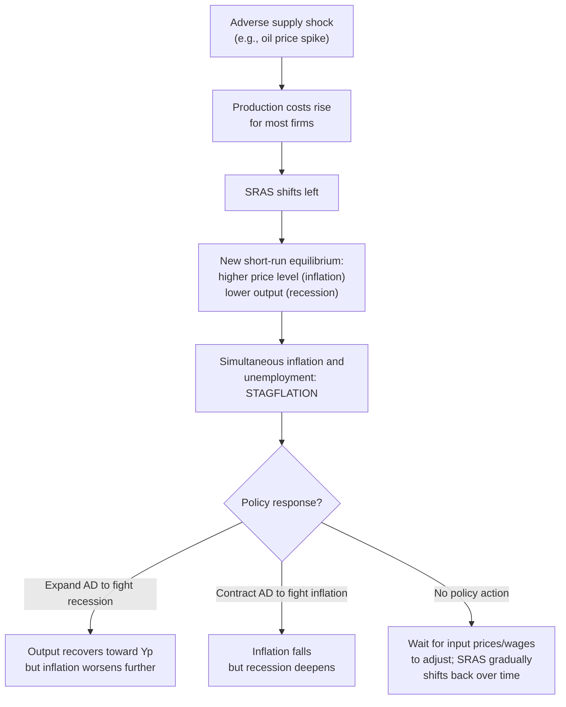

## Supply Shocks and Their Macroeconomic Effects

### Overview

A supply shock is a sudden, often unanticipated change in the cost of production or the availability of key inputs (labor, energy, raw materials, capital) that shifts the aggregate supply curve, rather than the aggregate demand curve. Supply shocks are distinguished from demand shocks by the *direction* in which they move price and output: a demand shock moves $P$ and $Y$ in the same direction, whereas a supply shock moves them in **opposite** directions — this signature co-movement pattern is one of the primary tools economists use to diagnose which type of shock is driving observed macroeconomic fluctuations.

### Classification of Supply Shocks

**Key Points**

- **Adverse (negative) supply shocks** shift SRAS leftward, raising the price level while lowering output — the classic combination associated with **stagflation**.
- **Favorable (positive) supply shocks** shift SRAS rightward, lowering the price level while raising output — a generally benign combination of falling inflation and rising output/employment.
- Supply shocks can be **transitory** (affecting SRAS only, with the economy self-correcting back to the original LRAS position over time) or, in some cases, **permanent** (affecting LRAS itself, if the shock permanently alters the economy's productive capacity).

#### Common Sources of Supply Shocks

- **Commodity price shocks**: sudden changes in the price of oil, natural gas, or other widely used inputs (e.g., the 1973 and 1979 oil price shocks).
- **Natural disasters**: earthquakes, hurricanes, droughts, or pandemics that destroy capital, disrupt labor supply, or interrupt supply chains.
- **Geopolitical disruptions**: wars, trade embargoes, or sanctions that restrict access to key inputs or export/import markets.
- **Productivity shocks**: sudden technological breakthroughs (favorable) or widespread technology failures/obsolescence (adverse).
- **Regulatory or policy shocks**: sudden changes in taxes, tariffs, or regulatory compliance costs affecting production costs economy-wide.
- **Labor supply shocks**: large, rapid changes in labor force availability (e.g., pandemic-related labor force exits, large-scale migration changes).
- **Supply chain disruptions**: logistics bottlenecks, shipping constraints, or semiconductor/input shortages that raise effective production costs even without a change in the underlying commodity price.

### The Adverse Supply Shock: Stagflation Mechanics

#### Diagrammatic Analysis

<svg xmlns="http://www.w3.org/2000/svg" viewBox="0 0 720 480" font-family="Arial, sans-serif">
<text x="360" y="28" font-size="16" font-weight="bold" text-anchor="middle">Adverse Supply Shock: SRAS Shifts Left (svg_diagram)</text>

<line x1="90" y1="420" x2="640" y2="420" stroke="black" stroke-width="2" />
<line x1="90" y1="420" x2="90" y2="60" stroke="black" stroke-width="2" />
<text x="650" y="425" font-size="13">Real GDP (Y)</text>
<text x="45" y="55" font-size="13">Price Level (P)</text>

<line x1="380" y1="410" x2="380" y2="80" stroke="#7f8c8d" stroke-width="2" stroke-dasharray="6,4" />
<text x="388" y="95" font-size="13" fill="#7f8c8d" font-weight="bold">LRAS</text>

<path d="M 150 400 Q 300 300 500 150" stroke="#2980b9" stroke-width="3" fill="none" />
<text x="505" y="150" font-size="13" fill="#2980b9" font-weight="bold">SRAS0</text>

<path d="M 100 400 Q 220 280 380 130" stroke="#c0392b" stroke-width="3" fill="none" />
<text x="100" y="120" font-size="13" fill="#c0392b" font-weight="bold">SRAS1 (adverse shock)</text>

<path d="M 200 120 Q 350 260 550 380" stroke="#27ae60" stroke-width="3" fill="none" />
<text x="555" y="382" font-size="13" fill="#27ae60" font-weight="bold">AD</text>

<circle cx="380" cy="250" r="5" fill="black" />
<text x="388" y="245" font-size="12">E0</text>

<circle cx="300" cy="190" r="5" fill="#c0392b" />
<text x="240" y="185" font-size="12" fill="#c0392b">E1: higher P, lower Y</text>
<line x1="300" y1="190" x2="300" y2="420" stroke="#c0392b" stroke-dasharray="2,2" />
<line x1="90" y1="190" x2="300" y2="190" stroke="#c0392b" stroke-dasharray="2,2" />
</svg>

#### Sequence of Effects

**Key Points**

- Adverse supply shocks present policymakers with a genuine **dilemma**: there is no single demand-side policy action that simultaneously reduces both inflation and unemployment, because both variables have moved in the "wrong" direction relative to what standard demand-management tools can jointly fix.
- This is fundamentally different from a demand shock (e.g., a fall in AD), where a single expansionary policy response can simultaneously restore output *and* reduce any deflationary pressure — the tools are aligned. With a supply shock, the tools are in tension.

### The Favorable Supply Shock

A positive supply shock (e.g., a major productivity-enhancing technological innovation, a sustained fall in energy prices, or a positive labor-supply shock) shifts SRAS rightward, producing simultaneously **higher output and a lower price level** — a combination sometimes referred to informally as a "free lunch" in macroeconomic policy terms, since it improves both inflation and output/employment outcomes at once without requiring any policy tradeoff.

**[Inference]** Episodes such as the mid-to-late 1990s U.S. productivity acceleration (frequently attributed in part to information technology investment) are commonly cited as real-world approximations of a favorable supply shock, associated with a period of falling or stable inflation alongside robust output growth — though disentangling the supply-shock contribution from concurrent demand-side and monetary policy factors in any specific historical episode requires careful empirical analysis and is often debated among economists.

### Distinguishing Supply Shocks from Demand Shocks Empirically

| Indicator | Demand Shock | Supply Shock |
| --- | --- | --- |
| Price level and output co-movement | Same direction (both rise or both fall) | Opposite directions |
| Positive shock example | AD rises: $P \uparrow$, $Y \uparrow$ | Favorable: $P \downarrow$, $Y \uparrow$ |
| Negative shock example | AD falls: $P \downarrow$, $Y \downarrow$ | Adverse: $P \uparrow$, $Y \downarrow$ |
| Unemployment-inflation relationship | Consistent with standard (downward-sloping) short-run Phillips Curve | Can produce simultaneous rise in both inflation and unemployment (Phillips Curve appears to shift outward) |
| Typical policy tradeoff | None — a single policy direction addresses both symptoms | Genuine — policy cannot simultaneously fix both symptoms |

This co-movement diagnostic is one of the most commonly used tools in applied macroeconomics (including in structural VAR identification schemes) for classifying the underlying source of an observed business cycle fluctuation.

### Persistent versus Transitory Supply Shocks

**Key Points**

- Most textbook treatments of supply shocks assume they are **transitory** — SRAS shifts, but LRAS (potential output) is unaffected, so the economy eventually self-corrects back to $Y_p$ at the original price level trend once input costs normalize or wages/expectations adjust.
- Some supply shocks, however, can have **permanent effects on LRAS** if they permanently destroy productive capacity (e.g., a war destroying substantial capital stock, a natural disaster with lasting infrastructure damage) or permanently alter resource availability (e.g., depletion of a non-renewable resource, permanent loss of skilled labor through emigration or mortality).
- **[Inference]** Distinguishing whether a given real-world shock is transitory (SRAS-only) or permanent (LRAS-shifting) is often genuinely difficult in real time and is a recurring source of disagreement among forecasters and policymakers — for example, debates over whether a given energy price shock or supply-chain disruption represents a temporary SRAS shift that will reverse, or a more permanent restructuring of production costs.

### Hysteresis: When Transitory Shocks Leave Permanent Scars

A related and important complication is the **hysteresis** hypothesis: the idea that a sufficiently large or prolonged adverse *demand-driven* recession (or, similarly, a severe supply shock) can itself permanently reduce potential output, even though in principle it began as merely a temporary SRAS or AD disturbance.

**[Inference]** Proposed mechanisms include: long-term unemployed workers experiencing skill atrophy and reduced labor force attachment, reduced business investment during a prolonged downturn permanently lowering the capital stock relative to its counterfactual trend, and reduced R&D/innovation activity during a slump permanently lowering the economy's long-run technology trajectory. If hysteresis effects are empirically significant, this blurs the traditionally sharp textbook distinction between short-run (SRAS-based, self-correcting) and long-run (LRAS-based, structural) determinants of output, and strengthens the case for aggressive countercyclical policy to prevent a temporary downturn from becoming a permanent loss of capacity.

### Numerical Illustration: Cost-Push Shock and the Price Level

Suppose SRAS is approximated (in the neighborhood of the shock) by:

$$P = P_0 + \beta (Y - Y_p) + c$$

Where $c$ represents an exogenous cost-push shift term (positive for adverse shocks) and $\beta > 0$ captures the standard upward slope. Suppose $P_0 = 100$, $\beta = 0.05$, and initially $Y = Y_p$ so $P = 100$.

An adverse oil shock raises production costs economy-wide, represented as $c = 8$ (an 8-point upward shift in the price level at any given output):

$$P = 100 + 0.05(Y - Y_p) + 8$$

At the original output level ($Y = Y_p$), the price level would jump to $P = 108$ purely from the cost shock, before any output adjustment. If AD is held fixed and the economy moves along the new (shifted) SRAS to the point where AD intersects it, output falls below $Y_p$ (say to $Y_p - 200$), giving:

$$P = 100 + 0.05(-200) + 8 = 100 - 10 + 8 = 98$$

**[Inference]** This simplified numerical example illustrates the qualitative point that the ultimate price and output outcome depends on both the magnitude of the cost shock and the slope/position of AD; the specific coefficients here are illustrative rather than calibrated to any real economy, and actual empirical pass-through of cost shocks to the price level varies considerably by sector and monetary policy regime.

### Policy Responses to Supply Shocks

- **Accommodate**: expand AD to offset the output/employment loss, accepting a permanently higher price level (avoids recession but "validates" the inflationary impulse, potentially embedding it into future inflation expectations).
- **Do not accommodate**: hold AD fixed or contract it, accepting a deeper/longer recession in exchange for a smaller or shorter-lived inflationary impulse.
- **Wait for supply-side normalization**: if the shock is judged transitory, avoid demand-side action and rely on the SRAS curve gradually shifting back rightward as input costs and wages adjust — this minimizes policy-induced volatility but risks a prolonged period of stagflation if the shock or wage/price adjustment process proves more persistent than expected.
- **[Inference]** Modern central banks facing supply shocks generally weigh the *persistence* and *second-round effects* (whether the shock is feeding into longer-term inflation expectations and wage negotiations) heavily in choosing among these options, often explicitly distinguishing "headline" from "core" inflation measures to separate the direct supply-shock effect from broader underlying inflationary pressure.

### Common Misconceptions

- **Misconception**: All inflation is caused by demand-side ("too much money chasing too few goods") factors. **Correction**: cost-push (supply-side) inflation is a distinct mechanism that can raise prices even amid falling output — a pattern demand-side models alone cannot generate.
- **Misconception**: Supply shocks only ever affect SRAS, never LRAS. **Correction**: while most textbook treatments emphasize transitory SRAS effects, sufficiently large or prolonged shocks can permanently damage productive capacity or, via hysteresis, permanently lower potential output even from an initially demand-side disturbance.
- **Misconception**: There is always a "correct" policy response to a supply shock. **Correction**: the inflation-output tradeoff inherent in adverse supply shocks is a genuine dilemma without a costless solution; different policy choices simply allocate the costs differently between inflation and unemployment/output loss.

**Related Topics**

- Stagflation: historical case studies (1970s oil shocks)
- Short-run versus long-run aggregate supply
- Hysteresis and permanent output losses from recessions
- Structural VAR identification of demand versus supply shocks
- Core versus headline inflation measurement
- Central bank credibility and anchored inflation expectations
- Cost-push versus demand-pull inflation
- Sacrifice ratio and disinflation policy tradeoffs