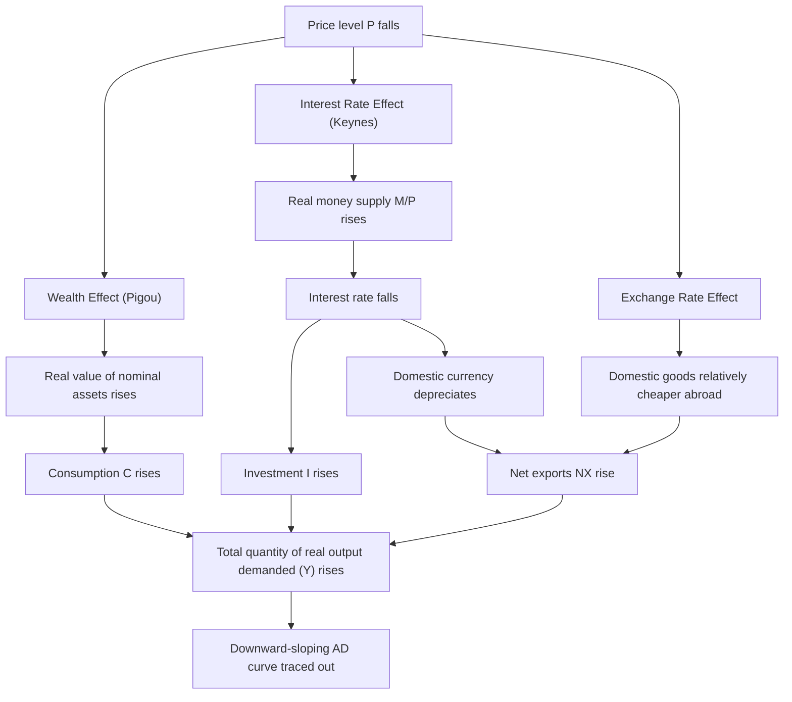

## Deriving the Aggregate Demand Curve

### Overview

The aggregate demand (AD) curve depicts the relationship between the overall price level and the total quantity of real output demanded across an entire economy — encompassing consumption, investment, government purchases, and net exports. Unlike a microeconomic demand curve, whose downward slope arises from substitution and income effects for a *single* good, the AD curve's downward slope arises from three distinct macroeconomic mechanisms operating on *aggregate* spending. Understanding these mechanisms — rather than simply asserting AD slopes downward — is essential to correctly analyzing how shocks and policy shift the curve versus move along it.

### The AD Curve in the Expenditure Framework

Aggregate demand is grounded in the national income identity:

$$Y = C + I + G + NX$$

Where:

- $C$ = aggregate consumption spending
- $I$ = aggregate investment spending
- $G$ = government purchases
- $NX$ = net exports (exports minus imports)

The AD curve plots the price level $P$ against the total real output $Y$ demanded at each price level, holding all other determinants of $C$, $I$, $G$, and $NX$ constant. It slopes downward: as $P$ falls, the quantity of real output demanded rises; as $P$ rises, quantity demanded falls.

### Why AD Slopes Downward: Three Mechanisms

**Key Points**

- The AD curve's negative slope is *not* explained by substitution among domestic goods (as in a microeconomic demand curve) — it is explained by three separate macro-level channels, each operating through a different component of aggregate expenditure.
- These three effects work simultaneously and reinforce one another, but they are analytically distinct and are frequently tested separately in coursework.

#### 1. The Wealth Effect (Pigou Effect)

A **fall in the price level** raises the real value of nominal-denominated financial assets held by households (cash, bank deposits, and other fixed-nominal-value assets). With greater real wealth, households feel richer and increase consumption spending ($C$) at any given level of real income.

$$\text{Real wealth} = \frac{\text{Nominal wealth}}{P}$$

As $P \downarrow$, real wealth $\uparrow$, consumption $C \uparrow$, and quantity of real output demanded $\uparrow$.

**[Inference]** This channel is generally considered the *weakest* of the three empirically, since only a relatively small fraction of household wealth is held in strictly fixed-nominal-value form (much wealth is in equities, real estate, or other assets whose nominal value itself may adjust with the price level), but it remains a standard textbook component of the AD derivation.

#### 2. The Interest Rate Effect (Keynes Effect)

A **fall in the price level** reduces the nominal amount of money households and firms need to hold for a given volume of transactions. With a fixed nominal money supply (held constant along a given AD curve, i.e., before any monetary policy response), this frees up money for lending, increasing the supply of loanable funds relative to demand and **lowering the equilibrium interest rate**.

A lower interest rate reduces the cost of borrowing, stimulating both consumer durables purchases and, especially, business investment spending ($I$) — and, in an open economy, can also affect capital flows and the exchange rate.

$$P \downarrow \implies \text{Real money supply } (M/P) \uparrow \implies \text{Interest rate } i \downarrow \implies I \uparrow \implies Y^{d} \uparrow$$

This is generally regarded as the most important of the three channels in standard closed-economy IS-LM-based derivations of AD.

#### 3. The Exchange Rate (International Trade) Effect

A **fall in the domestic price level** (relative to foreign price levels, holding the nominal exchange rate and foreign prices constant) makes domestically produced goods relatively cheaper compared to foreign goods. This increases export demand and reduces import demand, raising net exports ($NX$).

Additionally, via the interest rate channel above: a lower domestic interest rate (from mechanism 2) reduces the relative return on domestic assets, which tends to depreciate the domestic currency, further reinforcing the boost to net exports.

$$P \downarrow \implies \text{Domestic goods relatively cheaper} \implies \text{Exports} \uparrow, \text{Imports} \downarrow \implies NX \uparrow \implies Y^d \uparrow$$

**[Inference]** This channel's *magnitude* depends heavily on how open an economy is to international trade; it is typically considered more significant for smaller, trade-intensive economies than for large, relatively closed economies where trade is a smaller share of GDP.

### Diagram: The Three Channels Combined

### The AD Curve Diagram

<svg xmlns="http://www.w3.org/2000/svg" viewBox="0 0 700 480" font-family="Arial, sans-serif">
<text x="350" y="28" font-size="17" font-weight="bold" text-anchor="middle">The Aggregate Demand Curve (svg_diagram)</text>

<line x1="90" y1="420" x2="640" y2="420" stroke="black" stroke-width="2" />
<line x1="90" y1="420" x2="90" y2="60" stroke="black" stroke-width="2" />
<text x="650" y="425" font-size="13">Real GDP (Y)</text>
<text x="45" y="55" font-size="13">Price Level (P)</text>
<polygon points="640,420 630,414 630,426" fill="black" />
<polygon points="90,60 84,70 96,70" fill="black" />

<path d="M 150 120 Q 350 250 570 380" stroke="#2980b9" stroke-width="3" fill="none" />
<text x="575" y="382" font-size="14" fill="#2980b9" font-weight="bold">AD</text>

<circle cx="250" cy="180" r="5" fill="black" />
<text x="200" y="170" font-size="12">Higher P, lower Y</text>
<line x1="250" y1="180" x2="250" y2="420" stroke="black" stroke-dasharray="2,2" />
<line x1="90" y1="180" x2="250" y2="180" stroke="black" stroke-dasharray="2,2" />
<circle cx="450" cy="310" r="5" fill="#c0392b" />
<text x="380" y="335" font-size="12" fill="#c0392b">Lower P, higher Y</text>
<line x1="450" y1="310" x2="450" y2="420" stroke="#c0392b" stroke-dasharray="2,2" />
<line x1="90" y1="310" x2="450" y2="310" stroke="#c0392b" stroke-dasharray="2,2" />
</svg>

### Movements Along vs. Shifts of the AD Curve

**Key Points**

- A **movement along** the AD curve occurs *only* when the price level itself changes, holding all other determinants of $C$, $I$, $G$, $NX$ constant — this is precisely the wealth, interest rate, and exchange rate mechanisms described above operating in isolation.
- A **shift of** the entire AD curve occurs when any determinant of $C$, $I$, $G$, or $NX$ changes *independently of the price level*.

#### Determinants That Shift AD (Not the Price Level)

| Component | Example Shifters |
| --- | --- |
| Consumption ($C$) | Consumer confidence, household wealth from non-price sources (e.g., stock market gains), tax changes, credit availability |
| Investment ($I$) | Business confidence, technological change, corporate tax policy, interest rates set by monetary policy (a *change* in the money supply itself, not the price-level-induced real money supply change), expected future profitability |
| Government purchases ($G$) | Fiscal policy decisions (spending changes) |
| Net exports ($NX$) | Foreign income/growth, exchange rate movements from causes *other than domestic price changes* (e.g., a change in the nominal exchange rate via monetary policy or capital flows), foreign price levels, trade policy (tariffs, quotas) |

A rightward AD shift represents an *increase* in aggregate demand at every price level; a leftward shift represents a *decrease*.

### The Aggregate Demand Formula and the Quantity Theory Connection

**[Inference]** A useful, complementary way to derive and think about the downward slope of AD (particularly common in monetarist-influenced treatments) comes from the equation of exchange:

$$MV = PY$$

Where $M$ is the money supply, $V$ is the velocity of money, $P$ is the price level, and $Y$ is real output. Holding $M$ and $V$ constant (i.e., holding monetary policy fixed, consistent with being *on* a given AD curve rather than shifting it):

$$Y = \frac{MV}{P}$$

This algebraically confirms an inverse relationship between $P$ and $Y$ for a fixed $MV$, providing a monetarist-flavored derivation that complements (rather than replaces) the wealth/interest-rate/exchange-rate mechanisms above. A change in $M$ (monetary policy) or $V$ (velocity, driven by financial innovation, payment technology, or confidence) shifts the entire AD curve, since it changes the $MV$ product at every price level.

### Numerical Illustration

Suppose $M = 1000$ and $V = 5$ (each unit of money is spent on average 5 times per period), so $MV = 5000$.

- At $P = 100$: $Y = 5000/100 = 50$
- At $P = 125$: $Y = 5000/125 = 40$
- At $P = 80$: $Y = 5000/80 = 62.5$

This traces a downward-sloping AD relationship between $P$ and $Y$ for the fixed $MV = 5000$.

Now suppose the central bank increases the money supply to $M = 1200$ (with $V$ unchanged at 5), so $MV = 6000$ — this represents a **rightward shift** of the entire AD curve, not a movement along the original curve:

- At $P = 100$: $Y = 6000/100 = 60$ (compared to 50 before — more output demanded at the *same* price level)

### Comparison: AD Slope Explanation vs. Microeconomic Demand Curve

| Feature | Microeconomic Demand Curve | Aggregate Demand Curve |
| --- | --- | --- |
| Why it slopes down | Substitution effect (relative price change vs. other goods) and income effect | Wealth effect, interest rate effect, exchange rate effect — no substitution between "aggregate output" and some other good |
| What is held constant along the curve | Income, prices of other goods | Money supply, fiscal policy, foreign income, expectations |
| Nature of the "price" | Price of one specific good relative to others | The *overall* price level of all goods and services simultaneously |

### Policy Relevance

**Key Points**

- Fiscal policy (changes in $G$ or taxes affecting $C$) and monetary policy (changes in $M$, affecting interest rates and hence $I$, as well as $NX$ via exchange rate channels) are the primary tools available to shift the AD curve deliberately.
- Because the AD curve interacts with the SRAS/LRAS framework (see: Short-run versus long-run aggregate supply), the *effect* of an AD shift on output versus the price level depends critically on where the economy sits relative to potential output and on the shape/position of the relevant SRAS curve at the time.
- **Crowding out**: an important caveat to the interest-rate channel is that expansionary *fiscal* policy (e.g., higher $G$) can itself raise interest rates by increasing government borrowing, which can partially offset the expansionary effect by reducing private investment — a dynamic often explored via the IS-LM model as a complement to the simpler AD-AS framework.

### Common Misconceptions

- **Misconception**: AD slopes downward for the same reason as a single-good demand curve (substitution toward relatively cheaper goods). **Correction**: since AD covers *all* goods simultaneously, there is no "other good" to substitute toward — the downward slope instead comes from the wealth, interest-rate, and exchange-rate effects operating through the components of aggregate spending.
- **Misconception**: Any change in interest rates shifts the AD curve. **Correction**: interest rate changes that occur *because of* a price-level change (via the real money supply, holding nominal $M$ fixed) are a movement *along* AD; interest rate changes from a *change in* monetary policy (a shift in $M$ itself) shift the entire curve.
- **Misconception**: A stronger domestic currency always shifts AD in one uniform, easily predictable direction. **Correction**: exchange rate effects on AD operate specifically through their effect on net exports (and are one of three channels), and their net macroeconomic impact can be complicated by simultaneous effects on capital flows, import costs, and inflation.

**Related Topics**

- Short-run versus long-run aggregate supply
- IS-LM model and its relationship to the AD curve derivation
- Fiscal policy multipliers and crowding out
- Monetary policy transmission mechanism
- Quantity theory of money and velocity
- Open-economy macroeconomics: exchange rate determination
- Determinants and shifters of aggregate demand
- Equilibrium in the AD-AS model