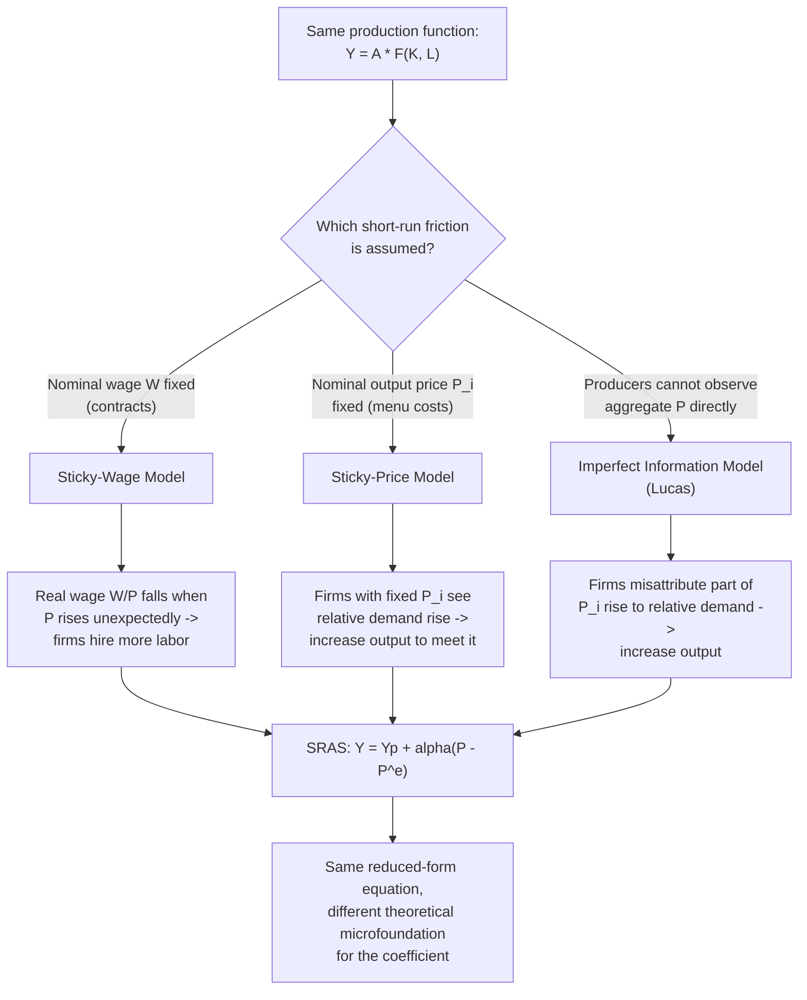

## Deriving the Aggregate Supply Curve

### Overview

The aggregate supply (AS) side of the AD-AS model is not a single curve but a **pair of related curves** — the Short-Run Aggregate Supply (SRAS) curve and the Long-Run Aggregate Supply (LRAS) curve — each derived from a distinct set of assumptions about price and wage flexibility. This entry synthesizes the full derivation logic across both time horizons and the three competing microfoundations for SRAS's slope, providing the unified framework that ties together sticky-wage, sticky-price, and imperfect-information explanations into a single coherent AS-side model.

### The Production-Function Starting Point

Both SRAS and LRAS ultimately derive from the same underlying aggregate production function:

$$Y = A \cdot F(K, L)$$

Where $Y$ is real output, $A$ is total factor productivity, $K$ is the capital stock, and $L$ is labor input. The *difference* between the short run and long run lies entirely in how the **labor market** clears in response to price-level changes — capital $K$ is typically treated as fixed in both the short and long run for AS derivation purposes (capital accumulation is a separate, slower-moving growth story), while $A$ (productivity) is a source of AS shifts in either horizon.

### Deriving LRAS: The Classical, Full-Employment Case

#### Step 1: Labor Market Clearing

In the long run, the nominal wage $W$ adjusts freely to clear the labor market — labor supply equals labor demand at the market-clearing real wage $(W/P)^*$:

$$L^S\left(\frac{W}{P}\right) = L^D\left(\frac{W}{P}\right)$$

This clearing condition determines a unique equilibrium level of employment $L^*$, consistent with the **natural rate of unemployment** (frictional and structural unemployment only — no cyclical unemployment).

#### Step 2: Output Is Independent of P

Substituting $L^*$ into the production function:

$$Y_p = A \cdot F(K, L^*)$$

Critically, **nothing in this expression depends on $P$**. If the price level $P$ rises, nominal wages $W$ rise proportionally to keep the real wage at its market-clearing level $(W/P)^*$ — employment, and hence output, is unchanged. This is the formal derivation of the **vertical LRAS curve** at $Y = Y_p$.

### Deriving SRAS: Introducing a Short-Run Friction

The SRAS curve is derived by relaxing the assumption of instantaneous labor-market (or price) clearing. Three distinct frictions have been developed in the literature, each producing an upward-sloping SRAS through a different channel:

#### Sticky-Wage Derivation (Summary)

Nominal wage $W$ is fixed at a level based on the *expected* price level $P^e$ at the time of contracting: $W = (W/P)^{target} \times P^e$. If actual $P > P^e$, real wage $W/P$ falls below target, firms move down their labor demand curve and hire more labor, raising output above $Y_p$.

#### Sticky-Price Derivation (Summary)

A fraction of firms cannot adjust their individual output price $P_i$ immediately (menu costs). When aggregate demand rises and the price level $P$ rises, firms with fixed $P_i$ see a rise in relative demand for their good (since their price is now relatively low) and expand output to meet it.

#### Imperfect Information Derivation (Summary)

Producers observe only their own price $P_i$, not the aggregate price level $P$ directly. A rise in $P_i$ is rationally, partially attributed to a genuine rise in relative demand (a signal-extraction problem), inducing producers to raise output even when, in aggregate, only $P$ has changed.

**[Inference]** All three derivations converge on the *same* reduced-form SRAS equation, $Y = Y_p + \alpha(P - P^e)$, despite resting on entirely different microeconomic assumptions — a notable feature that makes the equation pedagogically robust (multiple theoretical justifications support the same functional form) but also historically made it difficult to definitively distinguish empirically which mechanism dominates in practice.

### The Unified SRAS Equation

$$Y = Y_p + \alpha (P - P^e)$$

- When $P = P^e$ (expectations fully realized — the defining condition of "the long run" in this framework), $Y = Y_p$: SRAS and LRAS intersect exactly at potential output.
- As $P^e$ adjusts over time to catch up with actual $P$ following a shock, the SRAS curve itself shifts, tracing the economy's adjustment path back toward the vertical LRAS.

### Diagram: SRAS and LRAS Derived Together

<svg xmlns="http://www.w3.org/2000/svg" viewBox="0 0 720 500" font-family="Arial, sans-serif">
<text x="360" y="28" font-size="16" font-weight="bold" text-anchor="middle">Unified Derivation: SRAS Converging to LRAS (svg_diagram)</text>

<line x1="90" y1="440" x2="640" y2="440" stroke="black" stroke-width="2" />
<line x1="90" y1="440" x2="90" y2="70" stroke="black" stroke-width="2" />
<text x="650" y="445" font-size="13">Real GDP (Y)</text>
<text x="45" y="65" font-size="13">Price Level (P)</text>

<line x1="400" y1="420" x2="400" y2="90" stroke="#c0392b" stroke-width="3" />
<text x="408" y="105" font-size="13" fill="#c0392b" font-weight="bold">LRAS (vertical, Y = Yp)</text>

<path d="M 150 400 Q 300 300 500 150" stroke="#2980b9" stroke-width="3" fill="none" />
<text x="505" y="150" font-size="12" fill="#2980b9">SRAS (P^e = 100)</text>

<path d="M 130 350 Q 260 250 400 130" stroke="#8e44ad" stroke-width="3" fill="none" stroke-dasharray="6,3" />
<text x="130" y="120" font-size="12" fill="#8e44ad">SRAS (P^e adjusts up to 110)</text>

<circle cx="400" cy="260" r="5" fill="black" />
<text x="408" y="255" font-size="12">Long-run equilibrium (P^e = P)</text>
</svg>

### Numerical Walkthrough: From Shock to Full Adjustment

Suppose $Y_p = 2000$, $\alpha = 40$, and initially $P^e = P = 100$ (economy at long-run equilibrium, $Y = 2000$).

**Period 1 — Unanticipated AD increase pushes $P$ to 108, while $P^e$ remains at 100** (contracts/expectations not yet updated):

$$Y = 2000 + 40(108 - 100) = 2000 + 320 = 2320$$

Output rises above potential — the economy is in a short-run expansionary equilibrium.

**Period 2 — Expectations adjust; $P^e$ rises to 105** (partial catch-up), while actual $P$ settles at 108:

$$Y = 2000 + 40(108-105) = 2000 + 120 = 2120$$

The gap narrows as SRAS shifts left (in $P$–$Y$ space) with rising $P^e$.

**Period 3 — Full adjustment; $P^e$ reaches 108, equal to actual $P$:**

$$Y = 2000 + 40(108-108) = 2000$$

Output has returned exactly to $Y_p = 2000$, now at the new, higher price level of 108 — the economy has reached a new long-run equilibrium, illustrating the complete self-correction mechanism from a demand shock, mediated entirely through the SRAS-to-LRAS convergence process.

### Comparative Table: The Two Derivation Paths

| Feature | LRAS Derivation | SRAS Derivation |
| --- | --- | --- |
| Labor market assumption | Clears fully; $W/P$ at market-clearing level | Some friction prevents instantaneous clearing |
| Role of $P$ | None — output determined solely by $K$, $L^*$, $A$ | Central — output responds to $P - P^e$ |
| Curve shape | Vertical at $Y_p$ | Upward sloping |
| What shifts it | Changes in $K$, labor force, technology $A$, institutions | Changes in $P^e$, input costs, productivity shocks, expectations |
| Underlying friction | None (by construction) | Sticky wages, sticky prices, OR imperfect information (three competing/complementary theories) |

### Why the Distinction Matters for Policy Analysis

**Key Points**

- Because SRAS and LRAS respond differently to the *same* price-level change, the effect of any AD shift (fiscal or monetary policy, or an autonomous demand shock) on output versus price level depends entirely on the time horizon under consideration.
- In the short run, AD shifts move both $P$ and $Y$ along SRAS. In the long run, the same AD shift moves *only* $P$, with $Y$ returning to $Y_p$ as SRAS itself shifts in response to updated expectations — regardless of which of the three underlying frictions is assumed to generate the short-run slope.
- This is the formal basis for the standard textbook conclusion that "money is neutral in the long run, but not in the short run" — a proposition that holds across all three SRAS microfoundations, even though they disagree about *why* short-run non-neutrality occurs and about the precise conditions (anticipated vs. unanticipated policy) under which it arises.

### Common Misconceptions

- **Misconception**: SRAS and LRAS are derived from entirely different production technologies. **Correction**: both are derived from the *same* production function; the difference lies purely in the labor-market clearing assumption (full flexibility vs. some specified friction), not in the technology itself.
- **Misconception**: Only one of the three SRAS microfoundations (sticky wage, sticky price, imperfect information) can be "correct." **Correction**: they are not mutually exclusive; modern macroeconomic models frequently combine multiple frictions (e.g., New Keynesian DSGE models with both sticky wages and sticky prices) to better match empirical dynamics.
- **Misconception**: The transition from SRAS to LRAS happens instantaneously or on a fixed calendar timetable. **Correction**: the speed of convergence depends on how quickly $P^e$ adjusts to actual $P$, which itself depends on the specific friction (contract renewal length, menu cost frequency, or speed of information diffusion) — there is no universal fixed timeline.

**Related Topics**

- Short-run versus long-run aggregate supply
- Sticky wage models of aggregate supply
- Sticky price models and menu cost theory
- Imperfect information models of aggregate supply
- Lucas supply function
- New Keynesian Phillips curve derivation
- Deriving the aggregate demand curve
- Equilibrium in the AD-AS model and self-correction dynamics